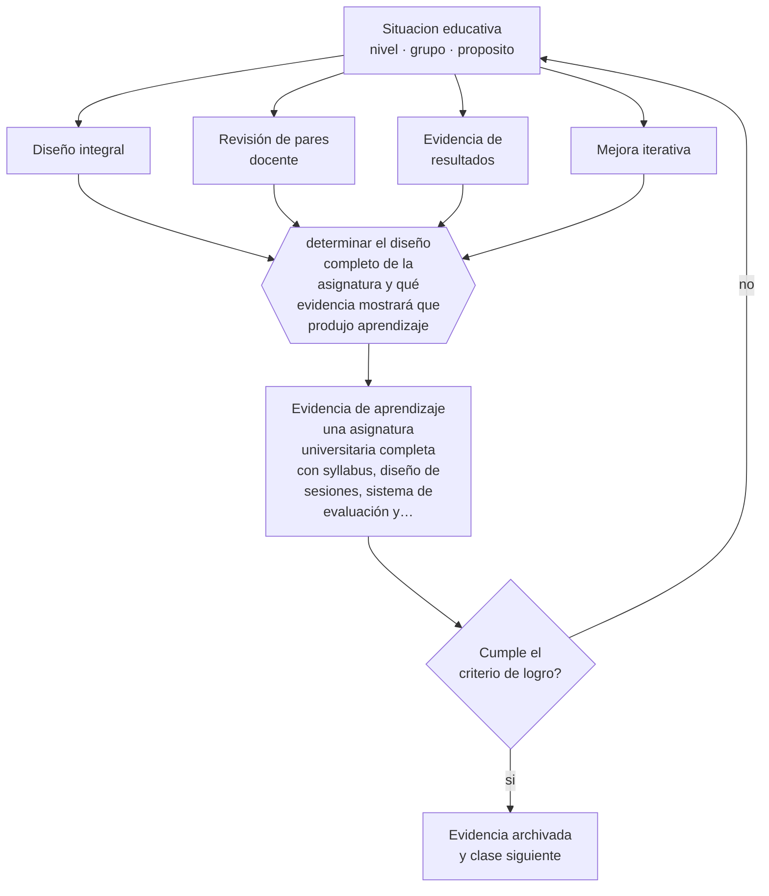

# Clase 180 — Proyecto integrador: asignatura universitaria

> **Parte 14 · Docencia universitaria** — clase 12 de 12

**Estado de evidencia:** `CONSISTENTE` · **Etapa:** 🟠 Etapa D — Educación superior y liderazgo · **Población de referencia:** pregrado y postgrado universitario y técnico superior 
**Decisión que habilita:** determinar el diseño completo de la asignatura y qué evidencia mostrará que produjo aprendizaje 
**Evidencia de aprendizaje:** una asignatura universitaria completa con syllabus, diseño de sesiones, sistema de evaluación y análisis de resultados

## 🎯 Propósito

Integrar la parte diseñando, ejecutando y evaluando una asignatura universitaria completa con alineamiento, métodos activos, evaluación sostenible y evidencia de resultados.

## 📚 Resultados de aprendizaje

Al finalizar esta clase podrás:

1. **Definir** con precisión los cuatro conceptos centrales de la clase y reconocerlos en una situación educativa real, no solo en su enunciado.
2. **Explicar** cómo se construye una asignatura universitaria completa que resista una revisión de pares.
3. **Decidir** —el diseño completo de la asignatura y qué evidencia mostrará que produjo aprendizaje— y sostener la decisión con un fundamento escrito.
4. **Producir** la evidencia de la clase —una asignatura universitaria completa con syllabus, diseño de sesiones, sistema de evaluación y análisis de resultados— y contrastarla contra el criterio de logro.
5. **Distinguir** lo que la evidencia sostiene de lo que es práctica instalada, preferencia personal o costumbre de la institución.

## 🧩 Conceptos centrales

| Concepto | Comprensión verificable |
|---|---|
| **Diseño integral** | articulación de resultados, métodos, evaluación y carga en una sola asignatura coherente |
| **Revisión de pares docente** | evaluación del diseño por colegas antes o después de su implementación |
| **Evidencia de resultados** | información sobre el aprendizaje logrado y no solo sobre la satisfacción |
| **Mejora iterativa** | ajuste del diseño con la evidencia de cada versión del curso |

## 🗺️ Flujo de razonamiento

## 📖 Desarrollo

### 1. El fondo del asunto

El proyecto integrador exige que las decisiones de la parte funcionen juntas: alineamiento con el perfil, métodos que exijan procesamiento activo, evaluación distribuida y sostenible, y carga realista. La prueba de calidad es la revisión de pares: entregar el diseño a un colega y responder sus objeciones sin recurrir a la costumbre o a la autoridad disciplinar.

### 2. Cómo se traduce en decisiones de enseñanza

El análisis final debe distinguir tres fuentes: resultados de aprendizaje, percepción de los estudiantes y observación del propio docente. Cuando divergen —buena evaluación docente con bajo aprendizaje, por ejemplo— la divergencia es la información más valiosa y la que orienta la siguiente versión.

### 3. Qué sostiene la evidencia y qué no

Una asignatura ejecutada una vez no permite atribuir resultados al diseño: la cohorte, el momento y el propio entusiasmo del docente influyen. Lo que produce es evidencia local suficiente para mejorar, y la base de un trabajo de investigación sobre la propia docencia si se diseña con más rigor.

> **Cómo leer el estado de evidencia `CONSISTENTE`.** La evidencia es amplia y coherente, pero proviene sobre todo de estudios correlacionales, de síntesis con heterogeneidad alta o de contextos distintos al tuyo. Sirve para orientar la decisión y exige que compruebes el efecto en tu propio grupo.

## 🧪 Taller guiado

Aplica la clase a **uno** de los contextos siguientes y repite después el ejercicio en un
contexto de exigencia distinta. Cambiar de contexto es parte del aprendizaje: lo que funciona
con un grupo no se traslada intacto a otro.

| Contexto | Rasgo que cambia la decisión |
|---|---|
| Curso masivo de primer año | heterogeneidad alta y riesgo de deserción temprana |
| Asignatura de especialidad con pocos estudiantes | el seminario es el formato natural |
| Laboratorio o clínica | el desempeño supervisado es la evidencia |
| Postgrado profesional | estudiantes que trabajan y exigen aplicabilidad |
| Asignatura en línea o híbrida | la evaluación debe rediseñarse por completo |
| Dirección de tesis o proyecto de título | la relación de supervisión es el método |

**Secuencia de trabajo:**

1. Delimita el contexto: nivel, edad, tamaño del grupo, asignatura o experiencia y tiempo real disponible.
2. Declara qué saben ya los estudiantes y **cómo lo comprobaste**, no cómo lo supones.
3. Formula la decisión pedagógica que esta clase habilita y escribe su fundamento.
4. Anticipa qué observarías si la decisión funciona y qué observarías si no funciona.
5. Diseña de antemano la alternativa que aplicarás si la primera estrategia falla.
6. Ejecuta o simula, y registra lo observado con fecha, contexto y evidencia concreta.
7. Produce la evidencia de aprendizaje de la clase.
8. Contrástala contra el criterio de logro, corrige y recién entonces avanza.

### 📦 Evidencia de aprendizaje

Una asignatura universitaria completa con syllabus, diseño de sesiones, sistema de evaluación y análisis de resultados.

Debe incluir contexto, decisión, fundamento, fuentes consultadas con su fecha, indicador de
logro observable, riesgos previstos y qué harías distinto en la siguiente iteración.

## 🏆 Reto verificable

Ejecuta la asignatura, analiza sus resultados y somete el diseño a revisión de un par. Documenta los cambios para la siguiente versión.

## ✅ Criterio de logro

- [ ] el diseño fue revisado por un par y las objeciones quedaron documentadas;
- [ ] el análisis contrasta evidencia de aprendizaje con percepción de los estudiantes;
- [ ] cada afirmación sobre «lo que funciona» está atribuida a una fuente identificable, con autor y fecha;
- [ ] la decisión es ejecutable con el tiempo, el espacio, el número de estudiantes y los recursos que realmente tienes;
- [ ] la evidencia queda archivada de forma reproducible: otra persona podría revisarla sin que tú se la expliques.

## ⚠️ Errores frecuentes

**Propios de esta clase:**

- Evaluar el éxito de la asignatura solo con la encuesta de satisfacción estudiantil.
- Rediseñar sin revisar la evidencia de aprendizaje de la versión anterior.

**Característicos de la parte 14:**

- Suponer que el dominio disciplinar se traduce solo en buena enseñanza.
- Diseñar la carga del estudiante sin calcular el tiempo real que exige.

## ♿ Diversidad, accesibilidad y ética

El análisis por estudiante permite detectar si el diseño funcionó para quienes llegaron con menor preparación o con menos tiempo disponible, que es donde se juega la equidad real de una asignatura universitaria.

Antes de aplicar cualquier decisión de esta clase con estudiantes reales, revisa el
[protocolo de práctica responsable](../../../docs/ETICA_Y_PRACTICA_RESPONSABLE.md):
consentimiento, resguardo de datos personales, proporcionalidad de la intervención y derecho
de cada estudiante a no ser objeto de un ensayo que no le reporta beneficio.

## ❓ Preguntas de comprobación

1. ¿Qué objeción de tu colega no supiste responder?
2. ¿Dónde divergen los resultados de aprendizaje y la satisfacción declarada?
3. ¿Qué cambiarás en la próxima versión y con qué evidencia?

## 📕 Lecturas base

**Biggs, J. & Tang, C. (2011). *Teaching for Quality Learning at University*.**  
*Qué aporta a esta clase:* marco integral para diseñar y revisar una asignatura completa.

**Boyer, E. (1990). *Scholarship Reconsidered*.**  
*Qué aporta a esta clase:* fundamenta la docencia como objeto legítimo de indagación académica sistemática.

Catálogo completo: [bibliografía del programa](../../../docs/BIBLIOGRAFIA.md) ·
[glosario](../../../docs/GLOSARIO.md) ·
[fuentes oficiales y cómo leerlas](../../../docs/FUENTES.md).

## 🔗 Conexión con el resto del programa

Cierra la parte 14 integrando sus once clases previas y se conecta con las partes 15 y 16.

> [!IMPORTANT]
> Material de formación profesional. No reemplaza un título de pedagogía, una habilitación
> legal para ejercer, ni el juicio de un equipo educativo que conoce a sus estudiantes.

---

| Anterior | Índice | Siguiente |
|---|---|---|
| [← 179 · Supervisión inicial de investigación](../class-11-supervision-inicial-de-investigacion/README.md) | [Parte 14](../README.md) · [Programa](../../../README.md) | [Programa completo →](../../../README.md) |
