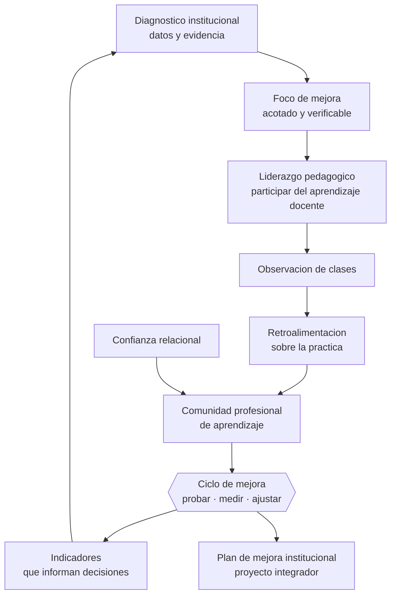

# Parte 15 — Gestión y liderazgo educativo

> *Un director no enseña a más estudiantes: crea las condiciones para que otros enseñen mejor*

🟠 **Etapa D — Educación superior y liderazgo** · salida de la etapa: sostener la calidad del trabajo de otros, no solo del propio

**Clases:** 12 (181–192) · **Población de referencia:** equipos directivos, jefaturas técnicas y coordinaciones · **Conceptos operacionales:** 48 · **Señales observables:** 36 
**Contenido central:** Liderazgo pedagógico, cultura organizacional, observación de clases, retroalimentación a docentes, comunidades profesionales de aprendizaje, planificación estratégica, gestión de equipos, indicadores, mejora escolar, innovación y ética directiva

## 🎯 De qué trata esta parte

La investigación sobre liderazgo escolar entrega un resultado consistente y útil: el efecto del liderazgo sobre el aprendizaje es real pero indirecto, y la práctica directiva con mayor efecto es la participación en el desarrollo profesional de los docentes. Dicho sin adornos: el director que aprende junto a sus profesores sobre cómo enseñar mejor produce más efecto que el que administra impecablemente o el que inspira sin entrar a las salas.

La segunda idea es que la mejora escolar sostenida no se produce por planes anuales ambiciosos, sino por ciclos cortos de indagación con evidencia: identificar un problema específico, probar un cambio acotado, medir, ajustar. La tradición de mejora continua aplicada a escuelas —ciclos de indagación, redes de mejoramiento— tiene mejor rendimiento que las reformas internas de gran escala, que suelen agotar al equipo antes de producir resultados.

El tercer eje es la confianza relacional. Los estudios longitudinales sobre escuelas que mejoran muestran que la confianza entre docentes, directivos y familias no es un valor blando sino una condición material: donde no existe, ninguna estrategia técnica prende. Por eso esta parte trata la observación de clases y la retroalimentación a docentes como prácticas de alto riesgo relacional que deben diseñarse con reglas explícitas.

## 🏫 Caso de la parte

Las doce clases trabajan sobre la misma realidad, para que puedas ver cómo cambia tu diagnóstico
a medida que avanzas:

> El equipo directivo de Los Aromos tiene ocho prioridades en su plan de mejora, ninguna con línea base. El uso real del tiempo directivo muestra un 12 % dedicado a lo pedagógico y el resto a administración y emergencias.

**Artefacto que produces al terminar:** plan de mejora institucional con pocas prioridades, ciclos de indagación, indicadores desagregados y sistema de seguimiento.

## 📚 Resultados de la parte

Al terminar esta parte podrás:

1. **Ejercer liderazgo pedagógico centrado en el aprendizaje profesional del equipo**.
2. **Observar clases y retroalimentar docentes sin dañar la confianza y con foco en la práctica**.
3. **Conducir un ciclo de mejora con datos, hipótesis, intervención acotada y verificación**.
4. **Construir indicadores institucionales que informen decisiones en vez de decorar informes**.

## 🗺️ Mapa de la parte

## 🧠 Marco de referencia

- liderazgo centrado en el aprendizaje y sus prácticas de mayor efecto
- mejora continua e indagación por ciclos en organizaciones escolares
- confianza relacional como condición de la mejora sostenida
- Marco para la Buena Dirección y Liderazgo Escolar y planificación institucional en Chile

**Autoras y autores que conviene conocer:** Viviane Robinson, Kenneth Leithwood, Michael Fullan, Anthony Bryk, Andy Hargreaves, equipos del Centro de Liderazgo Educativo y del sistema de educación pública chileno

## 📋 Las 12 clases

| # | Clase | Decisión que habilita | Evidencia |
|---:|---|---|---|
| 181 | [Liderazgo pedagógico](class-01-liderazgo-pedagogico/README.md) | determinar en qué prácticas de liderazgo vas a invertir tu tiempo, sabiendo que no alcanza para todas | `CONSISTENTE` |
| 182 | [Cultura organizacional educativa](class-02-cultura-organizacional-educativa/README.md) | determinar qué supuesto cultural debe moverse antes de intentar el cambio que quieres introducir | `CONSISTENTE` |
| 183 | [Observación de clases](class-03-observacion-de-clases/README.md) | determinar el foco, el instrumento y el uso de la información antes de entrar a la primera sala | `CONSISTENTE` |
| 184 | [Feedback a docentes](class-04-feedback-a-docentes/README.md) | determinar qué evidencia presentarás y qué acuerdo buscas de la conversación | `CONSISTENTE` |
| 185 | [Comunidades profesionales de aprendizaje](class-05-comunidades-profesionales-de-aprendizaje/README.md) | determinar qué condición falta en tus instancias colectivas para que produzcan aprendizaje profesional | `CONSISTENTE` |
| 186 | [Planificación estratégica](class-06-planificacion-estrategica/README.md) | determinar qué pocas prioridades sostendrá tu institución y qué dejará de hacer para lograrlo | `PRACTICA-PROFESIONAL` |
| 187 | [Gestión de equipos](class-07-gestion-de-equipos/README.md) | determinar qué palanca de gestión tienes efectivamente disponible para el problema de equipo que enfrentas | `PRACTICA-PROFESIONAL` |
| 188 | [Indicadores educativos](class-08-indicadores-educativos/README.md) | determinar qué indicadores usará tu institución para decidir y cuáles dejará de recolectar | `CONSISTENTE` |
| 189 | [Mejora escolar](class-09-mejora-escolar/README.md) | determinar qué cambio acotado vas a probar primero y cómo medirás si funcionó | `CONSISTENTE` |
| 190 | [Innovación educativa](class-10-innovacion-educativa/README.md) | determinar si una innovación propuesta merece la energía institucional que consumirá | `EN-DEBATE` |
| 191 | [Ética de la dirección](class-11-etica-de-la-direccion/README.md) | determinar cómo decidirás ante un conflicto entre intereses institucionales y derechos de un estudiante | `MARCO-NORMATIVO` |
| 192 | [Proyecto integrador: plan de mejora institucional](class-12-proyecto-integrador-plan-de-mejora-institucional/README.md) | determinar el plan completo de mejora y cómo se verificará su efecto sin depender de percepciones | `CONSISTENTE` |

## ⚠️ Riesgos característicos

- Confundir liderazgo con carisma o con control administrativo.
- Observar clases sin acuerdo previo sobre foco, uso y confidencialidad.
- Fijar metas institucionales sin línea base ni medio de verificación.
- Iniciar más cambios de los que el equipo puede sostener a la vez.

## 📕 Lecturas de referencia de la parte

- **Robinson, V. (2011). *Student-Centered Leadership*.** — identifica y ordena por efecto las prácticas de liderazgo con impacto en el aprendizaje. **Localizar:** [ISBN 9780470874134](https://openlibrary.org/isbn/9780470874134) · [ficha](../../docs/REGISTRO_DE_FUENTES.md#robinson-2011-student-centered-leadership)
- **Leithwood, K. et al. (2020). *Seven Strong Claims about Successful School Leadership Revisited*. School Leadership & Management, 40(1).** — actualiza qué se sabe con evidencia sobre liderazgo escolar y qué sigue siendo suposición. **Localizar:** [DOI 10.1080/13632434.2019.1596077](https://doi.org/10.1080/13632434.2019.1596077) · [ficha](../../docs/REGISTRO_DE_FUENTES.md#leithwood-2020-seven-strong-claims-about-successful-school-2)
- **Bryk, A. & Schneider, B. (2002). *Trust in Schools*.** — muestra con datos longitudinales por qué la confianza es condición y no consecuencia de la mejora. **Localizar:** [ISBN 9780871541796](https://openlibrary.org/isbn/9780871541796) · [ficha](../../docs/REGISTRO_DE_FUENTES.md#bryk-schneider-2002-trust-in-schools)
- **Bryk, A. et al. (2015). *Learning to Improve*.** — traslada la mejora continua a la escuela: problemas específicos, ciclos cortos y redes de aprendizaje. **Localizar:** [ISBN 9781612507910](https://openlibrary.org/isbn/9781612507910) · [ficha](../../docs/REGISTRO_DE_FUENTES.md#bryk-2015-learning-to-improve)

## ✅ Evidencia mínima para dar la parte por cerrada

- [ ] un diagnóstico institucional con datos y foco de mejora justificado;
- [ ] un protocolo de observación y retroalimentación acordado con el equipo;
- [ ] un ciclo de mejora ejecutado con línea base, intervención y resultado;
- [ ] el plan de mejora institucional con indicadores y responsables.

## 🧭 Práctica y evaluación de la parte

- [Rúbrica maestra e instrumentos de autoevaluación](../../assessments/README.md)
- [Casos profesionales para resolver con este marco](../../cases/README.md)
- [Laboratorios de decisión](../../labs/README.md)
- [Dónde se archiva la evidencia](../../evidence/README.md)

---

| Anterior | Índice | Siguiente |
|---|---|---|
| [← Parte 14 · Docencia universitaria](../part-14-docencia-universitaria/README.md) | [Programa](../../README.md) · [Currículo](../../CURRICULUM.md) | [Parte 16 · Investigación educativa →](../part-16-investigacion-educativa/README.md) |
