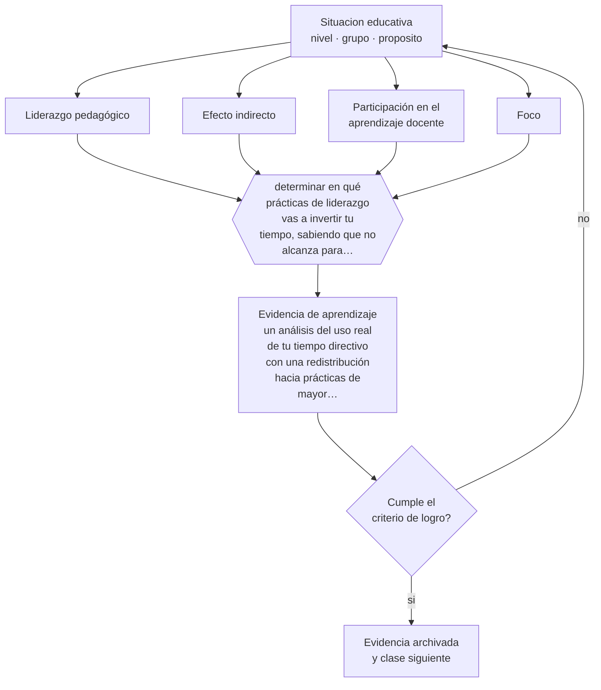

# Clase 181 — Liderazgo pedagógico

> **Parte 15 · Gestión y liderazgo educativo** — clase 1 de 12

**Estado de evidencia:** `CONSISTENTE` · **Etapa:** 🟠 Etapa D — Educación superior y liderazgo · **Población de referencia:** equipos directivos, jefaturas técnicas y coordinaciones 
**Decisión que habilita:** determinar en qué prácticas de liderazgo vas a invertir tu tiempo, sabiendo que no alcanza para todas 
**Evidencia de aprendizaje:** un análisis del uso real de tu tiempo directivo con una redistribución hacia prácticas de mayor efecto

## 🎯 Propósito

Ejercer liderazgo pedagógico centrado en el aprendizaje: participar del desarrollo profesional del equipo, garantizar condiciones de enseñanza y sostener el foco frente a las urgencias administrativas.

## 📚 Resultados de aprendizaje

Al finalizar esta clase podrás:

1. **Definir** con precisión los cuatro conceptos centrales de la clase y reconocerlos en una situación educativa real, no solo en su enunciado.
2. **Explicar** qué práctica directiva tiene el mayor efecto documentado sobre el aprendizaje de los estudiantes.
3. **Decidir** —en qué prácticas de liderazgo vas a invertir tu tiempo, sabiendo que no alcanza para todas— y sostener la decisión con un fundamento escrito.
4. **Producir** la evidencia de la clase —un análisis del uso real de tu tiempo directivo con una redistribución hacia prácticas de mayor efecto— y contrastarla contra el criterio de logro.
5. **Distinguir** lo que la evidencia sostiene de lo que es práctica instalada, preferencia personal o costumbre de la institución.

## 🧩 Conceptos centrales

| Concepto | Comprensión verificable |
|---|---|
| **Liderazgo pedagógico** | conjunto de prácticas directivas centradas en la calidad de la enseñanza y del aprendizaje |
| **Efecto indirecto** | influencia del liderazgo sobre el aprendizaje a través de las condiciones y del trabajo docente |
| **Participación en el aprendizaje docente** | práctica directiva de aprender junto al equipo, no solo de organizarlo |
| **Foco** | capacidad de sostener pocas prioridades frente a la presión de lo urgente |

## 🗺️ Flujo de razonamiento

## 📖 Desarrollo

### 1. El fondo del asunto

La investigación sobre liderazgo escolar converge en un resultado útil: su efecto sobre el aprendizaje es real e indirecto, y la práctica con mayor magnitud documentada es la participación del directivo en el aprendizaje profesional de sus docentes. No supervisarlo desde fuera: participar. Le siguen el establecimiento de metas, la garantía de condiciones de enseñanza y la protección del tiempo pedagógico.

### 2. Cómo se traduce en decisiones de enseñanza

El análisis del uso del tiempo es incómodo y revelador: la mayoría de los equipos directivos descubre que dedica menos del veinte por ciento de su tiempo a prácticas pedagógicas. Redistribuir exige delegar o eliminar tareas administrativas, lo que a su vez exige decisiones sobre estructura y no solo sobre voluntad.

### 3. Qué sostiene la evidencia y qué no

Los efectos del liderazgo son moderados y dependen del contexto: en escuelas en crisis las prácticas que funcionan son distintas de las que sirven en escuelas estables. Y la evidencia proviene mayormente de estudios correlacionales y de síntesis con definiciones heterogéneas de liderazgo.

> **Cómo leer el estado de evidencia `CONSISTENTE`.** La evidencia es amplia y coherente, pero proviene sobre todo de estudios correlacionales, de síntesis con heterogeneidad alta o de contextos distintos al tuyo. Sirve para orientar la decisión y exige que compruebes el efecto en tu propio grupo.

## 🧪 Taller guiado

Aplica la clase a **uno** de los contextos siguientes y repite después el ejercicio en un
contexto de exigencia distinta. Cambiar de contexto es parte del aprendizaje: lo que funciona
con un grupo no se traslada intacto a otro.

| Contexto | Rasgo que cambia la decisión |
|---|---|
| Escuela pequeña con equipo reducido | el directivo también hace clases |
| Establecimiento grande con varios ciclos | la coordinación entre niveles es el problema |
| Institución con resultados descendentes | hay urgencia y baja confianza inicial |
| Equipo con alta rotación docente | el conocimiento institucional se pierde cada año |
| Institución de educación superior | gobierno colegiado y autonomía académica |
| Organización de capacitación | los indicadores son contractuales y externos |

**Secuencia de trabajo:**

1. Delimita el contexto: nivel, edad, tamaño del grupo, asignatura o experiencia y tiempo real disponible.
2. Declara qué saben ya los estudiantes y **cómo lo comprobaste**, no cómo lo supones.
3. Formula la decisión pedagógica que esta clase habilita y escribe su fundamento.
4. Anticipa qué observarías si la decisión funciona y qué observarías si no funciona.
5. Diseña de antemano la alternativa que aplicarás si la primera estrategia falla.
6. Ejecuta o simula, y registra lo observado con fecha, contexto y evidencia concreta.
7. Produce la evidencia de aprendizaje de la clase.
8. Contrástala contra el criterio de logro, corrige y recién entonces avanza.

### 📦 Evidencia de aprendizaje

Un análisis del uso real de tu tiempo directivo con una redistribución hacia prácticas de mayor efecto.

Debe incluir contexto, decisión, fundamento, fuentes consultadas con su fecha, indicador de
logro observable, riesgos previstos y qué harías distinto en la siguiente iteración.

## 🏆 Reto verificable

Registra tu uso del tiempo durante dos semanas. Redistribuye al menos cinco horas hacia prácticas pedagógicas y evalúa qué dejaste de hacer.

## ✅ Criterio de logro

- [ ] el análisis se basa en registro real del tiempo y no en estimación;
- [ ] la redistribución identifica qué se deja de hacer para liberar tiempo;
- [ ] cada afirmación sobre «lo que funciona» está atribuida a una fuente identificable, con autor y fecha;
- [ ] la decisión es ejecutable con el tiempo, el espacio, el número de estudiantes y los recursos que realmente tienes;
- [ ] la evidencia queda archivada de forma reproducible: otra persona podría revisarla sin que tú se la expliques.

## ⚠️ Errores frecuentes

**Propios de esta clase:**

- Ejercer liderazgo pedagógico solo mediante instrucciones y supervisión externa.
- Declarar prioridades pedagógicas sin liberar tiempo real para sostenerlas.

**Característicos de la parte 15:**

- Confundir liderazgo con carisma o con control administrativo.
- Observar clases sin acuerdo previo sobre foco, uso y confidencialidad.

## ♿ Diversidad, accesibilidad y ética

El liderazgo pedagógico incluye garantizar que los apoyos lleguen a los estudiantes que los necesitan. Revisar la distribución real de recursos y de tiempo profesional entre estudiantes es una práctica directiva de equidad.

Antes de aplicar cualquier decisión de esta clase con estudiantes reales, revisa el
[protocolo de práctica responsable](../../../docs/ETICA_Y_PRACTICA_RESPONSABLE.md):
consentimiento, resguardo de datos personales, proporcionalidad de la intervención y derecho
de cada estudiante a no ser objeto de un ensayo que no le reporta beneficio.

## ❓ Preguntas de comprobación

1. ¿Qué porcentaje de tu semana pasada dedicaste a prácticas pedagógicas?
2. ¿Qué aprendiste junto a tus docentes este mes?
3. ¿Qué dejarás de hacer para sostener tu prioridad pedagógica?

## 📕 Lecturas base

**Robinson, V. (2011). *Student-Centered Leadership*.**  
*Qué aporta a esta clase:* ordena por efecto las prácticas de liderazgo y sitúa arriba la participación en el aprendizaje docente.

**Leithwood, K. et al. (2020). *Seven Strong Claims about Successful School Leadership Revisited*.**  
*Qué aporta a esta clase:* actualiza lo que se sabe con evidencia sobre liderazgo escolar.

Catálogo completo: [bibliografía del programa](../../../docs/BIBLIOGRAFIA.md) ·
[glosario](../../../docs/GLOSARIO.md) ·
[fuentes oficiales y cómo leerlas](../../../docs/FUENTES.md).

## 🔗 Conexión con el resto del programa

Abre la parte 15 y se apoya en la clase 010. Ordena las prioridades de las clases 183 a 189.

> [!IMPORTANT]
> Material de formación profesional. No reemplaza un título de pedagogía, una habilitación
> legal para ejercer, ni el juicio de un equipo educativo que conoce a sus estudiantes.

---

| Anterior | Índice | Siguiente |
|---|---|---|
| [← Parte 15](../README.md) | [Parte 15](../README.md) · [Programa](../../../README.md) | [182 · Cultura organizacional educativa →](../class-02-cultura-organizacional-educativa/README.md) |
