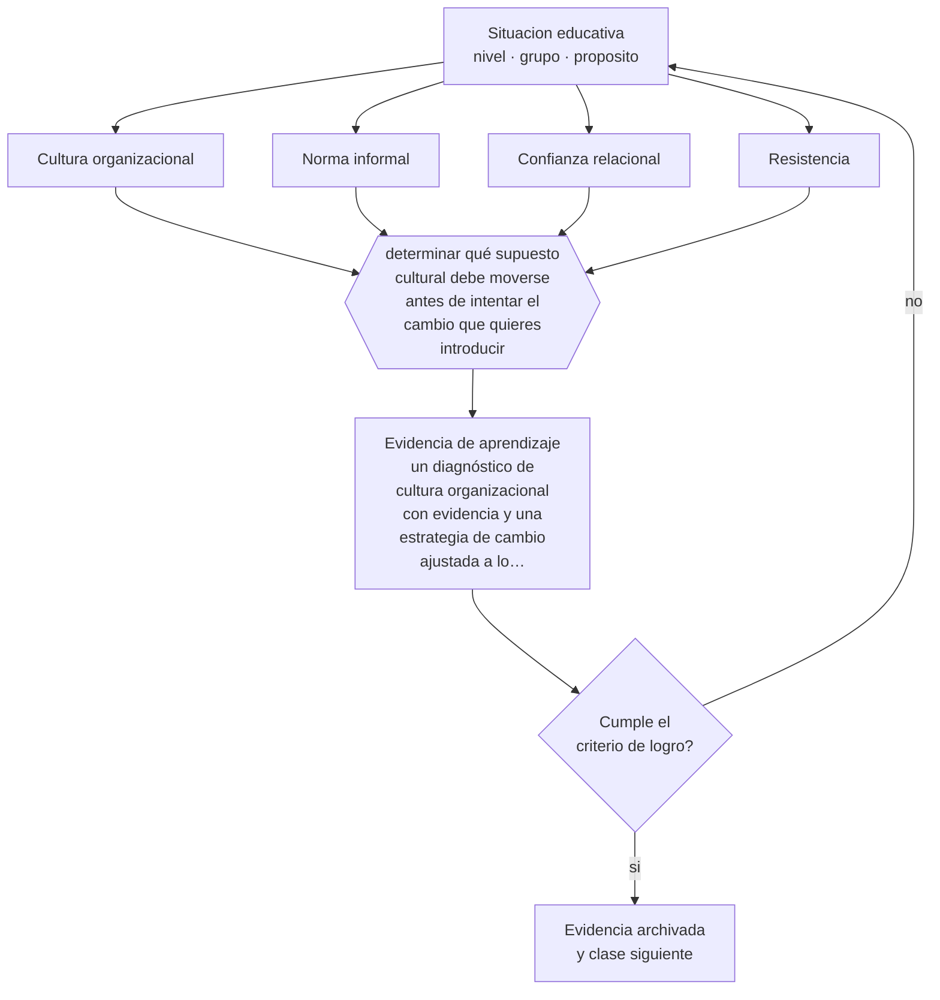

# Clase 182 — Cultura organizacional educativa

> **Parte 15 · Gestión y liderazgo educativo** — clase 2 de 12

**Estado de evidencia:** `CONSISTENTE` · **Etapa:** 🟠 Etapa D — Educación superior y liderazgo · **Población de referencia:** equipos directivos, jefaturas técnicas y coordinaciones 
**Decisión que habilita:** determinar qué supuesto cultural debe moverse antes de intentar el cambio que quieres introducir 
**Evidencia de aprendizaje:** un diagnóstico de cultura organizacional con evidencia y una estrategia de cambio ajustada a lo que permite

## 🎯 Propósito

Diagnosticar y trabajar la cultura organizacional educativa: supuestos compartidos, normas informales y confianza, que determinan qué cambios son posibles.

## 📚 Resultados de aprendizaje

Al finalizar esta clase podrás:

1. **Definir** con precisión los cuatro conceptos centrales de la clase y reconocerlos en una situación educativa real, no solo en su enunciado.
2. **Explicar** por qué una buena estrategia fracasa cuando choca con la cultura de la organización.
3. **Decidir** —qué supuesto cultural debe moverse antes de intentar el cambio que quieres introducir— y sostener la decisión con un fundamento escrito.
4. **Producir** la evidencia de la clase —un diagnóstico de cultura organizacional con evidencia y una estrategia de cambio ajustada a lo que permite— y contrastarla contra el criterio de logro.
5. **Distinguir** lo que la evidencia sostiene de lo que es práctica instalada, preferencia personal o costumbre de la institución.

## 🧩 Conceptos centrales

| Concepto | Comprensión verificable |
|---|---|
| **Cultura organizacional** | supuestos compartidos, mayormente implícitos, sobre cómo se hacen las cosas aquí |
| **Norma informal** | regla no escrita que gobierna la conducta cotidiana con más fuerza que el reglamento |
| **Confianza relacional** | calidad de las expectativas mutuas entre docentes, directivos, estudiantes y familias |
| **Resistencia** | respuesta organizacional al cambio; suele proteger algo que el cambio pone en riesgo |

## 🗺️ Flujo de razonamiento

## 📖 Desarrollo

### 1. El fondo del asunto

Una estrategia que contradice la cultura se abandona, aunque tenga evidencia y financiamiento. Por eso el diagnóstico cultural precede al diseño del cambio: qué se premia informalmente, qué ocurre cuando alguien innova, qué se puede admitir en una reunión y qué no. La resistencia, además, rara vez es irracional: suele proteger algo —tiempo, autonomía, seguridad— que conviene identificar antes de intentar vencerla.

### 2. Cómo se traduce en decisiones de enseñanza

El diagnóstico se hace con evidencia observable y conversaciones, no con encuestas de clima. Y la estrategia se ajusta: empezar por cambios que la cultura tolera, mostrar resultados, usar esos resultados para ampliar el margen. La confianza es el recurso que se acumula o se gasta en cada uno de esos intentos.

### 3. Qué sostiene la evidencia y qué no

La cultura se describe mejor de lo que se manipula: no hay recetas para cambiarla y los plazos son largos. Además, los estudios que la vinculan con resultados son correlacionales. Sirve como marco estratégico de decisión, no como explicación causal de los resultados de una institución.

> **Cómo leer el estado de evidencia `CONSISTENTE`.** La evidencia es amplia y coherente, pero proviene sobre todo de estudios correlacionales, de síntesis con heterogeneidad alta o de contextos distintos al tuyo. Sirve para orientar la decisión y exige que compruebes el efecto en tu propio grupo.

## 🧪 Taller guiado

Aplica la clase a **uno** de los contextos siguientes y repite después el ejercicio en un
contexto de exigencia distinta. Cambiar de contexto es parte del aprendizaje: lo que funciona
con un grupo no se traslada intacto a otro.

| Contexto | Rasgo que cambia la decisión |
|---|---|
| Escuela pequeña con equipo reducido | el directivo también hace clases |
| Establecimiento grande con varios ciclos | la coordinación entre niveles es el problema |
| Institución con resultados descendentes | hay urgencia y baja confianza inicial |
| Equipo con alta rotación docente | el conocimiento institucional se pierde cada año |
| Institución de educación superior | gobierno colegiado y autonomía académica |
| Organización de capacitación | los indicadores son contractuales y externos |

**Secuencia de trabajo:**

1. Delimita el contexto: nivel, edad, tamaño del grupo, asignatura o experiencia y tiempo real disponible.
2. Declara qué saben ya los estudiantes y **cómo lo comprobaste**, no cómo lo supones.
3. Formula la decisión pedagógica que esta clase habilita y escribe su fundamento.
4. Anticipa qué observarías si la decisión funciona y qué observarías si no funciona.
5. Diseña de antemano la alternativa que aplicarás si la primera estrategia falla.
6. Ejecuta o simula, y registra lo observado con fecha, contexto y evidencia concreta.
7. Produce la evidencia de aprendizaje de la clase.
8. Contrástala contra el criterio de logro, corrige y recién entonces avanza.

### 📦 Evidencia de aprendizaje

Un diagnóstico de cultura organizacional con evidencia y una estrategia de cambio ajustada a lo que permite.

Debe incluir contexto, decisión, fundamento, fuentes consultadas con su fecha, indicador de
logro observable, riesgos previstos y qué harías distinto en la siguiente iteración.

## 🏆 Reto verificable

Documenta tres situaciones donde la cultura decidió por sobre la norma escrita. Diseña un cambio que trabaje el supuesto detectado.

## ✅ Criterio de logro

- [ ] el diagnóstico se apoya en evidencia observada y no solo en percepciones declaradas;
- [ ] la estrategia identifica qué protege la resistencia esperada;
- [ ] cada afirmación sobre «lo que funciona» está atribuida a una fuente identificable, con autor y fecha;
- [ ] la decisión es ejecutable con el tiempo, el espacio, el número de estudiantes y los recursos que realmente tienes;
- [ ] la evidencia queda archivada de forma reproducible: otra persona podría revisarla sin que tú se la expliques.

## ⚠️ Errores frecuentes

**Propios de esta clase:**

- Introducir un cambio que contradice la cultura sin haber trabajado antes el supuesto que lo bloquea.
- Interpretar toda resistencia como falta de compromiso en vez de como protección de algo concreto.

**Característicos de la parte 15:**

- Confundir liderazgo con carisma o con control administrativo.
- Observar clases sin acuerdo previo sobre foco, uso y confidencialidad.

## ♿ Diversidad, accesibilidad y ética

La cultura define también qué estudiantes son considerados propios de la institución. Detectar supuestos sobre el estudiante esperado es condición para que cualquier política de inclusión deje de ser declarativa.

Antes de aplicar cualquier decisión de esta clase con estudiantes reales, revisa el
[protocolo de práctica responsable](../../../docs/ETICA_Y_PRACTICA_RESPONSABLE.md):
consentimiento, resguardo de datos personales, proporcionalidad de la intervención y derecho
de cada estudiante a no ser objeto de un ensayo que no le reporta beneficio.

## ❓ Preguntas de comprobación

1. ¿Qué pasa en tu institución cuando alguien reconoce un error?
2. ¿Qué protege la resistencia que anticipas?
3. ¿Qué cambio tolera hoy tu cultura y cuál no?

## 📕 Lecturas base

**Schein, E. (2010). *Organizational Culture and Leadership*.**  
*Qué aporta a esta clase:* modelo de niveles de cultura aplicable al diagnóstico institucional.

**Bryk, A. & Schneider, B. (2002). *Trust in Schools*.**  
*Qué aporta a esta clase:* evidencia longitudinal sobre confianza relacional como condición de mejora.

Catálogo completo: [bibliografía del programa](../../../docs/BIBLIOGRAFIA.md) ·
[glosario](../../../docs/GLOSARIO.md) ·
[fuentes oficiales y cómo leerlas](../../../docs/FUENTES.md).

## 🔗 Conexión con el resto del programa

Aplica la clase 010 al nivel institucional y condiciona el éxito de las clases 189 y 190.

> [!IMPORTANT]
> Material de formación profesional. No reemplaza un título de pedagogía, una habilitación
> legal para ejercer, ni el juicio de un equipo educativo que conoce a sus estudiantes.

---

| Anterior | Índice | Siguiente |
|---|---|---|
| [← 181 · Liderazgo pedagógico](../class-01-liderazgo-pedagogico/README.md) | [Parte 15](../README.md) · [Programa](../../../README.md) | [183 · Observación de clases →](../class-03-observacion-de-clases/README.md) |
