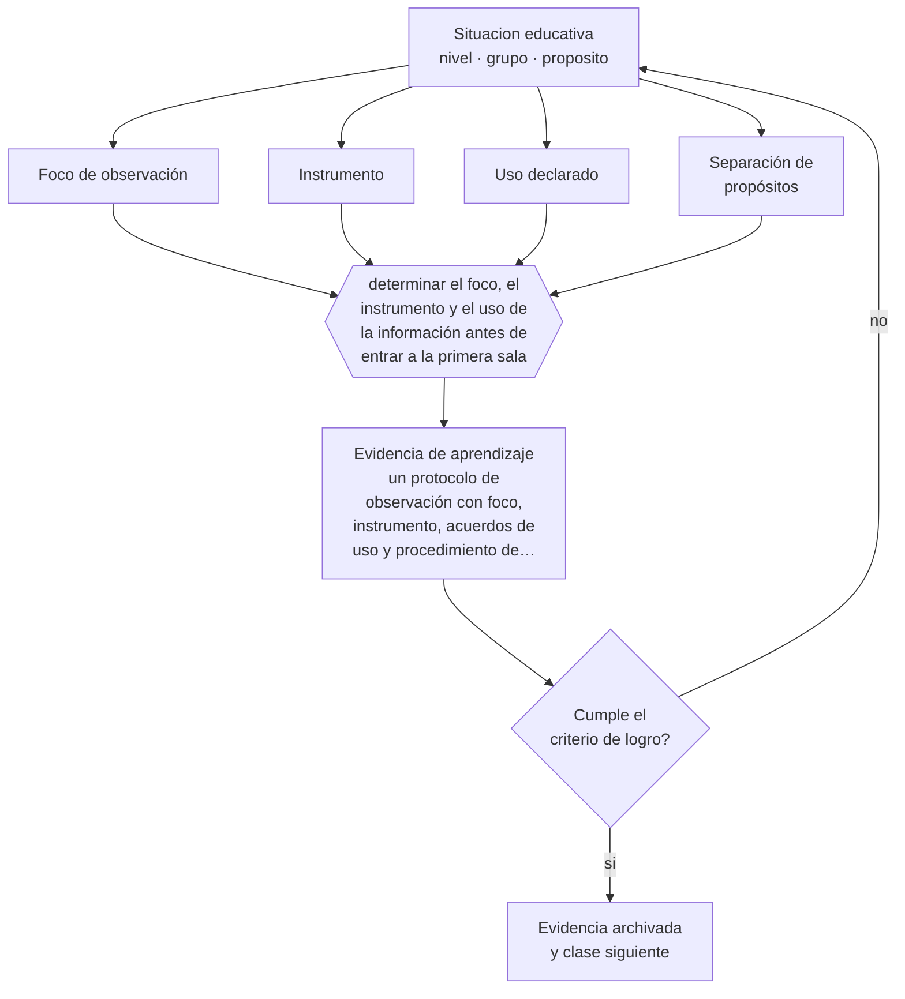

# Clase 183 — Observación de clases

> **Parte 15 · Gestión y liderazgo educativo** — clase 3 de 12

**Estado de evidencia:** `CONSISTENTE` · **Etapa:** 🟠 Etapa D — Educación superior y liderazgo · **Población de referencia:** equipos directivos, jefaturas técnicas y coordinaciones 
**Decisión que habilita:** determinar el foco, el instrumento y el uso de la información antes de entrar a la primera sala 
**Evidencia de aprendizaje:** un protocolo de observación con foco, instrumento, acuerdos de uso y procedimiento de retroalimentación

## 🎯 Propósito

Diseñar sistemas de observación de clases con foco acordado, instrumento explícito, uso declarado de la información y separación entre desarrollo profesional y evaluación.

## 📚 Resultados de aprendizaje

Al finalizar esta clase podrás:

1. **Definir** con precisión los cuatro conceptos centrales de la clase y reconocerlos en una situación educativa real, no solo en su enunciado.
2. **Explicar** cómo observar clases sin que la observación destruya la confianza que la hace útil.
3. **Decidir** —el foco, el instrumento y el uso de la información antes de entrar a la primera sala— y sostener la decisión con un fundamento escrito.
4. **Producir** la evidencia de la clase —un protocolo de observación con foco, instrumento, acuerdos de uso y procedimiento de retroalimentación— y contrastarla contra el criterio de logro.
5. **Distinguir** lo que la evidencia sostiene de lo que es práctica instalada, preferencia personal o costumbre de la institución.

## 🧩 Conceptos centrales

| Concepto | Comprensión verificable |
|---|---|
| **Foco de observación** | aspecto acotado de la práctica que se observará; observar todo equivale a no observar nada |
| **Instrumento** | pauta que define qué se registra y con qué criterios, para reducir el juicio arbitrario |
| **Uso declarado** | acuerdo explícito sobre para qué se usará la información y quién la verá |
| **Separación de propósitos** | distinción entre observación para desarrollo y observación para evaluación del desempeño |

## 🗺️ Flujo de razonamiento

## 📖 Desarrollo

### 1. El fondo del asunto

La observación de clases es una de las prácticas de mayor potencial y de mayor riesgo relacional. Su potencial: hacer visible la enseñanza real y permitir una conversación fundada. Su riesgo: si el docente no sabe qué se observa, para qué se usará y quién lo verá, la observación produce clases actuadas y desconfianza. La separación entre desarrollo y evaluación es la decisión más importante del diseño.

### 2. Cómo se traduce en decisiones de enseñanza

El protocolo se acuerda antes con el equipo: qué se observará, con qué instrumento, con qué frecuencia, quién accede a los registros y qué ocurre con ellos. Un foco acotado —por ejemplo, verificación de comprensión— produce conversaciones útiles; una pauta que evalúa treinta aspectos produce juicios generales y defensas.

### 3. Qué sostiene la evidencia y qué no

La confiabilidad de las observaciones de aula es limitada: distintos observadores puntúan distinto y una sola clase no representa la práctica de un docente. Los sistemas serios usan varias observaciones, formación de observadores y calibración. Usar una observación aislada para decisiones de alto impacto es técnicamente insostenible.

> **Cómo leer el estado de evidencia `CONSISTENTE`.** La evidencia es amplia y coherente, pero proviene sobre todo de estudios correlacionales, de síntesis con heterogeneidad alta o de contextos distintos al tuyo. Sirve para orientar la decisión y exige que compruebes el efecto en tu propio grupo.

## 🧪 Taller guiado

Aplica la clase a **uno** de los contextos siguientes y repite después el ejercicio en un
contexto de exigencia distinta. Cambiar de contexto es parte del aprendizaje: lo que funciona
con un grupo no se traslada intacto a otro.

| Contexto | Rasgo que cambia la decisión |
|---|---|
| Escuela pequeña con equipo reducido | el directivo también hace clases |
| Establecimiento grande con varios ciclos | la coordinación entre niveles es el problema |
| Institución con resultados descendentes | hay urgencia y baja confianza inicial |
| Equipo con alta rotación docente | el conocimiento institucional se pierde cada año |
| Institución de educación superior | gobierno colegiado y autonomía académica |
| Organización de capacitación | los indicadores son contractuales y externos |

**Secuencia de trabajo:**

1. Delimita el contexto: nivel, edad, tamaño del grupo, asignatura o experiencia y tiempo real disponible.
2. Declara qué saben ya los estudiantes y **cómo lo comprobaste**, no cómo lo supones.
3. Formula la decisión pedagógica que esta clase habilita y escribe su fundamento.
4. Anticipa qué observarías si la decisión funciona y qué observarías si no funciona.
5. Diseña de antemano la alternativa que aplicarás si la primera estrategia falla.
6. Ejecuta o simula, y registra lo observado con fecha, contexto y evidencia concreta.
7. Produce la evidencia de aprendizaje de la clase.
8. Contrástala contra el criterio de logro, corrige y recién entonces avanza.

### 📦 Evidencia de aprendizaje

Un protocolo de observación con foco, instrumento, acuerdos de uso y procedimiento de retroalimentación.

Debe incluir contexto, decisión, fundamento, fuentes consultadas con su fecha, indicador de
logro observable, riesgos previstos y qué harías distinto en la siguiente iteración.

## 🏆 Reto verificable

Acuerda un protocolo con tu equipo y realiza tres observaciones con el mismo foco. Contrasta tus registros con los de otro observador.

## ✅ Criterio de logro

- [ ] el protocolo declara foco, instrumento, frecuencia y uso de la información;
- [ ] distingue explícitamente observación para desarrollo de observación para evaluación;
- [ ] cada afirmación sobre «lo que funciona» está atribuida a una fuente identificable, con autor y fecha;
- [ ] la decisión es ejecutable con el tiempo, el espacio, el número de estudiantes y los recursos que realmente tienes;
- [ ] la evidencia queda archivada de forma reproducible: otra persona podría revisarla sin que tú se la expliques.

## ⚠️ Errores frecuentes

**Propios de esta clase:**

- Observar sin acuerdo previo sobre foco, uso y confidencialidad de la información.
- Tomar decisiones de evaluación de desempeño con una única observación.

**Característicos de la parte 15:**

- Confundir liderazgo con carisma o con control administrativo.
- Observar clases sin acuerdo previo sobre foco, uso y confidencialidad.

## ♿ Diversidad, accesibilidad y ética

Los sesgos del observador operan también en la observación de aula: docentes de determinados perfiles reciben sistemáticamente puntuaciones distintas. La formación de observadores y la calibración reducen ese efecto y deben documentarse.

Antes de aplicar cualquier decisión de esta clase con estudiantes reales, revisa el
[protocolo de práctica responsable](../../../docs/ETICA_Y_PRACTICA_RESPONSABLE.md):
consentimiento, resguardo de datos personales, proporcionalidad de la intervención y derecho
de cada estudiante a no ser objeto de un ensayo que no le reporta beneficio.

## ❓ Preguntas de comprobación

1. ¿Sabe el docente qué vas a observar y para qué se usará?
2. ¿Cuántas observaciones necesitas para afirmar algo sobre una práctica?
3. ¿Qué ocurre con tus registros después de la conversación?

## 📕 Lecturas base

**Danielson, C. *Framework for Teaching*.**  
*Qué aporta a esta clase:* instrumento ampliamente usado; conviene conocerlo junto con la evidencia sobre su confiabilidad.

**Ho, A. & Kane, T. (2013). *The Reliability of Classroom Observations by School Personnel*.**  
*Qué aporta a esta clase:* documenta cuántas observaciones y qué condiciones se requieren para obtener medidas confiables.

Catálogo completo: [bibliografía del programa](../../../docs/BIBLIOGRAFIA.md) ·
[glosario](../../../docs/GLOSARIO.md) ·
[fuentes oficiales y cómo leerlas](../../../docs/FUENTES.md).

## 🔗 Conexión con el resto del programa

Es condición de la clase 184 y se apoya en el criterio técnico de la parte 11.

> [!IMPORTANT]
> Material de formación profesional. No reemplaza un título de pedagogía, una habilitación
> legal para ejercer, ni el juicio de un equipo educativo que conoce a sus estudiantes.

---

| Anterior | Índice | Siguiente |
|---|---|---|
| [← 182 · Cultura organizacional educativa](../class-02-cultura-organizacional-educativa/README.md) | [Parte 15](../README.md) · [Programa](../../../README.md) | [184 · Feedback a docentes →](../class-04-feedback-a-docentes/README.md) |
