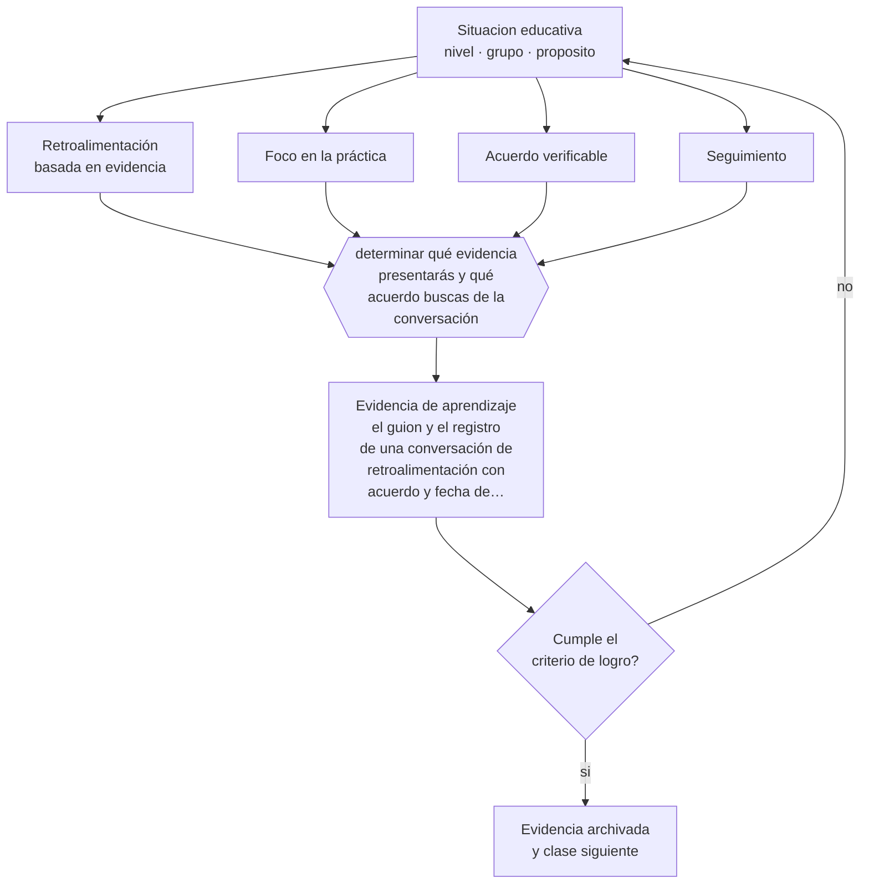

# Clase 184 — Feedback a docentes

> **Parte 15 · Gestión y liderazgo educativo** — clase 4 de 12

**Estado de evidencia:** `CONSISTENTE` · **Etapa:** 🟠 Etapa D — Educación superior y liderazgo · **Población de referencia:** equipos directivos, jefaturas técnicas y coordinaciones 
**Decisión que habilita:** determinar qué evidencia presentarás y qué acuerdo buscas de la conversación 
**Evidencia de aprendizaje:** el guion y el registro de una conversación de retroalimentación con acuerdo y fecha de seguimiento

## 🎯 Propósito

Conducir conversaciones de retroalimentación docente basadas en evidencia observada, con foco en la práctica, acuerdos verificables y seguimiento.

## 📚 Resultados de aprendizaje

Al finalizar esta clase podrás:

1. **Definir** con precisión los cuatro conceptos centrales de la clase y reconocerlos en una situación educativa real, no solo en su enunciado.
2. **Explicar** cómo dar retroalimentación a un colega adulto sin que la conversación se convierta en defensa.
3. **Decidir** —qué evidencia presentarás y qué acuerdo buscas de la conversación— y sostener la decisión con un fundamento escrito.
4. **Producir** la evidencia de la clase —el guion y el registro de una conversación de retroalimentación con acuerdo y fecha de seguimiento— y contrastarla contra el criterio de logro.
5. **Distinguir** lo que la evidencia sostiene de lo que es práctica instalada, preferencia personal o costumbre de la institución.

## 🧩 Conceptos centrales

| Concepto | Comprensión verificable |
|---|---|
| **Retroalimentación basada en evidencia** | conversación anclada en lo observado y no en impresiones generales |
| **Foco en la práctica** | centrar la conversación en decisiones docentes concretas y no en atributos de la persona |
| **Acuerdo verificable** | compromiso específico con indicador y plazo |
| **Seguimiento** | instancia posterior en que se revisa el acuerdo, sin la cual la conversación se disuelve |

## 🗺️ Flujo de razonamiento

## 📖 Desarrollo

### 1. El fondo del asunto

La retroalimentación a docentes fracasa por las mismas razones que la retroalimentación a estudiantes: se dirige a la persona, es general y no tiene seguimiento. La versión que funciona presenta evidencia concreta —lo que se observó, con datos—, pregunta antes de afirmar, se centra en una decisión pedagógica específica y termina con un acuerdo verificable y una fecha.

### 2. Cómo se traduce en decisiones de enseñanza

La estructura de la conversación importa: empezar con la lectura del propio docente sobre la clase, presentar la evidencia observada, contrastar, acordar una acción y fijar el seguimiento. Preguntar antes de afirmar no es una técnica de cortesía: la mayoría de las veces el docente ya identificó el problema y la conversación avanza mucho más rápido.

### 3. Qué sostiene la evidencia y qué no

El coaching instruccional muestra efectos positivos en programas bien implementados, con caída al escalar. Y su eficacia depende de que la persona que retroalimenta tenga credibilidad pedagógica: un directivo que no puede explicar cómo haría la clase pierde autoridad técnica en la conversación.

> **Cómo leer el estado de evidencia `CONSISTENTE`.** La evidencia es amplia y coherente, pero proviene sobre todo de estudios correlacionales, de síntesis con heterogeneidad alta o de contextos distintos al tuyo. Sirve para orientar la decisión y exige que compruebes el efecto en tu propio grupo.

## 🧪 Taller guiado

Aplica la clase a **uno** de los contextos siguientes y repite después el ejercicio en un
contexto de exigencia distinta. Cambiar de contexto es parte del aprendizaje: lo que funciona
con un grupo no se traslada intacto a otro.

| Contexto | Rasgo que cambia la decisión |
|---|---|
| Escuela pequeña con equipo reducido | el directivo también hace clases |
| Establecimiento grande con varios ciclos | la coordinación entre niveles es el problema |
| Institución con resultados descendentes | hay urgencia y baja confianza inicial |
| Equipo con alta rotación docente | el conocimiento institucional se pierde cada año |
| Institución de educación superior | gobierno colegiado y autonomía académica |
| Organización de capacitación | los indicadores son contractuales y externos |

**Secuencia de trabajo:**

1. Delimita el contexto: nivel, edad, tamaño del grupo, asignatura o experiencia y tiempo real disponible.
2. Declara qué saben ya los estudiantes y **cómo lo comprobaste**, no cómo lo supones.
3. Formula la decisión pedagógica que esta clase habilita y escribe su fundamento.
4. Anticipa qué observarías si la decisión funciona y qué observarías si no funciona.
5. Diseña de antemano la alternativa que aplicarás si la primera estrategia falla.
6. Ejecuta o simula, y registra lo observado con fecha, contexto y evidencia concreta.
7. Produce la evidencia de aprendizaje de la clase.
8. Contrástala contra el criterio de logro, corrige y recién entonces avanza.

### 📦 Evidencia de aprendizaje

El guion y el registro de una conversación de retroalimentación con acuerdo y fecha de seguimiento.

Debe incluir contexto, decisión, fundamento, fuentes consultadas con su fecha, indicador de
logro observable, riesgos previstos y qué harías distinto en la siguiente iteración.

## 🏆 Reto verificable

Conduce una conversación con guion y evidencia. Registra la proporción de tiempo en que habló cada uno y verifica el acuerdo a las tres semanas.

## ✅ Criterio de logro

- [ ] la conversación se ancla en evidencia observada y en una decisión pedagógica específica;
- [ ] termina con acuerdo verificable, indicador y fecha de seguimiento;
- [ ] cada afirmación sobre «lo que funciona» está atribuida a una fuente identificable, con autor y fecha;
- [ ] la decisión es ejecutable con el tiempo, el espacio, el número de estudiantes y los recursos que realmente tienes;
- [ ] la evidencia queda archivada de forma reproducible: otra persona podría revisarla sin que tú se la expliques.

## ⚠️ Errores frecuentes

**Propios de esta clase:**

- Retroalimentar con impresiones generales sin evidencia observada.
- Cerrar la conversación sin acuerdo verificable ni fecha de seguimiento.

**Característicos de la parte 15:**

- Confundir liderazgo con carisma o con control administrativo.
- Observar clases sin acuerdo previo sobre foco, uso y confidencialidad.

## ♿ Diversidad, accesibilidad y ética

Los docentes que enseñan en los cursos más difíciles suelen recibir más críticas y menos apoyo. Considerar las condiciones reales de cada contexto es parte de una retroalimentación justa y técnicamente correcta.

Antes de aplicar cualquier decisión de esta clase con estudiantes reales, revisa el
[protocolo de práctica responsable](../../../docs/ETICA_Y_PRACTICA_RESPONSABLE.md):
consentimiento, resguardo de datos personales, proporcionalidad de la intervención y derecho
de cada estudiante a no ser objeto de un ensayo que no le reporta beneficio.

## ❓ Preguntas de comprobación

1. ¿Qué evidencia concreta llevas a la conversación?
2. ¿Cuánto habla el docente y cuánto hablas tú?
3. ¿Cuándo revisarán juntos si el acuerdo se cumplió?

## 📕 Lecturas base

**Knight, J. (2007). *Instructional Coaching*.**  
*Qué aporta a esta clase:* protocolos de conversación y estructura de acompañamiento con docentes.

**Kraft, M., Blazar, D. & Hogan, D. (2018). *The Effect of Teacher Coaching*.**  
*Qué aporta a esta clase:* evidencia de efecto y advertencia sobre la caída al escalar los programas.

Catálogo completo: [bibliografía del programa](../../../docs/BIBLIOGRAFIA.md) ·
[glosario](../../../docs/GLOSARIO.md) ·
[fuentes oficiales y cómo leerlas](../../../docs/FUENTES.md).

## 🔗 Conexión con el resto del programa

Depende de la clase 183 y aplica los principios de la clase 139 a adultos profesionales.

> [!IMPORTANT]
> Material de formación profesional. No reemplaza un título de pedagogía, una habilitación
> legal para ejercer, ni el juicio de un equipo educativo que conoce a sus estudiantes.

---

| Anterior | Índice | Siguiente |
|---|---|---|
| [← 183 · Observación de clases](../class-03-observacion-de-clases/README.md) | [Parte 15](../README.md) · [Programa](../../../README.md) | [185 · Comunidades profesionales de aprendizaje →](../class-05-comunidades-profesionales-de-aprendizaje/README.md) |
