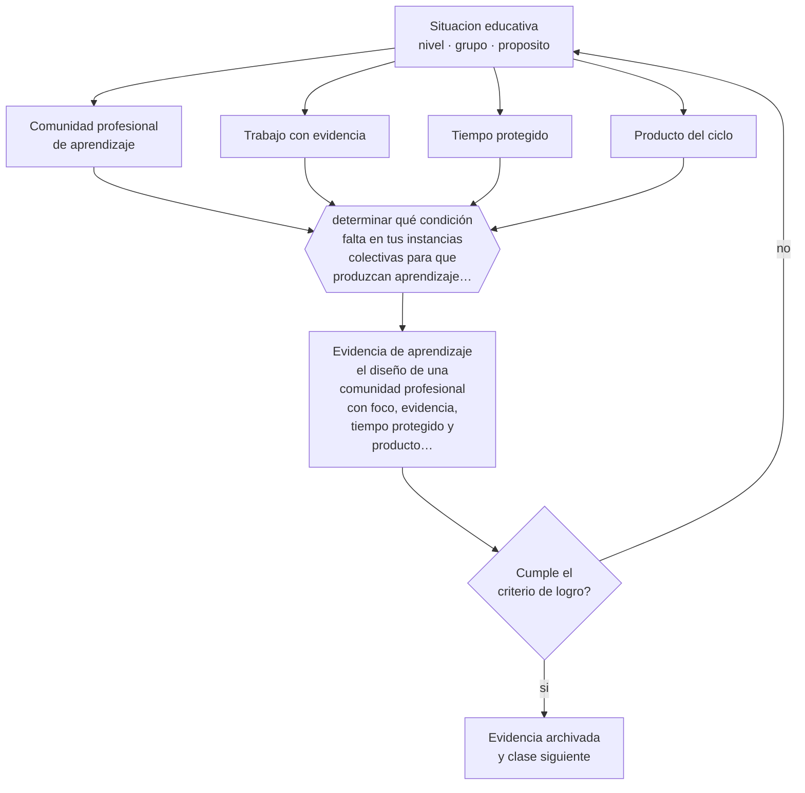

# Clase 185 — Comunidades profesionales de aprendizaje

> **Parte 15 · Gestión y liderazgo educativo** — clase 5 de 12

**Estado de evidencia:** `CONSISTENTE` · **Etapa:** 🟠 Etapa D — Educación superior y liderazgo · **Población de referencia:** equipos directivos, jefaturas técnicas y coordinaciones 
**Decisión que habilita:** determinar qué condición falta en tus instancias colectivas para que produzcan aprendizaje profesional 
**Evidencia de aprendizaje:** el diseño de una comunidad profesional con foco, evidencia, tiempo protegido y producto verificable por ciclo

## 🎯 Propósito

Instalar comunidades profesionales de aprendizaje con las condiciones que las hacen funcionar: foco en el aprendizaje de los estudiantes, trabajo con evidencia, tiempo protegido y normas de colaboración.

## 📚 Resultados de aprendizaje

Al finalizar esta clase podrás:

1. **Definir** con precisión los cuatro conceptos centrales de la clase y reconocerlos en una situación educativa real, no solo en su enunciado.
2. **Explicar** qué distingue una comunidad profesional de aprendizaje de una reunión de coordinación más.
3. **Decidir** —qué condición falta en tus instancias colectivas para que produzcan aprendizaje profesional— y sostener la decisión con un fundamento escrito.
4. **Producir** la evidencia de la clase —el diseño de una comunidad profesional con foco, evidencia, tiempo protegido y producto verificable por ciclo— y contrastarla contra el criterio de logro.
5. **Distinguir** lo que la evidencia sostiene de lo que es práctica instalada, preferencia personal o costumbre de la institución.

## 🧩 Conceptos centrales

| Concepto | Comprensión verificable |
|---|---|
| **Comunidad profesional de aprendizaje** | grupo docente que indaga colectivamente sobre el aprendizaje de sus estudiantes |
| **Trabajo con evidencia** | uso de trabajos de estudiantes y datos reales como material de la conversación |
| **Tiempo protegido** | espacio en la jornada destinado exclusivamente al trabajo colectivo |
| **Producto del ciclo** | resultado concreto —instrumento, secuencia, acuerdo— que deja cada período de trabajo |

## 🗺️ Flujo de razonamiento

## 📖 Desarrollo

### 1. El fondo del asunto

La mayoría de las reuniones docentes se ocupa de coordinación administrativa. Una comunidad profesional de aprendizaje se distingue por su material: trabajos de estudiantes, datos de una evaluación, registros de clase. La conversación deja de ser sobre opiniones y pasa a ser sobre evidencia, que es lo que permite acordar acciones y verificar su efecto.

### 2. Cómo se traduce en decisiones de enseñanza

El diseño exige tres condiciones concretas: tiempo en la jornada —no después de la jornada—, foco definido por ciclo y un producto verificable al final. Sin producto, el trabajo colectivo se percibe como conversación sin consecuencia y la asistencia decae, con razón.

### 3. Qué sostiene la evidencia y qué no

La evidencia sobre comunidades profesionales es favorable en desarrollo profesional y más débil e indirecta en aprendizaje de los estudiantes. Además, su implementación es muy variable: el mismo nombre cubre desde indagación rigurosa hasta reuniones renombradas. La condición material —tiempo protegido— es la que más frecuentemente falta.

> **Cómo leer el estado de evidencia `CONSISTENTE`.** La evidencia es amplia y coherente, pero proviene sobre todo de estudios correlacionales, de síntesis con heterogeneidad alta o de contextos distintos al tuyo. Sirve para orientar la decisión y exige que compruebes el efecto en tu propio grupo.

## 🧪 Taller guiado

Aplica la clase a **uno** de los contextos siguientes y repite después el ejercicio en un
contexto de exigencia distinta. Cambiar de contexto es parte del aprendizaje: lo que funciona
con un grupo no se traslada intacto a otro.

| Contexto | Rasgo que cambia la decisión |
|---|---|
| Escuela pequeña con equipo reducido | el directivo también hace clases |
| Establecimiento grande con varios ciclos | la coordinación entre niveles es el problema |
| Institución con resultados descendentes | hay urgencia y baja confianza inicial |
| Equipo con alta rotación docente | el conocimiento institucional se pierde cada año |
| Institución de educación superior | gobierno colegiado y autonomía académica |
| Organización de capacitación | los indicadores son contractuales y externos |

**Secuencia de trabajo:**

1. Delimita el contexto: nivel, edad, tamaño del grupo, asignatura o experiencia y tiempo real disponible.
2. Declara qué saben ya los estudiantes y **cómo lo comprobaste**, no cómo lo supones.
3. Formula la decisión pedagógica que esta clase habilita y escribe su fundamento.
4. Anticipa qué observarías si la decisión funciona y qué observarías si no funciona.
5. Diseña de antemano la alternativa que aplicarás si la primera estrategia falla.
6. Ejecuta o simula, y registra lo observado con fecha, contexto y evidencia concreta.
7. Produce la evidencia de aprendizaje de la clase.
8. Contrástala contra el criterio de logro, corrige y recién entonces avanza.

### 📦 Evidencia de aprendizaje

El diseño de una comunidad profesional con foco, evidencia, tiempo protegido y producto verificable por ciclo.

Debe incluir contexto, decisión, fundamento, fuentes consultadas con su fecha, indicador de
logro observable, riesgos previstos y qué harías distinto en la siguiente iteración.

## 🏆 Reto verificable

Conduce un ciclo completo con evidencia real y un producto definido. Evalúa si el producto cambió alguna práctica de aula.

## ✅ Criterio de logro

- [ ] cada ciclo trabaja con evidencia real de aprendizaje y produce un resultado verificable;
- [ ] el tiempo está protegido dentro de la jornada y no depende de la disposición individual;
- [ ] cada afirmación sobre «lo que funciona» está atribuida a una fuente identificable, con autor y fecha;
- [ ] la decisión es ejecutable con el tiempo, el espacio, el número de estudiantes y los recursos que realmente tienes;
- [ ] la evidencia queda archivada de forma reproducible: otra persona podría revisarla sin que tú se la expliques.

## ⚠️ Errores frecuentes

**Propios de esta clase:**

- Instalar la comunidad sin tiempo protegido en la jornada laboral.
- Trabajar sobre opiniones y no sobre evidencia del aprendizaje de los estudiantes.

**Característicos de la parte 15:**

- Confundir liderazgo con carisma o con control administrativo.
- Observar clases sin acuerdo previo sobre foco, uso y confidencialidad.

## ♿ Diversidad, accesibilidad y ética

Las comunidades que trabajan con evidencia desagregada detectan qué estudiantes están quedando fuera de forma sistemática, que es información que ningún promedio institucional entrega.

Antes de aplicar cualquier decisión de esta clase con estudiantes reales, revisa el
[protocolo de práctica responsable](../../../docs/ETICA_Y_PRACTICA_RESPONSABLE.md):
consentimiento, resguardo de datos personales, proporcionalidad de la intervención y derecho
de cada estudiante a no ser objeto de un ensayo que no le reporta beneficio.

## ❓ Preguntas de comprobación

1. ¿Qué material concreto se pone sobre la mesa en tus reuniones?
2. ¿Qué produjo tu equipo el último trimestre?
3. ¿De dónde sale el tiempo para este trabajo?

## 📕 Lecturas base

**Vescio, V., Ross, D. & Adams, A. (2008). *A Review of Research on the Impact of Professional Learning Communities*.**  
*Qué aporta a esta clase:* revisa la evidencia disponible y sus limitaciones.

**Bryk, A. et al. (2015). *Learning to Improve*.**  
*Qué aporta a esta clase:* modelo de indagación colectiva por ciclos con evidencia, aplicable a comunidades docentes.

Catálogo completo: [bibliografía del programa](../../../docs/BIBLIOGRAFIA.md) ·
[glosario](../../../docs/GLOSARIO.md) ·
[fuentes oficiales y cómo leerlas](../../../docs/FUENTES.md).

## 🔗 Conexión con el resto del programa

Se apoya en las clases 181 y 184 y alimenta el ciclo de mejora de la clase 189.

> [!IMPORTANT]
> Material de formación profesional. No reemplaza un título de pedagogía, una habilitación
> legal para ejercer, ni el juicio de un equipo educativo que conoce a sus estudiantes.

---

| Anterior | Índice | Siguiente |
|---|---|---|
| [← 184 · Feedback a docentes](../class-04-feedback-a-docentes/README.md) | [Parte 15](../README.md) · [Programa](../../../README.md) | [186 · Planificación estratégica →](../class-06-planificacion-estrategica/README.md) |
