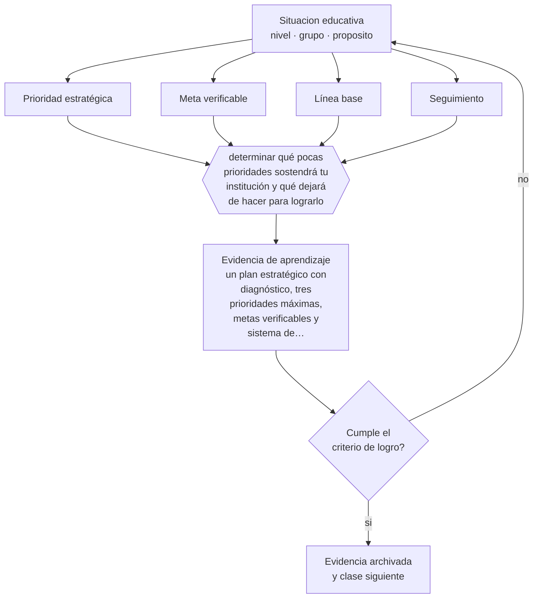

# Clase 186 — Planificación estratégica

> **Parte 15 · Gestión y liderazgo educativo** — clase 6 de 12

**Estado de evidencia:** `PRACTICA-PROFESIONAL` · **Etapa:** 🟠 Etapa D — Educación superior y liderazgo · **Población de referencia:** equipos directivos, jefaturas técnicas y coordinaciones 
**Decisión que habilita:** determinar qué pocas prioridades sostendrá tu institución y qué dejará de hacer para lograrlo 
**Evidencia de aprendizaje:** un plan estratégico con diagnóstico, tres prioridades máximas, metas verificables y sistema de seguimiento

## 🎯 Propósito

Construir planificación estratégica institucional que efectivamente oriente decisiones: diagnóstico con datos, pocas prioridades, metas verificables, responsables y seguimiento real.

## 📚 Resultados de aprendizaje

Al finalizar esta clase podrás:

1. **Definir** con precisión los cuatro conceptos centrales de la clase y reconocerlos en una situación educativa real, no solo en su enunciado.
2. **Explicar** por qué la mayoría de los planes estratégicos educativos no cambia nada.
3. **Decidir** —qué pocas prioridades sostendrá tu institución y qué dejará de hacer para lograrlo— y sostener la decisión con un fundamento escrito.
4. **Producir** la evidencia de la clase —un plan estratégico con diagnóstico, tres prioridades máximas, metas verificables y sistema de seguimiento— y contrastarla contra el criterio de logro.
5. **Distinguir** lo que la evidencia sostiene de lo que es práctica instalada, preferencia personal o costumbre de la institución.

## 🧩 Conceptos centrales

| Concepto | Comprensión verificable |
|---|---|
| **Prioridad estratégica** | foco que concentra recursos y atención; su número debe ser pequeño para ser real |
| **Meta verificable** | resultado esperado con indicador, línea base, plazo y responsable |
| **Línea base** | valor inicial del indicador, sin el cual no se puede afirmar mejora |
| **Seguimiento** | instancia periódica que revisa avance y ajusta, con consecuencias sobre las decisiones |

## 🗺️ Flujo de razonamiento

## 📖 Desarrollo

### 1. El fondo del asunto

Los planes estratégicos fracasan por tres razones recurrentes: demasiadas prioridades, metas sin línea base ni indicador, y ausencia de seguimiento con consecuencias. El resultado es un documento que se escribe para cumplir un requisito y que nadie usa para decidir. Un plan útil tiene pocas prioridades, metas que se pueden verificar y una instancia periódica donde se decide con sus datos.

### 2. Cómo se traduce en decisiones de enseñanza

La disciplina más difícil es decidir qué no se hará: una institución que declara ocho prioridades no tiene ninguna. Y cada meta necesita línea base: sin ella, cualquier resultado se puede narrar como avance. El seguimiento debe tener consecuencias sobre asignación de tiempo y recursos, o se convierte en un reporte más.

### 3. Qué sostiene la evidencia y qué no

No hay evidencia sólida sobre modelos de planificación estratégica en educación: es conocimiento profesional y de gestión. Lo que sí está documentado es que las instituciones que sostienen pocas prioridades durante varios años obtienen mejores resultados que las que cambian de foco cada año.

> **Cómo leer el estado de evidencia `PRACTICA-PROFESIONAL`.** Es conocimiento práctico acumulado del oficio, útil y transferible, pero no probado con diseños de investigación. Trátalo como un buen punto de partida sujeto a comprobación en tu contexto.

## 🧪 Taller guiado

Aplica la clase a **uno** de los contextos siguientes y repite después el ejercicio en un
contexto de exigencia distinta. Cambiar de contexto es parte del aprendizaje: lo que funciona
con un grupo no se traslada intacto a otro.

| Contexto | Rasgo que cambia la decisión |
|---|---|
| Escuela pequeña con equipo reducido | el directivo también hace clases |
| Establecimiento grande con varios ciclos | la coordinación entre niveles es el problema |
| Institución con resultados descendentes | hay urgencia y baja confianza inicial |
| Equipo con alta rotación docente | el conocimiento institucional se pierde cada año |
| Institución de educación superior | gobierno colegiado y autonomía académica |
| Organización de capacitación | los indicadores son contractuales y externos |

**Secuencia de trabajo:**

1. Delimita el contexto: nivel, edad, tamaño del grupo, asignatura o experiencia y tiempo real disponible.
2. Declara qué saben ya los estudiantes y **cómo lo comprobaste**, no cómo lo supones.
3. Formula la decisión pedagógica que esta clase habilita y escribe su fundamento.
4. Anticipa qué observarías si la decisión funciona y qué observarías si no funciona.
5. Diseña de antemano la alternativa que aplicarás si la primera estrategia falla.
6. Ejecuta o simula, y registra lo observado con fecha, contexto y evidencia concreta.
7. Produce la evidencia de aprendizaje de la clase.
8. Contrástala contra el criterio de logro, corrige y recién entonces avanza.

### 📦 Evidencia de aprendizaje

Un plan estratégico con diagnóstico, tres prioridades máximas, metas verificables y sistema de seguimiento.

Debe incluir contexto, decisión, fundamento, fuentes consultadas con su fecha, indicador de
logro observable, riesgos previstos y qué harías distinto en la siguiente iteración.

## 🏆 Reto verificable

Reduce el plan de tu institución a tres prioridades con línea base. Presenta la propuesta al equipo y registra qué resistencias aparecen.

## ✅ Criterio de logro

- [ ] el plan tiene tres prioridades como máximo, con metas, línea base y responsables;
- [ ] declara explícitamente qué se dejará de hacer para sostenerlas;
- [ ] cada afirmación sobre «lo que funciona» está atribuida a una fuente identificable, con autor y fecha;
- [ ] la decisión es ejecutable con el tiempo, el espacio, el número de estudiantes y los recursos que realmente tienes;
- [ ] la evidencia queda archivada de forma reproducible: otra persona podría revisarla sin que tú se la expliques.

## ⚠️ Errores frecuentes

**Propios de esta clase:**

- Declarar más prioridades de las que la institución puede sostener a la vez.
- Fijar metas sin línea base, con lo que ningún resultado es verificable.

**Característicos de la parte 15:**

- Confundir liderazgo con carisma o con control administrativo.
- Observar clases sin acuerdo previo sobre foco, uso y confidencialidad.

## ♿ Diversidad, accesibilidad y ética

Un plan con foco de equidad declara metas desagregadas: qué ocurrirá con los estudiantes que hoy están más abajo. Sin desagregación, un promedio institucional puede mejorar mientras la brecha interna aumenta.

Antes de aplicar cualquier decisión de esta clase con estudiantes reales, revisa el
[protocolo de práctica responsable](../../../docs/ETICA_Y_PRACTICA_RESPONSABLE.md):
consentimiento, resguardo de datos personales, proporcionalidad de la intervención y derecho
de cada estudiante a no ser objeto de un ensayo que no le reporta beneficio.

## ❓ Preguntas de comprobación

1. ¿Cuántas prioridades declara hoy tu institución y cuántas puede sostener?
2. ¿Cuál es la línea base de tu meta principal?
3. ¿Qué decisión concreta cambió el último seguimiento?

## 📕 Lecturas base

**Fullan, M. (2011). *Choosing the Wrong Drivers for Whole System Reform*.**  
*Qué aporta a esta clase:* analiza por qué ciertas estrategias de mejora no producen efecto y cuáles sí.

**Mineduc. *Orientaciones para el Plan de Mejoramiento Educativo*.**  
*Qué aporta a esta clase:* marco chileno de planificación institucional con sus requisitos formales.

Catálogo completo: [bibliografía del programa](../../../docs/BIBLIOGRAFIA.md) ·
[glosario](../../../docs/GLOSARIO.md) ·
[fuentes oficiales y cómo leerlas](../../../docs/FUENTES.md).

## 🔗 Conexión con el resto del programa

Se apoya en las clases 011 y 188 y culmina en la clase 192.

> [!IMPORTANT]
> Material de formación profesional. No reemplaza un título de pedagogía, una habilitación
> legal para ejercer, ni el juicio de un equipo educativo que conoce a sus estudiantes.

---

| Anterior | Índice | Siguiente |
|---|---|---|
| [← 185 · Comunidades profesionales de aprendizaje](../class-05-comunidades-profesionales-de-aprendizaje/README.md) | [Parte 15](../README.md) · [Programa](../../../README.md) | [187 · Gestión de equipos →](../class-07-gestion-de-equipos/README.md) |
