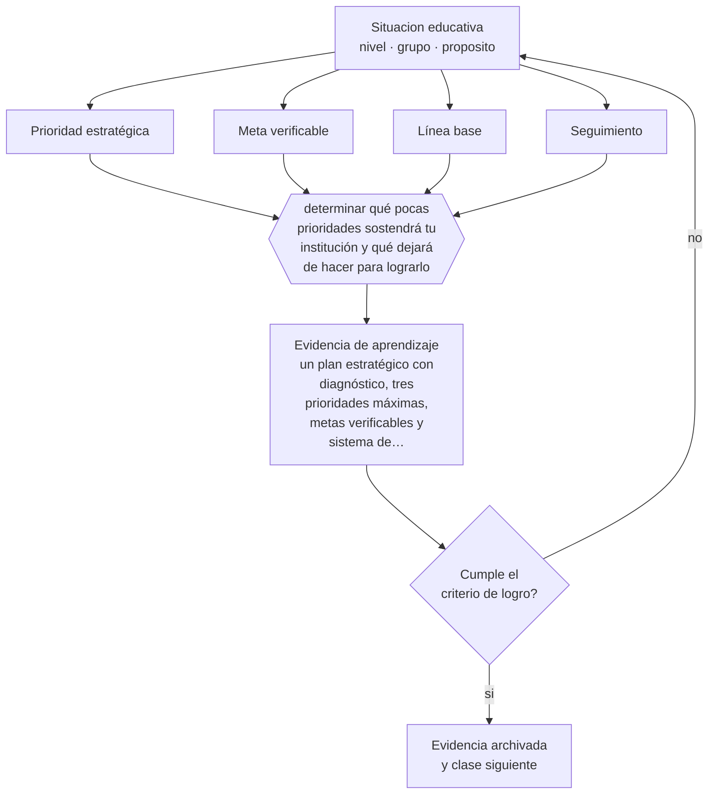

# Clase 186 — Planificación estratégica

> **Parte 15 · Gestión y liderazgo educativo** — clase 6 de 12

**Estado de evidencia:** `PRACTICA-PROFESIONAL` · **Etapa:** 🟠 Etapa D — Educación superior y liderazgo · **Población de referencia:** equipos directivos, jefaturas técnicas y coordinaciones 
**Decisión que habilita:** determinar qué pocas prioridades sostendrá tu institución y qué dejará de hacer para lograrlo 
**Evidencia de aprendizaje:** un plan estratégico con diagnóstico, tres prioridades máximas, metas verificables y sistema de seguimiento

## 🎯 Propósito

Construir planificación estratégica institucional que efectivamente oriente decisiones: diagnóstico con datos, pocas prioridades, metas verificables, responsables y seguimiento real.

## 📚 Resultados de aprendizaje

Al finalizar esta clase podrás:

1. **Definir** con precisión los cuatro conceptos centrales de la clase y reconocerlos en una situación educativa real, no solo en su enunciado.
2. **Explicar** por qué la mayoría de los planes estratégicos educativos no cambia nada.
3. **Decidir** —qué pocas prioridades sostendrá tu institución y qué dejará de hacer para lograrlo— y sostener la decisión con un fundamento escrito.
4. **Producir** la evidencia de la clase —un plan estratégico con diagnóstico, tres prioridades máximas, metas verificables y sistema de seguimiento— y contrastarla contra el criterio de logro.
5. **Distinguir** lo que la evidencia sostiene de lo que es práctica instalada, preferencia personal o costumbre de la institución.

## 🧭 Agenda sugerida (90 minutos)

| Minutos | Bloque | Qué ocurre |
|---:|---|---|
| 0–10 | Activación | Recuperar sin mirar la clase anterior y responder la pregunta de foco. |
| 10–25 | Conceptos | Definir los cuatro conceptos y reconocerlos en un caso real. |
| 25–45 | Modelo mental | Recorrer el método: delimitar el contexto y comprobar —no suponer— qué saben ya los estudiantes. |
| 45–70 | Ejemplo trabajado | Aplicar el método al caso de la parte, paso a paso y con evidencia. |
| 70–85 | Taller | Trasladar la decisión al contexto propio y anticipar su alternativa. |
| 85–90 | Cierre | Fijar responsable, plazo e indicador de la evidencia de aprendizaje. |

Fuera de la sesión, la clase exige aproximadamente **una hora y media** de práctica y de
producción de la evidencia. Si el tiempo se recorta, se recorta el ejemplo trabajado, nunca la
producción de evidencia: es la única parte que prueba el aprendizaje.

## 🧩 Conceptos centrales

| Concepto | Comprensión verificable |
|---|---|
| **Prioridad estratégica** | foco que concentra recursos y atención; su número debe ser pequeño para ser real |
| **Meta verificable** | resultado esperado que declara indicador, línea base, plazo y responsable, de modo que su cumplimiento no dependa de la interpretación |
| **Línea base** | valor inicial del indicador, sin el cual no se puede afirmar mejora |
| **Seguimiento** | instancia periódica que revisa avance y ajusta, con consecuencias sobre las decisiones |

## 🧠 Modelo mental

El método de esta clase, en cinco pasos que se ejecutan en orden:

1. Delimitar el contexto y comprobar —no suponer— qué saben ya los estudiantes.
2. Clasificar la situación distinguiendo **Prioridad estratégica** de **Meta verificable**.
3. Decidir con fundamento, usando **Línea base** como criterio y declarando la fuente.
4. Anticipar qué evidencia confirmaría la decisión y cuál la refutaría, con **Seguimiento** a la vista.
5. Registrar lo ocurrido y contrastarlo contra el criterio de logro antes de avanzar.

Lo que hace profesional a este método no son los pasos sino la evidencia que exige en cada uno.
Estas son las señales observables con las que se comprueba, y que deben quedar definidas **antes**
de recogerlas:

| Señal observable | Cómo se recoge y qué significa |
|---|---|
| **Evidencia de partida** | qué sabían o podían hacer los estudiantes antes de la decisión, comprobado y no supuesto |
| **Evidencia de proceso** | qué se observó mientras la decisión se aplicaba, con fecha, contexto y responsable del registro |
| **Evidencia de logro** | qué muestra un plan estratégico con diagnóstico, tres prioridades máximas, metas verificables y sistema de seguimiento frente al criterio declarado de antemano |

**Frontera de aplicación.** El método vale mientras las condiciones que lo sostienen se cumplan.
No hay evidencia sólida sobre modelos de planificación estratégica en educación: Cuando esa condición falla, el paso siguiente no es forzar el método:
es declarar el límite y decidir con menos certeza, dejándolo por escrito.

## 🗺️ Flujo de razonamiento

## 📖 Desarrollo

### 1. El fondo del asunto

Los planes estratégicos fracasan por tres razones recurrentes: demasiadas prioridades, metas sin línea base ni indicador, y ausencia de seguimiento con consecuencias. El resultado es un documento que se escribe para cumplir un requisito y que nadie usa para decidir. Un plan útil tiene pocas prioridades, metas que se pueden verificar y una instancia periódica donde se decide con sus datos. En el sistema chileno esa tensión es visible en los planes de mejoramiento educativo: el instrumento existe, es obligatorio y su calidad varía enormemente según si el equipo lo usa para conducir o para rendir cuenta.

### 2. Frontera conceptual: qué es y qué no es

Los cuatro conceptos de esta clase se confunden entre sí con facilidad, y esa confusión no es
inocua: produce decisiones que atacan el problema equivocado. **Prioridad estratégica** no es lo
mismo que **Meta verificable** —resultado esperado que declara indicador, línea base, plazo y responsable, de modo que su cumplimiento no dependa de la interpretación—, y tratarlos como sinónimos hace
que la intervención se dirija al lugar incorrecto. Del mismo modo, **Línea base** y
**Seguimiento** describen aspectos distintos de la misma situación: el primero
valor inicial del indicador, sin el cual no se puede afirmar mejora, mientras el segundo instancia periódica que revisa avance y ajusta, con consecuencias sobre las decisiones.

La prueba de que la distinción está entendida es operacional, no verbal: dos personas que
observan la misma clase deben poder clasificar el mismo episodio de la misma manera. Si no
coinciden, el problema está en la definición y no en el observador. El error de clasificación más
frecuente en esta materia es el primero de los que se listan más abajo, y conviene anticiparlo
antes de aplicar nada.

### 3. Cómo se observa y se mide

Nada de lo anterior sirve si no se puede observar. Estas son las señales que esta clase usa y
cómo se recogen:

- **Evidencia de partida.** Qué sabían o podían hacer los estudiantes antes de la decisión, comprobado y no supuesto. Se registra con fecha y contexto; sin eso, la señal no distingue una tendencia de una casualidad.
- **Evidencia de proceso.** Qué se observó mientras la decisión se aplicaba, con fecha, contexto y responsable del registro. Se registra con fecha y contexto; sin eso, la señal no distingue una tendencia de una casualidad.
- **Evidencia de logro.** Qué muestra un plan estratégico con diagnóstico, tres prioridades máximas, metas verificables y sistema de seguimiento frente al criterio declarado de antemano. Se registra con fecha y contexto; sin eso, la señal no distingue una tendencia de una casualidad.

Ninguna de estas señales es el aprendizaje: son indicios de él. Confundir el indicio con el
fenómeno es el error clásico de la medición educativa, y por eso cada señal se interpreta junto
con el contexto, el punto de partida del grupo y lo que el propio estudiante puede explicar sobre
su trabajo.

### 4. Cómo se traduce en decisiones de enseñanza

La disciplina más difícil es decidir qué no se hará: una institución que declara ocho prioridades no tiene ninguna. Y cada meta necesita línea base: sin ella, cualquier resultado se puede narrar como avance. El seguimiento debe tener consecuencias sobre asignación de tiempo y recursos, o se convierte en un reporte más. Una prueba práctica de calidad del plan es entregárselo a un docente que no participó en su elaboración y preguntarle qué cambia en su semana: si no puede responder, el plan todavía no aterriza.

### 5. Qué sostiene la evidencia y qué no

No hay evidencia sólida sobre modelos de planificación estratégica en educación: es conocimiento profesional y de gestión. Lo que sí está documentado es que las instituciones que sostienen pocas prioridades durante varios años obtienen mejores resultados que las que cambian de foco cada año. También está documentado el efecto contrario del exceso de iniciativas simultáneas, que compiten por el mismo tiempo docente y terminan ejecutándose todas a medias.

> **Cómo leer el estado de evidencia `PRACTICA-PROFESIONAL`.** Es conocimiento práctico acumulado del oficio, útil y transferible, pero no probado con diseños de investigación. Trátalo como un buen punto de partida sujeto a comprobación en tu contexto.

### 6. Integración: de los conceptos a una decisión defendible

Una decisión es defendible cuando puede explicarse a alguien que no estuvo presente. Esta clase
te deja en condiciones de qué pocas prioridades sostendrá tu institución y qué dejará de hacer para lograrlo, y esa decisión se sostiene solo si
declara cuatro cosas: la evidencia que la funda, el supuesto que asume, el indicador que la
comprobaría y la condición que la haría cambiar.

Ese es también el criterio con el que se evalúa la evidencia de aprendizaje de la clase. Un
análisis que podría copiarse a otra clase, a otro curso o a otro establecimiento sin cambiar una
palabra no es una decisión: es una declaración general, y el oficio empieza justo donde las
declaraciones generales terminan.

## 📚 Lectura comparada

Las obras no cumplen el mismo papel. Esta tabla indica qué lente aporta cada una;
después de leer, escribe una discrepancia real entre al menos dos fuentes.

| Fuente | Lente que aporta | Pregunta crítica |
|---|---|---|
| Fullan, M. (2011). *Choosing the Wrong Drivers for Whole System Reform*. | analiza por qué ciertas estrategias de mejora no producen efecto y cuáles sí. | ¿Qué supuesto de esta clase ayuda a poner a prueba? |
| Mineduc. *Orientaciones para el Plan de Mejoramiento Educativo* (edición vigente). | marco chileno de planificación institucional con sus requisitos formales. | ¿Qué supuesto de esta clase ayuda a poner a prueba? |

La lectura se evalúa por **uso**, no por cantidad de páginas. Tu nota de lectura debe indicar qué
tesis modifica tu diagnóstico, qué evidencia del caso la tensiona y qué decisión concreta
cambiarías después del contraste. Una nota que solo resume el texto no cumple el criterio.

## 🧮 Ejemplo trabajado

**Situación.** El equipo directivo de Los Aromos tiene ocho prioridades en su plan de mejora, ninguna con línea base. El uso real del tiempo directivo muestra un 12 % dedicado a lo pedagógico y el resto a administración y emergencias.

**Paso 1 — Delimitar el contexto y comprobar —no suponer— qué saben ya los estudiantes.** El equipo escribe primero el supuesto asociado a **Prioridad estratégica** y se prohíbe tratarlo como hecho. Contrasta ese supuesto con **Evidencia de partida** y anota qué parte del dato todavía no existe. Del paso sale un registro fechado y una frase explícita: «cambiaríamos de decisión si…».

**Paso 2 — Clasificar la situación distinguiendo Prioridad estratégica de Meta verificable.** El trabajo aquí es separar lo observado de lo interpretado sobre **Meta verificable**. La evidencia que ordena la conversación es **Evidencia de proceso**; si su definición no está escrita, escribirla es parte del paso. Nada avanza mientras el equipo no acuerde qué contaría como refutación.

**Paso 3 — Decidir con fundamento, usando Línea base como criterio y declarando la fuente.** El riesgo de este paso es cerrar demasiado rápido alrededor de **Línea base**. Antes de concluir, se enumeran dos explicaciones alternativas del mismo patrón y se revisa si **Evidencia de logro** logra distinguirlas. Si no lo logra, hace falta otra evidencia y así debe quedar registrado.

**Paso 4 — Anticipar qué evidencia confirmaría la decisión y cuál la refutaría, con Seguimiento a la vista.** Con **Seguimiento** ya delimitado, la pregunta pasa a ser de consecuencia: qué cambia para los estudiantes, para el tiempo de clase y para la carga del equipo. **Evidencia de partida** entrega la lectura observable; el juicio profesional sigue siendo humano y debe quedar firmado por quien lo hace.

**Paso 5 — Registrar lo ocurrido y contrastarlo contra el criterio de logro antes de avanzar.** El cierre exige compromiso: responsable, fecha, indicador de logro y condición de detención. **Evidencia de proceso** se convierte en la señal de seguimiento, y se acuerda con qué frecuencia se revisa y quién puede declarar que no funcionó sin costo político.

**Síntesis.** La recomendación termina con responsable, fecha, evidencia de logro y señal de
detención. Omitir cualquiera de esas cuatro piezas convierte el análisis en una opinión que nadie
podrá auditar dentro de tres meses, y que por lo tanto nadie corregirá.

## 🔀 Comparación de caminos y límites

Ante la misma situación caben varios cursos de acción. La decisión profesional no es
elegir el «correcto», sino saber qué privilegia cada uno y qué arriesga.

| Camino | Qué privilegia | Cuándo elegirlo | Riesgo principal |
|---|---|---|---|
| Intervenir sobre **Prioridad estratégica** | Foco que concentra recursos y atención; su número debe ser pequeño para ser real | Cuando **Evidencia de partida** es observable y accionable dentro del plazo de la decisión. | Sobrerreaccionar a una señal parcial. |
| Intervenir sobre **Meta verificable** | Resultado esperado que declara indicador, línea base, plazo y responsable, de modo que su cumplimiento no dependa de la interpretación | Cuando la primera explicación no distingue mecanismo ni responsable. | Convertir el concepto en etiqueta y no en intervención. |
| Observar antes de decidir | Reducir la incertidumbre antes de comprometer tiempo y credibilidad | Cuando la decisión es reversible y la evidencia disponible no distingue causas. | Observar indefinidamente y no decidir nunca. |
| Derivar o escalar | Poner la decisión donde están la competencia y la responsabilidad | Cuando hay normativa, resguardo de datos, salud o vulneración de derechos en juego. | Delegar hacia arriba lo que sí correspondía decidir en el aula. |

**Frontera de aplicación.** No hay evidencia sólida sobre modelos de planificación estratégica en educación: Fuera de esa frontera, la comparación
anterior deja de ser válida y la decisión debe tomarse con evidencia distinta.

## 🪜 El mismo tema según el rol

La misma materia cambia de forma según quién decida. Al subir de nivel aumentan las
personas, el tiempo y las consecuencias que quedan dentro de la decisión.

| Nivel | Responsabilidad sobre planificación estratégica |
|---|---|
| **Docente de aula** | Aplica, observa y registra la evidencia; declara qué no puede resolver desde su rol. |
| **Equipo de apoyo o educación diferencial** | Verifica que la decisión no deje fuera a quien más barreras enfrenta y aporta los apoyos. |
| **Jefatura técnico-pedagógica** | Convierte la decisión en criterio compartido, tiempo protegido y acompañamiento. |
| **Dirección** | Decide si esto cambia condiciones institucionales, recursos o el plan de mejora. |
| **Formación e investigación** | Pregunta si la decisión es generalizable, con qué evidencia y qué haría falta para probarlo. |

Si trabajas en uno de esos niveles, la [guía de carrera de tu rol](../../../rutas/README.md)
indica en qué orden conviene recorrer el programa y qué artefactos acreditan tu competencia.

## 🧪 Taller guiado

Aplica la clase a **uno** de los contextos siguientes y repite después el ejercicio en un
contexto de exigencia distinta. Cambiar de contexto es parte del aprendizaje: lo que funciona
con un grupo no se traslada intacto a otro.

| Contexto | Rasgo que cambia la decisión |
|---|---|
| Escuela pequeña con equipo reducido | el directivo también hace clases |
| Establecimiento grande con varios ciclos | la coordinación entre niveles es el problema |
| Institución con resultados descendentes | hay urgencia y baja confianza inicial |
| Equipo con alta rotación docente | el conocimiento institucional se pierde cada año |
| Institución de educación superior | gobierno colegiado y autonomía académica |
| Organización de capacitación | los indicadores son contractuales y externos |

**Secuencia de trabajo:**

1. Delimita el contexto: nivel, edad, tamaño del grupo, asignatura o experiencia y tiempo real disponible.
2. Declara qué saben ya los estudiantes y **cómo lo comprobaste**, no cómo lo supones.
3. Formula la decisión pedagógica que esta clase habilita y escribe su fundamento.
4. Anticipa qué observarías si la decisión funciona y qué observarías si no funciona.
5. Diseña de antemano la alternativa que aplicarás si la primera estrategia falla.
6. Ejecuta o simula, y registra lo observado con fecha, contexto y evidencia concreta.
7. Produce la evidencia de aprendizaje de la clase.
8. Contrástala contra el criterio de logro, corrige y recién entonces avanza.

## 🏫 Caso profesional

**Situación.** El equipo directivo de Los Aromos tiene ocho prioridades en su plan de mejora, ninguna con línea base. El uso real del tiempo directivo muestra un 12 % dedicado a lo pedagógico y el resto a administración y emergencias.

Entrega un **informe de decisión** de una página que contenga:

1. **Hechos y fuentes** — qué está documentado y con qué evidencia, separado de lo que se supone.
2. **Hipótesis** — la explicación más probable y una alternativa que también encajaría.
3. **Dos opciones defendibles** — no una recomendación y un espantapájaros.
4. **Efecto esperado** — sobre los estudiantes, el tiempo de clase, el equipo y los apoyos.
5. **Recomendación** — con su fundamento y la fuente que la respalda.
6. **Condición de revisión** — qué resultado te haría cambiar de decisión.
7. **Responsable y fecha** — quién ejecuta y cuándo se revisa.

Usa al menos **dos** fuentes de la lectura comparada para desafiar tu primera respuesta. Una
recomendación que ninguna fuente pone en duda casi siempre está poco examinada.

## 📥 Evidencia de aprendizaje

Un plan estratégico con diagnóstico, tres prioridades máximas, metas verificables y sistema de seguimiento.

Guárdala en `evidence/P15-C186-planificacion-estrategica/` con estos archivos:

| Archivo | Qué contiene |
|---|---|
| `decision.md` | contexto, decisión, fundamento, fuentes con fecha, indicador de logro y riesgos |
| `senales.md` | definición operacional de las tres señales, cómo se recogieron y qué no distinguen |
| `nota-de-lectura.md` | dos fuentes contrastadas, con edición y páginas consultadas |
| `revision-critica.md` | la objeción más fuerte a tu decisión y qué evidencia la invalidaría |

Esta evidencia alimenta el artefacto de la parte: **plan de mejora institucional con pocas prioridades, ciclos de indagación, indicadores desagregados y sistema de seguimiento**.

## 🏆 Reto verificable

Reduce el plan de tu institución a tres prioridades con línea base. Presenta la propuesta al equipo y registra qué resistencias aparecen.

## ✅ Evaluación de la clase

| Criterio | Peso | Evidencia esperada |
|---|---:|---|
| Precisión conceptual | 25 % | Distinciones correctas y observables entre los cuatro conceptos, aplicadas a un caso real. |
| Diagnóstico y evidencia | 30 % | Conocimiento previo comprobado, evidencia recogida con fecha y contexto, y límites del dato declarados. |
| Decisión y alternativas | 30 % | Decisión fundada, alternativa prevista si falla, y condición explícita que la haría cambiar. |
| Responsabilidad y comunicación | 15 % | Diversidad y resguardos considerados, fuentes citadas y evidencia archivada de forma reproducible. |

**Aprobación:** 80 de 100 y ningún criterio bajo el 60 %. Una respuesta que podría copiarse sin
cambios a otra clase, a otro curso o a otro establecimiento se considera insuficiente, aunque
esté bien escrita.

**Criterio de logro de la evidencia:**

- [ ] el plan tiene tres prioridades como máximo, con metas, línea base y responsables;
- [ ] declara explícitamente qué se dejará de hacer para sostenerlas;
- [ ] cada afirmación sobre «lo que funciona» está atribuida a una fuente identificable, con autor y fecha;
- [ ] la decisión es ejecutable con el tiempo, el espacio, el número de estudiantes y los recursos que realmente tienes;
- [ ] la evidencia queda archivada de forma reproducible: otra persona podría revisarla sin que tú se la expliques.

## ⚠️ Errores frecuentes

**Propios de esta clase:**

- Declarar más prioridades de las que la institución puede sostener a la vez.
- Fijar metas sin línea base, con lo que ningún resultado es verificable.

**Característicos de la parte 15:**

- Confundir liderazgo con carisma o con control administrativo.
- Observar clases sin acuerdo previo sobre foco, uso y confidencialidad.

Los cuatro comparten estructura: un síntoma visible, una causa que no se ve y una corrección que
casi siempre es de diseño y no de esfuerzo. Antes de atribuir el problema a los estudiantes o a
ti, comprueba cuál de ellos está operando y qué evidencia lo distinguiría de los otros tres.

## ♿ Diversidad, accesibilidad y ética

Un plan con foco de equidad declara metas desagregadas: qué ocurrirá con los estudiantes que hoy están más abajo. Sin desagregación, un promedio institucional puede mejorar mientras la brecha interna aumenta.

Antes de aplicar cualquier decisión de esta clase con estudiantes reales, revisa el
[protocolo de práctica responsable](../../../docs/ETICA_Y_PRACTICA_RESPONSABLE.md):
consentimiento, resguardo de datos personales, proporcionalidad de la intervención y derecho
de cada estudiante a no ser objeto de un ensayo que no le reporta beneficio.

## 🇨🇱 Contexto chileno y cumplimiento

Riesgo característico de esta parte: **Confundir liderazgo con carisma o con control administrativo.** Antes de aplicar
cualquier decisión de esta clase en un establecimiento real, verifica el marco vigente:

- Marco institucional y normativo: [`docs/MARCO_CHILE.md`](../../../docs/MARCO_CHILE.md).
- Inclusión y apoyos: [`docs/INCLUSION_Y_DUA.md`](../../../docs/INCLUSION_Y_DUA.md).
- Datos personales, IA y resguardos: [`docs/IA_EN_EDUCACION.md`](../../../docs/IA_EN_EDUCACION.md).
- Fuentes oficiales con cómo leerlas: [`docs/FUENTES.md`](../../../docs/FUENTES.md).

La regla del programa es simple: **la fuente oficial manda sobre el material pedagógico**. Si la
norma cambió después de la fecha de esta clase, gana la norma.

## ❓ Preguntas de comprobación

1. ¿Cuántas prioridades declara hoy tu institución y cuántas puede sostener?
2. ¿Cuál es la línea base de tu meta principal?
3. ¿Qué decisión concreta cambió el último seguimiento?

## 📗 Fuentes y verificación

- Fullan, M. (2011). *Choosing the Wrong Drivers for Whole System Reform*. **Uso en esta clase:** analiza por qué ciertas estrategias de mejora no producen efecto y cuáles sí. Lectura selectiva: índice y capítulos pertinentes; registra edición y páginas consultadas. **Localizar:** [ficha](../../../docs/REGISTRO_DE_FUENTES.md#fullan-2011-choosing-the-wrong-drivers-for-whole) — sin localizador verificado todavía.
- Mineduc. *Orientaciones para el Plan de Mejoramiento Educativo* (edición vigente). **Uso en esta clase:** marco chileno de planificación institucional con sus requisitos formales. Lectura selectiva: índice y capítulos pertinentes; registra edición y páginas consultadas. **Localizar:** [fuente oficial](https://liderazgoeducativo.mineduc.cl/orientaciones-pme-2026-2/) · [ficha](../../../docs/REGISTRO_DE_FUENTES.md#mineduc-orientaciones-para-el-plan-de-mejoramiento)

Catálogo completo: [registro de fuentes con localizador](../../../docs/REGISTRO_DE_FUENTES.md) ·
[bibliografía del programa](../../../docs/BIBLIOGRAFIA.md) ·
[glosario](../../../docs/GLOSARIO.md) ·
[fuentes oficiales y cómo leerlas](../../../docs/FUENTES.md).

> **Regla de fuentes.** Las obras anteriores estructuran las perspectivas de esta materia.
> Cualquier norma, decreto, orientación ministerial o política institucional mencionada debe
> comprobarse en su fuente primaria vigente antes de usarse con estudiantes reales. El desarrollo
> de esta clase es original y no reproduce capítulos protegidos por derechos de autor.

## 🔗 Conexión con el resto del programa

Se apoya en las clases 011 y 188 y culmina en la clase 192.

> [!IMPORTANT]
> Material de formación profesional. No reemplaza un título de pedagogía, una habilitación
> legal para ejercer, ni el juicio de un equipo educativo que conoce a sus estudiantes.

---

| Anterior | Índice | Siguiente |
|---|---|---|
| [← 185 · Comunidades profesionales de aprendizaje](../class-05-comunidades-profesionales-de-aprendizaje/README.md) | [Parte 15](../README.md) · [Programa](../../../README.md) | [187 · Gestión de equipos →](../class-07-gestion-de-equipos/README.md) |
