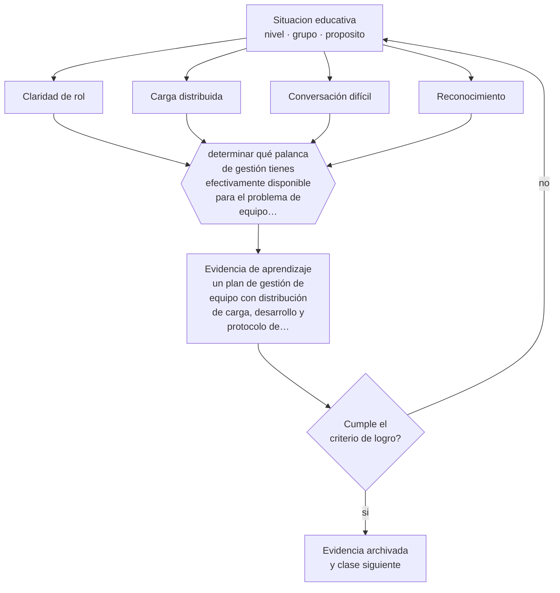

# Clase 187 — Gestión de equipos

> **Parte 15 · Gestión y liderazgo educativo** — clase 7 de 12

**Estado de evidencia:** `PRACTICA-PROFESIONAL` · **Etapa:** 🟠 Etapa D — Educación superior y liderazgo · **Población de referencia:** equipos directivos, jefaturas técnicas y coordinaciones 
**Decisión que habilita:** determinar qué palanca de gestión tienes efectivamente disponible para el problema de equipo que enfrentas 
**Evidencia de aprendizaje:** un plan de gestión de equipo con distribución de carga, desarrollo y protocolo de conversaciones difíciles

## 🎯 Propósito

Gestionar equipos educativos con las herramientas reales disponibles: claridad de rol, distribución justa de la carga, desarrollo profesional, conversaciones difíciles y reconocimiento.

## 📚 Resultados de aprendizaje

Al finalizar esta clase podrás:

1. **Definir** con precisión los cuatro conceptos centrales de la clase y reconocerlos en una situación educativa real, no solo en su enunciado.
2. **Explicar** cómo conducir un equipo docente cuando no se controla ni el sueldo ni la permanencia.
3. **Decidir** —qué palanca de gestión tienes efectivamente disponible para el problema de equipo que enfrentas— y sostener la decisión con un fundamento escrito.
4. **Producir** la evidencia de la clase —un plan de gestión de equipo con distribución de carga, desarrollo y protocolo de conversaciones difíciles— y contrastarla contra el criterio de logro.
5. **Distinguir** lo que la evidencia sostiene de lo que es práctica instalada, preferencia personal o costumbre de la institución.

## 🧩 Conceptos centrales

| Concepto | Comprensión verificable |
|---|---|
| **Claridad de rol** | definición explícita de funciones, decisiones y expectativas de cada integrante |
| **Carga distribuida** | reparto justo y transparente del trabajo, incluidas las tareas invisibles |
| **Conversación difícil** | intercambio sobre desempeño o conducta que la mayoría de los directivos posterga |
| **Reconocimiento** | valoración específica del trabajo bien hecho; una de las pocas palancas siempre disponibles |

## 🗺️ Flujo de razonamiento

## 📖 Desarrollo

### 1. El fondo del asunto

En educación, muchas palancas clásicas de gestión —remuneración, contratación, desvinculación— están limitadas por la normativa y por la estructura institucional. Las que quedan disponibles son potentes y poco usadas: claridad de rol, distribución justa de la carga, oportunidades reales de desarrollo, conversaciones honestas y reconocimiento específico del trabajo bien hecho.

### 2. Cómo se traduce en decisiones de enseñanza

La distribución de la carga es la fuente más frecuente de conflicto y la menos transparente: las tareas invisibles —jefaturas de curso, atención de apoderados, suplencias— se acumulan en las mismas personas. Hacerla explícita y revisarla en equipo resuelve más problemas de clima que cualquier actividad de integración.

### 3. Qué sostiene la evidencia y qué no

La gestión de equipos en educación está condicionada por la normativa laboral y por la estructura del sistema, que varían por país y por dependencia. Y no hay evidencia experimental sobre prácticas de gestión educativa: es conocimiento profesional que exige ajuste al contexto.

> **Cómo leer el estado de evidencia `PRACTICA-PROFESIONAL`.** Es conocimiento práctico acumulado del oficio, útil y transferible, pero no probado con diseños de investigación. Trátalo como un buen punto de partida sujeto a comprobación en tu contexto.

## 🧪 Taller guiado

Aplica la clase a **uno** de los contextos siguientes y repite después el ejercicio en un
contexto de exigencia distinta. Cambiar de contexto es parte del aprendizaje: lo que funciona
con un grupo no se traslada intacto a otro.

| Contexto | Rasgo que cambia la decisión |
|---|---|
| Escuela pequeña con equipo reducido | el directivo también hace clases |
| Establecimiento grande con varios ciclos | la coordinación entre niveles es el problema |
| Institución con resultados descendentes | hay urgencia y baja confianza inicial |
| Equipo con alta rotación docente | el conocimiento institucional se pierde cada año |
| Institución de educación superior | gobierno colegiado y autonomía académica |
| Organización de capacitación | los indicadores son contractuales y externos |

**Secuencia de trabajo:**

1. Delimita el contexto: nivel, edad, tamaño del grupo, asignatura o experiencia y tiempo real disponible.
2. Declara qué saben ya los estudiantes y **cómo lo comprobaste**, no cómo lo supones.
3. Formula la decisión pedagógica que esta clase habilita y escribe su fundamento.
4. Anticipa qué observarías si la decisión funciona y qué observarías si no funciona.
5. Diseña de antemano la alternativa que aplicarás si la primera estrategia falla.
6. Ejecuta o simula, y registra lo observado con fecha, contexto y evidencia concreta.
7. Produce la evidencia de aprendizaje de la clase.
8. Contrástala contra el criterio de logro, corrige y recién entonces avanza.

### 📦 Evidencia de aprendizaje

Un plan de gestión de equipo con distribución de carga, desarrollo y protocolo de conversaciones difíciles.

Debe incluir contexto, decisión, fundamento, fuentes consultadas con su fecha, indicador de
logro observable, riesgos previstos y qué harías distinto en la siguiente iteración.

## 🏆 Reto verificable

Levanta la distribución real de carga de tu equipo, incluidas las tareas invisibles. Preséntala y acuerda una redistribución.

## ✅ Criterio de logro

- [ ] la distribución de carga es explícita e incluye las tareas invisibles;
- [ ] existe un protocolo para conversaciones difíciles con registro y seguimiento;
- [ ] cada afirmación sobre «lo que funciona» está atribuida a una fuente identificable, con autor y fecha;
- [ ] la decisión es ejecutable con el tiempo, el espacio, el número de estudiantes y los recursos que realmente tienes;
- [ ] la evidencia queda archivada de forma reproducible: otra persona podría revisarla sin que tú se la expliques.

## ⚠️ Errores frecuentes

**Propios de esta clase:**

- Postergar las conversaciones difíciles hasta que el problema afecta a los estudiantes.
- Distribuir la carga de forma opaca, concentrando lo invisible en las mismas personas.

**Característicos de la parte 15:**

- Confundir liderazgo con carisma o con control administrativo.
- Observar clases sin acuerdo previo sobre foco, uso y confidencialidad.

## ♿ Diversidad, accesibilidad y ética

La distribución de tareas invisibles suele tener sesgo de género y de antigüedad. Hacerla explícita es una medida de equidad interna con efectos directos sobre el clima laboral.

Antes de aplicar cualquier decisión de esta clase con estudiantes reales, revisa el
[protocolo de práctica responsable](../../../docs/ETICA_Y_PRACTICA_RESPONSABLE.md):
consentimiento, resguardo de datos personales, proporcionalidad de la intervención y derecho
de cada estudiante a no ser objeto de un ensayo que no le reporta beneficio.

## ❓ Preguntas de comprobación

1. ¿Quién carga con las tareas invisibles de tu equipo?
2. ¿Qué conversación difícil llevas meses postergando?
3. ¿Cuándo reconociste por última vez un trabajo específico bien hecho?

## 📕 Lecturas base

**Hargreaves, A. & O'Connor, M. (2018). *Collaborative Professionalism*.**  
*Qué aporta a esta clase:* distingue colaboración real de coordinación y aporta criterios de conducción de equipos.

**Robinson, V. (2011). *Student-Centered Leadership*.**  
*Qué aporta a esta clase:* incluye las conversaciones sobre desempeño como práctica directiva central.

Catálogo completo: [bibliografía del programa](../../../docs/BIBLIOGRAFIA.md) ·
[glosario](../../../docs/GLOSARIO.md) ·
[fuentes oficiales y cómo leerlas](../../../docs/FUENTES.md).

## 🔗 Conexión con el resto del programa

Se apoya en la clase 009 y sostiene la implementación de las clases 185 y 189.

> [!IMPORTANT]
> Material de formación profesional. No reemplaza un título de pedagogía, una habilitación
> legal para ejercer, ni el juicio de un equipo educativo que conoce a sus estudiantes.

---

| Anterior | Índice | Siguiente |
|---|---|---|
| [← 186 · Planificación estratégica](../class-06-planificacion-estrategica/README.md) | [Parte 15](../README.md) · [Programa](../../../README.md) | [188 · Indicadores educativos →](../class-08-indicadores-educativos/README.md) |
