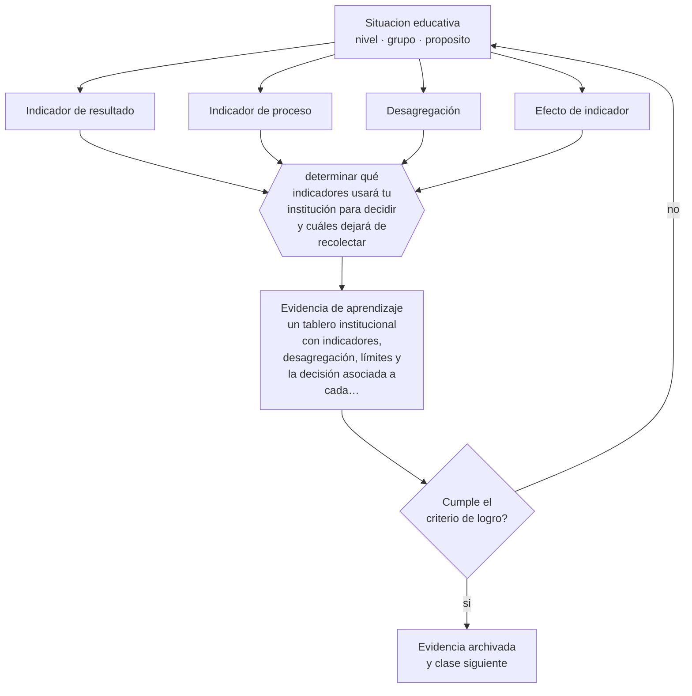

# Clase 188 — Indicadores educativos

> **Parte 15 · Gestión y liderazgo educativo** — clase 8 de 12

**Estado de evidencia:** `CONSISTENTE` · **Etapa:** 🟠 Etapa D — Educación superior y liderazgo · **Población de referencia:** equipos directivos, jefaturas técnicas y coordinaciones 
**Decisión que habilita:** determinar qué indicadores usará tu institución para decidir y cuáles dejará de recolectar 
**Evidencia de aprendizaje:** un tablero institucional con indicadores, desagregación, límites y la decisión asociada a cada uno

## 🎯 Propósito

Construir sistemas de indicadores educativos que orienten decisiones: pocos, con línea base, desagregados, con límites declarados y conectados a una acción posible.

## 📚 Resultados de aprendizaje

Al finalizar esta clase podrás:

1. **Definir** con precisión los cuatro conceptos centrales de la clase y reconocerlos en una situación educativa real, no solo en su enunciado.
2. **Explicar** qué indicadores institucionales informan decisiones y cuáles solo llenan informes.
3. **Decidir** —qué indicadores usará tu institución para decidir y cuáles dejará de recolectar— y sostener la decisión con un fundamento escrito.
4. **Producir** la evidencia de la clase —un tablero institucional con indicadores, desagregación, límites y la decisión asociada a cada uno— y contrastarla contra el criterio de logro.
5. **Distinguir** lo que la evidencia sostiene de lo que es práctica instalada, preferencia personal o costumbre de la institución.

## 🧩 Conceptos centrales

| Concepto | Comprensión verificable |
|---|---|
| **Indicador de resultado** | medida del logro alcanzado; informa pero no explica |
| **Indicador de proceso** | medida de lo que la institución hace; permite intervenir a tiempo |
| **Desagregación** | descomposición del indicador por grupos para revelar brechas internas |
| **Efecto de indicador** | distorsión de la conducta institucional producida por lo que se mide |

## 🗺️ Flujo de razonamiento

## 📖 Desarrollo

### 1. El fondo del asunto

Los sistemas educativos recolectan muchos datos y usan pocos. Un tablero útil tiene pocos indicadores, combina resultado y proceso, se desagrega para mostrar brechas y declara sus límites. La desagregación es la decisión más importante: un promedio institucional puede mejorar mientras el grupo más rezagado empeora, y esa es exactamente la información que una institución con foco en equidad necesita.

### 2. Cómo se traduce en decisiones de enseñanza

Cada indicador debe tener una decisión asociada: si baja la asistencia de un grupo, se activa un protocolo; si sube la reprobación en una asignatura, se revisa su enseñanza. Los indicadores sin decisión asociada se recolectan por inercia y consumen tiempo que rendiría más en otra parte.

### 3. Qué sostiene la evidencia y qué no

Todo indicador induce conducta: lo que se mide se prioriza y lo que no se mide se abandona. Los sistemas de rendición de cuentas de alta consecuencia producen efectos documentados de estrechamiento curricular y de selección de estudiantes. Diseñar indicadores incluye anticipar esos efectos.

> **Cómo leer el estado de evidencia `CONSISTENTE`.** La evidencia es amplia y coherente, pero proviene sobre todo de estudios correlacionales, de síntesis con heterogeneidad alta o de contextos distintos al tuyo. Sirve para orientar la decisión y exige que compruebes el efecto en tu propio grupo.

## 🧪 Taller guiado

Aplica la clase a **uno** de los contextos siguientes y repite después el ejercicio en un
contexto de exigencia distinta. Cambiar de contexto es parte del aprendizaje: lo que funciona
con un grupo no se traslada intacto a otro.

| Contexto | Rasgo que cambia la decisión |
|---|---|
| Escuela pequeña con equipo reducido | el directivo también hace clases |
| Establecimiento grande con varios ciclos | la coordinación entre niveles es el problema |
| Institución con resultados descendentes | hay urgencia y baja confianza inicial |
| Equipo con alta rotación docente | el conocimiento institucional se pierde cada año |
| Institución de educación superior | gobierno colegiado y autonomía académica |
| Organización de capacitación | los indicadores son contractuales y externos |

**Secuencia de trabajo:**

1. Delimita el contexto: nivel, edad, tamaño del grupo, asignatura o experiencia y tiempo real disponible.
2. Declara qué saben ya los estudiantes y **cómo lo comprobaste**, no cómo lo supones.
3. Formula la decisión pedagógica que esta clase habilita y escribe su fundamento.
4. Anticipa qué observarías si la decisión funciona y qué observarías si no funciona.
5. Diseña de antemano la alternativa que aplicarás si la primera estrategia falla.
6. Ejecuta o simula, y registra lo observado con fecha, contexto y evidencia concreta.
7. Produce la evidencia de aprendizaje de la clase.
8. Contrástala contra el criterio de logro, corrige y recién entonces avanza.

### 📦 Evidencia de aprendizaje

Un tablero institucional con indicadores, desagregación, límites y la decisión asociada a cada uno.

Debe incluir contexto, decisión, fundamento, fuentes consultadas con su fecha, indicador de
logro observable, riesgos previstos y qué harías distinto en la siguiente iteración.

## 🏆 Reto verificable

Revisa los indicadores que tu institución recolecta y elimina los que no tienen decisión asociada. Desagrega el principal y presenta lo que revela.

## ✅ Criterio de logro

- [ ] cada indicador declara su decisión asociada, su límite y su desagregación;
- [ ] el tablero combina indicadores de resultado y de proceso;
- [ ] cada afirmación sobre «lo que funciona» está atribuida a una fuente identificable, con autor y fecha;
- [ ] la decisión es ejecutable con el tiempo, el espacio, el número de estudiantes y los recursos que realmente tienes;
- [ ] la evidencia queda archivada de forma reproducible: otra persona podría revisarla sin que tú se la expliques.

## ⚠️ Errores frecuentes

**Propios de esta clase:**

- Recolectar indicadores sin decisión asociada, por requerimiento administrativo.
- Reportar solo promedios institucionales y ocultar las brechas internas.

**Característicos de la parte 15:**

- Confundir liderazgo con carisma o con control administrativo.
- Observar clases sin acuerdo previo sobre foco, uso y confidencialidad.

## ♿ Diversidad, accesibilidad y ética

Sin desagregación, la equidad es indemostrable. Todo tablero con pretensión de equidad debe poder responder qué pasó con los estudiantes que estaban más abajo y con los grupos históricamente desfavorecidos.

Antes de aplicar cualquier decisión de esta clase con estudiantes reales, revisa el
[protocolo de práctica responsable](../../../docs/ETICA_Y_PRACTICA_RESPONSABLE.md):
consentimiento, resguardo de datos personales, proporcionalidad de la intervención y derecho
de cada estudiante a no ser objeto de un ensayo que no le reporta beneficio.

## ❓ Preguntas de comprobación

1. ¿Qué indicador recolectas y nadie usa para decidir?
2. ¿Qué muestra tu indicador principal al desagregarlo?
3. ¿Qué conducta está induciendo lo que mides?

## 📕 Lecturas base

**Agencia de Calidad de la Educación (Chile). *Otros Indicadores de Calidad e informes técnicos*.**  
*Qué aporta a esta clase:* ejemplo institucional de ampliación de indicadores más allá del puntaje.

**OCDE. *Education at a Glance*.**  
*Qué aporta a esta clase:* definiciones y notas metodológicas útiles para construir indicadores comparables.

Catálogo completo: [bibliografía del programa](../../../docs/BIBLIOGRAFIA.md) ·
[glosario](../../../docs/GLOSARIO.md) ·
[fuentes oficiales y cómo leerlas](../../../docs/FUENTES.md).

## 🔗 Conexión con el resto del programa

Aplica la clase 011 al nivel institucional y alimenta las clases 186 y 189.

> [!IMPORTANT]
> Material de formación profesional. No reemplaza un título de pedagogía, una habilitación
> legal para ejercer, ni el juicio de un equipo educativo que conoce a sus estudiantes.

---

| Anterior | Índice | Siguiente |
|---|---|---|
| [← 187 · Gestión de equipos](../class-07-gestion-de-equipos/README.md) | [Parte 15](../README.md) · [Programa](../../../README.md) | [189 · Mejora escolar →](../class-09-mejora-escolar/README.md) |
