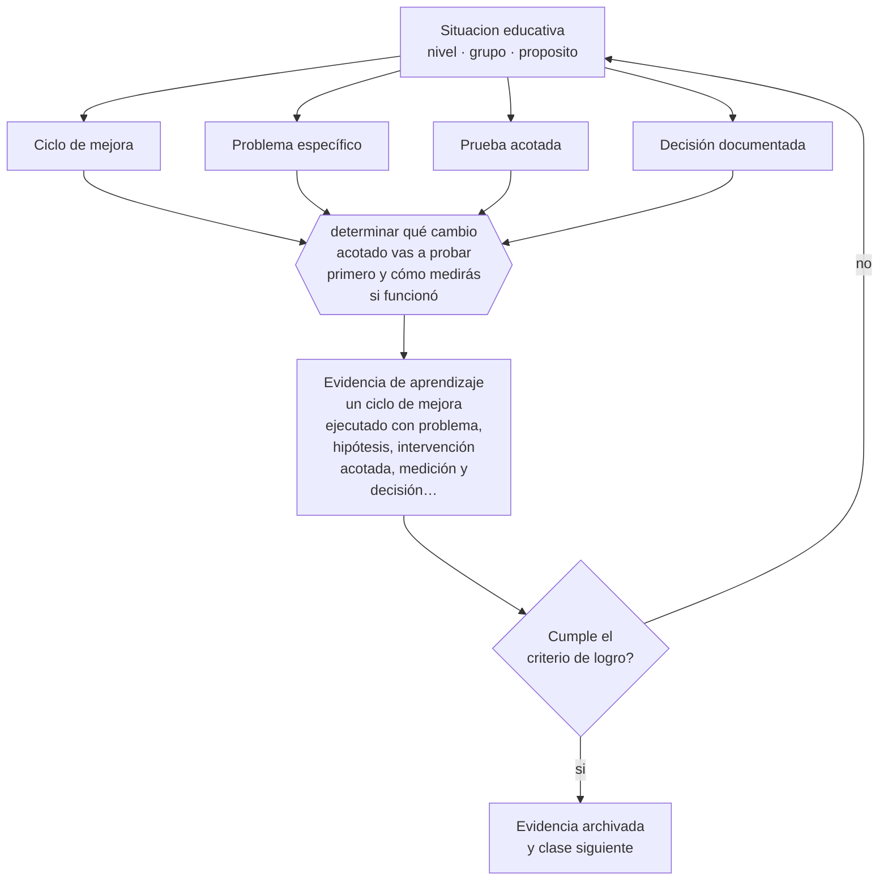

# Clase 189 — Mejora escolar

> **Parte 15 · Gestión y liderazgo educativo** — clase 9 de 12

**Estado de evidencia:** `CONSISTENTE` · **Etapa:** 🟠 Etapa D — Educación superior y liderazgo · **Población de referencia:** equipos directivos, jefaturas técnicas y coordinaciones 
**Decisión que habilita:** determinar qué cambio acotado vas a probar primero y cómo medirás si funcionó 
**Evidencia de aprendizaje:** un ciclo de mejora ejecutado con problema, hipótesis, intervención acotada, medición y decisión documentada

## 🎯 Propósito

Conducir mejora escolar mediante ciclos de indagación: problema específico, hipótesis de cambio, prueba acotada, medición y decisión, en vez de reformas simultáneas y ambiciosas.

## 📚 Resultados de aprendizaje

Al finalizar esta clase podrás:

1. **Definir** con precisión los cuatro conceptos centrales de la clase y reconocerlos en una situación educativa real, no solo en su enunciado.
2. **Explicar** por qué los ciclos cortos de mejora funcionan mejor que las reformas internas de gran escala.
3. **Decidir** —qué cambio acotado vas a probar primero y cómo medirás si funcionó— y sostener la decisión con un fundamento escrito.
4. **Producir** la evidencia de la clase —un ciclo de mejora ejecutado con problema, hipótesis, intervención acotada, medición y decisión documentada— y contrastarla contra el criterio de logro.
5. **Distinguir** lo que la evidencia sostiene de lo que es práctica instalada, preferencia personal o costumbre de la institución.

## 🧩 Conceptos centrales

| Concepto | Comprensión verificable |
|---|---|
| **Ciclo de mejora** | secuencia corta de probar, medir y ajustar sobre un problema específico |
| **Problema específico** | dificultad delimitada y observable, distinta de un objetivo general |
| **Prueba acotada** | implementación en pequeña escala antes de extender a toda la institución |
| **Decisión documentada** | conclusión del ciclo: se adopta, se ajusta o se abandona, con su fundamento |

## 🗺️ Flujo de razonamiento

## 📖 Desarrollo

### 1. El fondo del asunto

La mejora sostenida se produce por acumulación de ciclos cortos, no por reformas simultáneas. La lógica es directa: un problema específico, una hipótesis sobre qué lo causa, un cambio acotado, una medición y una decisión. Probar en pequeño antes de extender evita el patrón habitual de implementar a escala completa una idea que no funcionaba y agotar al equipo en el intento.

### 2. Cómo se traduce en decisiones de enseñanza

El ciclo exige delimitar bien: «mejorar la comprensión lectora» no es un problema específico; «los estudiantes de séptimo no identifican la idea principal en textos expositivos» sí lo es. Y exige medir con instrumentos simples y comparables. La decisión final debe ser explícita, incluida la de abandonar, que es la más difícil de tomar y la que más aprendizaje produce.

### 3. Qué sostiene la evidencia y qué no

La mejora continua aplicada a educación tiene evidencia prometedora y no concluyente, y su implementación exige capacidades que muchos equipos no tienen: delimitar problemas, medir y decidir con datos. Sin desarrollo de esas capacidades, los ciclos se convierten en un formato vacío.

> **Cómo leer el estado de evidencia `CONSISTENTE`.** La evidencia es amplia y coherente, pero proviene sobre todo de estudios correlacionales, de síntesis con heterogeneidad alta o de contextos distintos al tuyo. Sirve para orientar la decisión y exige que compruebes el efecto en tu propio grupo.

## 🧪 Taller guiado

Aplica la clase a **uno** de los contextos siguientes y repite después el ejercicio en un
contexto de exigencia distinta. Cambiar de contexto es parte del aprendizaje: lo que funciona
con un grupo no se traslada intacto a otro.

| Contexto | Rasgo que cambia la decisión |
|---|---|
| Escuela pequeña con equipo reducido | el directivo también hace clases |
| Establecimiento grande con varios ciclos | la coordinación entre niveles es el problema |
| Institución con resultados descendentes | hay urgencia y baja confianza inicial |
| Equipo con alta rotación docente | el conocimiento institucional se pierde cada año |
| Institución de educación superior | gobierno colegiado y autonomía académica |
| Organización de capacitación | los indicadores son contractuales y externos |

**Secuencia de trabajo:**

1. Delimita el contexto: nivel, edad, tamaño del grupo, asignatura o experiencia y tiempo real disponible.
2. Declara qué saben ya los estudiantes y **cómo lo comprobaste**, no cómo lo supones.
3. Formula la decisión pedagógica que esta clase habilita y escribe su fundamento.
4. Anticipa qué observarías si la decisión funciona y qué observarías si no funciona.
5. Diseña de antemano la alternativa que aplicarás si la primera estrategia falla.
6. Ejecuta o simula, y registra lo observado con fecha, contexto y evidencia concreta.
7. Produce la evidencia de aprendizaje de la clase.
8. Contrástala contra el criterio de logro, corrige y recién entonces avanza.

### 📦 Evidencia de aprendizaje

Un ciclo de mejora ejecutado con problema, hipótesis, intervención acotada, medición y decisión documentada.

Debe incluir contexto, decisión, fundamento, fuentes consultadas con su fecha, indicador de
logro observable, riesgos previstos y qué harías distinto en la siguiente iteración.

## 🏆 Reto verificable

Ejecuta un ciclo completo en ocho semanas con problema delimitado y medición. Documenta la decisión final, incluso si es abandonar.

## ✅ Criterio de logro

- [ ] el problema está delimitado y es observable con un instrumento simple;
- [ ] el ciclo termina con una decisión explícita y documentada;
- [ ] cada afirmación sobre «lo que funciona» está atribuida a una fuente identificable, con autor y fecha;
- [ ] la decisión es ejecutable con el tiempo, el espacio, el número de estudiantes y los recursos que realmente tienes;
- [ ] la evidencia queda archivada de forma reproducible: otra persona podría revisarla sin que tú se la expliques.

## ⚠️ Errores frecuentes

**Propios de esta clase:**

- Iniciar múltiples cambios simultáneos y no poder atribuir ningún resultado.
- Extender a toda la institución un cambio que no fue probado en pequeña escala.

**Característicos de la parte 15:**

- Confundir liderazgo con carisma o con control administrativo.
- Observar clases sin acuerdo previo sobre foco, uso y confidencialidad.

## ♿ Diversidad, accesibilidad y ética

Los ciclos deben medir su efecto de forma desagregada: una mejora promedio puede coexistir con un deterioro en el grupo que motivó la intervención. Sin ese control, la mejora institucional puede ampliar la brecha.

Antes de aplicar cualquier decisión de esta clase con estudiantes reales, revisa el
[protocolo de práctica responsable](../../../docs/ETICA_Y_PRACTICA_RESPONSABLE.md):
consentimiento, resguardo de datos personales, proporcionalidad de la intervención y derecho
de cada estudiante a no ser objeto de un ensayo que no le reporta beneficio.

## ❓ Preguntas de comprobación

1. ¿Cuál es el problema específico, en una frase verificable?
2. ¿En qué escala probarás antes de extender?
3. ¿Qué resultado te haría abandonar la idea?

## 📕 Lecturas base

**Bryk, A. et al. (2015). *Learning to Improve*.**  
*Qué aporta a esta clase:* modelo de mejora continua aplicado a escuelas, con ciclos y redes de aprendizaje.

**Fullan, M. (2011). *Choosing the Wrong Drivers*.**  
*Qué aporta a esta clase:* advierte sobre las estrategias de reforma que consumen energía sin producir mejora.

Catálogo completo: [bibliografía del programa](../../../docs/BIBLIOGRAFIA.md) ·
[glosario](../../../docs/GLOSARIO.md) ·
[fuentes oficiales y cómo leerlas](../../../docs/FUENTES.md).

## 🔗 Conexión con el resto del programa

Integra las clases 185, 187 y 188 y es el método del proyecto de la clase 192.

> [!IMPORTANT]
> Material de formación profesional. No reemplaza un título de pedagogía, una habilitación
> legal para ejercer, ni el juicio de un equipo educativo que conoce a sus estudiantes.

---

| Anterior | Índice | Siguiente |
|---|---|---|
| [← 188 · Indicadores educativos](../class-08-indicadores-educativos/README.md) | [Parte 15](../README.md) · [Programa](../../../README.md) | [190 · Innovación educativa →](../class-10-innovacion-educativa/README.md) |
