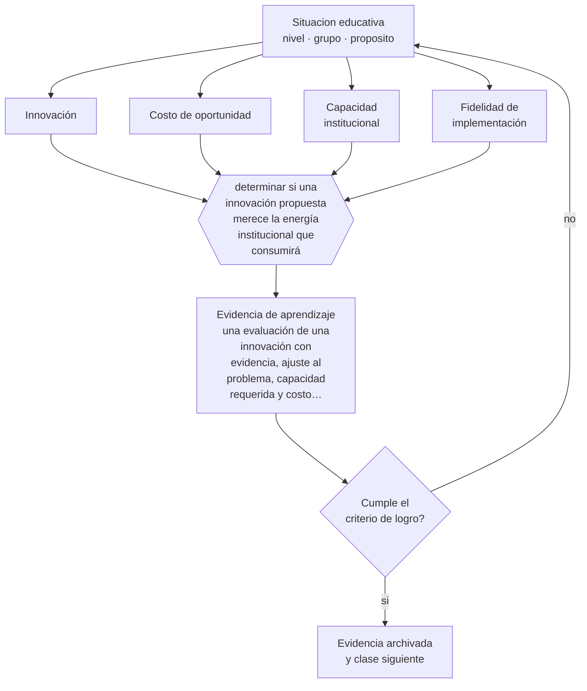

# Clase 190 — Innovación educativa

> **Parte 15 · Gestión y liderazgo educativo** — clase 10 de 12

**Estado de evidencia:** `EN-DEBATE` · **Etapa:** 🟠 Etapa D — Educación superior y liderazgo · **Población de referencia:** equipos directivos, jefaturas técnicas y coordinaciones 
**Decisión que habilita:** determinar si una innovación propuesta merece la energía institucional que consumirá 
**Evidencia de aprendizaje:** una evaluación de una innovación con evidencia, ajuste al problema, capacidad requerida y costo de oportunidad

## 🎯 Propósito

Evaluar y conducir innovación educativa con criterio: evidencia disponible, ajuste al problema real, capacidad institucional y costo de oportunidad.

## 📚 Resultados de aprendizaje

Al finalizar esta clase podrás:

1. **Definir** con precisión los cuatro conceptos centrales de la clase y reconocerlos en una situación educativa real, no solo en su enunciado.
2. **Explicar** cómo distinguir una innovación que vale la pena de una moda que consumirá dos años del equipo.
3. **Decidir** —si una innovación propuesta merece la energía institucional que consumirá— y sostener la decisión con un fundamento escrito.
4. **Producir** la evidencia de la clase —una evaluación de una innovación con evidencia, ajuste al problema, capacidad requerida y costo de oportunidad— y contrastarla contra el criterio de logro.
5. **Distinguir** lo que la evidencia sostiene de lo que es práctica instalada, preferencia personal o costumbre de la institución.

## 🧩 Conceptos centrales

| Concepto | Comprensión verificable |
|---|---|
| **Innovación** | cambio deliberado en la práctica con expectativa de mejora; no toda novedad lo es |
| **Costo de oportunidad** | lo que la institución deja de hacer por dedicar energía a esta innovación |
| **Capacidad institucional** | condiciones y competencias necesarias para implementar con fidelidad |
| **Fidelidad de implementación** | grado en que lo ejecutado corresponde a lo diseñado; explica muchos fracasos atribuidos al método |

## 🗺️ Flujo de razonamiento

## 📖 Desarrollo

### 1. El fondo del asunto

El campo educativo adopta y abandona innovaciones con un ciclo rápido y costoso: cada iniciativa consume energía, credibilidad y tiempo del equipo. Evaluar una innovación exige cuatro preguntas: qué evidencia tiene, qué problema real resuelve en esta institución, qué capacidad exige y qué se dejará de hacer para implementarla. La cuarta es la que casi nunca se hace y la que más explica el agotamiento de los equipos.

### 2. Cómo se traduce en decisiones de enseñanza

La evaluación se documenta y se discute antes de comprometer recursos. Y la implementación debe considerar la fidelidad: la mayoría de las innovaciones que fracasan no fueron probadas en su versión real, sino en una adaptación local que perdió sus componentes activos. Declarar qué es irrenunciable del diseño original es parte de la decisión.

### 3. Qué sostiene la evidencia y qué no

La evidencia sobre innovaciones específicas es heterogénea y muchas veces proviene de sus propios promotores. Y existe una tensión legítima: exigir evidencia completa antes de innovar paralizaría la práctica, mientras que innovar sin criterio consume el sistema. La posición defendible es probar acotado y medir.

> **Cómo leer el estado de evidencia `EN-DEBATE`.** Hay desacuerdo activo y publicado entre especialistas competentes. La clase presenta las posiciones y sus argumentos; tu tarea no es escoger un bando, sino saber qué evidencia te haría cambiar de posición.

## 🧪 Taller guiado

Aplica la clase a **uno** de los contextos siguientes y repite después el ejercicio en un
contexto de exigencia distinta. Cambiar de contexto es parte del aprendizaje: lo que funciona
con un grupo no se traslada intacto a otro.

| Contexto | Rasgo que cambia la decisión |
|---|---|
| Escuela pequeña con equipo reducido | el directivo también hace clases |
| Establecimiento grande con varios ciclos | la coordinación entre niveles es el problema |
| Institución con resultados descendentes | hay urgencia y baja confianza inicial |
| Equipo con alta rotación docente | el conocimiento institucional se pierde cada año |
| Institución de educación superior | gobierno colegiado y autonomía académica |
| Organización de capacitación | los indicadores son contractuales y externos |

**Secuencia de trabajo:**

1. Delimita el contexto: nivel, edad, tamaño del grupo, asignatura o experiencia y tiempo real disponible.
2. Declara qué saben ya los estudiantes y **cómo lo comprobaste**, no cómo lo supones.
3. Formula la decisión pedagógica que esta clase habilita y escribe su fundamento.
4. Anticipa qué observarías si la decisión funciona y qué observarías si no funciona.
5. Diseña de antemano la alternativa que aplicarás si la primera estrategia falla.
6. Ejecuta o simula, y registra lo observado con fecha, contexto y evidencia concreta.
7. Produce la evidencia de aprendizaje de la clase.
8. Contrástala contra el criterio de logro, corrige y recién entonces avanza.

### 📦 Evidencia de aprendizaje

Una evaluación de una innovación con evidencia, ajuste al problema, capacidad requerida y costo de oportunidad.

Debe incluir contexto, decisión, fundamento, fuentes consultadas con su fecha, indicador de
logro observable, riesgos previstos y qué harías distinto en la siguiente iteración.

## 🏆 Reto verificable

Evalúa una innovación en curso o propuesta con los cuatro criterios. Presenta la evaluación al equipo y toma una decisión documentada.

## ✅ Criterio de logro

- [ ] la evaluación declara evidencia, capacidad requerida y costo de oportunidad;
- [ ] identifica los componentes irrenunciables del diseño original;
- [ ] cada afirmación sobre «lo que funciona» está atribuida a una fuente identificable, con autor y fecha;
- [ ] la decisión es ejecutable con el tiempo, el espacio, el número de estudiantes y los recursos que realmente tienes;
- [ ] la evidencia queda archivada de forma reproducible: otra persona podría revisarla sin que tú se la expliques.

## ⚠️ Errores frecuentes

**Propios de esta clase:**

- Adoptar una innovación sin evaluar la capacidad institucional que exige.
- Adaptar el diseño hasta perder los componentes que lo hacían funcionar.

**Característicos de la parte 15:**

- Confundir liderazgo con carisma o con control administrativo.
- Observar clases sin acuerdo previo sobre foco, uso y confidencialidad.

## ♿ Diversidad, accesibilidad y ética

Las innovaciones que exigen recursos adicionales de las familias o de los estudiantes amplían brechas. Evaluar su costo para quienes tienen menos es parte de la decisión institucional.

Antes de aplicar cualquier decisión de esta clase con estudiantes reales, revisa el
[protocolo de práctica responsable](../../../docs/ETICA_Y_PRACTICA_RESPONSABLE.md):
consentimiento, resguardo de datos personales, proporcionalidad de la intervención y derecho
de cada estudiante a no ser objeto de un ensayo que no le reporta beneficio.

## ❓ Preguntas de comprobación

1. ¿Qué problema real de tu institución resuelve esta innovación?
2. ¿Qué dejará de hacer tu equipo para implementarla?
3. ¿Qué parte del diseño no se puede adaptar sin perder su efecto?

## 📕 Lecturas base

**Century, J. & Cassata, A. (2016). *Implementation Research: Finding Common Ground*.**  
*Qué aporta a esta clase:* sistematiza fidelidad de implementación y adaptación en innovaciones educativas.

**Fullan, M. (2007). *The New Meaning of Educational Change*.**  
*Qué aporta a esta clase:* análisis clásico sobre por qué las innovaciones prenden o se disuelven en las escuelas.

Catálogo completo: [bibliografía del programa](../../../docs/BIBLIOGRAFIA.md) ·
[glosario](../../../docs/GLOSARIO.md) ·
[fuentes oficiales y cómo leerlas](../../../docs/FUENTES.md).

## 🔗 Conexión con el resto del programa

Se apoya en la clase 182 y usa el método de la clase 189 para probar antes de escalar.

> [!IMPORTANT]
> Material de formación profesional. No reemplaza un título de pedagogía, una habilitación
> legal para ejercer, ni el juicio de un equipo educativo que conoce a sus estudiantes.

---

| Anterior | Índice | Siguiente |
|---|---|---|
| [← 189 · Mejora escolar](../class-09-mejora-escolar/README.md) | [Parte 15](../README.md) · [Programa](../../../README.md) | [191 · Ética de la dirección →](../class-11-etica-de-la-direccion/README.md) |
