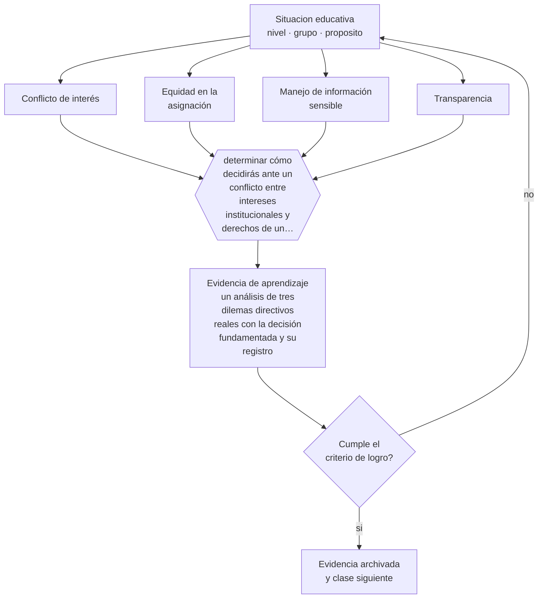

# Clase 191 — Ética de la dirección

> **Parte 15 · Gestión y liderazgo educativo** — clase 11 de 12

**Estado de evidencia:** `MARCO-NORMATIVO` · **Etapa:** 🟠 Etapa D — Educación superior y liderazgo · **Población de referencia:** equipos directivos, jefaturas técnicas y coordinaciones 
**Decisión que habilita:** determinar cómo decidirás ante un conflicto entre intereses institucionales y derechos de un estudiante 
**Evidencia de aprendizaje:** un análisis de tres dilemas directivos reales con la decisión fundamentada y su registro

## 🎯 Propósito

Ejercer la dirección con criterio ético: transparencia, equidad en la asignación de recursos, protección de los más vulnerables, manejo de información sensible y conflicto de interés.

## 📚 Resultados de aprendizaje

Al finalizar esta clase podrás:

1. **Definir** con precisión los cuatro conceptos centrales de la clase y reconocerlos en una situación educativa real, no solo en su enunciado.
2. **Explicar** qué decisiones directivas tienen consecuencias éticas que no se resuelven con el reglamento.
3. **Decidir** —cómo decidirás ante un conflicto entre intereses institucionales y derechos de un estudiante— y sostener la decisión con un fundamento escrito.
4. **Producir** la evidencia de la clase —un análisis de tres dilemas directivos reales con la decisión fundamentada y su registro— y contrastarla contra el criterio de logro.
5. **Distinguir** lo que la evidencia sostiene de lo que es práctica instalada, preferencia personal o costumbre de la institución.

## 🧩 Conceptos centrales

| Concepto | Comprensión verificable |
|---|---|
| **Conflicto de interés** | situación en que un interés personal o institucional puede afectar la imparcialidad de la decisión |
| **Equidad en la asignación** | distribución de recursos y de atención en función de la necesidad y no de la presión |
| **Manejo de información sensible** | resguardo de datos de estudiantes y de trabajadores en decisiones directivas |
| **Transparencia** | comunicación de los criterios de decisión a quienes son afectados por ella |

## 🗺️ Flujo de razonamiento

## 📖 Desarrollo

### 1. El fondo del asunto

La dirección educativa enfrenta dilemas que el reglamento no resuelve: expulsar a un estudiante disruptivo protege al grupo y puede vulnerar su derecho a la educación; asignar los mejores docentes a los cursos con evaluación externa mejora resultados y perjudica a otros estudiantes; atender a la familia que reclama con más fuerza desplaza a la que no reclama. Ninguno se resuelve con una regla: exigen criterio, fundamento y registro.

### 2. Cómo se traduce en decisiones de enseñanza

El método consiste en explicitar el conflicto, identificar los derechos e intereses en juego, evaluar alternativas con su impacto sobre los más vulnerables, decidir y registrar el fundamento. El registro protege a la institución y, sobre todo, obliga a formular por escrito una justificación que muchas decisiones apresuradas no resistirían.

### 3. Qué sostiene la evidencia y qué no

El marco normativo fija pisos y no resuelve la ponderación: cumplir la norma no equivale a decidir bien. Y el ejercicio directivo está condicionado por presiones reales —sostenedor, matrícula, resultados— que no desaparecen por reconocerlas. Explicitarlas permite decidir con conciencia del costo.

> **Cómo leer el estado de evidencia `MARCO-NORMATIVO`.** El contenido no se decide por evidencia empírica sino por norma, política pública o marco institucional vigente. Verifica siempre la versión vigente a la fecha en que vas a aplicarlo: la norma cambia y la clase no se actualiza sola.

## 🧪 Taller guiado

Aplica la clase a **uno** de los contextos siguientes y repite después el ejercicio en un
contexto de exigencia distinta. Cambiar de contexto es parte del aprendizaje: lo que funciona
con un grupo no se traslada intacto a otro.

| Contexto | Rasgo que cambia la decisión |
|---|---|
| Escuela pequeña con equipo reducido | el directivo también hace clases |
| Establecimiento grande con varios ciclos | la coordinación entre niveles es el problema |
| Institución con resultados descendentes | hay urgencia y baja confianza inicial |
| Equipo con alta rotación docente | el conocimiento institucional se pierde cada año |
| Institución de educación superior | gobierno colegiado y autonomía académica |
| Organización de capacitación | los indicadores son contractuales y externos |

**Secuencia de trabajo:**

1. Delimita el contexto: nivel, edad, tamaño del grupo, asignatura o experiencia y tiempo real disponible.
2. Declara qué saben ya los estudiantes y **cómo lo comprobaste**, no cómo lo supones.
3. Formula la decisión pedagógica que esta clase habilita y escribe su fundamento.
4. Anticipa qué observarías si la decisión funciona y qué observarías si no funciona.
5. Diseña de antemano la alternativa que aplicarás si la primera estrategia falla.
6. Ejecuta o simula, y registra lo observado con fecha, contexto y evidencia concreta.
7. Produce la evidencia de aprendizaje de la clase.
8. Contrástala contra el criterio de logro, corrige y recién entonces avanza.

### 📦 Evidencia de aprendizaje

Un análisis de tres dilemas directivos reales con la decisión fundamentada y su registro.

Debe incluir contexto, decisión, fundamento, fuentes consultadas con su fecha, indicador de
logro observable, riesgos previstos y qué harías distinto en la siguiente iteración.

## 🏆 Reto verificable

Documenta tres decisiones directivas con su fundamento y su impacto sobre los estudiantes más vulnerables. Revísalas con un par externo.

## ✅ Criterio de logro

- [ ] cada dilema identifica derechos e intereses en juego y evalúa el impacto sobre los más vulnerables;
- [ ] la decisión queda registrada con su fundamento y sus alternativas descartadas;
- [ ] cada afirmación sobre «lo que funciona» está atribuida a una fuente identificable, con autor y fecha;
- [ ] la decisión es ejecutable con el tiempo, el espacio, el número de estudiantes y los recursos que realmente tienes;
- [ ] la evidencia queda archivada de forma reproducible: otra persona podría revisarla sin que tú se la expliques.

## ⚠️ Errores frecuentes

**Propios de esta clase:**

- Asignar recursos según la presión recibida y no según la necesidad detectada.
- Tomar decisiones con impacto sobre derechos sin registrar el fundamento.

**Característicos de la parte 15:**

- Confundir liderazgo con carisma o con control administrativo.
- Observar clases sin acuerdo previo sobre foco, uso y confidencialidad.

## ♿ Diversidad, accesibilidad y ética

La prueba ética de una decisión directiva es su efecto sobre los estudiantes con menos capacidad de reclamar. Cuando una medida los perjudica y nadie protesta, esa ausencia de protesta no es señal de acierto.

Antes de aplicar cualquier decisión de esta clase con estudiantes reales, revisa el
[protocolo de práctica responsable](../../../docs/ETICA_Y_PRACTICA_RESPONSABLE.md):
consentimiento, resguardo de datos personales, proporcionalidad de la intervención y derecho
de cada estudiante a no ser objeto de un ensayo que no le reporta beneficio.

## ❓ Preguntas de comprobación

1. ¿Qué decisión tuya de este mes no resistiría una revisión externa?
2. ¿Quién recibe más recursos: quien más los necesita o quien más presiona?
3. ¿Qué información sensible circula en tu equipo sin necesidad?

## 📕 Lecturas base

**Starratt, R. (2004). *Ethical Leadership*.**  
*Qué aporta a esta clase:* marco de ética directiva aplicado a instituciones educativas.

**Mineduc. *Marco para la Buena Dirección y el Liderazgo Escolar*.**  
*Qué aporta a esta clase:* estándares chilenos del ejercicio directivo, incluidas sus dimensiones éticas.

Catálogo completo: [bibliografía del programa](../../../docs/BIBLIOGRAFIA.md) ·
[glosario](../../../docs/GLOSARIO.md) ·
[fuentes oficiales y cómo leerlas](../../../docs/FUENTES.md).

## 🔗 Conexión con el resto del programa

Aplica la clase 004 al nivel institucional y condiciona las decisiones de las clases 186 a 190.

> [!IMPORTANT]
> Material de formación profesional. No reemplaza un título de pedagogía, una habilitación
> legal para ejercer, ni el juicio de un equipo educativo que conoce a sus estudiantes.

---

| Anterior | Índice | Siguiente |
|---|---|---|
| [← 190 · Innovación educativa](../class-10-innovacion-educativa/README.md) | [Parte 15](../README.md) · [Programa](../../../README.md) | [192 · Proyecto integrador: plan de mejora institucional →](../class-12-proyecto-integrador-plan-de-mejora-institucional/README.md) |
