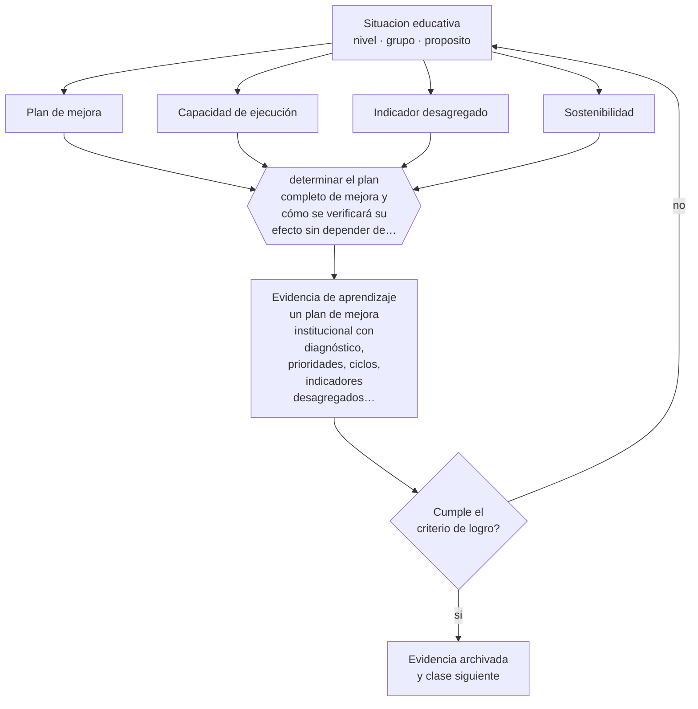

# Clase 192 — Proyecto integrador: plan de mejora institucional

> **Parte 15 · Gestión y liderazgo educativo** — clase 12 de 12

**Estado de evidencia:** `CONSISTENTE` · **Etapa:** 🟠 Etapa D — Educación superior y liderazgo · **Población de referencia:** equipos directivos, jefaturas técnicas y coordinaciones 
**Decisión que habilita:** determinar el plan completo de mejora y cómo se verificará su efecto sin depender de percepciones 
**Evidencia de aprendizaje:** un plan de mejora institucional con diagnóstico, prioridades, ciclos, indicadores desagregados y seguimiento

## 🎯 Propósito

Integrar la parte construyendo un plan de mejora institucional completo: diagnóstico con datos, prioridades acotadas, ciclos de mejora, indicadores desagregados y sistema de seguimiento.

## 📚 Resultados de aprendizaje

Al finalizar esta clase podrás:

1. **Definir** con precisión los cuatro conceptos centrales de la clase y reconocerlos en una situación educativa real, no solo en su enunciado.
2. **Explicar** cómo se construye un plan de mejora que el equipo pueda ejecutar y que produzca evidencia.
3. **Decidir** —el plan completo de mejora y cómo se verificará su efecto sin depender de percepciones— y sostener la decisión con un fundamento escrito.
4. **Producir** la evidencia de la clase —un plan de mejora institucional con diagnóstico, prioridades, ciclos, indicadores desagregados y seguimiento— y contrastarla contra el criterio de logro.
5. **Distinguir** lo que la evidencia sostiene de lo que es práctica instalada, preferencia personal o costumbre de la institución.

## 🧩 Conceptos centrales

| Concepto | Comprensión verificable |
|---|---|
| **Plan de mejora** | instrumento que articula diagnóstico, prioridades, acciones e indicadores institucionales |
| **Capacidad de ejecución** | condiciones reales del equipo para sostener las acciones comprometidas |
| **Indicador desagregado** | medida que muestra el efecto sobre distintos grupos de estudiantes |
| **Sostenibilidad** | posibilidad de mantener el plan más allá del entusiasmo inicial y del cambio de personas |

## 🗺️ Flujo de razonamiento

## 📖 Desarrollo

### 1. El fondo del asunto

El proyecto integrador exige articular todo lo anterior con un criterio dominante: la capacidad real de ejecución. Un plan que excede lo que el equipo puede sostener produce incumplimiento, desgaste y pérdida de credibilidad para el siguiente intento. Por eso el plan se dimensiona a partir del tiempo y las capacidades disponibles, no a partir de lo deseable.

### 2. Cómo se traduce en decisiones de enseñanza

El plan se organiza en pocas prioridades, cada una desagregada en ciclos de mejora con responsables y plazos, con indicadores que se puedan desagregar por grupo. El sistema de seguimiento define quién revisa, cada cuánto y con qué consecuencia sobre las decisiones de recursos y tiempo.

### 3. Qué sostiene la evidencia y qué no

Un plan bien diseñado no garantiza mejora: depende de la implementación, del contexto y de factores externos a la institución. Su valor es hacer explícitas las decisiones y producir evidencia sobre lo que se intentó, que es la base para el ciclo siguiente.

> **Cómo leer el estado de evidencia `CONSISTENTE`.** La evidencia es amplia y coherente, pero proviene sobre todo de estudios correlacionales, de síntesis con heterogeneidad alta o de contextos distintos al tuyo. Sirve para orientar la decisión y exige que compruebes el efecto en tu propio grupo.

## 🧪 Taller guiado

Aplica la clase a **uno** de los contextos siguientes y repite después el ejercicio en un
contexto de exigencia distinta. Cambiar de contexto es parte del aprendizaje: lo que funciona
con un grupo no se traslada intacto a otro.

| Contexto | Rasgo que cambia la decisión |
|---|---|
| Escuela pequeña con equipo reducido | el directivo también hace clases |
| Establecimiento grande con varios ciclos | la coordinación entre niveles es el problema |
| Institución con resultados descendentes | hay urgencia y baja confianza inicial |
| Equipo con alta rotación docente | el conocimiento institucional se pierde cada año |
| Institución de educación superior | gobierno colegiado y autonomía académica |
| Organización de capacitación | los indicadores son contractuales y externos |

**Secuencia de trabajo:**

1. Delimita el contexto: nivel, edad, tamaño del grupo, asignatura o experiencia y tiempo real disponible.
2. Declara qué saben ya los estudiantes y **cómo lo comprobaste**, no cómo lo supones.
3. Formula la decisión pedagógica que esta clase habilita y escribe su fundamento.
4. Anticipa qué observarías si la decisión funciona y qué observarías si no funciona.
5. Diseña de antemano la alternativa que aplicarás si la primera estrategia falla.
6. Ejecuta o simula, y registra lo observado con fecha, contexto y evidencia concreta.
7. Produce la evidencia de aprendizaje de la clase.
8. Contrástala contra el criterio de logro, corrige y recién entonces avanza.

### 📦 Evidencia de aprendizaje

Un plan de mejora institucional con diagnóstico, prioridades, ciclos, indicadores desagregados y seguimiento.

Debe incluir contexto, decisión, fundamento, fuentes consultadas con su fecha, indicador de
logro observable, riesgos previstos y qué harías distinto en la siguiente iteración.

## 🏆 Reto verificable

Construye el plan, ejecuta un ciclo y presenta la evidencia al equipo y al sostenedor. Documenta qué se ajustó a partir de los datos.

## ✅ Criterio de logro

- [ ] el plan está dimensionado a la capacidad real de ejecución del equipo;
- [ ] los indicadores se desagregan por grupo y tienen línea base;
- [ ] cada afirmación sobre «lo que funciona» está atribuida a una fuente identificable, con autor y fecha;
- [ ] la decisión es ejecutable con el tiempo, el espacio, el número de estudiantes y los recursos que realmente tienes;
- [ ] la evidencia queda archivada de forma reproducible: otra persona podría revisarla sin que tú se la expliques.

## ⚠️ Errores frecuentes

**Propios de esta clase:**

- Comprometer más acciones de las que el equipo puede ejecutar con su tiempo real.
- Definir indicadores sin desagregación, con lo que la equidad se vuelve indemostrable.

**Característicos de la parte 15:**

- Confundir liderazgo con carisma o con control administrativo.
- Observar clases sin acuerdo previo sobre foco, uso y confidencialidad.

## ♿ Diversidad, accesibilidad y ética

El plan debe declarar explícitamente qué hará por los estudiantes que hoy están más abajo, con metas propias y seguimiento propio. Sin eso, la mejora institucional tiende a beneficiar primero a quienes ya estaban mejor.

Antes de aplicar cualquier decisión de esta clase con estudiantes reales, revisa el
[protocolo de práctica responsable](../../../docs/ETICA_Y_PRACTICA_RESPONSABLE.md):
consentimiento, resguardo de datos personales, proporcionalidad de la intervención y derecho
de cada estudiante a no ser objeto de un ensayo que no le reporta beneficio.

## ❓ Preguntas de comprobación

1. ¿Cuántas horas de trabajo del equipo compromete tu plan y de dónde salen?
2. ¿Qué mostrará tu indicador principal desagregado?
3. ¿Qué sobrevive de tu plan si cambian tres personas del equipo?

## 📕 Lecturas base

**Bryk, A. et al. (2015). *Learning to Improve*.**  
*Qué aporta a esta clase:* método de mejora por ciclos aplicable a la estructura del plan.

**Mineduc. *Orientaciones para el Plan de Mejoramiento Educativo*.**  
*Qué aporta a esta clase:* marco chileno con sus requisitos formales y su lógica de ciclos.

Catálogo completo: [bibliografía del programa](../../../docs/BIBLIOGRAFIA.md) ·
[glosario](../../../docs/GLOSARIO.md) ·
[fuentes oficiales y cómo leerlas](../../../docs/FUENTES.md).

## 🔗 Conexión con el resto del programa

Cierra la parte 15 integrando sus once clases previas y se conecta con las partes 16 y 17.

> [!IMPORTANT]
> Material de formación profesional. No reemplaza un título de pedagogía, una habilitación
> legal para ejercer, ni el juicio de un equipo educativo que conoce a sus estudiantes.

---

| Anterior | Índice | Siguiente |
|---|---|---|
| [← 191 · Ética de la dirección](../class-11-etica-de-la-direccion/README.md) | [Parte 15](../README.md) · [Programa](../../../README.md) | [Programa completo →](../../../README.md) |
