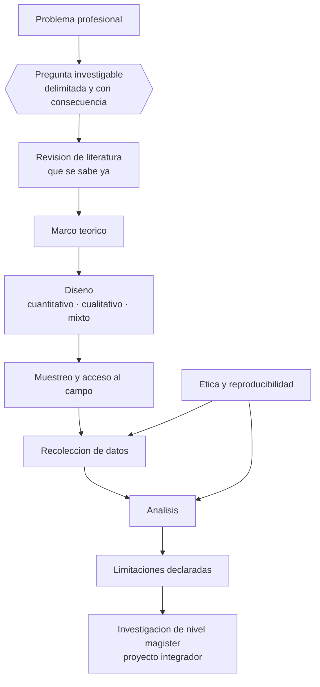

# Parte 16 — Investigación educativa

> *Una pregunta bien formulada vale más que un método sofisticado*

🔴 **Etapa E — Investigación avanzada y formación de formadores** · salida de la etapa: producir conocimiento educativo defendible y formar a quienes enseñan

**Clases:** 12 (193–204) · **Población de referencia:** investigación aplicada, tesis de magíster e investigación institucional · **Conceptos con definición operacional:** 48 
**Contenido central:** Epistemología, pregunta y problema, revisión de literatura, marco teórico, diseños cuantitativos, cualitativos y mixtos, muestreo, estadística, análisis temático, ética y reproducibilidad

## 🎯 De qué trata esta parte

La mayor parte de las tesis educativas fracasa antes del método, en la pregunta. Preguntas demasiado amplias, preguntas que ya tienen respuesta en la literatura, preguntas cuya respuesta no cambiaría ninguna decisión. Esta parte dedica su primer tercio a ese trabajo poco glamoroso: convertir una inquietud profesional en una pregunta investigable, delimitada, conectada con lo que ya se sabe y con consecuencias claras según el resultado.

El segundo tercio enseña diseños con su lógica, no como catálogo. Un diseño no es una etiqueta: es un argumento sobre cómo se descartan explicaciones alternativas. Quien entiende esa lógica sabe por qué un pretest-postest sin grupo de comparación no permite atribuir el cambio a la intervención, y por qué un estudio de casos bien hecho puede sostener afirmaciones fuertes sobre mecanismos aunque no generalice a poblaciones.

El último tercio es ética y reproducibilidad, y en educación tiene urgencia particular: se investiga con menores de edad, en instituciones con relaciones de poder, y con datos sensibles. Además, el campo arrastra la crisis de replicación de la psicología. Preregistrar, reportar tamaños de efecto con intervalos, publicar instrumentos y datos cuando es posible, y reconocer limitaciones sin adornos, es lo que separa una investigación defendible de una que solo suena bien.

## 📚 Resultados de la parte

Al terminar esta parte podrás:

1. **Formular una pregunta de investigación delimitada, relevante e investigable**.
2. **Escoger y justificar un diseño en función de la pregunta y no de la preferencia**.
3. **Analizar datos cuantitativos o cualitativos con procedimientos trazables**.
4. **Someter la investigación a estándares éticos y de reproducibilidad verificables**.

## 🗺️ Mapa de la parte

## 🧠 Marco de referencia

- epistemología y supuestos de los paradigmas de investigación educativa
- diseños experimentales, cuasiexperimentales y observacionales, y sus amenazas a la validez
- métodos cualitativos: casos, etnografía, análisis temático y criterios de rigor
- ética de la investigación con personas y prácticas de ciencia abierta

**Autoras y autores que conviene conocer:** William Shadish, Thomas Cook y Donald Campbell, John Creswell, Robert Yin, Virginia Braun y Victoria Clarke, Yvonna Lincoln y Egon Guba, Brian Nosek y el movimiento de ciencia abierta

## 📋 Las 12 clases

| # | Clase | Decisión que habilita | Evidencia |
|---:|---|---|---|
| 193 | [Epistemología de la investigación](class-01-epistemologia-de-la-investigacion/README.md) | determinar qué supuestos sobre el conocimiento sostienen tu pregunta y qué métodos son coherentes con ellos | `EN-DEBATE` |
| 194 | [Pregunta y problema de investigación](class-02-pregunta-y-problema-de-investigacion/README.md) | determinar la pregunta exacta que tu investigación responderá y qué decisión cambiaría según la respuesta | `PRACTICA-PROFESIONAL` |
| 195 | [Revisión de literatura](class-03-revision-de-literatura/README.md) | determinar qué se sabe con solidez sobre tu problema y dónde está el vacío que justifica tu investigación | `PRACTICA-PROFESIONAL` |
| 196 | [Marco teórico](class-04-marco-teorico/README.md) | determinar qué teoría orientará tu diseño y qué observaciones esperarías si esa teoría es correcta | `PRACTICA-PROFESIONAL` |
| 197 | [Diseños cuantitativos](class-05-disenos-cuantitativos/README.md) | determinar qué diseño permite sostener la afirmación causal que tu pregunta exige | `ROBUSTA` |
| 198 | [Diseños cualitativos](class-06-disenos-cualitativos/README.md) | determinar qué caso o casos permiten responder tu pregunta y qué podrás afirmar con ellos | `CONSISTENTE` |
| 199 | [Métodos mixtos](class-07-metodos-mixtos/README.md) | determinar qué aporta la combinación de métodos que ninguno de los dos aportaría por separado | `CONSISTENTE` |
| 200 | [Muestreo](class-08-muestreo/README.md) | determinar qué estrategia de muestreo corresponde a tu pregunta y qué sesgos introduce | `ROBUSTA` |
| 201 | [Estadística descriptiva e inferencial](class-09-estadistica-descriptiva-e-inferencial/README.md) | determinar qué análisis corresponde a tu diseño y qué puedes afirmar con sus resultados | `ROBUSTA` |
| 202 | [Análisis temático](class-10-analisis-tematico/README.md) | determinar el procedimiento de análisis y cómo documentarás el camino desde los datos hasta los temas | `CONSISTENTE` |
| 203 | [Ética y reproducibilidad](class-11-etica-y-reproducibilidad/README.md) | determinar qué resguardos éticos y qué prácticas de reproducibilidad exige tu investigación | `MARCO-NORMATIVO` |
| 204 | [Proyecto integrador: investigación de nivel magíster](class-12-proyecto-integrador-investigacion-de-nivel-magister/README.md) | determinar el conjunto completo de decisiones de tu investigación y qué podrás afirmar con ella | `CONSISTENTE` |

## ⚠️ Riesgos característicos

- Elegir el método antes de tener la pregunta delimitada.
- Atribuir causalidad a diseños que no la permiten.
- Reportar significación estadística sin tamaño de efecto ni intervalo.
- Investigar con menores o en la propia institución sin resguardos éticos explícitos.

## 📕 Lecturas de referencia de la parte

- **Shadish, W., Cook, T. & Campbell, D. (2002). *Experimental and Quasi-Experimental Designs for Generalized Causal Inference*.** — la referencia sobre amenazas a la validez; enseña a leer qué puede y qué no puede afirmar un diseño.
- **Creswell, J. & Creswell, J. D. (2018). *Research Design: Qualitative, Quantitative, and Mixed Methods Approaches*.** — buena entrada comparada a los tres enfoques con criterios de elección explícitos.
- **Braun, V. & Clarke, V. (2006). *Using Thematic Analysis in Psychology*. Qualitative Research in Psychology, 3(2).** — el procedimiento de análisis temático más usado y peor aplicado; léelo antes de decir que hiciste análisis temático.
- **Open Science Collaboration (2015). *Estimating the Reproducibility of Psychological Science*. Science, 349(6251).** — el estudio que obliga a leer con cautela cualquier hallazgo único no replicado.

## ✅ Evidencia mínima para dar la parte por cerrada

- [ ] una pregunta de investigación con su justificación y su delimitación;
- [ ] una revisión de literatura con estrategia de búsqueda documentada;
- [ ] un protocolo de investigación con diseño, instrumentos y plan de análisis;
- [ ] el informe final con limitaciones y consideraciones éticas declaradas.

---

| Anterior | Índice | Siguiente |
|---|---|---|
| [← Parte 15 · Gestión y liderazgo educativo](../part-15-gestion-y-liderazgo-educativo/README.md) | [Programa](../../README.md) · [Currículo](../../CURRICULUM.md) | [Parte 17 · Investigación doctoral y formación de formadores →](../part-17-investigacion-doctoral-y-formacion-de-formadores/README.md) |
