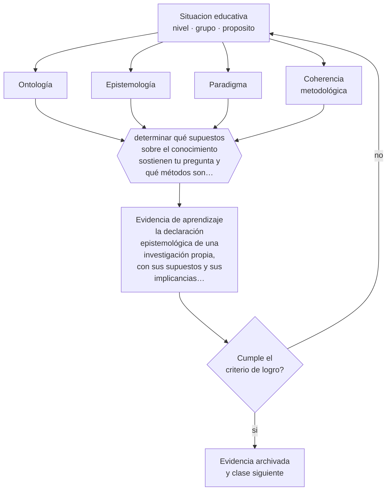

# Clase 193 — Epistemología de la investigación

> **Parte 16 · Investigación educativa** — clase 1 de 12

**Estado de evidencia:** `EN-DEBATE` · **Etapa:** 🔴 Etapa E — Investigación avanzada y formación de formadores · **Población de referencia:** investigación aplicada, tesis de magíster e investigación institucional 
**Decisión que habilita:** determinar qué supuestos sobre el conocimiento sostienen tu pregunta y qué métodos son coherentes con ellos 
**Evidencia de aprendizaje:** la declaración epistemológica de una investigación propia, con sus supuestos y sus implicancias metodológicas

## 🎯 Propósito

Explicitar los supuestos epistemológicos que sostienen una investigación educativa y evitar tanto el eclecticismo sin criterio como el dogmatismo metodológico.

## 📚 Resultados de aprendizaje

Al finalizar esta clase podrás:

1. **Definir** con precisión los cuatro conceptos centrales de la clase y reconocerlos en una situación educativa real, no solo en su enunciado.
2. **Explicar** qué supuestos sobre el conocimiento hay detrás de la elección de un método de investigación.
3. **Decidir** —qué supuestos sobre el conocimiento sostienen tu pregunta y qué métodos son coherentes con ellos— y sostener la decisión con un fundamento escrito.
4. **Producir** la evidencia de la clase —la declaración epistemológica de una investigación propia, con sus supuestos y sus implicancias metodológicas— y contrastarla contra el criterio de logro.
5. **Distinguir** lo que la evidencia sostiene de lo que es práctica instalada, preferencia personal o costumbre de la institución.

## 🧩 Conceptos centrales

| Concepto | Comprensión verificable |
|---|---|
| **Ontología** | supuestos sobre la naturaleza de aquello que se estudia |
| **Epistemología** | supuestos sobre qué cuenta como conocimiento válido y cómo se obtiene |
| **Paradigma** | conjunto articulado de supuestos, preguntas y métodos compartido por una comunidad de investigación |
| **Coherencia metodológica** | correspondencia entre supuestos declarados, pregunta y método elegido |

## 🗺️ Flujo de razonamiento

## 📖 Desarrollo

### 1. El fondo del asunto

Toda investigación supone una posición sobre qué se puede conocer y cómo. Quien busca establecer el efecto promedio de una intervención supone que existe un efecto estimable y que la comparación controlada lo revela; quien estudia cómo un grupo construye el sentido de una práctica supone que ese sentido es situado y no generalizable. Ninguna posición es superior en abstracto: la superioridad depende de la pregunta.

### 2. Cómo se traduce en decisiones de enseñanza

La declaración epistemológica no es un trámite de tesis: es lo que permite defender la coherencia del diseño. Cuando un estudiante declara un paradigma interpretativo y luego pretende generalizar a una población, la incoherencia se ve de inmediato. Escribir los supuestos antes de elegir el método previene esa contradicción.

### 3. Qué sostiene la evidencia y qué no

La discusión paradigmática se ha usado con frecuencia para descalificar métodos ajenos en vez de para orientar decisiones. Las llamadas guerras de paradigmas produjeron más trincheras que conocimiento. La posición razonable es instrumental: los supuestos orientan la elección, y la elección se justifica por la pregunta.

> **Cómo leer el estado de evidencia `EN-DEBATE`.** Hay desacuerdo activo y publicado entre especialistas competentes. La clase presenta las posiciones y sus argumentos; tu tarea no es escoger un bando, sino saber qué evidencia te haría cambiar de posición.

## 🧪 Taller guiado

Aplica la clase a **uno** de los contextos siguientes y repite después el ejercicio en un
contexto de exigencia distinta. Cambiar de contexto es parte del aprendizaje: lo que funciona
con un grupo no se traslada intacto a otro.

| Contexto | Rasgo que cambia la decisión |
|---|---|
| Investigación en la propia aula | el rol dual docente-investigador exige resguardos |
| Investigación institucional | hay intereses organizacionales sobre el resultado |
| Estudio con menores de edad | consentimiento, asentimiento y resguardo de datos |
| Estudio con datos administrativos | acceso, anonimización y sesgo de registro |
| Evaluación de una intervención | el diseño decide si podrás atribuir el efecto |
| Investigación cualitativa de campo | acceso, reflexividad y criterios de rigor |

**Secuencia de trabajo:**

1. Delimita el contexto: nivel, edad, tamaño del grupo, asignatura o experiencia y tiempo real disponible.
2. Declara qué saben ya los estudiantes y **cómo lo comprobaste**, no cómo lo supones.
3. Formula la decisión pedagógica que esta clase habilita y escribe su fundamento.
4. Anticipa qué observarías si la decisión funciona y qué observarías si no funciona.
5. Diseña de antemano la alternativa que aplicarás si la primera estrategia falla.
6. Ejecuta o simula, y registra lo observado con fecha, contexto y evidencia concreta.
7. Produce la evidencia de aprendizaje de la clase.
8. Contrástala contra el criterio de logro, corrige y recién entonces avanza.

### 📦 Evidencia de aprendizaje

La declaración epistemológica de una investigación propia, con sus supuestos y sus implicancias metodológicas.

Debe incluir contexto, decisión, fundamento, fuentes consultadas con su fecha, indicador de
logro observable, riesgos previstos y qué harías distinto en la siguiente iteración.

## 🏆 Reto verificable

Escribe la declaración epistemológica de tu investigación y pide a un colega de otra tradición que identifique sus incoherencias.

## ✅ Criterio de logro

- [ ] la declaración conecta supuestos, pregunta y método sin contradicción;
- [ ] reconoce qué tipo de afirmaciones podrá y no podrá sostener con ese enfoque;
- [ ] cada afirmación sobre «lo que funciona» está atribuida a una fuente identificable, con autor y fecha;
- [ ] la decisión es ejecutable con el tiempo, el espacio, el número de estudiantes y los recursos que realmente tienes;
- [ ] la evidencia queda archivada de forma reproducible: otra persona podría revisarla sin que tú se la expliques.

## ⚠️ Errores frecuentes

**Propios de esta clase:**

- Elegir el método por afinidad personal y construir después la justificación epistemológica.
- Descalificar un método por su paradigma en vez de por su ajuste a la pregunta.

**Característicos de la parte 16:**

- Elegir el método antes de tener la pregunta delimitada.
- Atribuir causalidad a diseños que no la permiten.

## ♿ Diversidad, accesibilidad y ética

Los supuestos epistemológicos determinan de quién se considera legítimo el conocimiento. Investigar con comunidades y no solo sobre ellas es una decisión epistemológica antes que metodológica, y tiene consecuencias éticas directas.

Antes de aplicar cualquier decisión de esta clase con estudiantes reales, revisa el
[protocolo de práctica responsable](../../../docs/ETICA_Y_PRACTICA_RESPONSABLE.md):
consentimiento, resguardo de datos personales, proporcionalidad de la intervención y derecho
de cada estudiante a no ser objeto de un ensayo que no le reporta beneficio.

## ❓ Preguntas de comprobación

1. ¿Qué tipo de afirmación quieres poder hacer al final de tu investigación?
2. ¿Qué supone tu método sobre lo que estás estudiando?
3. ¿Qué no podrás concluir con este enfoque?

## 📕 Lecturas base

**Guba, E. & Lincoln, Y. (1994). *Competing Paradigms in Qualitative Research*.**  
*Qué aporta a esta clase:* exposición clásica de los paradigmas y de sus supuestos.

**Creswell, J. & Creswell, J. D. (2018). *Research Design*.**  
*Qué aporta a esta clase:* conecta supuestos, preguntas y diseños con criterios prácticos de elección.

Catálogo completo: [bibliografía del programa](../../../docs/BIBLIOGRAFIA.md) ·
[glosario](../../../docs/GLOSARIO.md) ·
[fuentes oficiales y cómo leerlas](../../../docs/FUENTES.md).

## 🔗 Conexión con el resto del programa

Abre la parte 16 y condiciona las decisiones de las clases 197 a 199.

> [!IMPORTANT]
> Material de formación profesional. No reemplaza un título de pedagogía, una habilitación
> legal para ejercer, ni el juicio de un equipo educativo que conoce a sus estudiantes.

---

| Anterior | Índice | Siguiente |
|---|---|---|
| [← Parte 16](../README.md) | [Parte 16](../README.md) · [Programa](../../../README.md) | [194 · Pregunta y problema de investigación →](../class-02-pregunta-y-problema-de-investigacion/README.md) |
