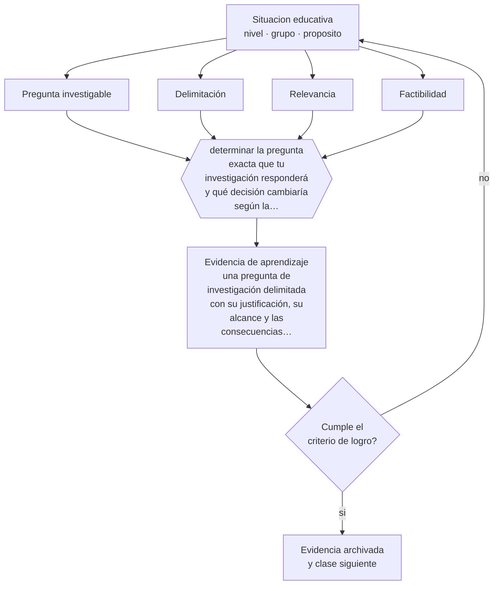

# Clase 194 — Pregunta y problema de investigación

> **Parte 16 · Investigación educativa** — clase 2 de 12

**Estado de evidencia:** `PRACTICA-PROFESIONAL` · **Etapa:** 🔴 Etapa E — Investigación avanzada y formación de formadores · **Población de referencia:** investigación aplicada, tesis de magíster e investigación institucional 
**Decisión que habilita:** determinar la pregunta exacta que tu investigación responderá y qué decisión cambiaría según la respuesta 
**Evidencia de aprendizaje:** una pregunta de investigación delimitada con su justificación, su alcance y las consecuencias de cada respuesta posible

## 🎯 Propósito

Convertir una inquietud profesional en una pregunta investigable: delimitada, conectada con lo que ya se sabe, respondible con los recursos disponibles y con consecuencias claras según el resultado.

## 📚 Resultados de aprendizaje

Al finalizar esta clase podrás:

1. **Definir** con precisión los cuatro conceptos centrales de la clase y reconocerlos en una situación educativa real, no solo en su enunciado.
2. **Explicar** por qué la mayoría de las investigaciones educativas fracasa antes de elegir el método.
3. **Decidir** —la pregunta exacta que tu investigación responderá y qué decisión cambiaría según la respuesta— y sostener la decisión con un fundamento escrito.
4. **Producir** la evidencia de la clase —una pregunta de investigación delimitada con su justificación, su alcance y las consecuencias de cada respuesta posible— y contrastarla contra el criterio de logro.
5. **Distinguir** lo que la evidencia sostiene de lo que es práctica instalada, preferencia personal o costumbre de la institución.

## 🧩 Conceptos centrales

| Concepto | Comprensión verificable |
|---|---|
| **Pregunta investigable** | interrogante que puede responderse con evidencia empírica en un plazo y con recursos definidos |
| **Delimitación** | precisión sobre población, contexto, variables y período que la pregunta abarca |
| **Relevancia** | aporte de la respuesta al conocimiento disponible o a una decisión práctica |
| **Factibilidad** | posibilidad real de responder la pregunta con el acceso, el tiempo y los recursos disponibles |

## 🗺️ Flujo de razonamiento

## 📖 Desarrollo

### 1. El fondo del asunto

Una pregunta demasiado amplia no se responde; una demasiado obvia no aporta; una cuya respuesta no cambiaría nada no justifica el esfuerzo. El trabajo de delimitación es el menos glamoroso y el que más determina el destino de una investigación. Un buen indicador: si no puedes anticipar cómo se vería la respuesta y qué implicaría, la pregunta todavía no está lista.

### 2. Cómo se traduce en decisiones de enseñanza

El procedimiento consiste en escribir la pregunta, anticipar sus respuestas posibles y declarar qué cambiaría con cada una. Si todas las respuestas llevan a la misma conclusión práctica, la pregunta no discrimina. Y la factibilidad debe evaluarse antes: acceso al campo, permisos, tiempo real disponible y competencias metodológicas propias.

### 3. Qué sostiene la evidencia y qué no

No hay una fórmula para producir buenas preguntas: se construyen con conocimiento del campo, y por eso la revisión de literatura es previa y no posterior. Además, la pregunta suele reformularse durante el proceso, y eso no es un defecto siempre que la reformulación se documente y no se presente como plan original.

> **Cómo leer el estado de evidencia `PRACTICA-PROFESIONAL`.** Es conocimiento práctico acumulado del oficio, útil y transferible, pero no probado con diseños de investigación. Trátalo como un buen punto de partida sujeto a comprobación en tu contexto.

## 🧪 Taller guiado

Aplica la clase a **uno** de los contextos siguientes y repite después el ejercicio en un
contexto de exigencia distinta. Cambiar de contexto es parte del aprendizaje: lo que funciona
con un grupo no se traslada intacto a otro.

| Contexto | Rasgo que cambia la decisión |
|---|---|
| Investigación en la propia aula | el rol dual docente-investigador exige resguardos |
| Investigación institucional | hay intereses organizacionales sobre el resultado |
| Estudio con menores de edad | consentimiento, asentimiento y resguardo de datos |
| Estudio con datos administrativos | acceso, anonimización y sesgo de registro |
| Evaluación de una intervención | el diseño decide si podrás atribuir el efecto |
| Investigación cualitativa de campo | acceso, reflexividad y criterios de rigor |

**Secuencia de trabajo:**

1. Delimita el contexto: nivel, edad, tamaño del grupo, asignatura o experiencia y tiempo real disponible.
2. Declara qué saben ya los estudiantes y **cómo lo comprobaste**, no cómo lo supones.
3. Formula la decisión pedagógica que esta clase habilita y escribe su fundamento.
4. Anticipa qué observarías si la decisión funciona y qué observarías si no funciona.
5. Diseña de antemano la alternativa que aplicarás si la primera estrategia falla.
6. Ejecuta o simula, y registra lo observado con fecha, contexto y evidencia concreta.
7. Produce la evidencia de aprendizaje de la clase.
8. Contrástala contra el criterio de logro, corrige y recién entonces avanza.

### 📦 Evidencia de aprendizaje

Una pregunta de investigación delimitada con su justificación, su alcance y las consecuencias de cada respuesta posible.

Debe incluir contexto, decisión, fundamento, fuentes consultadas con su fecha, indicador de
logro observable, riesgos previstos y qué harías distinto en la siguiente iteración.

## 🏆 Reto verificable

Escribe tu pregunta y sus respuestas posibles con sus consecuencias. Preséntala a dos colegas y reformúlala hasta que ambos entiendan lo mismo.

## ✅ Criterio de logro

- [ ] la pregunta declara población, contexto y período con precisión;
- [ ] se anticipan las respuestas posibles y sus consecuencias prácticas;
- [ ] cada afirmación sobre «lo que funciona» está atribuida a una fuente identificable, con autor y fecha;
- [ ] la decisión es ejecutable con el tiempo, el espacio, el número de estudiantes y los recursos que realmente tienes;
- [ ] la evidencia queda archivada de forma reproducible: otra persona podría revisarla sin que tú se la expliques.

## ⚠️ Errores frecuentes

**Propios de esta clase:**

- Formular una pregunta cuya respuesta ya está establecida en la literatura.
- Comprometer una pregunta sin haber verificado el acceso al campo ni los permisos necesarios.

**Característicos de la parte 16:**

- Elegir el método antes de tener la pregunta delimitada.
- Atribuir causalidad a diseños que no la permiten.

## ♿ Diversidad, accesibilidad y ética

Las preguntas de investigación reflejan quién define qué problema importa. Involucrar a los actores afectados en la formulación mejora la relevancia y evita investigar sobre comunidades sin su interés ni beneficio.

Antes de aplicar cualquier decisión de esta clase con estudiantes reales, revisa el
[protocolo de práctica responsable](../../../docs/ETICA_Y_PRACTICA_RESPONSABLE.md):
consentimiento, resguardo de datos personales, proporcionalidad de la intervención y derecho
de cada estudiante a no ser objeto de un ensayo que no le reporta beneficio.

## ❓ Preguntas de comprobación

1. ¿Qué decisión cambiaría según la respuesta que obtengas?
2. ¿Qué parte de tu pregunta ya está respondida en la literatura?
3. ¿Tienes acceso real al campo que tu pregunta exige?

## 📕 Lecturas base

**Booth, W., Colomb, G. & Williams, J. *The Craft of Research*.**  
*Qué aporta a esta clase:* el mejor tratamiento del paso de un tema a una pregunta investigable.

**Maxwell, J. (2013). *Qualitative Research Design: An Interactive Approach*.**  
*Qué aporta a esta clase:* modelo interactivo que conecta propósito, pregunta, método y validez.

Catálogo completo: [bibliografía del programa](../../../docs/BIBLIOGRAFIA.md) ·
[glosario](../../../docs/GLOSARIO.md) ·
[fuentes oficiales y cómo leerlas](../../../docs/FUENTES.md).

## 🔗 Conexión con el resto del programa

Es la decisión que condiciona toda la parte 16 y se apoya en la revisión de la clase 195.

> [!IMPORTANT]
> Material de formación profesional. No reemplaza un título de pedagogía, una habilitación
> legal para ejercer, ni el juicio de un equipo educativo que conoce a sus estudiantes.

---

| Anterior | Índice | Siguiente |
|---|---|---|
| [← 193 · Epistemología de la investigación](../class-01-epistemologia-de-la-investigacion/README.md) | [Parte 16](../README.md) · [Programa](../../../README.md) | [195 · Revisión de literatura →](../class-03-revision-de-literatura/README.md) |
