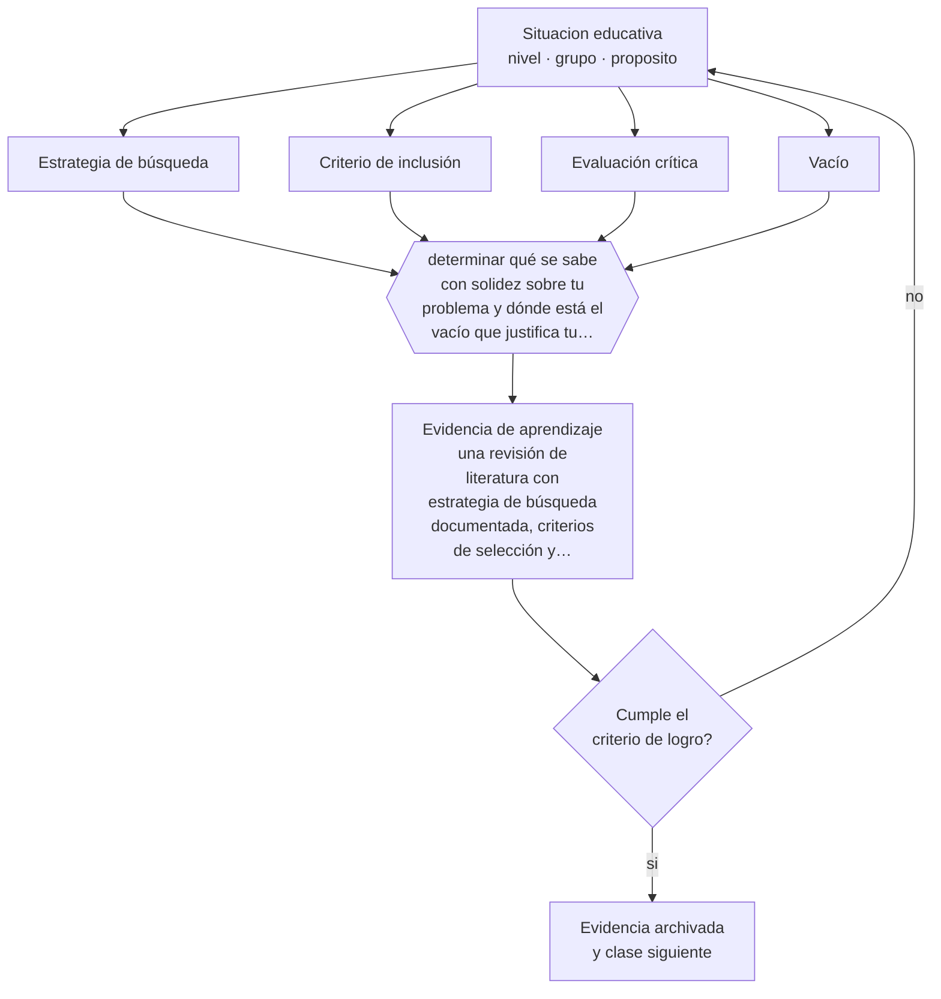

# Clase 195 — Revisión de literatura

> **Parte 16 · Investigación educativa** — clase 3 de 12

**Estado de evidencia:** `PRACTICA-PROFESIONAL` · **Etapa:** 🔴 Etapa E — Investigación avanzada y formación de formadores · **Población de referencia:** investigación aplicada, tesis de magíster e investigación institucional 
**Decisión que habilita:** determinar qué se sabe con solidez sobre tu problema y dónde está el vacío que justifica tu investigación 
**Evidencia de aprendizaje:** una revisión de literatura con estrategia de búsqueda documentada, criterios de selección y síntesis crítica

## 🎯 Propósito

Realizar revisiones de literatura con estrategia documentada: búsqueda sistemática, criterios de inclusión, evaluación crítica y síntesis que muestre qué se sabe, qué se discute y qué falta.

## 📚 Resultados de aprendizaje

Al finalizar esta clase podrás:

1. **Definir** con precisión los cuatro conceptos centrales de la clase y reconocerlos en una situación educativa real, no solo en su enunciado.
2. **Explicar** cómo se revisa literatura sin acumular resúmenes que no dicen nada.
3. **Decidir** —qué se sabe con solidez sobre tu problema y dónde está el vacío que justifica tu investigación— y sostener la decisión con un fundamento escrito.
4. **Producir** la evidencia de la clase —una revisión de literatura con estrategia de búsqueda documentada, criterios de selección y síntesis crítica— y contrastarla contra el criterio de logro.
5. **Distinguir** lo que la evidencia sostiene de lo que es práctica instalada, preferencia personal o costumbre de la institución.

## 🧩 Conceptos centrales

| Concepto | Comprensión verificable |
|---|---|
| **Estrategia de búsqueda** | conjunto de fuentes, términos y filtros usados, documentado para ser reproducible |
| **Criterio de inclusión** | regla explícita que define qué estudios entran en la revisión y cuáles no |
| **Evaluación crítica** | juicio sobre la calidad metodológica de cada estudio y sobre lo que permite afirmar |
| **Vacío** | aspecto del problema que la literatura no resuelve y que justifica una nueva investigación |

## 🗺️ Flujo de razonamiento

## 📖 Desarrollo

### 1. El fondo del asunto

Una revisión no es una lista de resúmenes: es un argumento sobre el estado del conocimiento. Su producto es una afirmación —esto está establecido, esto se discute, esto no se ha estudiado— que justifica la pregunta propia. Documentar la estrategia de búsqueda es lo que separa una revisión de una selección conveniente de estudios que confirman lo que ya se pensaba.

### 2. Cómo se traduce en decisiones de enseñanza

El procedimiento incluye definir fuentes y términos, registrar la búsqueda con fecha, aplicar criterios de inclusión declarados, evaluar críticamente cada estudio y sintetizar por temas o por hallazgos y no por autores. La síntesis por autores —«Pérez dice, González dice»— es el error más común y el que revela que no hubo integración.

### 3. Qué sostiene la evidencia y qué no

Toda revisión tiene sesgo de publicación: los estudios con resultados nulos se publican menos, de modo que la literatura sobreestima los efectos. Y las revisiones no sistemáticas tienen sesgo de selección del autor. Reconocerlo y declararlo es parte del rigor, y en algunos casos justifica una revisión sistemática formal.

> **Cómo leer el estado de evidencia `PRACTICA-PROFESIONAL`.** Es conocimiento práctico acumulado del oficio, útil y transferible, pero no probado con diseños de investigación. Trátalo como un buen punto de partida sujeto a comprobación en tu contexto.

## 🧪 Taller guiado

Aplica la clase a **uno** de los contextos siguientes y repite después el ejercicio en un
contexto de exigencia distinta. Cambiar de contexto es parte del aprendizaje: lo que funciona
con un grupo no se traslada intacto a otro.

| Contexto | Rasgo que cambia la decisión |
|---|---|
| Investigación en la propia aula | el rol dual docente-investigador exige resguardos |
| Investigación institucional | hay intereses organizacionales sobre el resultado |
| Estudio con menores de edad | consentimiento, asentimiento y resguardo de datos |
| Estudio con datos administrativos | acceso, anonimización y sesgo de registro |
| Evaluación de una intervención | el diseño decide si podrás atribuir el efecto |
| Investigación cualitativa de campo | acceso, reflexividad y criterios de rigor |

**Secuencia de trabajo:**

1. Delimita el contexto: nivel, edad, tamaño del grupo, asignatura o experiencia y tiempo real disponible.
2. Declara qué saben ya los estudiantes y **cómo lo comprobaste**, no cómo lo supones.
3. Formula la decisión pedagógica que esta clase habilita y escribe su fundamento.
4. Anticipa qué observarías si la decisión funciona y qué observarías si no funciona.
5. Diseña de antemano la alternativa que aplicarás si la primera estrategia falla.
6. Ejecuta o simula, y registra lo observado con fecha, contexto y evidencia concreta.
7. Produce la evidencia de aprendizaje de la clase.
8. Contrástala contra el criterio de logro, corrige y recién entonces avanza.

### 📦 Evidencia de aprendizaje

Una revisión de literatura con estrategia de búsqueda documentada, criterios de selección y síntesis crítica.

Debe incluir contexto, decisión, fundamento, fuentes consultadas con su fecha, indicador de
logro observable, riesgos previstos y qué harías distinto en la siguiente iteración.

## 🏆 Reto verificable

Documenta tu estrategia de búsqueda y aplícala. Identifica un estudio que contradiga tu expectativa y explica cómo cambia tu planteamiento.

## ✅ Criterio de logro

- [ ] la estrategia de búsqueda está documentada con fuentes, términos y fechas;
- [ ] la síntesis distingue lo establecido, lo discutido y el vacío identificado;
- [ ] cada afirmación sobre «lo que funciona» está atribuida a una fuente identificable, con autor y fecha;
- [ ] la decisión es ejecutable con el tiempo, el espacio, el número de estudiantes y los recursos que realmente tienes;
- [ ] la evidencia queda archivada de forma reproducible: otra persona podría revisarla sin que tú se la expliques.

## ⚠️ Errores frecuentes

**Propios de esta clase:**

- Sintetizar por autores en vez de por hallazgos, sin integrar ni contrastar.
- Omitir la estrategia de búsqueda, con lo que la revisión no es reproducible ni auditable.

**Característicos de la parte 16:**

- Elegir el método antes de tener la pregunta delimitada.
- Atribuir causalidad a diseños que no la permiten.

## ♿ Diversidad, accesibilidad y ética

La literatura disponible está sesgada hacia contextos anglosajones y hacia poblaciones específicas. Declararlo y buscar deliberadamente evidencia regional evita aplicar a un contexto conclusiones obtenidas en otro muy distinto.

Antes de aplicar cualquier decisión de esta clase con estudiantes reales, revisa el
[protocolo de práctica responsable](../../../docs/ETICA_Y_PRACTICA_RESPONSABLE.md):
consentimiento, resguardo de datos personales, proporcionalidad de la intervención y derecho
de cada estudiante a no ser objeto de un ensayo que no le reporta beneficio.

## ❓ Preguntas de comprobación

1. ¿Podría otra persona reproducir tu búsqueda?
2. ¿Qué estudio contradice tu hipótesis y cómo lo trataste?
3. ¿Cuál es exactamente el vacío que justifica tu investigación?

## 📕 Lecturas base

**Petticrew, M. & Roberts, H. (2006). *Systematic Reviews in the Social Sciences*.**  
*Qué aporta a esta clase:* metodología de revisión sistemática aplicable también a revisiones más acotadas.

**Boote, D. & Beile, P. (2005). *Scholars Before Researchers*.**  
*Qué aporta a esta clase:* argumenta y operacionaliza qué hace buena a una revisión de literatura de tesis.

Catálogo completo: [bibliografía del programa](../../../docs/BIBLIOGRAFIA.md) ·
[glosario](../../../docs/GLOSARIO.md) ·
[fuentes oficiales y cómo leerlas](../../../docs/FUENTES.md).

## 🔗 Conexión con el resto del programa

Es condición de la clase 194 y alimenta el marco teórico de la clase 196.

> [!IMPORTANT]
> Material de formación profesional. No reemplaza un título de pedagogía, una habilitación
> legal para ejercer, ni el juicio de un equipo educativo que conoce a sus estudiantes.

---

| Anterior | Índice | Siguiente |
|---|---|---|
| [← 194 · Pregunta y problema de investigación](../class-02-pregunta-y-problema-de-investigacion/README.md) | [Parte 16](../README.md) · [Programa](../../../README.md) | [196 · Marco teórico →](../class-04-marco-teorico/README.md) |
