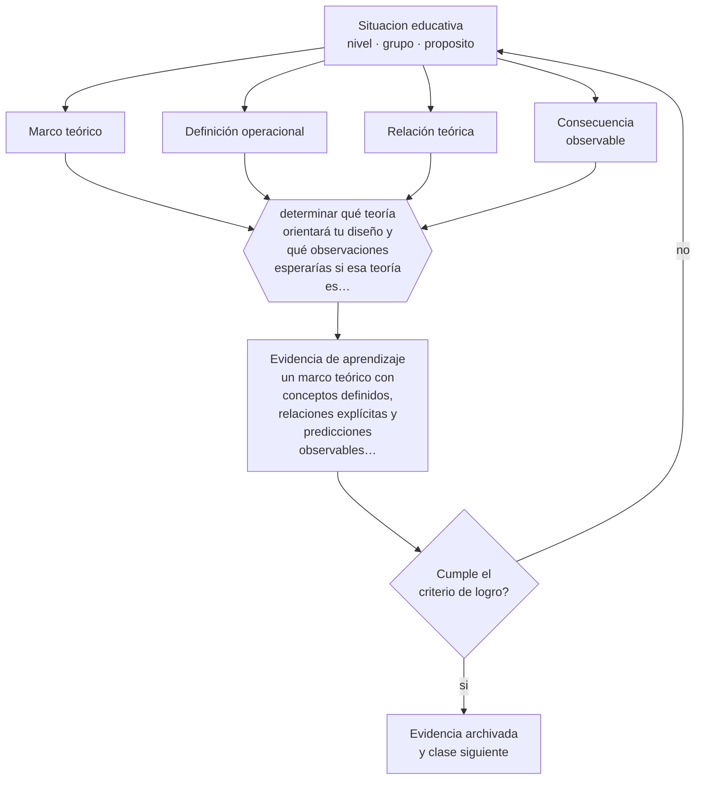

# Clase 196 — Marco teórico

> **Parte 16 · Investigación educativa** — clase 4 de 12

**Estado de evidencia:** `PRACTICA-PROFESIONAL` · **Etapa:** 🔴 Etapa E — Investigación avanzada y formación de formadores · **Población de referencia:** investigación aplicada, tesis de magíster e investigación institucional 
**Decisión que habilita:** determinar qué teoría orientará tu diseño y qué observaciones esperarías si esa teoría es correcta 
**Evidencia de aprendizaje:** un marco teórico con conceptos definidos, relaciones explícitas y predicciones observables derivadas

## 🎯 Propósito

Construir marcos teóricos funcionales: conceptos definidos, relaciones explícitas entre ellos y consecuencias observables que orientan el diseño y el análisis.

## 📚 Resultados de aprendizaje

Al finalizar esta clase podrás:

1. **Definir** con precisión los cuatro conceptos centrales de la clase y reconocerlos en una situación educativa real, no solo en su enunciado.
2. **Explicar** para qué sirve un marco teórico, además de cumplir un requisito del formato de tesis.
3. **Decidir** —qué teoría orientará tu diseño y qué observaciones esperarías si esa teoría es correcta— y sostener la decisión con un fundamento escrito.
4. **Producir** la evidencia de la clase —un marco teórico con conceptos definidos, relaciones explícitas y predicciones observables derivadas— y contrastarla contra el criterio de logro.
5. **Distinguir** lo que la evidencia sostiene de lo que es práctica instalada, preferencia personal o costumbre de la institución.

## 🧩 Conceptos centrales

| Concepto | Comprensión verificable |
|---|---|
| **Marco teórico** | conjunto articulado de conceptos y relaciones que orienta el diseño y la interpretación |
| **Definición operacional** | traducción de un concepto a algo observable o medible |
| **Relación teórica** | vínculo propuesto entre conceptos, del que se derivan predicciones |
| **Consecuencia observable** | hecho que debería ocurrir si la teoría propuesta es adecuada |

## 🗺️ Flujo de razonamiento

## 📖 Desarrollo

### 1. El fondo del asunto

Un marco teórico que no orienta ninguna decisión de diseño es decorativo. Su función es doble: definir con precisión los conceptos que se usarán —de modo que otros entiendan qué se midió o se observó— y proponer relaciones que generen expectativas verificables. Si de tu marco no se deriva ninguna predicción, no es un marco: es un capítulo de antecedentes.

### 2. Cómo se traduce en decisiones de enseñanza

La prueba práctica consiste en derivar del marco al menos dos observaciones esperadas y una que no se esperaría. Esa última es la más valiosa, porque hace la teoría falsable en el contexto del estudio. Y las definiciones operacionales deben escribirse antes de recoger datos, no después de mirarlos.

### 3. Qué sostiene la evidencia y qué no

En investigación cualitativa exploratoria, un marco demasiado rígido puede cerrar la observación a lo previsto y perder lo emergente. Ahí el marco funciona como sensibilizador y no como predictor. Declarar cuál de las dos funciones cumple evita la incoherencia entre marco y método.

> **Cómo leer el estado de evidencia `PRACTICA-PROFESIONAL`.** Es conocimiento práctico acumulado del oficio, útil y transferible, pero no probado con diseños de investigación. Trátalo como un buen punto de partida sujeto a comprobación en tu contexto.

## 🧪 Taller guiado

Aplica la clase a **uno** de los contextos siguientes y repite después el ejercicio en un
contexto de exigencia distinta. Cambiar de contexto es parte del aprendizaje: lo que funciona
con un grupo no se traslada intacto a otro.

| Contexto | Rasgo que cambia la decisión |
|---|---|
| Investigación en la propia aula | el rol dual docente-investigador exige resguardos |
| Investigación institucional | hay intereses organizacionales sobre el resultado |
| Estudio con menores de edad | consentimiento, asentimiento y resguardo de datos |
| Estudio con datos administrativos | acceso, anonimización y sesgo de registro |
| Evaluación de una intervención | el diseño decide si podrás atribuir el efecto |
| Investigación cualitativa de campo | acceso, reflexividad y criterios de rigor |

**Secuencia de trabajo:**

1. Delimita el contexto: nivel, edad, tamaño del grupo, asignatura o experiencia y tiempo real disponible.
2. Declara qué saben ya los estudiantes y **cómo lo comprobaste**, no cómo lo supones.
3. Formula la decisión pedagógica que esta clase habilita y escribe su fundamento.
4. Anticipa qué observarías si la decisión funciona y qué observarías si no funciona.
5. Diseña de antemano la alternativa que aplicarás si la primera estrategia falla.
6. Ejecuta o simula, y registra lo observado con fecha, contexto y evidencia concreta.
7. Produce la evidencia de aprendizaje de la clase.
8. Contrástala contra el criterio de logro, corrige y recién entonces avanza.

### 📦 Evidencia de aprendizaje

Un marco teórico con conceptos definidos, relaciones explícitas y predicciones observables derivadas.

Debe incluir contexto, decisión, fundamento, fuentes consultadas con su fecha, indicador de
logro observable, riesgos previstos y qué harías distinto en la siguiente iteración.

## 🏆 Reto verificable

Deriva de tu marco tres consecuencias observables y contrástalas con datos preliminares. Ajusta el marco donde la realidad no se comportó como esperabas.

## ✅ Criterio de logro

- [ ] los conceptos tienen definición operacional escrita antes de la recolección;
- [ ] del marco se derivan observaciones esperadas y al menos una no esperada;
- [ ] cada afirmación sobre «lo que funciona» está atribuida a una fuente identificable, con autor y fecha;
- [ ] la decisión es ejecutable con el tiempo, el espacio, el número de estudiantes y los recursos que realmente tienes;
- [ ] la evidencia queda archivada de forma reproducible: otra persona podría revisarla sin que tú se la expliques.

## ⚠️ Errores frecuentes

**Propios de esta clase:**

- Escribir un capítulo de teoría que no orienta ninguna decisión del diseño.
- Definir los conceptos después de haber recogido los datos, ajustándolos al resultado.

**Característicos de la parte 16:**

- Elegir el método antes de tener la pregunta delimitada.
- Atribuir causalidad a diseños que no la permiten.

## ♿ Diversidad, accesibilidad y ética

Los marcos teóricos importados sin ajuste pueden imponer categorías ajenas a la realidad estudiada. Verificar que los conceptos tengan sentido en el contexto local es una exigencia de validez y también de respeto.

Antes de aplicar cualquier decisión de esta clase con estudiantes reales, revisa el
[protocolo de práctica responsable](../../../docs/ETICA_Y_PRACTICA_RESPONSABLE.md):
consentimiento, resguardo de datos personales, proporcionalidad de la intervención y derecho
de cada estudiante a no ser objeto de un ensayo que no le reporta beneficio.

## ❓ Preguntas de comprobación

1. ¿Qué observarías si tu teoría es correcta, y qué si no lo es?
2. ¿Qué decisión de tu diseño se deriva del marco?
3. ¿Cómo definiste operacionalmente tu concepto principal?

## 📕 Lecturas base

**Maxwell, J. (2013). *Qualitative Research Design*.**  
*Qué aporta a esta clase:* explica el marco teórico como herramienta de diseño y no como requisito formal.

**Merton, R. *Teorías de alcance intermedio*.**  
*Qué aporta a esta clase:* fundamenta el nivel de teorización que resulta productivo en investigación social aplicada.

Catálogo completo: [bibliografía del programa](../../../docs/BIBLIOGRAFIA.md) ·
[glosario](../../../docs/GLOSARIO.md) ·
[fuentes oficiales y cómo leerlas](../../../docs/FUENTES.md).

## 🔗 Conexión con el resto del programa

Se apoya en la clase 195 y ordena las decisiones de las clases 197 a 199.

> [!IMPORTANT]
> Material de formación profesional. No reemplaza un título de pedagogía, una habilitación
> legal para ejercer, ni el juicio de un equipo educativo que conoce a sus estudiantes.

---

| Anterior | Índice | Siguiente |
|---|---|---|
| [← 195 · Revisión de literatura](../class-03-revision-de-literatura/README.md) | [Parte 16](../README.md) · [Programa](../../../README.md) | [197 · Diseños cuantitativos →](../class-05-disenos-cuantitativos/README.md) |
