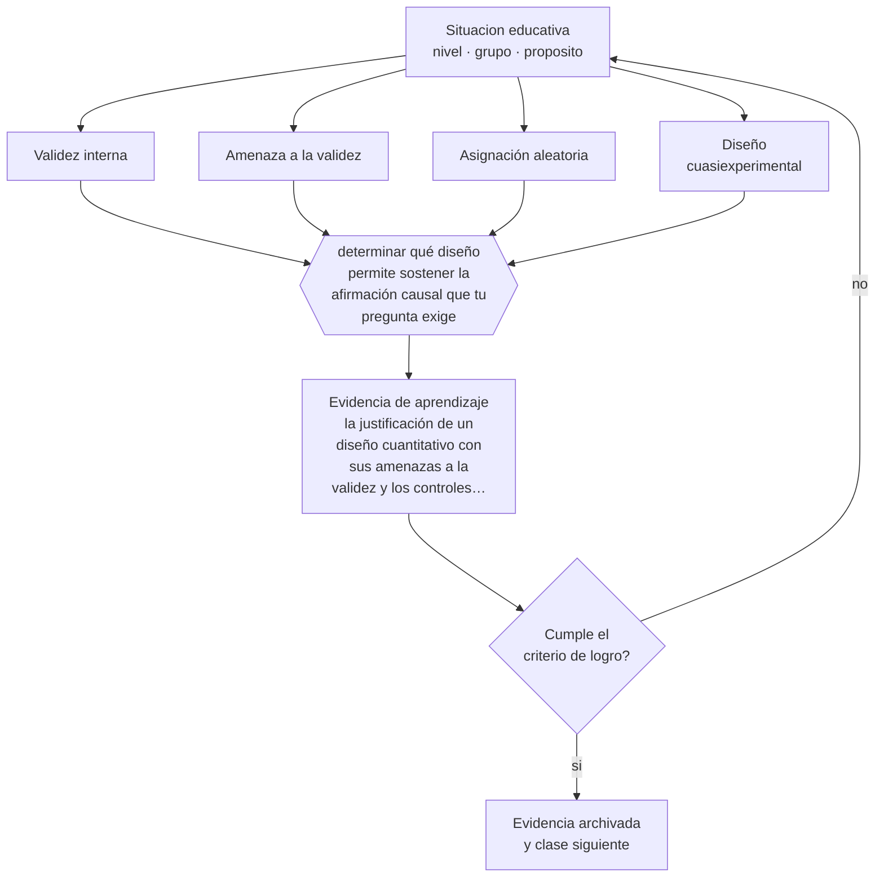

# Clase 197 — Diseños cuantitativos

> **Parte 16 · Investigación educativa** — clase 5 de 12

**Estado de evidencia:** `ROBUSTA` · **Etapa:** 🔴 Etapa E — Investigación avanzada y formación de formadores · **Población de referencia:** investigación aplicada, tesis de magíster e investigación institucional 
**Decisión que habilita:** determinar qué diseño permite sostener la afirmación causal que tu pregunta exige 
**Evidencia de aprendizaje:** la justificación de un diseño cuantitativo con sus amenazas a la validez y los controles previstos

## 🎯 Propósito

Elegir y justificar diseños cuantitativos según la pregunta, comprendiendo las amenazas a la validez interna y qué controla cada diseño.

## 📚 Resultados de aprendizaje

Al finalizar esta clase podrás:

1. **Definir** con precisión los cuatro conceptos centrales de la clase y reconocerlos en una situación educativa real, no solo en su enunciado.
2. **Explicar** qué diseño permite afirmar que una intervención causó el resultado y cuál no.
3. **Decidir** —qué diseño permite sostener la afirmación causal que tu pregunta exige— y sostener la decisión con un fundamento escrito.
4. **Producir** la evidencia de la clase —la justificación de un diseño cuantitativo con sus amenazas a la validez y los controles previstos— y contrastarla contra el criterio de logro.
5. **Distinguir** lo que la evidencia sostiene de lo que es práctica instalada, preferencia personal o costumbre de la institución.

## 🧩 Conceptos centrales

| Concepto | Comprensión verificable |
|---|---|
| **Validez interna** | grado en que el diseño permite atribuir el resultado a la intervención y no a otra causa |
| **Amenaza a la validez** | explicación alternativa del resultado: maduración, selección, historia, regresión a la media |
| **Asignación aleatoria** | procedimiento que equilibra en promedio las diferencias previas entre grupos |
| **Diseño cuasiexperimental** | comparación sin aleatorización, con controles que reducen algunas amenazas |

## 🗺️ Flujo de razonamiento

## 📖 Desarrollo

### 1. El fondo del asunto

Un diseño no es una etiqueta: es un argumento sobre qué explicaciones alternativas quedan descartadas. Un pretest-postest sin grupo de comparación no permite atribuir el cambio a la intervención, porque la maduración, la historia y la regresión a la media explican igual de bien el resultado. Conocer las amenazas y qué controla cada diseño es lo que permite elegir con criterio y, sobre todo, afirmar solo lo que corresponde.

### 2. Cómo se traduce en decisiones de enseñanza

El trabajo consiste en listar las amenazas plausibles para tu contexto y decidir qué diseño las controla. En educación, la asignación aleatoria suele ser inviable o inaceptable, y los diseños cuasiexperimentales bien construidos —con grupo de comparación equivalente, medición previa y controles— sostienen inferencias razonables si sus supuestos se declaran.

### 3. Qué sostiene la evidencia y qué no

Ningún diseño observacional elimina la posibilidad de variables no medidas. Y los efectos promedio no describen a ningún estudiante en particular: un efecto positivo puede coexistir con perjuicio para un subgrupo. Reportar heterogeneidad de efectos es parte del rigor y rara vez se hace.

> **Cómo leer el estado de evidencia `ROBUSTA`.** Hay evidencia convergente de varios equipos, países y diseños de investigación, incluidos estudios experimentales o cuasiexperimentales, y el efecto se sostiene al replicarlo. Puedes apoyar una decisión profesional en ella, sin olvidar que ningún efecto promedio describe a un estudiante concreto.

## 🧪 Taller guiado

Aplica la clase a **uno** de los contextos siguientes y repite después el ejercicio en un
contexto de exigencia distinta. Cambiar de contexto es parte del aprendizaje: lo que funciona
con un grupo no se traslada intacto a otro.

| Contexto | Rasgo que cambia la decisión |
|---|---|
| Investigación en la propia aula | el rol dual docente-investigador exige resguardos |
| Investigación institucional | hay intereses organizacionales sobre el resultado |
| Estudio con menores de edad | consentimiento, asentimiento y resguardo de datos |
| Estudio con datos administrativos | acceso, anonimización y sesgo de registro |
| Evaluación de una intervención | el diseño decide si podrás atribuir el efecto |
| Investigación cualitativa de campo | acceso, reflexividad y criterios de rigor |

**Secuencia de trabajo:**

1. Delimita el contexto: nivel, edad, tamaño del grupo, asignatura o experiencia y tiempo real disponible.
2. Declara qué saben ya los estudiantes y **cómo lo comprobaste**, no cómo lo supones.
3. Formula la decisión pedagógica que esta clase habilita y escribe su fundamento.
4. Anticipa qué observarías si la decisión funciona y qué observarías si no funciona.
5. Diseña de antemano la alternativa que aplicarás si la primera estrategia falla.
6. Ejecuta o simula, y registra lo observado con fecha, contexto y evidencia concreta.
7. Produce la evidencia de aprendizaje de la clase.
8. Contrástala contra el criterio de logro, corrige y recién entonces avanza.

### 📦 Evidencia de aprendizaje

La justificación de un diseño cuantitativo con sus amenazas a la validez y los controles previstos.

Debe incluir contexto, decisión, fundamento, fuentes consultadas con su fecha, indicador de
logro observable, riesgos previstos y qué harías distinto en la siguiente iteración.

## 🏆 Reto verificable

Toma una intervención de tu institución y diseña su evaluación con grupo de comparación. Declara qué amenazas quedan sin controlar.

## ✅ Criterio de logro

- [ ] las amenazas plausibles están listadas con el control previsto para cada una;
- [ ] la afirmación causal declarada corresponde a lo que el diseño efectivamente sostiene;
- [ ] cada afirmación sobre «lo que funciona» está atribuida a una fuente identificable, con autor y fecha;
- [ ] la decisión es ejecutable con el tiempo, el espacio, el número de estudiantes y los recursos que realmente tienes;
- [ ] la evidencia queda archivada de forma reproducible: otra persona podría revisarla sin que tú se la expliques.

## ⚠️ Errores frecuentes

**Propios de esta clase:**

- Atribuir causalidad a partir de un pretest-postest sin grupo de comparación.
- Reportar un efecto promedio sin examinar si beneficia por igual a los distintos subgrupos.

**Característicos de la parte 16:**

- Elegir el método antes de tener la pregunta delimitada.
- Atribuir causalidad a diseños que no la permiten.

## ♿ Diversidad, accesibilidad y ética

Los diseños que excluyen a estudiantes con necesidades de apoyo producen resultados que después se aplican a ellos igualmente. Declarar la población efectivamente incluida es una exigencia elemental y frecuentemente omitida.

Antes de aplicar cualquier decisión de esta clase con estudiantes reales, revisa el
[protocolo de práctica responsable](../../../docs/ETICA_Y_PRACTICA_RESPONSABLE.md):
consentimiento, resguardo de datos personales, proporcionalidad de la intervención y derecho
de cada estudiante a no ser objeto de un ensayo que no le reporta beneficio.

## ❓ Preguntas de comprobación

1. ¿Qué explicación alternativa a la tuya no queda descartada?
2. ¿Qué afirmación exacta sostiene tu diseño?
3. ¿A quién podría estar perjudicando una intervención con efecto promedio positivo?

## 📕 Lecturas base

**Shadish, W., Cook, T. & Campbell, D. (2002). *Experimental and Quasi-Experimental Designs*.**  
*Qué aporta a esta clase:* la referencia sobre amenazas a la validez y sobre qué controla cada diseño.

**What Works Clearinghouse. *Standards Handbook*.**  
*Qué aporta a esta clase:* criterios operativos para juzgar si un estudio sostiene una afirmación causal.

Catálogo completo: [bibliografía del programa](../../../docs/BIBLIOGRAFIA.md) ·
[glosario](../../../docs/GLOSARIO.md) ·
[fuentes oficiales y cómo leerlas](../../../docs/FUENTES.md).

## 🔗 Conexión con el resto del programa

Se apoya en las clases 193 y 196 y se complementa con la clase 201.

> [!IMPORTANT]
> Material de formación profesional. No reemplaza un título de pedagogía, una habilitación
> legal para ejercer, ni el juicio de un equipo educativo que conoce a sus estudiantes.

---

| Anterior | Índice | Siguiente |
|---|---|---|
| [← 196 · Marco teórico](../class-04-marco-teorico/README.md) | [Parte 16](../README.md) · [Programa](../../../README.md) | [198 · Diseños cualitativos →](../class-06-disenos-cualitativos/README.md) |
