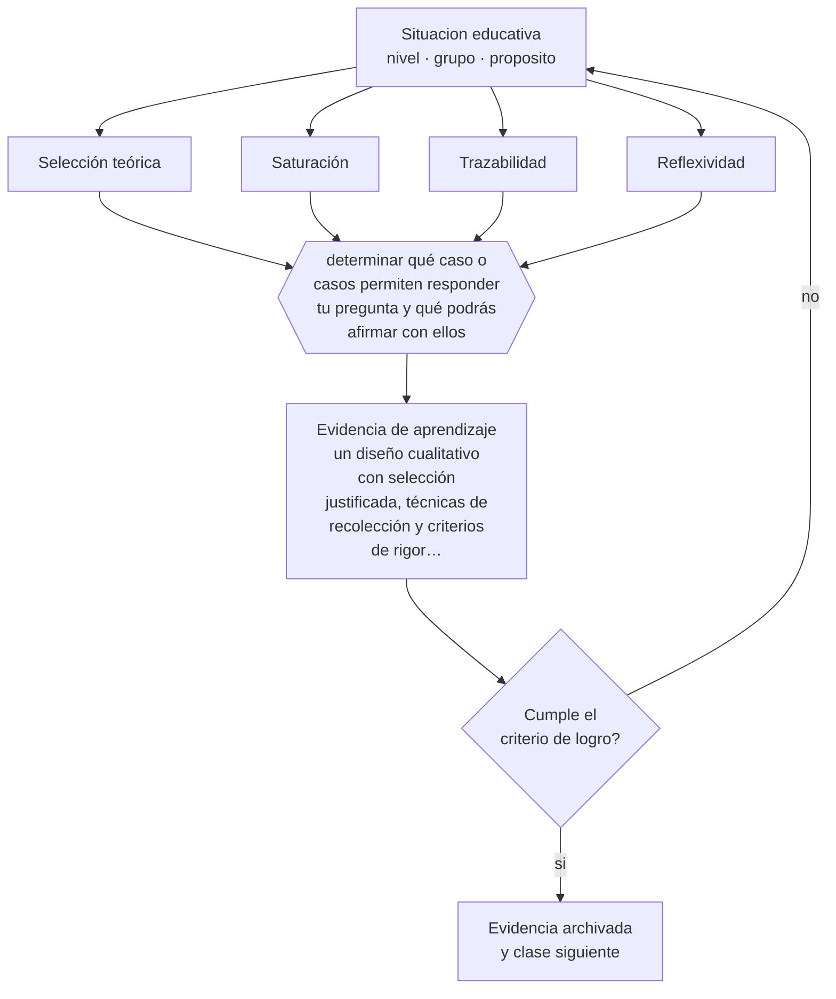

# Clase 198 — Diseños cualitativos

> **Parte 16 · Investigación educativa** — clase 6 de 12

**Estado de evidencia:** `CONSISTENTE` · **Etapa:** 🔴 Etapa E — Investigación avanzada y formación de formadores · **Población de referencia:** investigación aplicada, tesis de magíster e investigación institucional 
**Decisión que habilita:** determinar qué caso o casos permiten responder tu pregunta y qué podrás afirmar con ellos 
**Evidencia de aprendizaje:** un diseño cualitativo con selección justificada, técnicas de recolección y criterios de rigor declarados

## 🎯 Propósito

Diseñar investigación cualitativa con rigor: selección justificada de casos, recolección sistemática, análisis trazable y criterios de calidad propios de la tradición.

## 📚 Resultados de aprendizaje

Al finalizar esta clase podrás:

1. **Definir** con precisión los cuatro conceptos centrales de la clase y reconocerlos en una situación educativa real, no solo en su enunciado.
2. **Explicar** qué afirmaciones sostiene un estudio cualitativo bien hecho y cuáles exceden su alcance.
3. **Decidir** —qué caso o casos permiten responder tu pregunta y qué podrás afirmar con ellos— y sostener la decisión con un fundamento escrito.
4. **Producir** la evidencia de la clase —un diseño cualitativo con selección justificada, técnicas de recolección y criterios de rigor declarados— y contrastarla contra el criterio de logro.
5. **Distinguir** lo que la evidencia sostiene de lo que es práctica instalada, preferencia personal o costumbre de la institución.

## 🧩 Conceptos centrales

| Concepto | Comprensión verificable |
|---|---|
| **Selección teórica** | elección de casos por su capacidad de informar sobre el fenómeno, no por representatividad estadística |
| **Saturación** | punto en que nuevos datos dejan de aportar información relevante a las categorías |
| **Trazabilidad** | posibilidad de seguir el camino desde los datos hasta las conclusiones |
| **Reflexividad** | examen explícito del efecto del investigador sobre el campo y sobre la interpretación |

## 🗺️ Flujo de razonamiento

## 📖 Desarrollo

### 1. El fondo del asunto

La investigación cualitativa no busca generalizar a poblaciones sino comprender mecanismos, significados y procesos en contextos concretos. Sus criterios de calidad son propios: selección justificada, recolección sistemática, análisis trazable, búsqueda deliberada de casos que contradigan la interpretación y reflexividad sobre la posición del investigador. Aplicarle criterios cuantitativos —tamaño muestral, representatividad— es un error categorial frecuente.

### 2. Cómo se traduce en decisiones de enseñanza

El diseño declara por qué esos casos, con qué técnicas se recogerán los datos, cómo se registrarán y cómo se analizarán. La búsqueda activa de evidencia discrepante es el control de calidad más potente: si el investigador solo encuentra confirmaciones, probablemente no las buscó.

### 3. Qué sostiene la evidencia y qué no

El estudio cualitativo no permite estimar prevalencia ni efecto promedio, y su transferibilidad a otros contextos la juzga el lector a partir de la descripción, no el investigador. Además, el análisis es interpretativo y por eso exige documentar el camino: sin trazabilidad, no hay forma de distinguir hallazgo de impresión.

> **Cómo leer el estado de evidencia `CONSISTENTE`.** La evidencia es amplia y coherente, pero proviene sobre todo de estudios correlacionales, de síntesis con heterogeneidad alta o de contextos distintos al tuyo. Sirve para orientar la decisión y exige que compruebes el efecto en tu propio grupo.

## 🧪 Taller guiado

Aplica la clase a **uno** de los contextos siguientes y repite después el ejercicio en un
contexto de exigencia distinta. Cambiar de contexto es parte del aprendizaje: lo que funciona
con un grupo no se traslada intacto a otro.

| Contexto | Rasgo que cambia la decisión |
|---|---|
| Investigación en la propia aula | el rol dual docente-investigador exige resguardos |
| Investigación institucional | hay intereses organizacionales sobre el resultado |
| Estudio con menores de edad | consentimiento, asentimiento y resguardo de datos |
| Estudio con datos administrativos | acceso, anonimización y sesgo de registro |
| Evaluación de una intervención | el diseño decide si podrás atribuir el efecto |
| Investigación cualitativa de campo | acceso, reflexividad y criterios de rigor |

**Secuencia de trabajo:**

1. Delimita el contexto: nivel, edad, tamaño del grupo, asignatura o experiencia y tiempo real disponible.
2. Declara qué saben ya los estudiantes y **cómo lo comprobaste**, no cómo lo supones.
3. Formula la decisión pedagógica que esta clase habilita y escribe su fundamento.
4. Anticipa qué observarías si la decisión funciona y qué observarías si no funciona.
5. Diseña de antemano la alternativa que aplicarás si la primera estrategia falla.
6. Ejecuta o simula, y registra lo observado con fecha, contexto y evidencia concreta.
7. Produce la evidencia de aprendizaje de la clase.
8. Contrástala contra el criterio de logro, corrige y recién entonces avanza.

### 📦 Evidencia de aprendizaje

Un diseño cualitativo con selección justificada, técnicas de recolección y criterios de rigor declarados.

Debe incluir contexto, decisión, fundamento, fuentes consultadas con su fecha, indicador de
logro observable, riesgos previstos y qué harías distinto en la siguiente iteración.

## 🏆 Reto verificable

Diseña tu estudio y realiza dos recolecciones. Busca deliberadamente un caso que contradiga tu interpretación inicial y documenta qué cambió.

## ✅ Criterio de logro

- [ ] la selección de casos está justificada por su aporte a la pregunta;
- [ ] el diseño incluye búsqueda deliberada de evidencia discrepante y reflexividad;
- [ ] cada afirmación sobre «lo que funciona» está atribuida a una fuente identificable, con autor y fecha;
- [ ] la decisión es ejecutable con el tiempo, el espacio, el número de estudiantes y los recursos que realmente tienes;
- [ ] la evidencia queda archivada de forma reproducible: otra persona podría revisarla sin que tú se la expliques.

## ⚠️ Errores frecuentes

**Propios de esta clase:**

- Generalizar a poblaciones a partir de un estudio de casos.
- Presentar citas seleccionadas como evidencia sin mostrar el procedimiento de análisis.

**Característicos de la parte 16:**

- Elegir el método antes de tener la pregunta delimitada.
- Atribuir causalidad a diseños que no la permiten.

## ♿ Diversidad, accesibilidad y ética

La investigación cualitativa da voz a quienes los promedios invisibilizan, y por eso arrastra una responsabilidad adicional: representar sin exotizar, sin extraer y sin exponer a personas que quedan identificables pese al anonimato declarado.

Antes de aplicar cualquier decisión de esta clase con estudiantes reales, revisa el
[protocolo de práctica responsable](../../../docs/ETICA_Y_PRACTICA_RESPONSABLE.md):
consentimiento, resguardo de datos personales, proporcionalidad de la intervención y derecho
de cada estudiante a no ser objeto de un ensayo que no le reporta beneficio.

## ❓ Preguntas de comprobación

1. ¿Por qué estos casos y no otros?
2. ¿Qué dato encontraste que contradice tu interpretación?
3. ¿Cómo afecta tu posición en la institución lo que las personas te dicen?

## 📕 Lecturas base

**Yin, R. (2018). *Case Study Research and Applications*.**  
*Qué aporta a esta clase:* diseño de estudios de caso con criterios de calidad y de inferencia.

**Lincoln, Y. & Guba, E. (1985). *Naturalistic Inquiry*.**  
*Qué aporta a esta clase:* propone credibilidad, transferibilidad, dependibilidad y confirmabilidad como criterios de rigor.

Catálogo completo: [bibliografía del programa](../../../docs/BIBLIOGRAFIA.md) ·
[glosario](../../../docs/GLOSARIO.md) ·
[fuentes oficiales y cómo leerlas](../../../docs/FUENTES.md).

## 🔗 Conexión con el resto del programa

Complementa la clase 197 y aporta el método de análisis de la clase 202.

> [!IMPORTANT]
> Material de formación profesional. No reemplaza un título de pedagogía, una habilitación
> legal para ejercer, ni el juicio de un equipo educativo que conoce a sus estudiantes.

---

| Anterior | Índice | Siguiente |
|---|---|---|
| [← 197 · Diseños cuantitativos](../class-05-disenos-cuantitativos/README.md) | [Parte 16](../README.md) · [Programa](../../../README.md) | [199 · Métodos mixtos →](../class-07-metodos-mixtos/README.md) |
