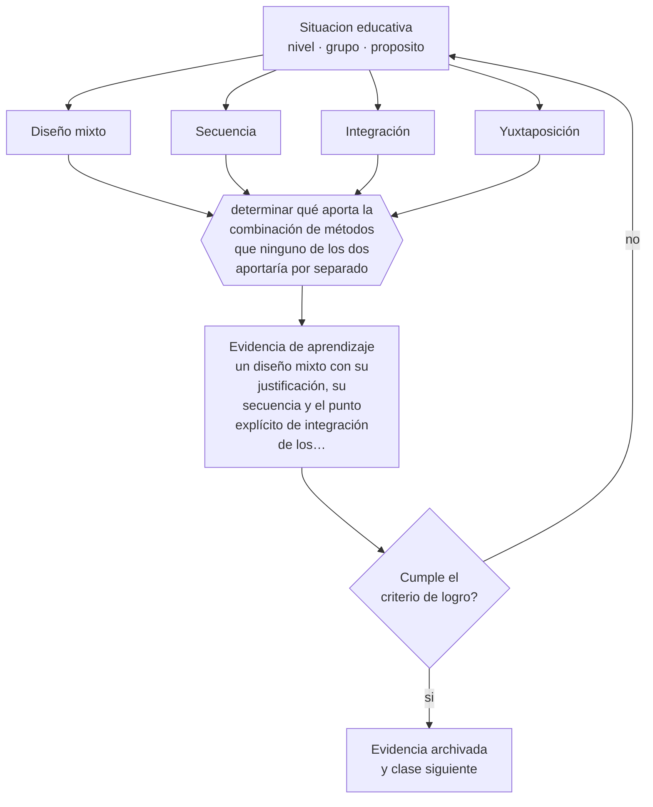

# Clase 199 — Métodos mixtos

> **Parte 16 · Investigación educativa** — clase 7 de 12

**Estado de evidencia:** `CONSISTENTE` · **Etapa:** 🔴 Etapa E — Investigación avanzada y formación de formadores · **Población de referencia:** investigación aplicada, tesis de magíster e investigación institucional 
**Decisión que habilita:** determinar qué aporta la combinación de métodos que ninguno de los dos aportaría por separado 
**Evidencia de aprendizaje:** un diseño mixto con su justificación, su secuencia y el punto explícito de integración de los componentes

## 🎯 Propósito

Diseñar investigación con métodos mixtos cuando la pregunta lo justifica, con integración explícita entre componentes y no como yuxtaposición de dos estudios.

## 📚 Resultados de aprendizaje

Al finalizar esta clase podrás:

1. **Definir** con precisión los cuatro conceptos centrales de la clase y reconocerlos en una situación educativa real, no solo en su enunciado.
2. **Explicar** cuándo combinar métodos aporta y cuándo solo duplica el trabajo.
3. **Decidir** —qué aporta la combinación de métodos que ninguno de los dos aportaría por separado— y sostener la decisión con un fundamento escrito.
4. **Producir** la evidencia de la clase —un diseño mixto con su justificación, su secuencia y el punto explícito de integración de los componentes— y contrastarla contra el criterio de logro.
5. **Distinguir** lo que la evidencia sostiene de lo que es práctica instalada, preferencia personal o costumbre de la institución.

## 🧩 Conceptos centrales

| Concepto | Comprensión verificable |
|---|---|
| **Diseño mixto** | investigación que combina componentes cuantitativos y cualitativos con integración explícita |
| **Secuencia** | orden de los componentes: exploratorio, explicativo o convergente |
| **Integración** | punto y forma en que los resultados de ambos componentes se combinan para producir una conclusión |
| **Yuxtaposición** | error de presentar dos estudios paralelos sin integración real |

## 🗺️ Flujo de razonamiento

## 📖 Desarrollo

### 1. El fondo del asunto

Los métodos mixtos aportan cuando la pregunta tiene dos partes que ningún método responde solo: cuánto ocurre y por qué ocurre, o qué efecto tiene y cómo lo experimentan quienes lo reciben. El error más frecuente es la yuxtaposición: dos estudios pegados sin integración, donde el componente cualitativo funciona como ilustración anecdótica del cuantitativo.

### 2. Cómo se traduce en decisiones de enseñanza

El diseño debe declarar el punto de integración desde el inicio: si el componente cualitativo informa el instrumento cuantitativo, si explica sus resultados, o si ambos se comparan para buscar convergencias y discrepancias. Las discrepancias entre componentes son el hallazgo más valioso de un diseño mixto y el que más se omite en los informes.

### 3. Qué sostiene la evidencia y qué no

Los diseños mixtos exigen competencia en ambas tradiciones y consumen más recursos. Si la pregunta se responde bien con un solo método, mezclar agrega costo sin aportar. Y la integración auténtica es difícil: la mayoría de las tesis que se declaran mixtas presentan dos capítulos separados.

> **Cómo leer el estado de evidencia `CONSISTENTE`.** La evidencia es amplia y coherente, pero proviene sobre todo de estudios correlacionales, de síntesis con heterogeneidad alta o de contextos distintos al tuyo. Sirve para orientar la decisión y exige que compruebes el efecto en tu propio grupo.

## 🧪 Taller guiado

Aplica la clase a **uno** de los contextos siguientes y repite después el ejercicio en un
contexto de exigencia distinta. Cambiar de contexto es parte del aprendizaje: lo que funciona
con un grupo no se traslada intacto a otro.

| Contexto | Rasgo que cambia la decisión |
|---|---|
| Investigación en la propia aula | el rol dual docente-investigador exige resguardos |
| Investigación institucional | hay intereses organizacionales sobre el resultado |
| Estudio con menores de edad | consentimiento, asentimiento y resguardo de datos |
| Estudio con datos administrativos | acceso, anonimización y sesgo de registro |
| Evaluación de una intervención | el diseño decide si podrás atribuir el efecto |
| Investigación cualitativa de campo | acceso, reflexividad y criterios de rigor |

**Secuencia de trabajo:**

1. Delimita el contexto: nivel, edad, tamaño del grupo, asignatura o experiencia y tiempo real disponible.
2. Declara qué saben ya los estudiantes y **cómo lo comprobaste**, no cómo lo supones.
3. Formula la decisión pedagógica que esta clase habilita y escribe su fundamento.
4. Anticipa qué observarías si la decisión funciona y qué observarías si no funciona.
5. Diseña de antemano la alternativa que aplicarás si la primera estrategia falla.
6. Ejecuta o simula, y registra lo observado con fecha, contexto y evidencia concreta.
7. Produce la evidencia de aprendizaje de la clase.
8. Contrástala contra el criterio de logro, corrige y recién entonces avanza.

### 📦 Evidencia de aprendizaje

Un diseño mixto con su justificación, su secuencia y el punto explícito de integración de los componentes.

Debe incluir contexto, decisión, fundamento, fuentes consultadas con su fecha, indicador de
logro observable, riesgos previstos y qué harías distinto en la siguiente iteración.

## 🏆 Reto verificable

Diseña un estudio mixto declarando el punto de integración. Simula una discrepancia entre componentes y escribe cómo la interpretarías.

## ✅ Criterio de logro

- [ ] el diseño declara secuencia y punto de integración desde el inicio;
- [ ] el informe reporta las discrepancias entre componentes y no solo las convergencias;
- [ ] cada afirmación sobre «lo que funciona» está atribuida a una fuente identificable, con autor y fecha;
- [ ] la decisión es ejecutable con el tiempo, el espacio, el número de estudiantes y los recursos que realmente tienes;
- [ ] la evidencia queda archivada de forma reproducible: otra persona podría revisarla sin que tú se la expliques.

## ⚠️ Errores frecuentes

**Propios de esta clase:**

- Presentar dos estudios paralelos sin punto de integración declarado.
- Usar el componente cualitativo solo como ilustración anecdótica del cuantitativo.

**Característicos de la parte 16:**

- Elegir el método antes de tener la pregunta delimitada.
- Atribuir causalidad a diseños que no la permiten.

## ♿ Diversidad, accesibilidad y ética

La combinación permite contrastar lo que los indicadores muestran con lo que las personas afectadas describen, que es especialmente valioso cuando los datos administrativos invisibilizan a determinados grupos.

Antes de aplicar cualquier decisión de esta clase con estudiantes reales, revisa el
[protocolo de práctica responsable](../../../docs/ETICA_Y_PRACTICA_RESPONSABLE.md):
consentimiento, resguardo de datos personales, proporcionalidad de la intervención y derecho
de cada estudiante a no ser objeto de un ensayo que no le reporta beneficio.

## ❓ Preguntas de comprobación

1. ¿Qué responde la combinación que ningún método responde solo?
2. ¿En qué momento exacto se integran tus componentes?
3. ¿Qué harás si ambos componentes se contradicen?

## 📕 Lecturas base

**Creswell, J. & Plano Clark, V. (2018). *Designing and Conducting Mixed Methods Research*.**  
*Qué aporta a esta clase:* tipología de diseños mixtos con sus puntos de integración.

**Bryman, A. (2007). *Barriers to Integrating Quantitative and Qualitative Research*.**  
*Qué aporta a esta clase:* documenta por qué la integración falla en la práctica y cómo evitarlo.

Catálogo completo: [bibliografía del programa](../../../docs/BIBLIOGRAFIA.md) ·
[glosario](../../../docs/GLOSARIO.md) ·
[fuentes oficiales y cómo leerlas](../../../docs/FUENTES.md).

## 🔗 Conexión con el resto del programa

Integra las clases 197 y 198 y prepara el diseño del proyecto de la clase 204.

> [!IMPORTANT]
> Material de formación profesional. No reemplaza un título de pedagogía, una habilitación
> legal para ejercer, ni el juicio de un equipo educativo que conoce a sus estudiantes.

---

| Anterior | Índice | Siguiente |
|---|---|---|
| [← 198 · Diseños cualitativos](../class-06-disenos-cualitativos/README.md) | [Parte 16](../README.md) · [Programa](../../../README.md) | [200 · Muestreo →](../class-08-muestreo/README.md) |
