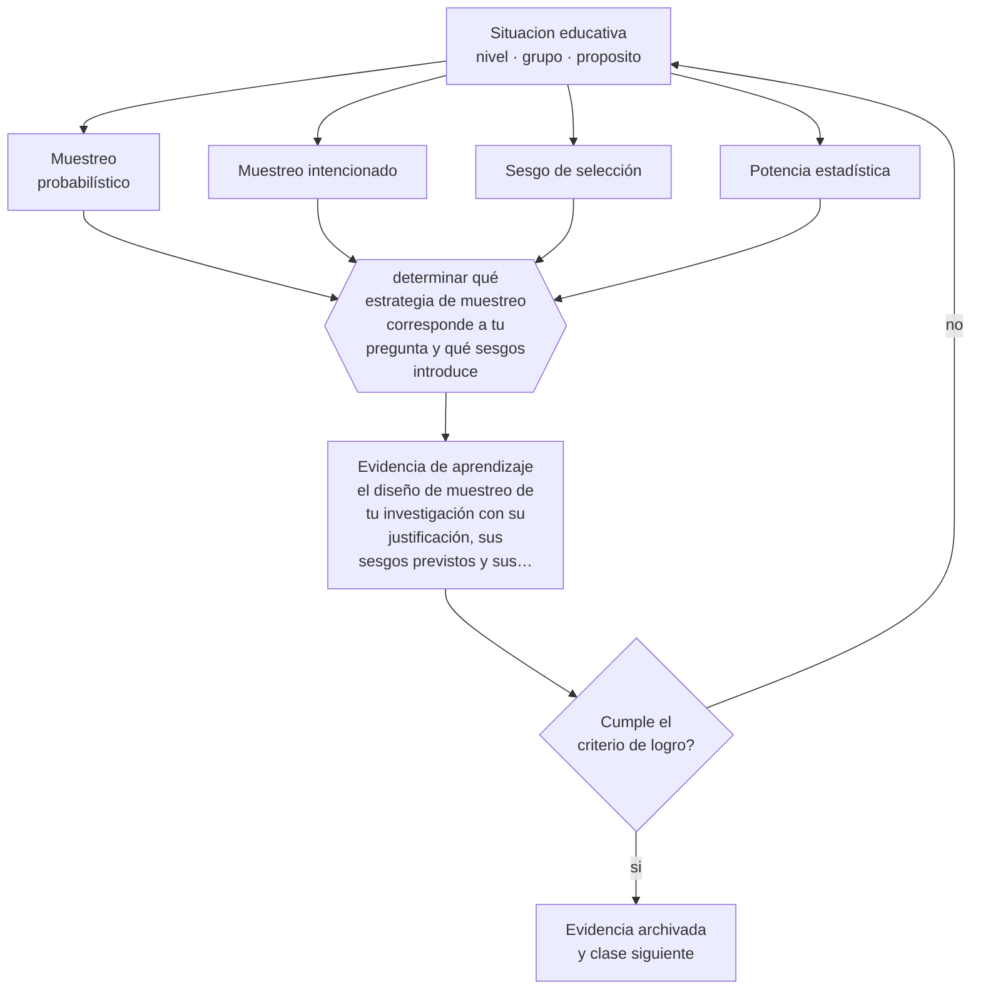

# Clase 200 — Muestreo

> **Parte 16 · Investigación educativa** — clase 8 de 12

**Estado de evidencia:** `ROBUSTA` · **Etapa:** 🔴 Etapa E — Investigación avanzada y formación de formadores · **Población de referencia:** investigación aplicada, tesis de magíster e investigación institucional 
**Decisión que habilita:** determinar qué estrategia de muestreo corresponde a tu pregunta y qué sesgos introduce 
**Evidencia de aprendizaje:** el diseño de muestreo de tu investigación con su justificación, sus sesgos previstos y sus límites de inferencia

## 🎯 Propósito

Diseñar el muestreo según la pregunta y el método: probabilístico cuando se busca estimar en una población, intencionado cuando se busca comprender un fenómeno.

## 📚 Resultados de aprendizaje

Al finalizar esta clase podrás:

1. **Definir** con precisión los cuatro conceptos centrales de la clase y reconocerlos en una situación educativa real, no solo en su enunciado.
2. **Explicar** por qué el tamaño de la muestra importa menos que cómo se seleccionó.
3. **Decidir** —qué estrategia de muestreo corresponde a tu pregunta y qué sesgos introduce— y sostener la decisión con un fundamento escrito.
4. **Producir** la evidencia de la clase —el diseño de muestreo de tu investigación con su justificación, sus sesgos previstos y sus límites de inferencia— y contrastarla contra el criterio de logro.
5. **Distinguir** lo que la evidencia sostiene de lo que es práctica instalada, preferencia personal o costumbre de la institución.

## 🧩 Conceptos centrales

| Concepto | Comprensión verificable |
|---|---|
| **Muestreo probabilístico** | selección con probabilidad conocida que permite inferencia estadística a la población |
| **Muestreo intencionado** | selección deliberada de casos por su relevancia para la pregunta |
| **Sesgo de selección** | distorsión producida cuando quienes participan difieren sistemáticamente de quienes no |
| **Potencia estadística** | probabilidad de detectar un efecto existente; depende del tamaño de muestra y del efecto esperado |

## 🗺️ Flujo de razonamiento

## 📖 Desarrollo

### 1. El fondo del asunto

Una muestra grande mal seleccionada produce estimaciones precisas de algo equivocado. El sesgo de selección es el problema central: quienes aceptan participar, quienes responden la encuesta o quienes permanecen hasta el final del estudio difieren de quienes no lo hacen, y esa diferencia suele estar relacionada con lo que se investiga. Declararlo y estimar su dirección es parte del análisis, no una limitación menor.

### 2. Cómo se traduce en decisiones de enseñanza

En investigación educativa la aleatorización pura es rara: se trabaja con cursos completos, con establecimientos que aceptan participar y con estudiantes cuyos apoderados autorizan. Documentar quién quedó fuera y por qué es lo que permite interpretar correctamente los resultados. Y en estudios cuantitativos, el cálculo de potencia debe hacerse antes: un estudio sin potencia suficiente no puede concluir nada, ni siquiera la ausencia de efecto.

### 3. Qué sostiene la evidencia y qué no

El cálculo de potencia exige estimar el tamaño de efecto esperado, y esas estimaciones suelen provenir de literatura sesgada hacia efectos grandes. Además, en muchos contextos educativos el tamaño posible está fijado por la realidad: entonces corresponde declarar qué se puede y qué no se puede concluir con ese tamaño.

> **Cómo leer el estado de evidencia `ROBUSTA`.** Hay evidencia convergente de varios equipos, países y diseños de investigación, incluidos estudios experimentales o cuasiexperimentales, y el efecto se sostiene al replicarlo. Puedes apoyar una decisión profesional en ella, sin olvidar que ningún efecto promedio describe a un estudiante concreto.

## 🧪 Taller guiado

Aplica la clase a **uno** de los contextos siguientes y repite después el ejercicio en un
contexto de exigencia distinta. Cambiar de contexto es parte del aprendizaje: lo que funciona
con un grupo no se traslada intacto a otro.

| Contexto | Rasgo que cambia la decisión |
|---|---|
| Investigación en la propia aula | el rol dual docente-investigador exige resguardos |
| Investigación institucional | hay intereses organizacionales sobre el resultado |
| Estudio con menores de edad | consentimiento, asentimiento y resguardo de datos |
| Estudio con datos administrativos | acceso, anonimización y sesgo de registro |
| Evaluación de una intervención | el diseño decide si podrás atribuir el efecto |
| Investigación cualitativa de campo | acceso, reflexividad y criterios de rigor |

**Secuencia de trabajo:**

1. Delimita el contexto: nivel, edad, tamaño del grupo, asignatura o experiencia y tiempo real disponible.
2. Declara qué saben ya los estudiantes y **cómo lo comprobaste**, no cómo lo supones.
3. Formula la decisión pedagógica que esta clase habilita y escribe su fundamento.
4. Anticipa qué observarías si la decisión funciona y qué observarías si no funciona.
5. Diseña de antemano la alternativa que aplicarás si la primera estrategia falla.
6. Ejecuta o simula, y registra lo observado con fecha, contexto y evidencia concreta.
7. Produce la evidencia de aprendizaje de la clase.
8. Contrástala contra el criterio de logro, corrige y recién entonces avanza.

### 📦 Evidencia de aprendizaje

El diseño de muestreo de tu investigación con su justificación, sus sesgos previstos y sus límites de inferencia.

Debe incluir contexto, decisión, fundamento, fuentes consultadas con su fecha, indicador de
logro observable, riesgos previstos y qué harías distinto en la siguiente iteración.

## 🏆 Reto verificable

Documenta el muestreo real de tu estudio, incluidos los que no participaron. Estima en qué dirección podría sesgar tus resultados.

## ✅ Criterio de logro

- [ ] la estrategia de muestreo corresponde al tipo de inferencia que se pretende;
- [ ] se documenta quién quedó fuera y qué sesgo puede introducir;
- [ ] cada afirmación sobre «lo que funciona» está atribuida a una fuente identificable, con autor y fecha;
- [ ] la decisión es ejecutable con el tiempo, el espacio, el número de estudiantes y los recursos que realmente tienes;
- [ ] la evidencia queda archivada de forma reproducible: otra persona podría revisarla sin que tú se la expliques.

## ⚠️ Errores frecuentes

**Propios de esta clase:**

- Interpretar un resultado no significativo como ausencia de efecto en un estudio sin potencia suficiente.
- Omitir la descripción de quiénes quedaron fuera de la muestra y por qué.

**Característicos de la parte 16:**

- Elegir el método antes de tener la pregunta delimitada.
- Atribuir causalidad a diseños que no la permiten.

## ♿ Diversidad, accesibilidad y ética

Los estudios que excluyen sistemáticamente a estudiantes con necesidades de apoyo, con inasistencia alta o de zonas rurales producen conocimiento que después se les aplica sin haberlos incluido. Declarar la exclusión es el mínimo; corregirla es el objetivo.

Antes de aplicar cualquier decisión de esta clase con estudiantes reales, revisa el
[protocolo de práctica responsable](../../../docs/ETICA_Y_PRACTICA_RESPONSABLE.md):
consentimiento, resguardo de datos personales, proporcionalidad de la intervención y derecho
de cada estudiante a no ser objeto de un ensayo que no le reporta beneficio.

## ❓ Preguntas de comprobación

1. ¿En qué se diferencian los que participaron de los que no?
2. ¿Qué efecto mínimo podrías detectar con tu muestra?
3. ¿A qué población puedes inferir realmente?

## 📕 Lecturas base

**Shadish, W., Cook, T. & Campbell, D. (2002). *Experimental and Quasi-Experimental Designs*.**  
*Qué aporta a esta clase:* trata validez externa y problemas de selección con precisión.

**Cohen, J. (1988). *Statistical Power Analysis for the Behavioral Sciences*.**  
*Qué aporta a esta clase:* base del análisis de potencia y de la interpretación de tamaños de efecto.

Catálogo completo: [bibliografía del programa](../../../docs/BIBLIOGRAFIA.md) ·
[glosario](../../../docs/GLOSARIO.md) ·
[fuentes oficiales y cómo leerlas](../../../docs/FUENTES.md).

## 🔗 Conexión con el resto del programa

Condiciona la interpretación de las clases 197 y 201.

> [!IMPORTANT]
> Material de formación profesional. No reemplaza un título de pedagogía, una habilitación
> legal para ejercer, ni el juicio de un equipo educativo que conoce a sus estudiantes.

---

| Anterior | Índice | Siguiente |
|---|---|---|
| [← 199 · Métodos mixtos](../class-07-metodos-mixtos/README.md) | [Parte 16](../README.md) · [Programa](../../../README.md) | [201 · Estadística descriptiva e inferencial →](../class-09-estadistica-descriptiva-e-inferencial/README.md) |
