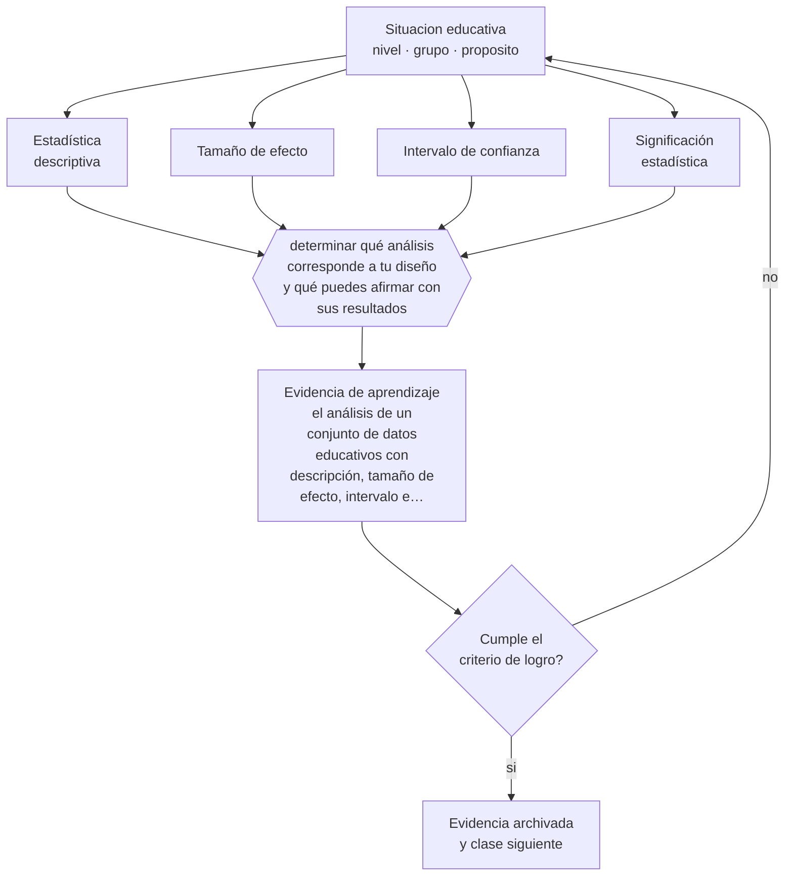

# Clase 201 — Estadística descriptiva e inferencial

> **Parte 16 · Investigación educativa** — clase 9 de 12

**Estado de evidencia:** `ROBUSTA` · **Etapa:** 🔴 Etapa E — Investigación avanzada y formación de formadores · **Población de referencia:** investigación aplicada, tesis de magíster e investigación institucional 
**Decisión que habilita:** determinar qué análisis corresponde a tu diseño y qué puedes afirmar con sus resultados 
**Evidencia de aprendizaje:** el análisis de un conjunto de datos educativos con descripción, tamaño de efecto, intervalo e interpretación

## 🎯 Propósito

Analizar y reportar datos cuantitativos con corrección: descripción antes que inferencia, tamaños de efecto con intervalos, y interpretación proporcional a la evidencia.

## 📚 Resultados de aprendizaje

Al finalizar esta clase podrás:

1. **Definir** con precisión los cuatro conceptos centrales de la clase y reconocerlos en una situación educativa real, no solo en su enunciado.
2. **Explicar** cómo reportar resultados cuantitativos sin decir más de lo que los datos sostienen.
3. **Decidir** —qué análisis corresponde a tu diseño y qué puedes afirmar con sus resultados— y sostener la decisión con un fundamento escrito.
4. **Producir** la evidencia de la clase —el análisis de un conjunto de datos educativos con descripción, tamaño de efecto, intervalo e interpretación— y contrastarla contra el criterio de logro.
5. **Distinguir** lo que la evidencia sostiene de lo que es práctica instalada, preferencia personal o costumbre de la institución.

## 🧩 Conceptos centrales

| Concepto | Comprensión verificable |
|---|---|
| **Estadística descriptiva** | resumen de los datos observados: distribución, tendencia central, dispersión |
| **Tamaño de efecto** | magnitud de la diferencia o de la relación, independiente del tamaño de muestra |
| **Intervalo de confianza** | rango de valores compatibles con los datos; comunica incertidumbre mejor que un valor único |
| **Significación estadística** | probabilidad de observar estos datos si no hubiera efecto; no indica importancia ni magnitud |

## 🗺️ Flujo de razonamiento

## 📖 Desarrollo

### 1. El fondo del asunto

El error de interpretación más extendido en investigación educativa es tratar la significación estadística como sinónimo de importancia. Un efecto trivial puede ser significativo con una muestra grande, y un efecto relevante puede no serlo con una muestra pequeña. Reportar tamaños de efecto con intervalos de confianza y describir la distribución antes de inferir corrige la mayor parte de esos errores.

### 2. Cómo se traduce en decisiones de enseñanza

El orden de trabajo importa: mirar los datos primero —distribuciones, valores extremos, datos faltantes—, describir, y solo después inferir. Los datos faltantes merecen atención explícita: en educación rara vez faltan al azar, y quienes no responden suelen ser precisamente los casos de interés.

### 3. Qué sostiene la evidencia y qué no

El análisis correcto no rescata un diseño débil: ninguna técnica estadística convierte una comparación sesgada en evidencia causal. Y la práctica de probar múltiples análisis hasta encontrar uno significativo invalida la interpretación, aunque cada análisis por separado sea correcto.

> **Cómo leer el estado de evidencia `ROBUSTA`.** Hay evidencia convergente de varios equipos, países y diseños de investigación, incluidos estudios experimentales o cuasiexperimentales, y el efecto se sostiene al replicarlo. Puedes apoyar una decisión profesional en ella, sin olvidar que ningún efecto promedio describe a un estudiante concreto.

## 🧪 Taller guiado

Aplica la clase a **uno** de los contextos siguientes y repite después el ejercicio en un
contexto de exigencia distinta. Cambiar de contexto es parte del aprendizaje: lo que funciona
con un grupo no se traslada intacto a otro.

| Contexto | Rasgo que cambia la decisión |
|---|---|
| Investigación en la propia aula | el rol dual docente-investigador exige resguardos |
| Investigación institucional | hay intereses organizacionales sobre el resultado |
| Estudio con menores de edad | consentimiento, asentimiento y resguardo de datos |
| Estudio con datos administrativos | acceso, anonimización y sesgo de registro |
| Evaluación de una intervención | el diseño decide si podrás atribuir el efecto |
| Investigación cualitativa de campo | acceso, reflexividad y criterios de rigor |

**Secuencia de trabajo:**

1. Delimita el contexto: nivel, edad, tamaño del grupo, asignatura o experiencia y tiempo real disponible.
2. Declara qué saben ya los estudiantes y **cómo lo comprobaste**, no cómo lo supones.
3. Formula la decisión pedagógica que esta clase habilita y escribe su fundamento.
4. Anticipa qué observarías si la decisión funciona y qué observarías si no funciona.
5. Diseña de antemano la alternativa que aplicarás si la primera estrategia falla.
6. Ejecuta o simula, y registra lo observado con fecha, contexto y evidencia concreta.
7. Produce la evidencia de aprendizaje de la clase.
8. Contrástala contra el criterio de logro, corrige y recién entonces avanza.

### 📦 Evidencia de aprendizaje

El análisis de un conjunto de datos educativos con descripción, tamaño de efecto, intervalo e interpretación.

Debe incluir contexto, decisión, fundamento, fuentes consultadas con su fecha, indicador de
logro observable, riesgos previstos y qué harías distinto en la siguiente iteración.

## 🏆 Reto verificable

Analiza un conjunto de datos reportando descripción, tamaño de efecto e intervalo. Escribe la conclusión que el resultado sostiene, y la que no.

## ✅ Criterio de logro

- [ ] el reporte incluye descripción, tamaño de efecto e intervalo de confianza;
- [ ] el tratamiento de los datos faltantes está declarado y justificado;
- [ ] cada afirmación sobre «lo que funciona» está atribuida a una fuente identificable, con autor y fecha;
- [ ] la decisión es ejecutable con el tiempo, el espacio, el número de estudiantes y los recursos que realmente tienes;
- [ ] la evidencia queda archivada de forma reproducible: otra persona podría revisarla sin que tú se la expliques.

## ⚠️ Errores frecuentes

**Propios de esta clase:**

- Reportar significación estadística sin tamaño de efecto ni intervalo de confianza.
- Probar múltiples análisis y reportar solo el que resultó significativo.

**Característicos de la parte 16:**

- Elegir el método antes de tener la pregunta delimitada.
- Atribuir causalidad a diseños que no la permiten.

## ♿ Diversidad, accesibilidad y ética

Los análisis desagregados por subgrupo revelan efectos heterogéneos que el promedio oculta. Reportarlos, con la cautela que exige su menor potencia, es parte del compromiso con la equidad en investigación.

Antes de aplicar cualquier decisión de esta clase con estudiantes reales, revisa el
[protocolo de práctica responsable](../../../docs/ETICA_Y_PRACTICA_RESPONSABLE.md):
consentimiento, resguardo de datos personales, proporcionalidad de la intervención y derecho
de cada estudiante a no ser objeto de un ensayo que no le reporta beneficio.

## ❓ Preguntas de comprobación

1. ¿Cuál es la magnitud del efecto y qué significa en la práctica?
2. ¿Qué pasó con los casos que no tienen datos?
3. ¿Cuántos análisis probaste antes de reportar este?

## 📕 Lecturas base

**Cumming, G. (2012). *Understanding the New Statistics*.**  
*Qué aporta a esta clase:* enfoque basado en estimación y en intervalos, más informativo que la prueba de hipótesis.

**Wasserstein, R. & Lazar, N. (2016). *The ASA Statement on p-Values*.**  
*Qué aporta a esta clase:* declaración oficial sobre qué indica y qué no indica un valor p.

Catálogo completo: [bibliografía del programa](../../../docs/BIBLIOGRAFIA.md) ·
[glosario](../../../docs/GLOSARIO.md) ·
[fuentes oficiales y cómo leerlas](../../../docs/FUENTES.md).

## 🔗 Conexión con el resto del programa

Se apoya en las clases 197 y 200 y aporta la lectura crítica que exige la clase 143.

> [!IMPORTANT]
> Material de formación profesional. No reemplaza un título de pedagogía, una habilitación
> legal para ejercer, ni el juicio de un equipo educativo que conoce a sus estudiantes.

---

| Anterior | Índice | Siguiente |
|---|---|---|
| [← 200 · Muestreo](../class-08-muestreo/README.md) | [Parte 16](../README.md) · [Programa](../../../README.md) | [202 · Análisis temático →](../class-10-analisis-tematico/README.md) |
