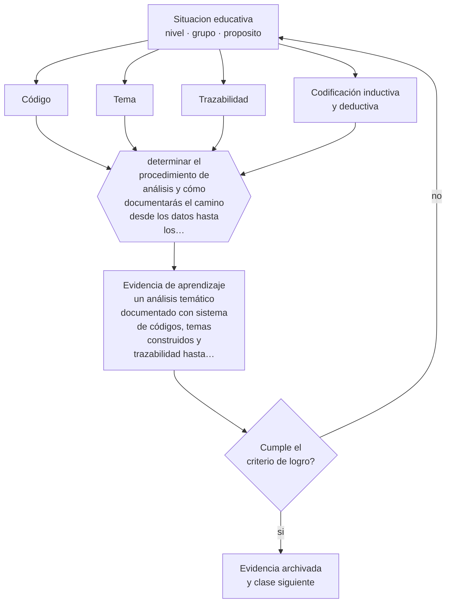

# Clase 202 — Análisis temático

> **Parte 16 · Investigación educativa** — clase 10 de 12

**Estado de evidencia:** `CONSISTENTE` · **Etapa:** 🔴 Etapa E — Investigación avanzada y formación de formadores · **Población de referencia:** investigación aplicada, tesis de magíster e investigación institucional 
**Decisión que habilita:** determinar el procedimiento de análisis y cómo documentarás el camino desde los datos hasta los temas 
**Evidencia de aprendizaje:** un análisis temático documentado con sistema de códigos, temas construidos y trazabilidad hasta los datos

## 🎯 Propósito

Realizar análisis temático con procedimiento explícito: familiarización, codificación, construcción de temas, revisión y definición, con trazabilidad completa.

## 📚 Resultados de aprendizaje

Al finalizar esta clase podrás:

1. **Definir** con precisión los cuatro conceptos centrales de la clase y reconocerlos en una situación educativa real, no solo en su enunciado.
2. **Explicar** cómo se analiza material cualitativo de modo que otro pueda seguir el camino hasta las conclusiones.
3. **Decidir** —el procedimiento de análisis y cómo documentarás el camino desde los datos hasta los temas— y sostener la decisión con un fundamento escrito.
4. **Producir** la evidencia de la clase —un análisis temático documentado con sistema de códigos, temas construidos y trazabilidad hasta los datos— y contrastarla contra el criterio de logro.
5. **Distinguir** lo que la evidencia sostiene de lo que es práctica instalada, preferencia personal o costumbre de la institución.

## 🧩 Conceptos centrales

| Concepto | Comprensión verificable |
|---|---|
| **Código** | etiqueta que identifica un segmento de datos con significado relevante para la pregunta |
| **Tema** | patrón de significado construido a partir de códigos, que responde a la pregunta de investigación |
| **Trazabilidad** | posibilidad de recorrer el camino desde una afirmación hasta los datos que la sostienen |
| **Codificación inductiva y deductiva** | construcción de códigos desde los datos o desde un marco previo |

## 🗺️ Flujo de razonamiento

## 📖 Desarrollo

### 1. El fondo del asunto

El análisis temático es el procedimiento cualitativo más usado y peor aplicado: con frecuencia se declara sin haberlo ejecutado, presentando citas escogidas como si fueran hallazgos. El procedimiento real tiene fases —familiarización, codificación sistemática de todo el material, construcción de temas, revisión contra los datos y definición— y produce un sistema de códigos documentado que permite auditar el camino.

### 2. Cómo se traduce en decisiones de enseñanza

La documentación es el control de calidad: un libro de códigos con definiciones, ejemplos y decisiones tomadas durante el proceso. Y la revisión contra los datos es la fase que más se omite: cada tema debe volver a contrastarse con el material completo para verificar que lo representa y no solo que resulta atractivo.

### 3. Qué sostiene la evidencia y qué no

El análisis temático es flexible y esa flexibilidad exige declarar decisiones: si es inductivo o deductivo, si busca significados latentes o manifiestos, y desde qué posición epistemológica se interpreta. Sin esas declaraciones, el método se vuelve una etiqueta que no informa nada sobre lo que efectivamente se hizo.

> **Cómo leer el estado de evidencia `CONSISTENTE`.** La evidencia es amplia y coherente, pero proviene sobre todo de estudios correlacionales, de síntesis con heterogeneidad alta o de contextos distintos al tuyo. Sirve para orientar la decisión y exige que compruebes el efecto en tu propio grupo.

## 🧪 Taller guiado

Aplica la clase a **uno** de los contextos siguientes y repite después el ejercicio en un
contexto de exigencia distinta. Cambiar de contexto es parte del aprendizaje: lo que funciona
con un grupo no se traslada intacto a otro.

| Contexto | Rasgo que cambia la decisión |
|---|---|
| Investigación en la propia aula | el rol dual docente-investigador exige resguardos |
| Investigación institucional | hay intereses organizacionales sobre el resultado |
| Estudio con menores de edad | consentimiento, asentimiento y resguardo de datos |
| Estudio con datos administrativos | acceso, anonimización y sesgo de registro |
| Evaluación de una intervención | el diseño decide si podrás atribuir el efecto |
| Investigación cualitativa de campo | acceso, reflexividad y criterios de rigor |

**Secuencia de trabajo:**

1. Delimita el contexto: nivel, edad, tamaño del grupo, asignatura o experiencia y tiempo real disponible.
2. Declara qué saben ya los estudiantes y **cómo lo comprobaste**, no cómo lo supones.
3. Formula la decisión pedagógica que esta clase habilita y escribe su fundamento.
4. Anticipa qué observarías si la decisión funciona y qué observarías si no funciona.
5. Diseña de antemano la alternativa que aplicarás si la primera estrategia falla.
6. Ejecuta o simula, y registra lo observado con fecha, contexto y evidencia concreta.
7. Produce la evidencia de aprendizaje de la clase.
8. Contrástala contra el criterio de logro, corrige y recién entonces avanza.

### 📦 Evidencia de aprendizaje

Un análisis temático documentado con sistema de códigos, temas construidos y trazabilidad hasta los datos.

Debe incluir contexto, decisión, fundamento, fuentes consultadas con su fecha, indicador de
logro observable, riesgos previstos y qué harías distinto en la siguiente iteración.

## 🏆 Reto verificable

Codifica un conjunto de datos con libro de códigos documentado. Pide a un colega que codifique una parte y compara las diferencias.

## ✅ Criterio de logro

- [ ] existe un libro de códigos con definiciones, ejemplos y decisiones documentadas;
- [ ] cada tema se contrastó contra el conjunto de los datos y no solo contra los casos que lo apoyan;
- [ ] cada afirmación sobre «lo que funciona» está atribuida a una fuente identificable, con autor y fecha;
- [ ] la decisión es ejecutable con el tiempo, el espacio, el número de estudiantes y los recursos que realmente tienes;
- [ ] la evidencia queda archivada de forma reproducible: otra persona podría revisarla sin que tú se la expliques.

## ⚠️ Errores frecuentes

**Propios de esta clase:**

- Presentar citas seleccionadas como resultados sin mostrar el sistema de códigos.
- Construir temas sin volver a contrastarlos contra el material completo.

**Característicos de la parte 16:**

- Elegir el método antes de tener la pregunta delimitada.
- Atribuir causalidad a diseños que no la permiten.

## ♿ Diversidad, accesibilidad y ética

El análisis debe cuidar que las voces de participantes menos elocuentes o menos numerosos no desaparezcan bajo los temas dominantes. Registrar los casos discrepantes protege esa diversidad y mejora el análisis.

Antes de aplicar cualquier decisión de esta clase con estudiantes reales, revisa el
[protocolo de práctica responsable](../../../docs/ETICA_Y_PRACTICA_RESPONSABLE.md):
consentimiento, resguardo de datos personales, proporcionalidad de la intervención y derecho
de cada estudiante a no ser objeto de un ensayo que no le reporta beneficio.

## ❓ Preguntas de comprobación

1. ¿Podría otra persona seguir el camino desde tus datos hasta tus temas?
2. ¿Qué segmento de datos no encaja en ninguno de tus temas?
3. ¿Es tu análisis inductivo o estabas buscando lo que tu marco predecía?

## 📕 Lecturas base

**Braun, V. & Clarke, V. (2006). *Using Thematic Analysis in Psychology*.**  
*Qué aporta a esta clase:* el procedimiento por fases más usado; léelo completo antes de declarar que lo aplicaste.

**Miles, M., Huberman, A. & Saldaña (2014). *Qualitative Data Analysis*.**  
*Qué aporta a esta clase:* repertorio de estrategias de codificación y de despliegue de datos.

Catálogo completo: [bibliografía del programa](../../../docs/BIBLIOGRAFIA.md) ·
[glosario](../../../docs/GLOSARIO.md) ·
[fuentes oficiales y cómo leerlas](../../../docs/FUENTES.md).

## 🔗 Conexión con el resto del programa

Es el método de análisis de la clase 198 y se integra en el proyecto de la clase 204.

> [!IMPORTANT]
> Material de formación profesional. No reemplaza un título de pedagogía, una habilitación
> legal para ejercer, ni el juicio de un equipo educativo que conoce a sus estudiantes.

---

| Anterior | Índice | Siguiente |
|---|---|---|
| [← 201 · Estadística descriptiva e inferencial](../class-09-estadistica-descriptiva-e-inferencial/README.md) | [Parte 16](../README.md) · [Programa](../../../README.md) | [203 · Ética y reproducibilidad →](../class-11-etica-y-reproducibilidad/README.md) |
