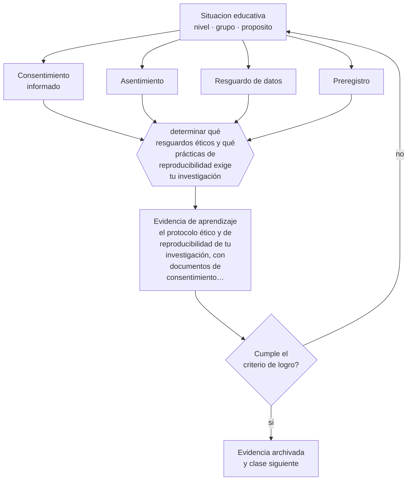

# Clase 203 — Ética y reproducibilidad

> **Parte 16 · Investigación educativa** — clase 11 de 12

**Estado de evidencia:** `MARCO-NORMATIVO` · **Etapa:** 🔴 Etapa E — Investigación avanzada y formación de formadores · **Población de referencia:** investigación aplicada, tesis de magíster e investigación institucional 
**Decisión que habilita:** determinar qué resguardos éticos y qué prácticas de reproducibilidad exige tu investigación 
**Evidencia de aprendizaje:** el protocolo ético y de reproducibilidad de tu investigación, con documentos de consentimiento y plan de datos

## 🎯 Propósito

Cumplir los estándares éticos de investigación con personas —consentimiento, asentimiento, resguardo, beneficio— e incorporar prácticas de ciencia abierta que hagan verificable el trabajo.

## 📚 Resultados de aprendizaje

Al finalizar esta clase podrás:

1. **Definir** con precisión los cuatro conceptos centrales de la clase y reconocerlos en una situación educativa real, no solo en su enunciado.
2. **Explicar** qué obligaciones éticas y qué prácticas de reproducibilidad exige investigar con estudiantes.
3. **Decidir** —qué resguardos éticos y qué prácticas de reproducibilidad exige tu investigación— y sostener la decisión con un fundamento escrito.
4. **Producir** la evidencia de la clase —el protocolo ético y de reproducibilidad de tu investigación, con documentos de consentimiento y plan de datos— y contrastarla contra el criterio de logro.
5. **Distinguir** lo que la evidencia sostiene de lo que es práctica instalada, preferencia personal o costumbre de la institución.

## 🧩 Conceptos centrales

| Concepto | Comprensión verificable |
|---|---|
| **Consentimiento informado** | autorización libre e informada de quien participa o de su representante legal |
| **Asentimiento** | acuerdo del menor de edad, además de la autorización de su adulto responsable |
| **Resguardo de datos** | medidas de anonimización, almacenamiento y acceso a la información recogida |
| **Preregistro** | publicación anticipada de hipótesis y plan de análisis para evitar la reinterpretación posterior |

## 🗺️ Flujo de razonamiento

## 📖 Desarrollo

### 1. El fondo del asunto

Investigar en educación implica trabajar con menores de edad, dentro de instituciones con relaciones de poder y con datos sensibles. Eso exige consentimiento del adulto responsable, asentimiento del propio estudiante, resguardo efectivo de los datos y una evaluación honesta del beneficio: nadie debería participar en un estudio que no le reporta ningún beneficio, ni directo ni al grupo al que pertenece.

### 2. Cómo se traduce en decisiones de enseñanza

El protocolo debe incluir documentos comprensibles —no formularios legales incomprensibles—, plan de anonimización, almacenamiento seguro, plazos de conservación y destrucción, y la aprobación del comité correspondiente cuando se requiere. Y las prácticas de reproducibilidad —preregistro, publicación de instrumentos, disponibilidad de datos anonimizados cuando es posible— fortalecen la credibilidad de un campo golpeado por problemas de replicación.

### 3. Qué sostiene la evidencia y qué no

El rol dual docente-investigador plantea un problema específico: el estudiante puede sentir que negarse afecta su relación o su calificación. Ese riesgo exige resguardos adicionales —consentimiento gestionado por un tercero, disociación entre participación y evaluación— que muchas investigaciones de aula omiten.

> **Cómo leer el estado de evidencia `MARCO-NORMATIVO`.** El contenido no se decide por evidencia empírica sino por norma, política pública o marco institucional vigente. Verifica siempre la versión vigente a la fecha en que vas a aplicarlo: la norma cambia y la clase no se actualiza sola.

## 🧪 Taller guiado

Aplica la clase a **uno** de los contextos siguientes y repite después el ejercicio en un
contexto de exigencia distinta. Cambiar de contexto es parte del aprendizaje: lo que funciona
con un grupo no se traslada intacto a otro.

| Contexto | Rasgo que cambia la decisión |
|---|---|
| Investigación en la propia aula | el rol dual docente-investigador exige resguardos |
| Investigación institucional | hay intereses organizacionales sobre el resultado |
| Estudio con menores de edad | consentimiento, asentimiento y resguardo de datos |
| Estudio con datos administrativos | acceso, anonimización y sesgo de registro |
| Evaluación de una intervención | el diseño decide si podrás atribuir el efecto |
| Investigación cualitativa de campo | acceso, reflexividad y criterios de rigor |

**Secuencia de trabajo:**

1. Delimita el contexto: nivel, edad, tamaño del grupo, asignatura o experiencia y tiempo real disponible.
2. Declara qué saben ya los estudiantes y **cómo lo comprobaste**, no cómo lo supones.
3. Formula la decisión pedagógica que esta clase habilita y escribe su fundamento.
4. Anticipa qué observarías si la decisión funciona y qué observarías si no funciona.
5. Diseña de antemano la alternativa que aplicarás si la primera estrategia falla.
6. Ejecuta o simula, y registra lo observado con fecha, contexto y evidencia concreta.
7. Produce la evidencia de aprendizaje de la clase.
8. Contrástala contra el criterio de logro, corrige y recién entonces avanza.

### 📦 Evidencia de aprendizaje

El protocolo ético y de reproducibilidad de tu investigación, con documentos de consentimiento y plan de datos.

Debe incluir contexto, decisión, fundamento, fuentes consultadas con su fecha, indicador de
logro observable, riesgos previstos y qué harías distinto en la siguiente iteración.

## 🏆 Reto verificable

Redacta tus documentos de consentimiento y pruébalos con dos personas del perfil real de tus participantes. Corrige todo lo que no entendieron.

## ✅ Criterio de logro

- [ ] los documentos de consentimiento y asentimiento son comprensibles para sus destinatarios;
- [ ] el plan de datos declara anonimización, almacenamiento, acceso y plazo de conservación;
- [ ] cada afirmación sobre «lo que funciona» está atribuida a una fuente identificable, con autor y fecha;
- [ ] la decisión es ejecutable con el tiempo, el espacio, el número de estudiantes y los recursos que realmente tienes;
- [ ] la evidencia queda archivada de forma reproducible: otra persona podría revisarla sin que tú se la expliques.

## ⚠️ Errores frecuentes

**Propios de esta clase:**

- Obtener consentimiento con documentos que las familias no pueden comprender.
- Investigar con los propios estudiantes sin resguardar el efecto del rol dual sobre su libertad de negarse.

**Característicos de la parte 16:**

- Elegir el método antes de tener la pregunta delimitada.
- Atribuir causalidad a diseños que no la permiten.

## ♿ Diversidad, accesibilidad y ética

El consentimiento debe ser accesible: traducido cuando corresponde, en lenguaje claro y en formatos alternativos. Un consentimiento que no se comprende no es consentimiento, y afecta primero a las familias con menos escolaridad.

Antes de aplicar cualquier decisión de esta clase con estudiantes reales, revisa el
[protocolo de práctica responsable](../../../docs/ETICA_Y_PRACTICA_RESPONSABLE.md):
consentimiento, resguardo de datos personales, proporcionalidad de la intervención y derecho
de cada estudiante a no ser objeto de un ensayo que no le reporta beneficio.

## ❓ Preguntas de comprobación

1. ¿Puede un estudiante negarse a participar sin ningún costo para él?
2. ¿Qué beneficio obtiene quien participa en tu estudio?
3. ¿Dónde estarán tus datos en tres años y quién podrá acceder?

## 📕 Lecturas base

**Informe Belmont y declaraciones internacionales sobre investigación con seres humanos.**  
*Qué aporta a esta clase:* principios de respeto, beneficencia y justicia que fundan los comités de ética.

**Open Science Collaboration (2015). *Estimating the Reproducibility of Psychological Science*.**  
*Qué aporta a esta clase:* muestra por qué las prácticas de reproducibilidad dejaron de ser opcionales.

Catálogo completo: [bibliografía del programa](../../../docs/BIBLIOGRAFIA.md) ·
[glosario](../../../docs/GLOSARIO.md) ·
[fuentes oficiales y cómo leerlas](../../../docs/FUENTES.md).

## 🔗 Conexión con el resto del programa

Rige toda la parte 16 y se apoya en la clase 004. Sus exigencias se profundizan en la parte 17.

> [!IMPORTANT]
> Material de formación profesional. No reemplaza un título de pedagogía, una habilitación
> legal para ejercer, ni el juicio de un equipo educativo que conoce a sus estudiantes.

---

| Anterior | Índice | Siguiente |
|---|---|---|
| [← 202 · Análisis temático](../class-10-analisis-tematico/README.md) | [Parte 16](../README.md) · [Programa](../../../README.md) | [204 · Proyecto integrador: investigación de nivel magíster →](../class-12-proyecto-integrador-investigacion-de-nivel-magister/README.md) |
