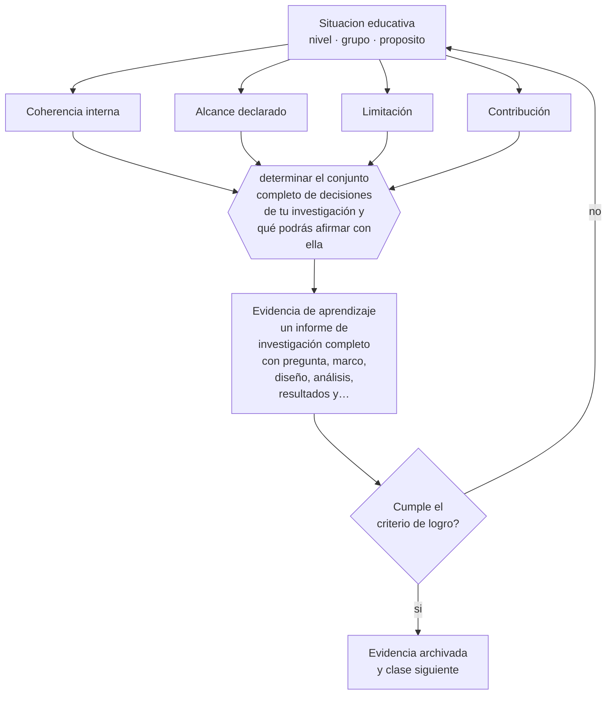

# Clase 204 — Proyecto integrador: investigación de nivel magíster

> **Parte 16 · Investigación educativa** — clase 12 de 12

**Estado de evidencia:** `CONSISTENTE` · **Etapa:** 🔴 Etapa E — Investigación avanzada y formación de formadores · **Población de referencia:** investigación aplicada, tesis de magíster e investigación institucional 
**Decisión que habilita:** determinar el conjunto completo de decisiones de tu investigación y qué podrás afirmar con ella 
**Evidencia de aprendizaje:** un informe de investigación completo con pregunta, marco, diseño, análisis, resultados y limitaciones

## 🎯 Propósito

Integrar la parte diseñando y ejecutando una investigación educativa completa de nivel magíster, con pregunta delimitada, diseño coherente, análisis trazable y límites declarados.

## 📚 Resultados de aprendizaje

Al finalizar esta clase podrás:

1. **Definir** con precisión los cuatro conceptos centrales de la clase y reconocerlos en una situación educativa real, no solo en su enunciado.
2. **Explicar** cómo se construye una investigación completa que se pueda defender ante una comisión exigente.
3. **Decidir** —el conjunto completo de decisiones de tu investigación y qué podrás afirmar con ella— y sostener la decisión con un fundamento escrito.
4. **Producir** la evidencia de la clase —un informe de investigación completo con pregunta, marco, diseño, análisis, resultados y limitaciones— y contrastarla contra el criterio de logro.
5. **Distinguir** lo que la evidencia sostiene de lo que es práctica instalada, preferencia personal o costumbre de la institución.

## 🧩 Conceptos centrales

| Concepto | Comprensión verificable |
|---|---|
| **Coherencia interna** | correspondencia entre pregunta, marco, diseño, análisis y conclusiones |
| **Alcance declarado** | afirmación explícita de a qué contexto y población se aplican los hallazgos |
| **Limitación** | restricción del estudio que condiciona sus conclusiones; se declara, no se disimula |
| **Contribución** | aporte concreto al conocimiento o a la práctica que el estudio produce |

## 🗺️ Flujo de razonamiento

## 📖 Desarrollo

### 1. El fondo del asunto

El proyecto integrador exige coherencia de principio a fin: una pregunta que el diseño pueda responder, un análisis que corresponda a los datos y conclusiones que no excedan la evidencia. La sección de limitaciones es la prueba de honestidad del trabajo: cuando se escribe como trámite —«el tamaño de muestra fue reducido»— no cumple su función; cuando declara qué afirmaciones quedan sin sostén, fortalece el trabajo.

### 2. Cómo se traduce en decisiones de enseñanza

El informe debe permitir que otra persona evalúe cada decisión: por qué esa pregunta, ese diseño, esa muestra, ese análisis. Y debe distinguir con claridad hallazgo de interpretación y de recomendación, que es la separación que más frecuentemente se pierde en las tesis educativas.

### 3. Qué sostiene la evidencia y qué no

Una investigación de magíster produce evidencia acotada: un contexto, un período, una muestra limitada. Su valor está en la calidad de sus decisiones y en la honestidad de sus límites, no en la magnitud de sus conclusiones. Presentarla como generalizable es el error que más credibilidad quita a un trabajo por lo demás sólido.

> **Cómo leer el estado de evidencia `CONSISTENTE`.** La evidencia es amplia y coherente, pero proviene sobre todo de estudios correlacionales, de síntesis con heterogeneidad alta o de contextos distintos al tuyo. Sirve para orientar la decisión y exige que compruebes el efecto en tu propio grupo.

## 🧪 Taller guiado

Aplica la clase a **uno** de los contextos siguientes y repite después el ejercicio en un
contexto de exigencia distinta. Cambiar de contexto es parte del aprendizaje: lo que funciona
con un grupo no se traslada intacto a otro.

| Contexto | Rasgo que cambia la decisión |
|---|---|
| Investigación en la propia aula | el rol dual docente-investigador exige resguardos |
| Investigación institucional | hay intereses organizacionales sobre el resultado |
| Estudio con menores de edad | consentimiento, asentimiento y resguardo de datos |
| Estudio con datos administrativos | acceso, anonimización y sesgo de registro |
| Evaluación de una intervención | el diseño decide si podrás atribuir el efecto |
| Investigación cualitativa de campo | acceso, reflexividad y criterios de rigor |

**Secuencia de trabajo:**

1. Delimita el contexto: nivel, edad, tamaño del grupo, asignatura o experiencia y tiempo real disponible.
2. Declara qué saben ya los estudiantes y **cómo lo comprobaste**, no cómo lo supones.
3. Formula la decisión pedagógica que esta clase habilita y escribe su fundamento.
4. Anticipa qué observarías si la decisión funciona y qué observarías si no funciona.
5. Diseña de antemano la alternativa que aplicarás si la primera estrategia falla.
6. Ejecuta o simula, y registra lo observado con fecha, contexto y evidencia concreta.
7. Produce la evidencia de aprendizaje de la clase.
8. Contrástala contra el criterio de logro, corrige y recién entonces avanza.

### 📦 Evidencia de aprendizaje

Un informe de investigación completo con pregunta, marco, diseño, análisis, resultados y limitaciones.

Debe incluir contexto, decisión, fundamento, fuentes consultadas con su fecha, indicador de
logro observable, riesgos previstos y qué harías distinto en la siguiente iteración.

## 🏆 Reto verificable

Somete tu informe a la revisión de un colega con instrucción explícita de buscar afirmaciones no sostenidas. Corrige cada una que encuentre.

## ✅ Criterio de logro

- [ ] la coherencia entre pregunta, diseño, análisis y conclusiones es verificable por un lector externo;
- [ ] las limitaciones declaran explícitamente qué no se puede afirmar con este estudio;
- [ ] cada afirmación sobre «lo que funciona» está atribuida a una fuente identificable, con autor y fecha;
- [ ] la decisión es ejecutable con el tiempo, el espacio, el número de estudiantes y los recursos que realmente tienes;
- [ ] la evidencia queda archivada de forma reproducible: otra persona podría revisarla sin que tú se la expliques.

## ⚠️ Errores frecuentes

**Propios de esta clase:**

- Extender las conclusiones más allá de lo que el diseño y la muestra permiten.
- Escribir las limitaciones como trámite sin declarar qué afirmaciones quedan sin sostén.

**Característicos de la parte 16:**

- Elegir el método antes de tener la pregunta delimitada.
- Atribuir causalidad a diseños que no la permiten.

## ♿ Diversidad, accesibilidad y ética

El informe debe declarar quiénes quedaron fuera del estudio y qué consecuencias tiene para la interpretación. Esa declaración es la que impide que los hallazgos se apliquen a poblaciones que nunca fueron incluidas.

Antes de aplicar cualquier decisión de esta clase con estudiantes reales, revisa el
[protocolo de práctica responsable](../../../docs/ETICA_Y_PRACTICA_RESPONSABLE.md):
consentimiento, resguardo de datos personales, proporcionalidad de la intervención y derecho
de cada estudiante a no ser objeto de un ensayo que no le reporta beneficio.

## ❓ Preguntas de comprobación

1. ¿Qué afirmación de tu conclusión no está sostenida por tus datos?
2. ¿A qué contexto se aplican realmente tus hallazgos?
3. ¿Qué haría distinto si empezaras de nuevo?

## 📕 Lecturas base

**Creswell, J. & Creswell, J. D. (2018). *Research Design*.**  
*Qué aporta a esta clase:* estructura de un informe completo y criterios de coherencia interna.

**Booth, W., Colomb, G. & Williams, J. *The Craft of Research*.**  
*Qué aporta a esta clase:* tratamiento de la argumentación y de la relación entre evidencia y afirmación.

Catálogo completo: [bibliografía del programa](../../../docs/BIBLIOGRAFIA.md) ·
[glosario](../../../docs/GLOSARIO.md) ·
[fuentes oficiales y cómo leerlas](../../../docs/FUENTES.md).

## 🔗 Conexión con el resto del programa

Cierra la parte 16 integrando sus once clases previas y es el antecedente directo de la parte 17.

> [!IMPORTANT]
> Material de formación profesional. No reemplaza un título de pedagogía, una habilitación
> legal para ejercer, ni el juicio de un equipo educativo que conoce a sus estudiantes.

---

| Anterior | Índice | Siguiente |
|---|---|---|
| [← 203 · Ética y reproducibilidad](../class-11-etica-y-reproducibilidad/README.md) | [Parte 16](../README.md) · [Programa](../../../README.md) | [Programa completo →](../../../README.md) |
