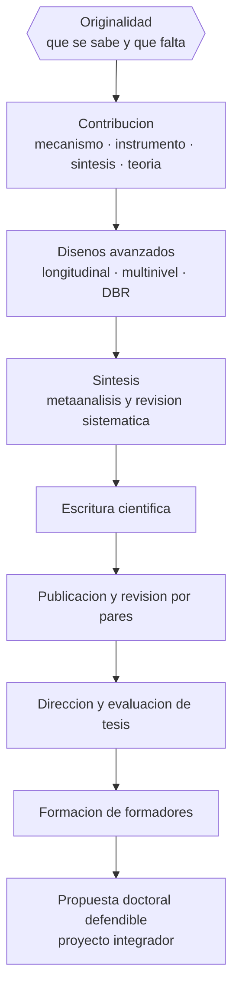

# Parte 17 — Investigación doctoral y formación de formadores

> *Aportar conocimiento nuevo y, después, enseñar a otros a producirlo*

🔴 **Etapa E — Investigación avanzada y formación de formadores** · salida de la etapa: producir conocimiento educativo defendible y formar a quienes enseñan

**Clases:** 12 (205–216) · **Población de referencia:** nivel doctoral, dirección de tesis y formación docente · **Conceptos con definición operacional:** 48 
**Contenido central:** Originalidad y contribución, diseños avanzados, modelos longitudinales y multinivel, metaanálisis y revisión sistemática, investigación basada en diseño, analítica avanzada, escritura científica, publicación, dirección de tesis y formación de docentes

## 🎯 De qué trata esta parte

El salto doctoral no es de cantidad sino de tipo: ya no basta con aplicar bien un método, hay que sostener una contribución original y defenderla ante quienes conocen el campo mejor que uno en aspectos puntuales. Esta parte trabaja explícitamente qué cuenta como contribución en educación —un mecanismo explicado, un instrumento validado, una síntesis que reorganiza la evidencia, una teoría refutada— y cómo se argumenta que la propia lo es.

Técnicamente, la parte incorpora los diseños que el nivel exige: datos anidados que obligan a modelos multinivel porque los estudiantes están dentro de cursos y los cursos dentro de escuelas; medidas repetidas que permiten estudiar trayectorias; síntesis cuantitativa de evidencia acumulada; e investigación basada en diseño, que produce a la vez una intervención y una teoría sobre por qué funciona. No se trata de dominar todo el aparato estadístico, sino de saber qué exige cada pregunta y cuándo hay que trabajar con un especialista.

El cierre del programa es la formación de formadores, y no por simetría: porque enseñar a enseñar es el único modo de que este trabajo escale. La evidencia sobre desarrollo profesional docente es clara en lo que no funciona —talleres aislados sin seguimiento— y razonablemente clara en lo que sí: foco en el contenido, duración sostenida, práctica con retroalimentación y acompañamiento en el puesto. El proyecto final del programa es exactamente eso: un dispositivo de formación docente defendible con evidencia.

## 📚 Resultados de la parte

Al terminar esta parte podrás:

1. **Delimitar y defender una contribución original al conocimiento educativo**.
2. **Escoger diseños avanzados coherentes con la estructura real de los datos**.
3. **Escribir y publicar según los estándares de la comunidad científica del campo**.
4. **Diseñar y evaluar un programa de formación de docentes basado en evidencia**.

## 🗺️ Mapa de la parte

## 🧠 Marco de referencia

- criterios de originalidad y contribución en investigación educativa
- modelos multinivel y longitudinales para datos anidados y repetidos
- síntesis de evidencia: revisión sistemática y metaanálisis
- desarrollo profesional docente efectivo y su evaluación

**Autoras y autores que conviene conocer:** Harris Cooper, Larry Hedges, Ann Brown y Allan Collins, Stephen Raudenbush y Anthony Bryk, Linda Darling-Hammond, Laura Desimone, Matthew Kraft, Robert Coe

## 📋 Las 12 clases

| # | Clase | Decisión que habilita | Evidencia |
|---:|---|---|---|
| 205 | [Problema doctoral y originalidad](class-01-problema-doctoral-y-originalidad/README.md) | determinar cuál es la tensión no resuelta que tu investigación abordará y por qué importa al campo | `PRACTICA-PROFESIONAL` |
| 206 | [Contribución al conocimiento](class-02-contribucion-al-conocimiento/README.md) | determinar qué tipo de contribución hará tu investigación y con qué criterio se juzgará | `PRACTICA-PROFESIONAL` |
| 207 | [Diseños avanzados de investigación](class-03-disenos-avanzados-de-investigacion/README.md) | determinar qué diseño avanzado corresponde a la estructura real de tu problema y de tus datos | `ROBUSTA` |
| 208 | [Modelos longitudinales y multinivel](class-04-modelos-longitudinales-y-multinivel/README.md) | determinar qué estructura tienen tus datos y qué modelo corresponde a esa estructura | `ROBUSTA` |
| 209 | [Meta-análisis y revisión sistemática](class-05-meta-analisis-y-revision-sistematica/README.md) | determinar si tu pregunta admite síntesis cuantitativa y qué estudios son legítimamente combinables | `ROBUSTA` |
| 210 | [Investigación basada en diseño](class-06-investigacion-basada-en-diseno/README.md) | determinar qué principios de diseño quieres poner a prueba y cómo documentarás su refinamiento | `EMERGENTE` |
| 211 | [Learning analytics avanzado](class-07-learning-analytics-avanzado/README.md) | determinar qué pregunta de investigación justifica el uso de datos digitales masivos y qué resguardos exige | `EMERGENTE` |
| 212 | [Escritura científica](class-08-escritura-cientifica/README.md) | determinar cuál es el argumento central de tu texto y qué sobra en él | `PRACTICA-PROFESIONAL` |
| 213 | [Publicación y peer review](class-09-publicacion-y-peer-review/README.md) | determinar a qué revista corresponde tu trabajo y cómo responderás a la revisión | `PRACTICA-PROFESIONAL` |
| 214 | [Dirección y evaluación de tesis](class-10-direccion-y-evaluacion-de-tesis/README.md) | determinar los criterios con que evaluarás una tesis y cómo los comunicarás antes de que se escriba | `PRACTICA-PROFESIONAL` |
| 215 | [Formación de docentes](class-11-formacion-de-docentes/README.md) | determinar qué diseño de formación docente producirá cambio en la práctica y no solo satisfacción | `ROBUSTA` |
| 216 | [Proyecto integrador: propuesta doctoral defendible](class-12-proyecto-integrador-propuesta-doctoral-defendible/README.md) | determinar el conjunto completo de decisiones de tu propuesta y su defensa ante la objeción más fuerte | `PRACTICA-PROFESIONAL` |

## ⚠️ Riesgos característicos

- Confundir novedad temática con contribución al conocimiento.
- Analizar datos anidados como si fueran independientes.
- Sintetizar estudios heterogéneos sin evaluar su calidad ni su sesgo de publicación.
- Formar docentes con talleres aislados y esperar cambio en la práctica.

## 📕 Lecturas de referencia de la parte

- **Raudenbush, S. & Bryk, A. (2002). *Hierarchical Linear Models*.** — la referencia sobre datos anidados; explica por qué ignorar la estructura infla la significación.
- **Cooper, H., Hedges, L. & Valentine, J. (eds.) (2019). *The Handbook of Research Synthesis and Meta-Analysis*.** — el manual estándar para hacer y para juzgar síntesis cuantitativas.
- **Design-Based Research Collective (2003). *Design-Based Research: An Emerging Paradigm for Educational Inquiry*. Educational Researcher, 32(1).** — define el paradigma que produce intervención y teoría a la vez; útil para tesis aplicadas.
- **Darling-Hammond, L. et al. (2017). *Effective Teacher Professional Development*. Learning Policy Institute.** — sintetiza qué caracteriza al desarrollo profesional que sí cambia la práctica docente.

## ✅ Evidencia mínima para dar la parte por cerrada

- [ ] un argumento escrito de originalidad y contribución, revisado por pares;
- [ ] un plan de análisis avanzado coherente con la estructura de los datos;
- [ ] un manuscrito en formato de artículo listo para someter a revisión;
- [ ] un programa de formación de formadores con su diseño de evaluación.

---

| Anterior | Índice | Siguiente |
|---|---|---|
| [← Parte 16 · Investigación educativa](../part-16-investigacion-educativa/README.md) | [Programa](../../README.md) · [Currículo](../../CURRICULUM.md) | [Proyectos integradores →](../../projects/README.md) |
