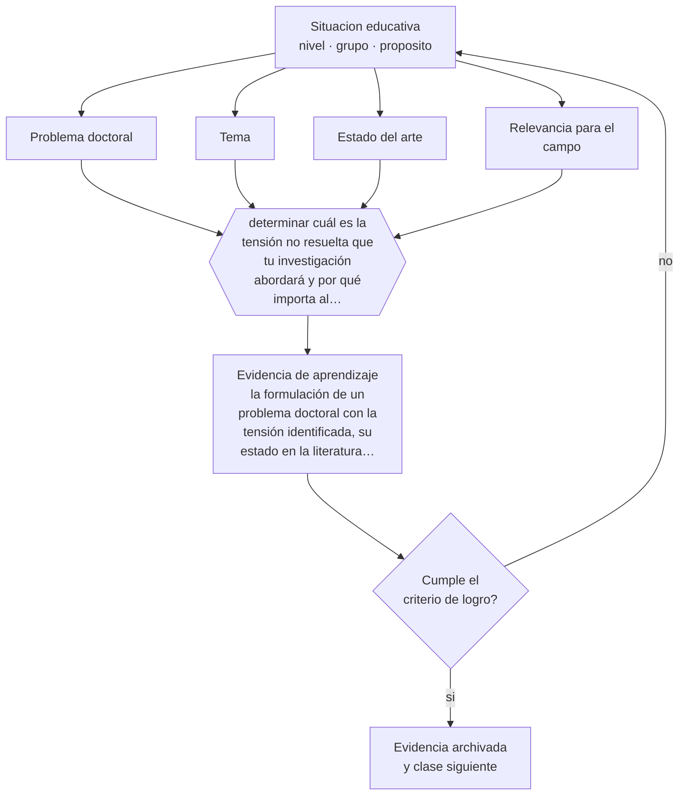

# Clase 205 — Problema doctoral y originalidad

> **Parte 17 · Investigación doctoral y formación de formadores** — clase 1 de 12

**Estado de evidencia:** `PRACTICA-PROFESIONAL` · **Etapa:** 🔴 Etapa E — Investigación avanzada y formación de formadores · **Población de referencia:** nivel doctoral, dirección de tesis y formación docente 
**Decisión que habilita:** determinar cuál es la tensión no resuelta que tu investigación abordará y por qué importa al campo 
**Evidencia de aprendizaje:** la formulación de un problema doctoral con la tensión identificada, su estado en la literatura y su relevancia

## 🎯 Propósito

Delimitar un problema de investigación de nivel doctoral: no un tema amplio ni una aplicación de lo conocido, sino una tensión no resuelta en el campo que la investigación puede abordar.

## 📚 Resultados de aprendizaje

Al finalizar esta clase podrás:

1. **Definir** con precisión los cuatro conceptos centrales de la clase y reconocerlos en una situación educativa real, no solo en su enunciado.
2. **Explicar** qué distingue un tema doctoral de un problema doctoral.
3. **Decidir** —cuál es la tensión no resuelta que tu investigación abordará y por qué importa al campo— y sostener la decisión con un fundamento escrito.
4. **Producir** la evidencia de la clase —la formulación de un problema doctoral con la tensión identificada, su estado en la literatura y su relevancia— y contrastarla contra el criterio de logro.
5. **Distinguir** lo que la evidencia sostiene de lo que es práctica instalada, preferencia personal o costumbre de la institución.

## 🧩 Conceptos centrales

| Concepto | Comprensión verificable |
|---|---|
| **Problema doctoral** | tensión, contradicción o vacío no resuelto que la comunidad del campo reconoce como relevante |
| **Tema** | área de interés; no constituye por sí sola un problema investigable |
| **Estado del arte** | síntesis crítica de lo que el campo sabe, discute y no ha resuelto |
| **Relevancia para el campo** | razón por la que la comunidad especializada debería interesarse en la respuesta |

## 🗺️ Flujo de razonamiento

## 📖 Desarrollo

### 1. El fondo del asunto

La diferencia entre magíster y doctorado no es de extensión sino de tipo de aporte. En el nivel doctoral no basta con aplicar bien un método a un caso nuevo: hay que identificar algo que el campo no ha resuelto y mostrar por qué importa. Esa identificación exige dominio del estado del arte, y por eso el primer año doctoral es mayormente lectura y no recolección de datos.

### 2. Cómo se traduce en decisiones de enseñanza

La formulación del problema se prueba con una conversación: explicarlo en tres minutos a un especialista del campo y observar si reconoce la tensión. Si responde que eso ya está resuelto, o que no ve por qué importa, el problema todavía no está formulado. Esa prueba, repetida con varios interlocutores, ahorra años de trabajo mal dirigido.

### 3. Qué sostiene la evidencia y qué no

La delimitación es iterativa y el problema cambia durante el proceso: eso es normal y debe documentarse. Y la relevancia es en parte una convención del campo: lo que una comunidad considera un problema importante puede no serlo para otra. Explicitar la comunidad de referencia forma parte de la formulación.

> **Cómo leer el estado de evidencia `PRACTICA-PROFESIONAL`.** Es conocimiento práctico acumulado del oficio, útil y transferible, pero no probado con diseños de investigación. Trátalo como un buen punto de partida sujeto a comprobación en tu contexto.

## 🧪 Taller guiado

Aplica la clase a **uno** de los contextos siguientes y repite después el ejercicio en un
contexto de exigencia distinta. Cambiar de contexto es parte del aprendizaje: lo que funciona
con un grupo no se traslada intacto a otro.

| Contexto | Rasgo que cambia la decisión |
|---|---|
| Tesis doctoral en curso | la contribución debe delimitarse y defenderse |
| Investigación con datos anidados | estudiantes en cursos, cursos en escuelas |
| Síntesis de evidencia acumulada | calidad de estudios y sesgo de publicación |
| Investigación basada en diseño | intervención y teoría se construyen a la vez |
| Dirección de tesis de otros | el método pasa a ser la relación de supervisión |
| Programa de formación docente | el criterio final es el cambio en la práctica |

**Secuencia de trabajo:**

1. Delimita el contexto: nivel, edad, tamaño del grupo, asignatura o experiencia y tiempo real disponible.
2. Declara qué saben ya los estudiantes y **cómo lo comprobaste**, no cómo lo supones.
3. Formula la decisión pedagógica que esta clase habilita y escribe su fundamento.
4. Anticipa qué observarías si la decisión funciona y qué observarías si no funciona.
5. Diseña de antemano la alternativa que aplicarás si la primera estrategia falla.
6. Ejecuta o simula, y registra lo observado con fecha, contexto y evidencia concreta.
7. Produce la evidencia de aprendizaje de la clase.
8. Contrástala contra el criterio de logro, corrige y recién entonces avanza.

### 📦 Evidencia de aprendizaje

La formulación de un problema doctoral con la tensión identificada, su estado en la literatura y su relevancia.

Debe incluir contexto, decisión, fundamento, fuentes consultadas con su fecha, indicador de
logro observable, riesgos previstos y qué harías distinto en la siguiente iteración.

## 🏆 Reto verificable

Explica tu problema en tres minutos a tres especialistas distintos. Registra sus objeciones y reformula hasta que los tres reconozcan la tensión.

## ✅ Criterio de logro

- [ ] el problema identifica una tensión no resuelta con evidencia del estado del arte;
- [ ] la relevancia está formulada para una comunidad de referencia identificada;
- [ ] cada afirmación sobre «lo que funciona» está atribuida a una fuente identificable, con autor y fecha;
- [ ] la decisión es ejecutable con el tiempo, el espacio, el número de estudiantes y los recursos que realmente tienes;
- [ ] la evidencia queda archivada de forma reproducible: otra persona podría revisarla sin que tú se la expliques.

## ⚠️ Errores frecuentes

**Propios de esta clase:**

- Confundir un tema amplio con un problema investigable de nivel doctoral.
- Comprometer un problema sin haberlo contrastado con especialistas del campo.

**Característicos de la parte 17:**

- Confundir novedad temática con contribución al conocimiento.
- Analizar datos anidados como si fueran independientes.

## ♿ Diversidad, accesibilidad y ética

Los problemas que el campo reconoce como importantes reflejan quién ha tenido voz en él. Investigar problemas de contextos poco representados es una contribución legítima y con frecuencia más necesaria que replicar agendas importadas.

Antes de aplicar cualquier decisión de esta clase con estudiantes reales, revisa el
[protocolo de práctica responsable](../../../docs/ETICA_Y_PRACTICA_RESPONSABLE.md):
consentimiento, resguardo de datos personales, proporcionalidad de la intervención y derecho
de cada estudiante a no ser objeto de un ensayo que no le reporta beneficio.

## ❓ Preguntas de comprobación

1. ¿Qué no sabe hoy tu campo que tu investigación podría aclarar?
2. ¿A quién le importaría la respuesta y por qué?
3. ¿Qué especialista te dijo que esto ya estaba resuelto, y tenía razón?

## 📕 Lecturas base

**Booth, W., Colomb, G. & Williams, J. *The Craft of Research*.**  
*Qué aporta a esta clase:* tratamiento de la construcción de problemas y de su justificación.

**Dunleavy, P. (2003). *Authoring a PhD*.**  
*Qué aporta a esta clase:* orientación específica sobre delimitación y estructura del trabajo doctoral.

Catálogo completo: [bibliografía del programa](../../../docs/BIBLIOGRAFIA.md) ·
[glosario](../../../docs/GLOSARIO.md) ·
[fuentes oficiales y cómo leerlas](../../../docs/FUENTES.md).

## 🔗 Conexión con el resto del programa

Abre la parte 17 y se apoya en las clases 194 y 195.

> [!IMPORTANT]
> Material de formación profesional. No reemplaza un título de pedagogía, una habilitación
> legal para ejercer, ni el juicio de un equipo educativo que conoce a sus estudiantes.

---

| Anterior | Índice | Siguiente |
|---|---|---|
| [← Parte 17](../README.md) | [Parte 17](../README.md) · [Programa](../../../README.md) | [206 · Contribución al conocimiento →](../class-02-contribucion-al-conocimiento/README.md) |
