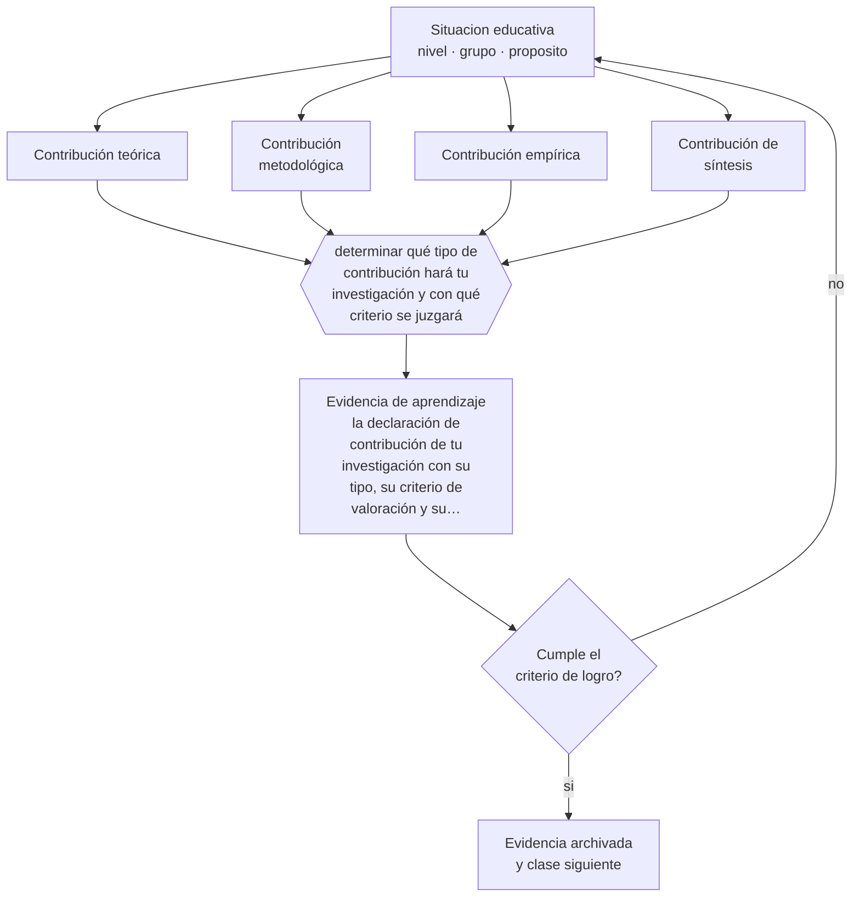

# Clase 206 — Contribución al conocimiento

> **Parte 17 · Investigación doctoral y formación de formadores** — clase 2 de 12

**Estado de evidencia:** `PRACTICA-PROFESIONAL` · **Etapa:** 🔴 Etapa E — Investigación avanzada y formación de formadores · **Población de referencia:** nivel doctoral, dirección de tesis y formación docente 
**Decisión que habilita:** determinar qué tipo de contribución hará tu investigación y con qué criterio se juzgará 
**Evidencia de aprendizaje:** la declaración de contribución de tu investigación con su tipo, su criterio de valoración y su defensa

## 🎯 Propósito

Identificar y defender el tipo de contribución que una investigación produce: teórica, metodológica, empírica o de síntesis, con sus criterios de valoración propios.

## 📚 Resultados de aprendizaje

Al finalizar esta clase podrás:

1. **Definir** con precisión los cuatro conceptos centrales de la clase y reconocerlos en una situación educativa real, no solo en su enunciado.
2. **Explicar** qué cuenta como contribución al conocimiento en educación, además de datos nuevos.
3. **Decidir** —qué tipo de contribución hará tu investigación y con qué criterio se juzgará— y sostener la decisión con un fundamento escrito.
4. **Producir** la evidencia de la clase —la declaración de contribución de tu investigación con su tipo, su criterio de valoración y su defensa— y contrastarla contra el criterio de logro.
5. **Distinguir** lo que la evidencia sostiene de lo que es práctica instalada, preferencia personal o costumbre de la institución.

## 🧩 Conceptos centrales

| Concepto | Comprensión verificable |
|---|---|
| **Contribución teórica** | aporte que modifica, refina o refuta una explicación existente |
| **Contribución metodológica** | desarrollo o validación de un instrumento, procedimiento o diseño |
| **Contribución empírica** | evidencia nueva sobre un fenómeno, población o contexto no estudiado |
| **Contribución de síntesis** | integración de evidencia dispersa que reorganiza lo que el campo sabe |

## 🗺️ Flujo de razonamiento

## 📖 Desarrollo

### 1. El fondo del asunto

En educación la contribución puede tomar varias formas, y cada una se juzga con criterios distintos. Una contribución empírica se valora por la calidad de la evidencia y por el vacío que llena; una teórica, por su capacidad explicativa y su alcance; una metodológica, por su validación; una de síntesis, por su rigor y por lo que reordena. Declarar el tipo evita que el trabajo se evalúe con criterios que no le corresponden.

### 2. Cómo se traduce en decisiones de enseñanza

La defensa de la contribución debe formularse en una frase verificable: «este estudio muestra que X ocurre bajo condiciones Y, lo que el modelo Z no predecía». Esa formulación obliga a precisar y expone de inmediato las contribuciones débiles, que son las que se enuncian en términos generales de aporte al conocimiento del área.

### 3. Qué sostiene la evidencia y qué no

La magnitud de la contribución no se decide por autoevaluación: la juzga la comunidad del campo a través de la revisión por pares y del uso posterior del trabajo. Y en investigación aplicada existe una tensión legítima entre contribución al conocimiento y utilidad práctica, que conviene explicitar en vez de resolver por omisión.

> **Cómo leer el estado de evidencia `PRACTICA-PROFESIONAL`.** Es conocimiento práctico acumulado del oficio, útil y transferible, pero no probado con diseños de investigación. Trátalo como un buen punto de partida sujeto a comprobación en tu contexto.

## 🧪 Taller guiado

Aplica la clase a **uno** de los contextos siguientes y repite después el ejercicio en un
contexto de exigencia distinta. Cambiar de contexto es parte del aprendizaje: lo que funciona
con un grupo no se traslada intacto a otro.

| Contexto | Rasgo que cambia la decisión |
|---|---|
| Tesis doctoral en curso | la contribución debe delimitarse y defenderse |
| Investigación con datos anidados | estudiantes en cursos, cursos en escuelas |
| Síntesis de evidencia acumulada | calidad de estudios y sesgo de publicación |
| Investigación basada en diseño | intervención y teoría se construyen a la vez |
| Dirección de tesis de otros | el método pasa a ser la relación de supervisión |
| Programa de formación docente | el criterio final es el cambio en la práctica |

**Secuencia de trabajo:**

1. Delimita el contexto: nivel, edad, tamaño del grupo, asignatura o experiencia y tiempo real disponible.
2. Declara qué saben ya los estudiantes y **cómo lo comprobaste**, no cómo lo supones.
3. Formula la decisión pedagógica que esta clase habilita y escribe su fundamento.
4. Anticipa qué observarías si la decisión funciona y qué observarías si no funciona.
5. Diseña de antemano la alternativa que aplicarás si la primera estrategia falla.
6. Ejecuta o simula, y registra lo observado con fecha, contexto y evidencia concreta.
7. Produce la evidencia de aprendizaje de la clase.
8. Contrástala contra el criterio de logro, corrige y recién entonces avanza.

### 📦 Evidencia de aprendizaje

La declaración de contribución de tu investigación con su tipo, su criterio de valoración y su defensa.

Debe incluir contexto, decisión, fundamento, fuentes consultadas con su fecha, indicador de
logro observable, riesgos previstos y qué harías distinto en la siguiente iteración.

## 🏆 Reto verificable

Escribe tu contribución en una frase verificable y sométela a dos especialistas. Reformula hasta que ninguno pueda decir que eso ya se sabía.

## ✅ Criterio de logro

- [ ] la contribución está formulada en una frase verificable y específica;
- [ ] declara con qué criterio corresponde juzgarla;
- [ ] cada afirmación sobre «lo que funciona» está atribuida a una fuente identificable, con autor y fecha;
- [ ] la decisión es ejecutable con el tiempo, el espacio, el número de estudiantes y los recursos que realmente tienes;
- [ ] la evidencia queda archivada de forma reproducible: otra persona podría revisarla sin que tú se la expliques.

## ⚠️ Errores frecuentes

**Propios de esta clase:**

- Declarar la contribución en términos generales sin especificar qué cambia en el conocimiento del campo.
- Evaluar una contribución metodológica con criterios de contribución empírica, o viceversa.

**Característicos de la parte 17:**

- Confundir novedad temática con contribución al conocimiento.
- Analizar datos anidados como si fueran independientes.

## ♿ Diversidad, accesibilidad y ética

La evidencia sobre contextos y poblaciones subrepresentadas constituye contribución empírica legítima y necesaria, y con frecuencia se subvalora frente a la replicación de agendas de los centros dominantes del campo.

Antes de aplicar cualquier decisión de esta clase con estudiantes reales, revisa el
[protocolo de práctica responsable](../../../docs/ETICA_Y_PRACTICA_RESPONSABLE.md):
consentimiento, resguardo de datos personales, proporcionalidad de la intervención y derecho
de cada estudiante a no ser objeto de un ensayo que no le reporta beneficio.

## ❓ Preguntas de comprobación

1. ¿Qué sabrá el campo después de tu trabajo que no sabía antes?
2. ¿Qué explicación existente queda modificada o refutada?
3. ¿Con qué criterio debe juzgarse tu aporte?

## 📕 Lecturas base

**Whetten, D. (1989). *What Constitutes a Theoretical Contribution?* Academy of Management Review, 14(4).**  
*Qué aporta a esta clase:* criterios operativos para juzgar aportes teóricos, aplicables a educación.

**Dunleavy, P. (2003). *Authoring a PhD*.**  
*Qué aporta a esta clase:* orienta la formulación explícita de la contribución en el trabajo doctoral.

Catálogo completo: [bibliografía del programa](../../../docs/BIBLIOGRAFIA.md) ·
[glosario](../../../docs/GLOSARIO.md) ·
[fuentes oficiales y cómo leerlas](../../../docs/FUENTES.md).

## 🔗 Conexión con el resto del programa

Se apoya en la clase 205 y orienta el diseño de las clases 207 a 210.

> [!IMPORTANT]
> Material de formación profesional. No reemplaza un título de pedagogía, una habilitación
> legal para ejercer, ni el juicio de un equipo educativo que conoce a sus estudiantes.

---

| Anterior | Índice | Siguiente |
|---|---|---|
| [← 205 · Problema doctoral y originalidad](../class-01-problema-doctoral-y-originalidad/README.md) | [Parte 17](../README.md) · [Programa](../../../README.md) | [207 · Diseños avanzados de investigación →](../class-03-disenos-avanzados-de-investigacion/README.md) |
