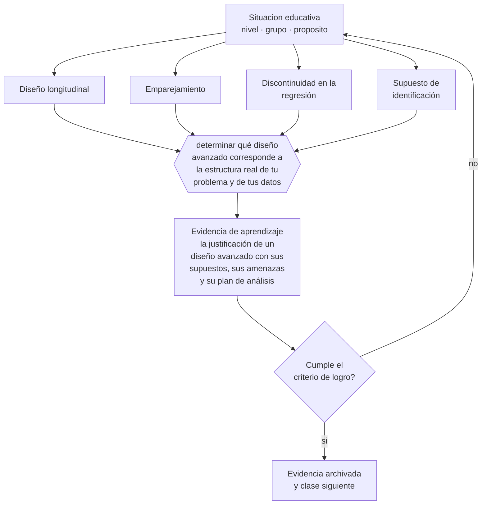

# Clase 207 — Diseños avanzados de investigación

> **Parte 17 · Investigación doctoral y formación de formadores** — clase 3 de 12

**Estado de evidencia:** `ROBUSTA` · **Etapa:** 🔴 Etapa E — Investigación avanzada y formación de formadores · **Población de referencia:** nivel doctoral, dirección de tesis y formación docente 
**Decisión que habilita:** determinar qué diseño avanzado corresponde a la estructura real de tu problema y de tus datos 
**Evidencia de aprendizaje:** la justificación de un diseño avanzado con sus supuestos, sus amenazas y su plan de análisis

## 🎯 Propósito

Seleccionar diseños avanzados —longitudinales, con series temporales, con variables instrumentales, con emparejamiento— según la estructura del problema y los datos disponibles.

## 📚 Resultados de aprendizaje

Al finalizar esta clase podrás:

1. **Definir** con precisión los cuatro conceptos centrales de la clase y reconocerlos en una situación educativa real, no solo en su enunciado.
2. **Explicar** qué diseños permiten responder preguntas que los diseños básicos no alcanzan.
3. **Decidir** —qué diseño avanzado corresponde a la estructura real de tu problema y de tus datos— y sostener la decisión con un fundamento escrito.
4. **Producir** la evidencia de la clase —la justificación de un diseño avanzado con sus supuestos, sus amenazas y su plan de análisis— y contrastarla contra el criterio de logro.
5. **Distinguir** lo que la evidencia sostiene de lo que es práctica instalada, preferencia personal o costumbre de la institución.

## 🧩 Conceptos centrales

| Concepto | Comprensión verificable |
|---|---|
| **Diseño longitudinal** | medición repetida de los mismos sujetos que permite estudiar trayectorias y cambio |
| **Emparejamiento** | procedimiento que construye grupos comparables a partir de características observadas |
| **Discontinuidad en la regresión** | diseño que aprovecha un punto de corte administrativo para estimar efectos |
| **Supuesto de identificación** | condición que debe cumplirse para que el diseño permita la inferencia causal declarada |

## 🗺️ Flujo de razonamiento

## 📖 Desarrollo

### 1. El fondo del asunto

Los diseños avanzados no son técnicas más sofisticadas por sí mismas: son estrategias para identificar efectos cuando la aleatorización no es posible. Cada uno descansa en supuestos de identificación que deben declararse y, cuando es posible, someterse a prueba. Un diseño avanzado con supuestos incumplidos produce estimaciones precisas de algo que no es el efecto buscado.

### 2. Cómo se traduce en decisiones de enseñanza

La elección parte de la estructura del problema y de los datos existentes: si hay un punto de corte administrativo, si hay mediciones repetidas, si hay una fuente de variación exógena. En educación, los datos administrativos ofrecen oportunidades reales para estos diseños, y su uso exige tanto competencia técnica como resguardo de los datos.

### 3. Qué sostiene la evidencia y qué no

Estos diseños exigen competencia estadística específica y, en muchos casos, colaboración con especialistas. Además, sus supuestos son fuertes y en ocasiones no verificables: la honestidad consiste en declararlos y en analizar la sensibilidad de los resultados a su incumplimiento.

> **Cómo leer el estado de evidencia `ROBUSTA`.** Hay evidencia convergente de varios equipos, países y diseños de investigación, incluidos estudios experimentales o cuasiexperimentales, y el efecto se sostiene al replicarlo. Puedes apoyar una decisión profesional en ella, sin olvidar que ningún efecto promedio describe a un estudiante concreto.

## 🧪 Taller guiado

Aplica la clase a **uno** de los contextos siguientes y repite después el ejercicio en un
contexto de exigencia distinta. Cambiar de contexto es parte del aprendizaje: lo que funciona
con un grupo no se traslada intacto a otro.

| Contexto | Rasgo que cambia la decisión |
|---|---|
| Tesis doctoral en curso | la contribución debe delimitarse y defenderse |
| Investigación con datos anidados | estudiantes en cursos, cursos en escuelas |
| Síntesis de evidencia acumulada | calidad de estudios y sesgo de publicación |
| Investigación basada en diseño | intervención y teoría se construyen a la vez |
| Dirección de tesis de otros | el método pasa a ser la relación de supervisión |
| Programa de formación docente | el criterio final es el cambio en la práctica |

**Secuencia de trabajo:**

1. Delimita el contexto: nivel, edad, tamaño del grupo, asignatura o experiencia y tiempo real disponible.
2. Declara qué saben ya los estudiantes y **cómo lo comprobaste**, no cómo lo supones.
3. Formula la decisión pedagógica que esta clase habilita y escribe su fundamento.
4. Anticipa qué observarías si la decisión funciona y qué observarías si no funciona.
5. Diseña de antemano la alternativa que aplicarás si la primera estrategia falla.
6. Ejecuta o simula, y registra lo observado con fecha, contexto y evidencia concreta.
7. Produce la evidencia de aprendizaje de la clase.
8. Contrástala contra el criterio de logro, corrige y recién entonces avanza.

### 📦 Evidencia de aprendizaje

La justificación de un diseño avanzado con sus supuestos, sus amenazas y su plan de análisis.

Debe incluir contexto, decisión, fundamento, fuentes consultadas con su fecha, indicador de
logro observable, riesgos previstos y qué harías distinto en la siguiente iteración.

## 🏆 Reto verificable

Escoge un diseño avanzado para tu pregunta y escribe sus supuestos. Diseña una prueba de sensibilidad para el supuesto más frágil.

## ✅ Criterio de logro

- [ ] los supuestos de identificación están declarados y, cuando es posible, examinados;
- [ ] el plan de análisis incluye pruebas de sensibilidad a los supuestos clave;
- [ ] cada afirmación sobre «lo que funciona» está atribuida a una fuente identificable, con autor y fecha;
- [ ] la decisión es ejecutable con el tiempo, el espacio, el número de estudiantes y los recursos que realmente tienes;
- [ ] la evidencia queda archivada de forma reproducible: otra persona podría revisarla sin que tú se la expliques.

## ⚠️ Errores frecuentes

**Propios de esta clase:**

- Aplicar un diseño avanzado sin declarar ni examinar sus supuestos de identificación.
- Presentar la sofisticación técnica como sustituto de la validez del constructo medido.

**Característicos de la parte 17:**

- Confundir novedad temática con contribución al conocimiento.
- Analizar datos anidados como si fueran independientes.

## ♿ Diversidad, accesibilidad y ética

Los diseños basados en datos administrativos suelen subrepresentar a estudiantes con trayectorias interrumpidas, que son quienes desaparecen de los registros. Analizar quién falta es parte del análisis, no una limitación menor.

Antes de aplicar cualquier decisión de esta clase con estudiantes reales, revisa el
[protocolo de práctica responsable](../../../docs/ETICA_Y_PRACTICA_RESPONSABLE.md):
consentimiento, resguardo de datos personales, proporcionalidad de la intervención y derecho
de cada estudiante a no ser objeto de un ensayo que no le reporta beneficio.

## ❓ Preguntas de comprobación

1. ¿Qué supuesto debe cumplirse para que tu estimación signifique lo que dices?
2. ¿Qué ocurre con tus conclusiones si ese supuesto falla parcialmente?
3. ¿Necesitas colaborar con un especialista en este diseño?

## 📕 Lecturas base

**Angrist, J. & Pischke, J.-S. (2009). *Mostly Harmless Econometrics*.**  
*Qué aporta a esta clase:* tratamiento accesible de diseños de identificación causal aplicables a datos educativos.

**Murnane, R. & Willett, J. (2011). *Methods Matter*.**  
*Qué aporta a esta clase:* aplica estos diseños específicamente a preguntas de investigación educativa.

Catálogo completo: [bibliografía del programa](../../../docs/BIBLIOGRAFIA.md) ·
[glosario](../../../docs/GLOSARIO.md) ·
[fuentes oficiales y cómo leerlas](../../../docs/FUENTES.md).

## 🔗 Conexión con el resto del programa

Profundiza la clase 197 y se complementa con la clase 208.

> [!IMPORTANT]
> Material de formación profesional. No reemplaza un título de pedagogía, una habilitación
> legal para ejercer, ni el juicio de un equipo educativo que conoce a sus estudiantes.

---

| Anterior | Índice | Siguiente |
|---|---|---|
| [← 206 · Contribución al conocimiento](../class-02-contribucion-al-conocimiento/README.md) | [Parte 17](../README.md) · [Programa](../../../README.md) | [208 · Modelos longitudinales y multinivel →](../class-04-modelos-longitudinales-y-multinivel/README.md) |
