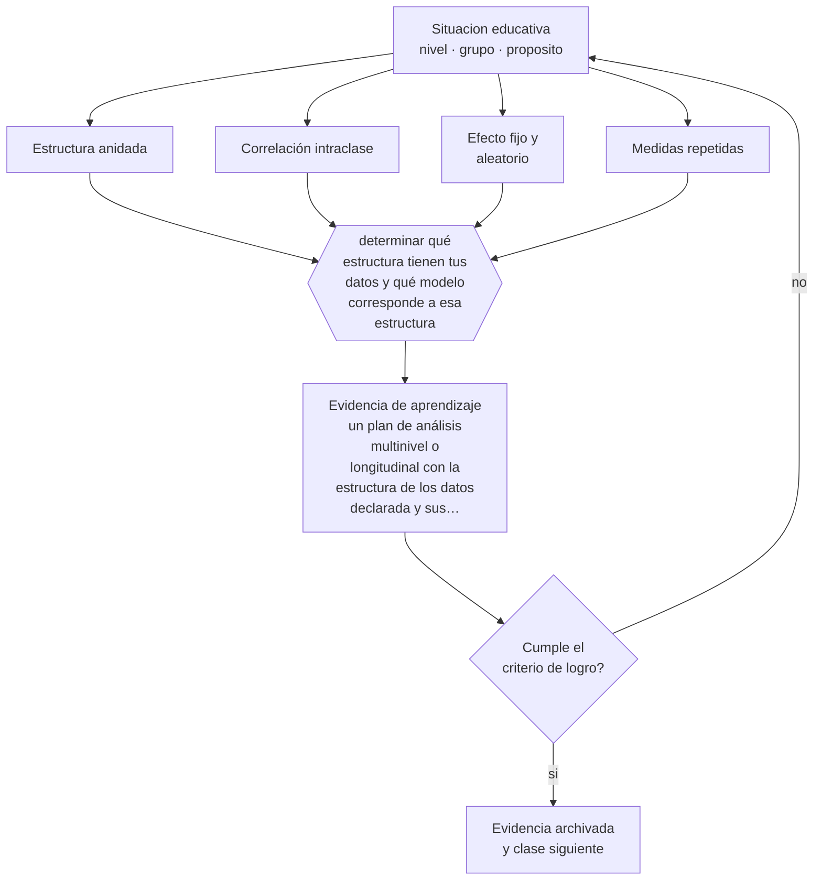

# Clase 208 — Modelos longitudinales y multinivel

> **Parte 17 · Investigación doctoral y formación de formadores** — clase 4 de 12

**Estado de evidencia:** `ROBUSTA` · **Etapa:** 🔴 Etapa E — Investigación avanzada y formación de formadores · **Población de referencia:** nivel doctoral, dirección de tesis y formación docente 
**Decisión que habilita:** determinar qué estructura tienen tus datos y qué modelo corresponde a esa estructura 
**Evidencia de aprendizaje:** un plan de análisis multinivel o longitudinal con la estructura de los datos declarada y sus implicancias

## 🎯 Propósito

Aplicar modelos multinivel y longitudinales cuando la estructura de los datos lo exige: estudiantes anidados en cursos, cursos en escuelas, y mediciones repetidas dentro de personas.

## 📚 Resultados de aprendizaje

Al finalizar esta clase podrás:

1. **Definir** con precisión los cuatro conceptos centrales de la clase y reconocerlos en una situación educativa real, no solo en su enunciado.
2. **Explicar** por qué analizar estudiantes como si fueran independientes infla la significación de los resultados.
3. **Decidir** —qué estructura tienen tus datos y qué modelo corresponde a esa estructura— y sostener la decisión con un fundamento escrito.
4. **Producir** la evidencia de la clase —un plan de análisis multinivel o longitudinal con la estructura de los datos declarada y sus implicancias— y contrastarla contra el criterio de logro.
5. **Distinguir** lo que la evidencia sostiene de lo que es práctica instalada, preferencia personal o costumbre de la institución.

## 🧩 Conceptos centrales

| Concepto | Comprensión verificable |
|---|---|
| **Estructura anidada** | organización jerárquica de los datos: estudiantes en cursos, cursos en establecimientos |
| **Correlación intraclase** | proporción de la varianza atribuible al nivel superior; justifica el modelo multinivel |
| **Efecto fijo y aleatorio** | componentes del modelo que capturan relaciones promedio y variación entre unidades |
| **Medidas repetidas** | observaciones sucesivas del mismo sujeto, que permiten modelar trayectorias individuales |

## 🗺️ Flujo de razonamiento

## 📖 Desarrollo

### 1. El fondo del asunto

En educación, los datos casi siempre están anidados: los estudiantes de un mismo curso se parecen más entre sí que estudiantes de cursos distintos, porque comparten docente, contexto y selección. Analizarlos como observaciones independientes subestima los errores estándar e infla la significación, produciendo hallazgos que no se replican. Es uno de los errores técnicos más frecuentes en tesis educativas.

### 2. Cómo se traduce en decisiones de enseñanza

El punto de partida es declarar la estructura y estimar cuánta varianza corresponde a cada nivel. A partir de ahí, el modelo multinivel permite estimar efectos a nivel de estudiante, de curso y de establecimiento, y examinar si un efecto varía entre unidades, que suele ser la pregunta más interesante. En datos longitudinales, el mismo enfoque modela trayectorias individuales.

### 3. Qué sostiene la evidencia y qué no

Los modelos multinivel exigen un número suficiente de unidades de nivel superior: con pocos establecimientos, las estimaciones de ese nivel son inestables. Y su complejidad puede exceder la pregunta: cuando el interés es descriptivo, un modelo más simple bien interpretado comunica mejor.

> **Cómo leer el estado de evidencia `ROBUSTA`.** Hay evidencia convergente de varios equipos, países y diseños de investigación, incluidos estudios experimentales o cuasiexperimentales, y el efecto se sostiene al replicarlo. Puedes apoyar una decisión profesional en ella, sin olvidar que ningún efecto promedio describe a un estudiante concreto.

## 🧪 Taller guiado

Aplica la clase a **uno** de los contextos siguientes y repite después el ejercicio en un
contexto de exigencia distinta. Cambiar de contexto es parte del aprendizaje: lo que funciona
con un grupo no se traslada intacto a otro.

| Contexto | Rasgo que cambia la decisión |
|---|---|
| Tesis doctoral en curso | la contribución debe delimitarse y defenderse |
| Investigación con datos anidados | estudiantes en cursos, cursos en escuelas |
| Síntesis de evidencia acumulada | calidad de estudios y sesgo de publicación |
| Investigación basada en diseño | intervención y teoría se construyen a la vez |
| Dirección de tesis de otros | el método pasa a ser la relación de supervisión |
| Programa de formación docente | el criterio final es el cambio en la práctica |

**Secuencia de trabajo:**

1. Delimita el contexto: nivel, edad, tamaño del grupo, asignatura o experiencia y tiempo real disponible.
2. Declara qué saben ya los estudiantes y **cómo lo comprobaste**, no cómo lo supones.
3. Formula la decisión pedagógica que esta clase habilita y escribe su fundamento.
4. Anticipa qué observarías si la decisión funciona y qué observarías si no funciona.
5. Diseña de antemano la alternativa que aplicarás si la primera estrategia falla.
6. Ejecuta o simula, y registra lo observado con fecha, contexto y evidencia concreta.
7. Produce la evidencia de aprendizaje de la clase.
8. Contrástala contra el criterio de logro, corrige y recién entonces avanza.

### 📦 Evidencia de aprendizaje

Un plan de análisis multinivel o longitudinal con la estructura de los datos declarada y sus implicancias.

Debe incluir contexto, decisión, fundamento, fuentes consultadas con su fecha, indicador de
logro observable, riesgos previstos y qué harías distinto en la siguiente iteración.

## 🏆 Reto verificable

Estima la correlación intraclase de un conjunto de datos educativos reales y compara las conclusiones de un análisis que ignora la estructura con uno que la modela.

## ✅ Criterio de logro

- [ ] la estructura de los datos está declarada con su correlación intraclase estimada;
- [ ] el modelo corresponde a la estructura y su complejidad se justifica por la pregunta;
- [ ] cada afirmación sobre «lo que funciona» está atribuida a una fuente identificable, con autor y fecha;
- [ ] la decisión es ejecutable con el tiempo, el espacio, el número de estudiantes y los recursos que realmente tienes;
- [ ] la evidencia queda archivada de forma reproducible: otra persona podría revisarla sin que tú se la expliques.

## ⚠️ Errores frecuentes

**Propios de esta clase:**

- Analizar datos anidados con métodos que suponen independencia.
- Estimar efectos de nivel superior con muy pocas unidades en ese nivel.

**Característicos de la parte 17:**

- Confundir novedad temática con contribución al conocimiento.
- Analizar datos anidados como si fueran independientes.

## ♿ Diversidad, accesibilidad y ética

Los modelos multinivel permiten estimar si un efecto beneficia por igual a distintos grupos y contextos. Reportar esa heterogeneidad es lo que impide que una política basada en un efecto promedio perjudique a quienes ya están peor.

Antes de aplicar cualquier decisión de esta clase con estudiantes reales, revisa el
[protocolo de práctica responsable](../../../docs/ETICA_Y_PRACTICA_RESPONSABLE.md):
consentimiento, resguardo de datos personales, proporcionalidad de la intervención y derecho
de cada estudiante a no ser objeto de un ensayo que no le reporta beneficio.

## ❓ Preguntas de comprobación

1. ¿Cuántas unidades tienes en cada nivel de tu estructura?
2. ¿Qué proporción de la varianza está en el nivel del curso o del establecimiento?
3. ¿Tu pregunta es sobre el promedio o sobre la variación entre unidades?

## 📕 Lecturas base

**Raudenbush, S. & Bryk, A. (2002). *Hierarchical Linear Models*.**  
*Qué aporta a esta clase:* la referencia sobre modelos multinivel y su aplicación en educación.

**Singer, J. & Willett, J. (2003). *Applied Longitudinal Data Analysis*.**  
*Qué aporta a esta clase:* tratamiento accesible del modelado de trayectorias y de eventos.

Catálogo completo: [bibliografía del programa](../../../docs/BIBLIOGRAFIA.md) ·
[glosario](../../../docs/GLOSARIO.md) ·
[fuentes oficiales y cómo leerlas](../../../docs/FUENTES.md).

## 🔗 Conexión con el resto del programa

Se apoya en la clase 201 y es condición técnica de muchas preguntas de la clase 207.

> [!IMPORTANT]
> Material de formación profesional. No reemplaza un título de pedagogía, una habilitación
> legal para ejercer, ni el juicio de un equipo educativo que conoce a sus estudiantes.

---

| Anterior | Índice | Siguiente |
|---|---|---|
| [← 207 · Diseños avanzados de investigación](../class-03-disenos-avanzados-de-investigacion/README.md) | [Parte 17](../README.md) · [Programa](../../../README.md) | [209 · Meta-análisis y revisión sistemática →](../class-05-meta-analisis-y-revision-sistematica/README.md) |
