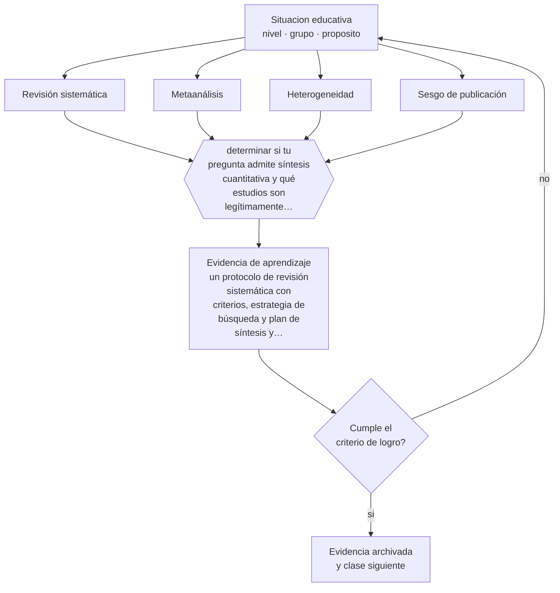

# Clase 209 — Meta-análisis y revisión sistemática

> **Parte 17 · Investigación doctoral y formación de formadores** — clase 5 de 12

**Estado de evidencia:** `ROBUSTA` · **Etapa:** 🔴 Etapa E — Investigación avanzada y formación de formadores · **Población de referencia:** nivel doctoral, dirección de tesis y formación docente 
**Decisión que habilita:** determinar si tu pregunta admite síntesis cuantitativa y qué estudios son legítimamente combinables 
**Evidencia de aprendizaje:** un protocolo de revisión sistemática con criterios, estrategia de búsqueda y plan de síntesis y de análisis de sesgo

## 🎯 Propósito

Realizar y juzgar revisiones sistemáticas y metaanálisis: protocolo previo, búsqueda exhaustiva, evaluación de calidad, síntesis cuantitativa y análisis de heterogeneidad y sesgo.

## 📚 Resultados de aprendizaje

Al finalizar esta clase podrás:

1. **Definir** con precisión los cuatro conceptos centrales de la clase y reconocerlos en una situación educativa real, no solo en su enunciado.
2. **Explicar** cómo se integra evidencia dispersa sin promediar estudios que no son comparables.
3. **Decidir** —si tu pregunta admite síntesis cuantitativa y qué estudios son legítimamente combinables— y sostener la decisión con un fundamento escrito.
4. **Producir** la evidencia de la clase —un protocolo de revisión sistemática con criterios, estrategia de búsqueda y plan de síntesis y de análisis de sesgo— y contrastarla contra el criterio de logro.
5. **Distinguir** lo que la evidencia sostiene de lo que es práctica instalada, preferencia personal o costumbre de la institución.

## 🧩 Conceptos centrales

| Concepto | Comprensión verificable |
|---|---|
| **Revisión sistemática** | síntesis con protocolo previo, búsqueda exhaustiva y criterios explícitos de inclusión |
| **Metaanálisis** | síntesis cuantitativa que combina tamaños de efecto de estudios comparables |
| **Heterogeneidad** | variación entre estudios que no se explica por el azar; puede invalidar el promedio |
| **Sesgo de publicación** | sobrerrepresentación de resultados positivos en la literatura publicada |

## 🗺️ Flujo de razonamiento

## 📖 Desarrollo

### 1. El fondo del asunto

Un metaanálisis mal hecho es más peligroso que ningún metaanálisis, porque presenta con apariencia de precisión el promedio de estudios que no debían promediarse. Las condiciones son exigentes: protocolo previo, búsqueda exhaustiva incluida la literatura no publicada, evaluación de calidad de cada estudio, y análisis explícito de heterogeneidad y de sesgo de publicación.

### 2. Cómo se traduce en decisiones de enseñanza

El protocolo se registra antes de empezar, con criterios de inclusión, variables de interés y plan de análisis. Y la heterogeneidad no es un inconveniente: es información. Cuando los estudios difieren sistemáticamente, la pregunta interesante deja de ser cuál es el efecto promedio y pasa a ser bajo qué condiciones el efecto es mayor o menor.

### 3. Qué sostiene la evidencia y qué no

En educación la heterogeneidad suele ser alta porque las intervenciones, los contextos y las medidas difieren. Además, las síntesis que promedian estudios de calidad muy dispar producen estimaciones infladas. Las síntesis más citadas del campo han sido criticadas precisamente por combinar lo incombinable.

> **Cómo leer el estado de evidencia `ROBUSTA`.** Hay evidencia convergente de varios equipos, países y diseños de investigación, incluidos estudios experimentales o cuasiexperimentales, y el efecto se sostiene al replicarlo. Puedes apoyar una decisión profesional en ella, sin olvidar que ningún efecto promedio describe a un estudiante concreto.

## 🧪 Taller guiado

Aplica la clase a **uno** de los contextos siguientes y repite después el ejercicio en un
contexto de exigencia distinta. Cambiar de contexto es parte del aprendizaje: lo que funciona
con un grupo no se traslada intacto a otro.

| Contexto | Rasgo que cambia la decisión |
|---|---|
| Tesis doctoral en curso | la contribución debe delimitarse y defenderse |
| Investigación con datos anidados | estudiantes en cursos, cursos en escuelas |
| Síntesis de evidencia acumulada | calidad de estudios y sesgo de publicación |
| Investigación basada en diseño | intervención y teoría se construyen a la vez |
| Dirección de tesis de otros | el método pasa a ser la relación de supervisión |
| Programa de formación docente | el criterio final es el cambio en la práctica |

**Secuencia de trabajo:**

1. Delimita el contexto: nivel, edad, tamaño del grupo, asignatura o experiencia y tiempo real disponible.
2. Declara qué saben ya los estudiantes y **cómo lo comprobaste**, no cómo lo supones.
3. Formula la decisión pedagógica que esta clase habilita y escribe su fundamento.
4. Anticipa qué observarías si la decisión funciona y qué observarías si no funciona.
5. Diseña de antemano la alternativa que aplicarás si la primera estrategia falla.
6. Ejecuta o simula, y registra lo observado con fecha, contexto y evidencia concreta.
7. Produce la evidencia de aprendizaje de la clase.
8. Contrástala contra el criterio de logro, corrige y recién entonces avanza.

### 📦 Evidencia de aprendizaje

Un protocolo de revisión sistemática con criterios, estrategia de búsqueda y plan de síntesis y de análisis de sesgo.

Debe incluir contexto, decisión, fundamento, fuentes consultadas con su fecha, indicador de
logro observable, riesgos previstos y qué harías distinto en la siguiente iteración.

## 🏆 Reto verificable

Escribe el protocolo de una revisión sistemática sobre tu problema y ejecútalo parcialmente. Documenta la heterogeneidad que encuentres.

## ✅ Criterio de logro

- [ ] el protocolo se define antes de la búsqueda y declara criterios de inclusión y de calidad;
- [ ] el plan incluye análisis de heterogeneidad y evaluación de sesgo de publicación;
- [ ] cada afirmación sobre «lo que funciona» está atribuida a una fuente identificable, con autor y fecha;
- [ ] la decisión es ejecutable con el tiempo, el espacio, el número de estudiantes y los recursos que realmente tienes;
- [ ] la evidencia queda archivada de forma reproducible: otra persona podría revisarla sin que tú se la expliques.

## ⚠️ Errores frecuentes

**Propios de esta clase:**

- Combinar estudios con diseños, medidas y poblaciones no comparables.
- Reportar un efecto promedio sin analizar heterogeneidad ni sesgo de publicación.

**Característicos de la parte 17:**

- Confundir novedad temática con contribución al conocimiento.
- Analizar datos anidados como si fueran independientes.

## ♿ Diversidad, accesibilidad y ética

La literatura sintetizada suele provenir de unos pocos países y sistemas. Declarar la procedencia de los estudios y analizar si el efecto varía por contexto evita aplicar conclusiones ajenas a realidades distintas.

Antes de aplicar cualquier decisión de esta clase con estudiantes reales, revisa el
[protocolo de práctica responsable](../../../docs/ETICA_Y_PRACTICA_RESPONSABLE.md):
consentimiento, resguardo de datos personales, proporcionalidad de la intervención y derecho
de cada estudiante a no ser objeto de un ensayo que no le reporta beneficio.

## ❓ Preguntas de comprobación

1. ¿Son estos estudios legítimamente combinables?
2. ¿Qué explica la variación entre sus resultados?
3. ¿Cuánta literatura con resultados nulos podría estar faltando?

## 📕 Lecturas base

**Cooper, H., Hedges, L. & Valentine, J. (eds.) (2019). *The Handbook of Research Synthesis and Meta-Analysis*.**  
*Qué aporta a esta clase:* el manual estándar para producir y juzgar síntesis cuantitativas.

**Page, M. et al. (2021). *The PRISMA 2020 Statement*.**  
*Qué aporta a esta clase:* estándar de reporte de revisiones sistemáticas; úsalo como lista de verificación.

Catálogo completo: [bibliografía del programa](../../../docs/BIBLIOGRAFIA.md) ·
[glosario](../../../docs/GLOSARIO.md) ·
[fuentes oficiales y cómo leerlas](../../../docs/FUENTES.md).

## 🔗 Conexión con el resto del programa

Profundiza la clase 195 y aporta el criterio de lectura crítica que exige toda la parte 17.

> [!IMPORTANT]
> Material de formación profesional. No reemplaza un título de pedagogía, una habilitación
> legal para ejercer, ni el juicio de un equipo educativo que conoce a sus estudiantes.

---

| Anterior | Índice | Siguiente |
|---|---|---|
| [← 208 · Modelos longitudinales y multinivel](../class-04-modelos-longitudinales-y-multinivel/README.md) | [Parte 17](../README.md) · [Programa](../../../README.md) | [210 · Investigación basada en diseño →](../class-06-investigacion-basada-en-diseno/README.md) |
