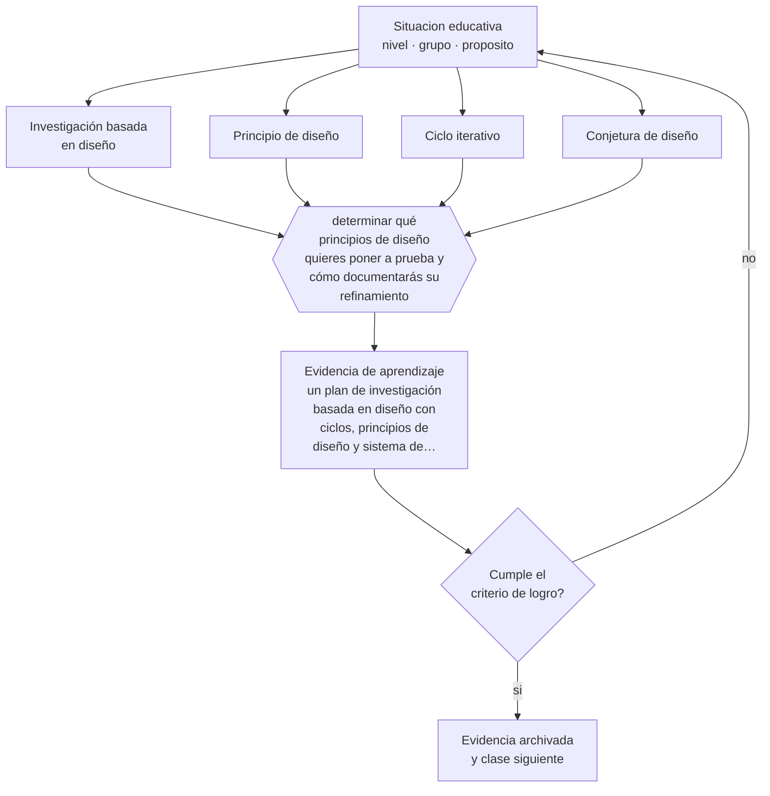

# Clase 210 — Investigación basada en diseño

> **Parte 17 · Investigación doctoral y formación de formadores** — clase 6 de 12

**Estado de evidencia:** `EMERGENTE` · **Etapa:** 🔴 Etapa E — Investigación avanzada y formación de formadores · **Población de referencia:** nivel doctoral, dirección de tesis y formación docente 
**Decisión que habilita:** determinar qué principios de diseño quieres poner a prueba y cómo documentarás su refinamiento 
**Evidencia de aprendizaje:** un plan de investigación basada en diseño con ciclos, principios de diseño y sistema de documentación

## 🎯 Propósito

Diseñar investigación basada en diseño: ciclos iterativos de desarrollo e implementación en contextos reales que producen simultáneamente una intervención y conocimiento teórico.

## 📚 Resultados de aprendizaje

Al finalizar esta clase podrás:

1. **Definir** con precisión los cuatro conceptos centrales de la clase y reconocerlos en una situación educativa real, no solo en su enunciado.
2. **Explicar** cómo producir a la vez una intervención que funcione y una teoría que explique por qué.
3. **Decidir** —qué principios de diseño quieres poner a prueba y cómo documentarás su refinamiento— y sostener la decisión con un fundamento escrito.
4. **Producir** la evidencia de la clase —un plan de investigación basada en diseño con ciclos, principios de diseño y sistema de documentación— y contrastarla contra el criterio de logro.
5. **Distinguir** lo que la evidencia sostiene de lo que es práctica instalada, preferencia personal o costumbre de la institución.

## 🧩 Conceptos centrales

| Concepto | Comprensión verificable |
|---|---|
| **Investigación basada en diseño** | metodología que desarrolla y estudia intervenciones en contextos reales mediante ciclos iterativos |
| **Principio de diseño** | afirmación transferible sobre qué funciona, para quién y bajo qué condiciones |
| **Ciclo iterativo** | secuencia de diseño, implementación, análisis y rediseño |
| **Conjetura de diseño** | hipótesis sobre cómo un componente de la intervención produciría el aprendizaje buscado |

## 🗺️ Flujo de razonamiento

## 📖 Desarrollo

### 1. El fondo del asunto

La investigación basada en diseño responde a un problema real del campo: los experimentos controlados dicen si algo funcionó en promedio y no explican por qué ni cómo adaptarlo. Esta metodología desarrolla la intervención en el contexto real, documenta las decisiones y sus efectos, y produce principios de diseño transferibles que otros pueden usar y poner a prueba.

### 2. Cómo se traduce en decisiones de enseñanza

El trabajo exige documentar sistemáticamente: qué se diseñó, con qué conjetura, qué ocurrió, qué se cambió y por qué. Esa documentación es el dato de la investigación y no una bitácora administrativa. Sin ella, el resultado es una intervención mejorada sin conocimiento transferible, que es lo que suele ocurrir en los proyectos de innovación.

### 3. Qué sostiene la evidencia y qué no

La metodología tiene una debilidad reconocida: la cercanía entre quien diseña y quien evalúa dificulta la crítica y facilita la interpretación favorable. Los resguardos incluyen documentación previa de las conjeturas, participación de observadores externos y reporte explícito de lo que no funcionó, que es lo que casi nunca se publica.

> **Cómo leer el estado de evidencia `EMERGENTE`.** El cuerpo de estudios es reciente, escaso o poco replicado. Úsala como hipótesis de trabajo con seguimiento explícito, nunca como argumento de autoridad ni como base para una política de establecimiento.

## 🧪 Taller guiado

Aplica la clase a **uno** de los contextos siguientes y repite después el ejercicio en un
contexto de exigencia distinta. Cambiar de contexto es parte del aprendizaje: lo que funciona
con un grupo no se traslada intacto a otro.

| Contexto | Rasgo que cambia la decisión |
|---|---|
| Tesis doctoral en curso | la contribución debe delimitarse y defenderse |
| Investigación con datos anidados | estudiantes en cursos, cursos en escuelas |
| Síntesis de evidencia acumulada | calidad de estudios y sesgo de publicación |
| Investigación basada en diseño | intervención y teoría se construyen a la vez |
| Dirección de tesis de otros | el método pasa a ser la relación de supervisión |
| Programa de formación docente | el criterio final es el cambio en la práctica |

**Secuencia de trabajo:**

1. Delimita el contexto: nivel, edad, tamaño del grupo, asignatura o experiencia y tiempo real disponible.
2. Declara qué saben ya los estudiantes y **cómo lo comprobaste**, no cómo lo supones.
3. Formula la decisión pedagógica que esta clase habilita y escribe su fundamento.
4. Anticipa qué observarías si la decisión funciona y qué observarías si no funciona.
5. Diseña de antemano la alternativa que aplicarás si la primera estrategia falla.
6. Ejecuta o simula, y registra lo observado con fecha, contexto y evidencia concreta.
7. Produce la evidencia de aprendizaje de la clase.
8. Contrástala contra el criterio de logro, corrige y recién entonces avanza.

### 📦 Evidencia de aprendizaje

Un plan de investigación basada en diseño con ciclos, principios de diseño y sistema de documentación.

Debe incluir contexto, decisión, fundamento, fuentes consultadas con su fecha, indicador de
logro observable, riesgos previstos y qué harías distinto en la siguiente iteración.

## 🏆 Reto verificable

Documenta un ciclo completo con sus conjeturas previas. Escribe el principio de diseño que se puede derivar y somételo a crítica externa.

## ✅ Criterio de logro

- [ ] las conjeturas de diseño están documentadas antes de cada ciclo;
- [ ] el reporte incluye lo que no funcionó y qué se aprendió de ello;
- [ ] cada afirmación sobre «lo que funciona» está atribuida a una fuente identificable, con autor y fecha;
- [ ] la decisión es ejecutable con el tiempo, el espacio, el número de estudiantes y los recursos que realmente tienes;
- [ ] la evidencia queda archivada de forma reproducible: otra persona podría revisarla sin que tú se la expliques.

## ⚠️ Errores frecuentes

**Propios de esta clase:**

- Documentar solo lo que funcionó y presentar la intervención final sin sus fracasos intermedios.
- Producir una intervención mejorada sin extraer principios de diseño transferibles.

**Característicos de la parte 17:**

- Confundir novedad temática con contribución al conocimiento.
- Analizar datos anidados como si fueran independientes.

## ♿ Diversidad, accesibilidad y ética

El diseño en contextos reales permite trabajar con las condiciones y las poblaciones que los estudios controlados excluyen. Aprovechar esa ventaja exige incluir deliberadamente los casos más difíciles y no solo los que facilitan el resultado.

Antes de aplicar cualquier decisión de esta clase con estudiantes reales, revisa el
[protocolo de práctica responsable](../../../docs/ETICA_Y_PRACTICA_RESPONSABLE.md):
consentimiento, resguardo de datos personales, proporcionalidad de la intervención y derecho
de cada estudiante a no ser objeto de un ensayo que no le reporta beneficio.

## ❓ Preguntas de comprobación

1. ¿Qué conjetura estás poniendo a prueba en este ciclo?
2. ¿Qué principio transferible produjo tu trabajo, más allá de la intervención?
3. ¿Quién revisa críticamente tus interpretaciones si tú también diseñaste?

## 📕 Lecturas base

**Design-Based Research Collective (2003). *Design-Based Research*. Educational Researcher, 32(1).**  
*Qué aporta a esta clase:* define el paradigma, sus criterios y sus tensiones metodológicas.

**Anderson, T. & Shattuck, J. (2012). *Design-Based Research: A Decade of Progress in Education Research?***  
*Qué aporta a esta clase:* balance crítico de sus logros y de sus debilidades.

Catálogo completo: [bibliografía del programa](../../../docs/BIBLIOGRAFIA.md) ·
[glosario](../../../docs/GLOSARIO.md) ·
[fuentes oficiales y cómo leerlas](../../../docs/FUENTES.md).

## 🔗 Conexión con el resto del programa

Combina las partes 10 y 16 en una metodología propia y alimenta el proyecto de la clase 216.

> [!IMPORTANT]
> Material de formación profesional. No reemplaza un título de pedagogía, una habilitación
> legal para ejercer, ni el juicio de un equipo educativo que conoce a sus estudiantes.

---

| Anterior | Índice | Siguiente |
|---|---|---|
| [← 209 · Meta-análisis y revisión sistemática](../class-05-meta-analisis-y-revision-sistematica/README.md) | [Parte 17](../README.md) · [Programa](../../../README.md) | [211 · Learning analytics avanzado →](../class-07-learning-analytics-avanzado/README.md) |
