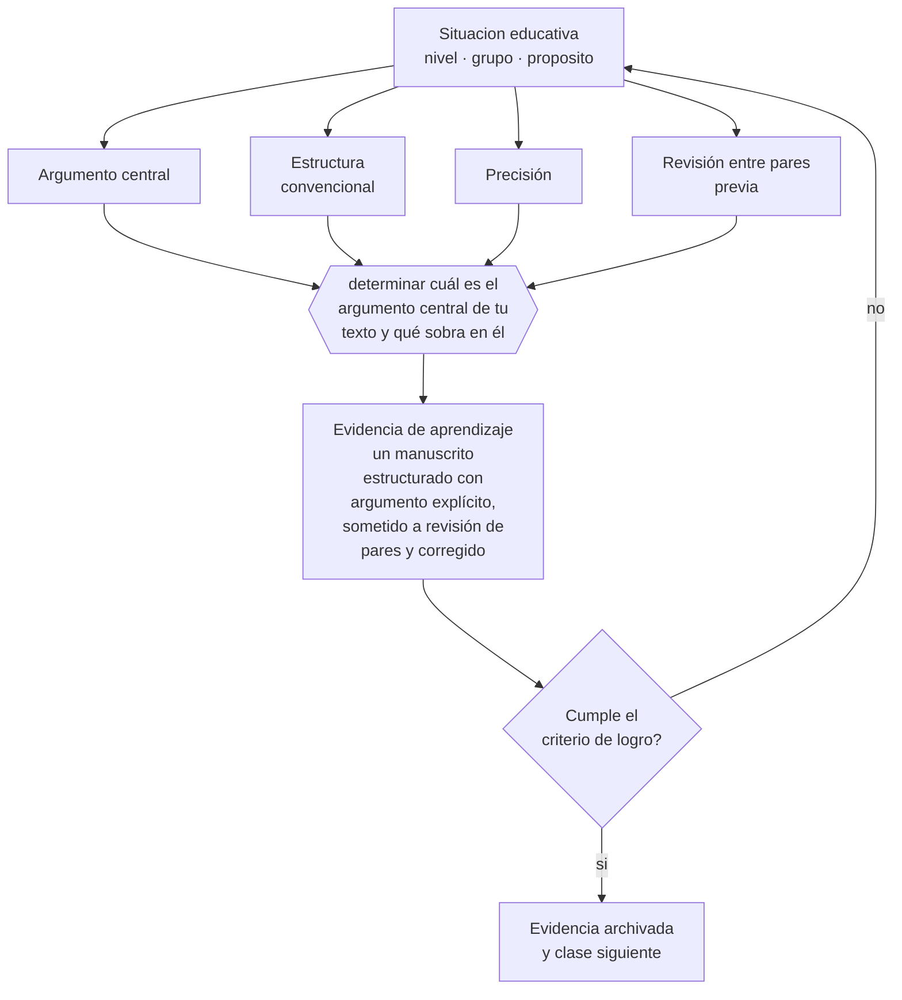

# Clase 212 — Escritura científica

> **Parte 17 · Investigación doctoral y formación de formadores** — clase 8 de 12

**Estado de evidencia:** `PRACTICA-PROFESIONAL` · **Etapa:** 🔴 Etapa E — Investigación avanzada y formación de formadores · **Población de referencia:** nivel doctoral, dirección de tesis y formación docente 
**Decisión que habilita:** determinar cuál es el argumento central de tu texto y qué sobra en él 
**Evidencia de aprendizaje:** un manuscrito estructurado con argumento explícito, sometido a revisión de pares y corregido

## 🎯 Propósito

Escribir textos científicos claros y estructurados: argumento central explícito, estructura convencional del campo, precisión en las afirmaciones y economía de lenguaje.

## 📚 Resultados de aprendizaje

Al finalizar esta clase podrás:

1. **Definir** con precisión los cuatro conceptos centrales de la clase y reconocerlos en una situación educativa real, no solo en su enunciado.
2. **Explicar** por qué un buen trabajo mal escrito no se publica y qué se puede hacer al respecto.
3. **Decidir** —cuál es el argumento central de tu texto y qué sobra en él— y sostener la decisión con un fundamento escrito.
4. **Producir** la evidencia de la clase —un manuscrito estructurado con argumento explícito, sometido a revisión de pares y corregido— y contrastarla contra el criterio de logro.
5. **Distinguir** lo que la evidencia sostiene de lo que es práctica instalada, preferencia personal o costumbre de la institución.

## 🧩 Conceptos centrales

| Concepto | Comprensión verificable |
|---|---|
| **Argumento central** | afirmación principal que el texto sostiene, formulable en una frase |
| **Estructura convencional** | organización esperada por el campo, que facilita la lectura y la revisión |
| **Precisión** | correspondencia exacta entre lo que se afirma y lo que la evidencia sostiene |
| **Revisión entre pares previa** | lectura crítica de colegas antes de someter el manuscrito |

## 🗺️ Flujo de razonamiento

## 📖 Desarrollo

### 1. El fondo del asunto

La escritura científica no es un adorno del trabajo: es la forma en que el conocimiento se hace público y verificable. Un texto sin argumento central explícito obliga al lector a reconstruirlo, y la mayoría no lo hará. La estructura convencional del campo —introducción, método, resultados, discusión— no es una camisa de fuerza: es un protocolo que permite al lector encontrar rápido lo que necesita para juzgar.

### 2. Cómo se traduce en decisiones de enseñanza

La disciplina más útil es escribir el argumento central en una frase antes de redactar, y comprobar al final que cada sección lo sostiene. Y la precisión exige revisar cada afirmación contra la evidencia: las palabras «demuestra», «prueba» y «confirma» rara vez son correctas; «sugiere», «es consistente con» y «no permite descartar» suelen serlo.

### 3. Qué sostiene la evidencia y qué no

Las convenciones varían por disciplina y por revista, y la escritura académica en un idioma no materno impone una carga adicional real que los procesos de revisión no siempre reconocen. Buscar apoyo de edición no es una debilidad sino una práctica profesional habitual.

> **Cómo leer el estado de evidencia `PRACTICA-PROFESIONAL`.** Es conocimiento práctico acumulado del oficio, útil y transferible, pero no probado con diseños de investigación. Trátalo como un buen punto de partida sujeto a comprobación en tu contexto.

## 🧪 Taller guiado

Aplica la clase a **uno** de los contextos siguientes y repite después el ejercicio en un
contexto de exigencia distinta. Cambiar de contexto es parte del aprendizaje: lo que funciona
con un grupo no se traslada intacto a otro.

| Contexto | Rasgo que cambia la decisión |
|---|---|
| Tesis doctoral en curso | la contribución debe delimitarse y defenderse |
| Investigación con datos anidados | estudiantes en cursos, cursos en escuelas |
| Síntesis de evidencia acumulada | calidad de estudios y sesgo de publicación |
| Investigación basada en diseño | intervención y teoría se construyen a la vez |
| Dirección de tesis de otros | el método pasa a ser la relación de supervisión |
| Programa de formación docente | el criterio final es el cambio en la práctica |

**Secuencia de trabajo:**

1. Delimita el contexto: nivel, edad, tamaño del grupo, asignatura o experiencia y tiempo real disponible.
2. Declara qué saben ya los estudiantes y **cómo lo comprobaste**, no cómo lo supones.
3. Formula la decisión pedagógica que esta clase habilita y escribe su fundamento.
4. Anticipa qué observarías si la decisión funciona y qué observarías si no funciona.
5. Diseña de antemano la alternativa que aplicarás si la primera estrategia falla.
6. Ejecuta o simula, y registra lo observado con fecha, contexto y evidencia concreta.
7. Produce la evidencia de aprendizaje de la clase.
8. Contrástala contra el criterio de logro, corrige y recién entonces avanza.

### 📦 Evidencia de aprendizaje

Un manuscrito estructurado con argumento explícito, sometido a revisión de pares y corregido.

Debe incluir contexto, decisión, fundamento, fuentes consultadas con su fecha, indicador de
logro observable, riesgos previstos y qué harías distinto en la siguiente iteración.

## 🏆 Reto verificable

Escribe tu manuscrito, formula el argumento central y pide a dos colegas que lo identifiquen leyendo solo el texto. Corrige si no coinciden.

## ✅ Criterio de logro

- [ ] el argumento central está formulado explícitamente y cada sección lo sostiene;
- [ ] cada afirmación usa el verbo que corresponde a la fuerza real de la evidencia;
- [ ] cada afirmación sobre «lo que funciona» está atribuida a una fuente identificable, con autor y fecha;
- [ ] la decisión es ejecutable con el tiempo, el espacio, el número de estudiantes y los recursos que realmente tienes;
- [ ] la evidencia queda archivada de forma reproducible: otra persona podría revisarla sin que tú se la expliques.

## ⚠️ Errores frecuentes

**Propios de esta clase:**

- Escribir sin haber formulado el argumento central en una frase.
- Usar verbos de certeza —demuestra, prueba— donde la evidencia solo sugiere.

**Característicos de la parte 17:**

- Confundir novedad temática con contribución al conocimiento.
- Analizar datos anidados como si fueran independientes.

## ♿ Diversidad, accesibilidad y ética

La escritura académica es un código que se aprende, no un talento. Enseñarlo explícitamente reduce la desventaja de quienes no lo adquirieron en su entorno familiar o académico previo.

Antes de aplicar cualquier decisión de esta clase con estudiantes reales, revisa el
[protocolo de práctica responsable](../../../docs/ETICA_Y_PRACTICA_RESPONSABLE.md):
consentimiento, resguardo de datos personales, proporcionalidad de la intervención y derecho
de cada estudiante a no ser objeto de un ensayo que no le reporta beneficio.

## ❓ Preguntas de comprobación

1. ¿Cuál es tu argumento central, en una frase?
2. ¿Qué párrafo de tu texto no aporta a ese argumento?
3. ¿Qué afirmación tuya usa un verbo más fuerte que tu evidencia?

## 📕 Lecturas base

**Sword, H. (2012). *Stylish Academic Writing*.**  
*Qué aporta a esta clase:* evidencia sobre qué hace legible un texto académico y cómo escribirlo.

**Booth, W., Colomb, G. & Williams, J. *The Craft of Research*.**  
*Qué aporta a esta clase:* tratamiento de la argumentación y de la relación entre afirmación y evidencia.

Catálogo completo: [bibliografía del programa](../../../docs/BIBLIOGRAFIA.md) ·
[glosario](../../../docs/GLOSARIO.md) ·
[fuentes oficiales y cómo leerlas](../../../docs/FUENTES.md).

## 🔗 Conexión con el resto del programa

Prepara la clase 213 y aplica el criterio de precisión de toda la parte 16.

> [!IMPORTANT]
> Material de formación profesional. No reemplaza un título de pedagogía, una habilitación
> legal para ejercer, ni el juicio de un equipo educativo que conoce a sus estudiantes.

---

| Anterior | Índice | Siguiente |
|---|---|---|
| [← 211 · Learning analytics avanzado](../class-07-learning-analytics-avanzado/README.md) | [Parte 17](../README.md) · [Programa](../../../README.md) | [213 · Publicación y peer review →](../class-09-publicacion-y-peer-review/README.md) |
