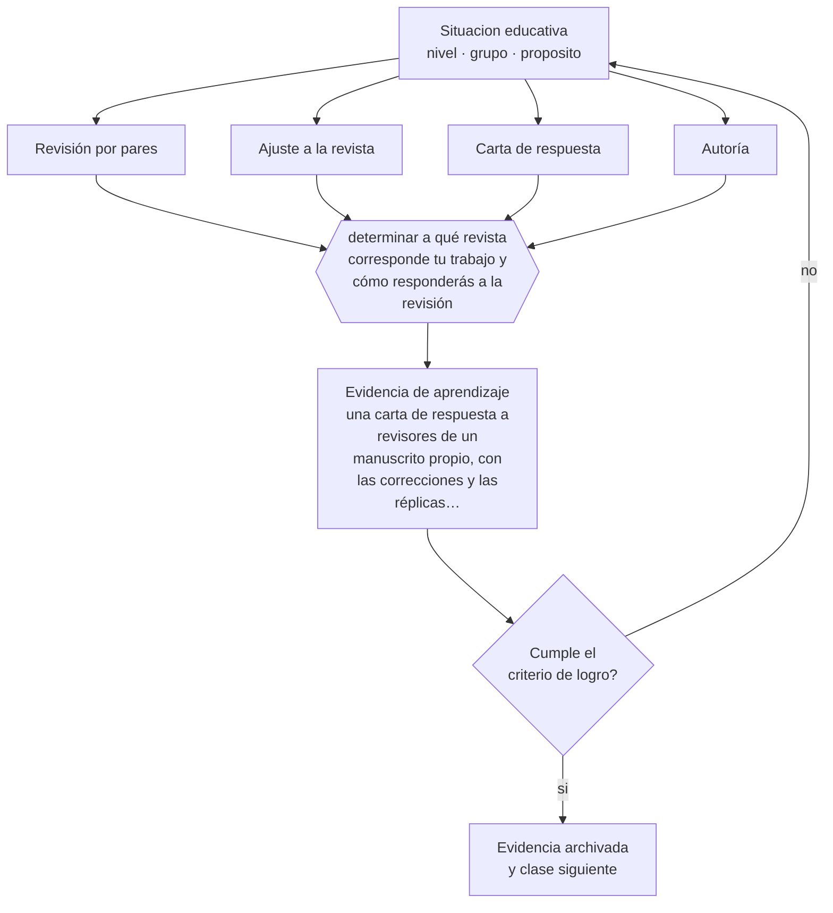

# Clase 213 — Publicación y peer review

> **Parte 17 · Investigación doctoral y formación de formadores** — clase 9 de 12

**Estado de evidencia:** `PRACTICA-PROFESIONAL` · **Etapa:** 🔴 Etapa E — Investigación avanzada y formación de formadores · **Población de referencia:** nivel doctoral, dirección de tesis y formación docente 
**Decisión que habilita:** determinar a qué revista corresponde tu trabajo y cómo responderás a la revisión 
**Evidencia de aprendizaje:** una carta de respuesta a revisores de un manuscrito propio, con las correcciones y las réplicas fundamentadas

## 🎯 Propósito

Comprender el proceso de publicación científica: selección de revista, proceso de revisión, respuesta a revisores, y criterios éticos de autoría y de difusión.

## 📚 Resultados de aprendizaje

Al finalizar esta clase podrás:

1. **Definir** con precisión los cuatro conceptos centrales de la clase y reconocerlos en una situación educativa real, no solo en su enunciado.
2. **Explicar** cómo funciona realmente la revisión por pares y qué hacer con un rechazo.
3. **Decidir** —a qué revista corresponde tu trabajo y cómo responderás a la revisión— y sostener la decisión con un fundamento escrito.
4. **Producir** la evidencia de la clase —una carta de respuesta a revisores de un manuscrito propio, con las correcciones y las réplicas fundamentadas— y contrastarla contra el criterio de logro.
5. **Distinguir** lo que la evidencia sostiene de lo que es práctica instalada, preferencia personal o costumbre de la institución.

## 🧩 Conceptos centrales

| Concepto | Comprensión verificable |
|---|---|
| **Revisión por pares** | evaluación del manuscrito por especialistas del campo antes de su publicación |
| **Ajuste a la revista** | correspondencia entre el trabajo y el alcance, la audiencia y el formato de la publicación |
| **Carta de respuesta** | documento que responde punto por punto a cada observación de los revisores |
| **Autoría** | reconocimiento de quienes contribuyeron sustantivamente, con criterios explícitos |

## 🗺️ Flujo de razonamiento

## 📖 Desarrollo

### 1. El fondo del asunto

La revisión por pares es imperfecta y sigue siendo el mejor mecanismo disponible de control de calidad. Entender su funcionamiento reduce la frustración: los rechazos son frecuentes incluso para trabajos sólidos, y la mayoría se debe a ajuste con la revista o a problemas de claridad antes que a errores metodológicos. La carta de respuesta es un género propio: se responde a todo, se corrige lo que corresponde y se replica con fundamento lo que no.

### 2. Cómo se traduce en decisiones de enseñanza

La selección de revista debe hacerse antes de escribir la versión final, porque determina formato, extensión y audiencia. Y la ética de la autoría exige criterios explícitos: quién contribuyó sustantivamente, en qué orden y por qué. Los conflictos de autoría son frecuentes y casi siempre se originan en acuerdos no explicitados al inicio.

### 3. Qué sostiene la evidencia y qué no

El sistema de publicación tiene problemas conocidos: sesgo hacia resultados positivos, lentitud, desigualdad de acceso para investigadores de países con menos recursos, y proliferación de editoriales predatorias. Conocer esos problemas es parte de la formación doctoral, y también los criterios para distinguir una revista legítima de una que solo cobra por publicar.

> **Cómo leer el estado de evidencia `PRACTICA-PROFESIONAL`.** Es conocimiento práctico acumulado del oficio, útil y transferible, pero no probado con diseños de investigación. Trátalo como un buen punto de partida sujeto a comprobación en tu contexto.

## 🧪 Taller guiado

Aplica la clase a **uno** de los contextos siguientes y repite después el ejercicio en un
contexto de exigencia distinta. Cambiar de contexto es parte del aprendizaje: lo que funciona
con un grupo no se traslada intacto a otro.

| Contexto | Rasgo que cambia la decisión |
|---|---|
| Tesis doctoral en curso | la contribución debe delimitarse y defenderse |
| Investigación con datos anidados | estudiantes en cursos, cursos en escuelas |
| Síntesis de evidencia acumulada | calidad de estudios y sesgo de publicación |
| Investigación basada en diseño | intervención y teoría se construyen a la vez |
| Dirección de tesis de otros | el método pasa a ser la relación de supervisión |
| Programa de formación docente | el criterio final es el cambio en la práctica |

**Secuencia de trabajo:**

1. Delimita el contexto: nivel, edad, tamaño del grupo, asignatura o experiencia y tiempo real disponible.
2. Declara qué saben ya los estudiantes y **cómo lo comprobaste**, no cómo lo supones.
3. Formula la decisión pedagógica que esta clase habilita y escribe su fundamento.
4. Anticipa qué observarías si la decisión funciona y qué observarías si no funciona.
5. Diseña de antemano la alternativa que aplicarás si la primera estrategia falla.
6. Ejecuta o simula, y registra lo observado con fecha, contexto y evidencia concreta.
7. Produce la evidencia de aprendizaje de la clase.
8. Contrástala contra el criterio de logro, corrige y recién entonces avanza.

### 📦 Evidencia de aprendizaje

Una carta de respuesta a revisores de un manuscrito propio, con las correcciones y las réplicas fundamentadas.

Debe incluir contexto, decisión, fundamento, fuentes consultadas con su fecha, indicador de
logro observable, riesgos previstos y qué harías distinto en la siguiente iteración.

## 🏆 Reto verificable

Somete un manuscrito o simula el proceso con dos colegas como revisores. Redacta la carta de respuesta punto por punto.

## ✅ Criterio de logro

- [ ] la carta responde a cada observación, con corrección o con réplica fundamentada;
- [ ] los criterios de autoría fueron acordados y documentados al inicio del trabajo;
- [ ] cada afirmación sobre «lo que funciona» está atribuida a una fuente identificable, con autor y fecha;
- [ ] la decisión es ejecutable con el tiempo, el espacio, el número de estudiantes y los recursos que realmente tienes;
- [ ] la evidencia queda archivada de forma reproducible: otra persona podría revisarla sin que tú se la expliques.

## ⚠️ Errores frecuentes

**Propios de esta clase:**

- Someter un manuscrito sin verificar el ajuste con el alcance de la revista.
- Responder a los revisores de forma defensiva en lugar de punto por punto y con fundamento.

**Característicos de la parte 17:**

- Confundir novedad temática con contribución al conocimiento.
- Analizar datos anidados como si fueran independientes.

## ♿ Diversidad, accesibilidad y ética

Los investigadores que escriben en un idioma no materno y los de instituciones con menos recursos enfrentan barreras adicionales en la publicación. Conocerlas permite anticiparlas y buscar apoyos, y también cuestionarlas como problema del sistema.

Antes de aplicar cualquier decisión de esta clase con estudiantes reales, revisa el
[protocolo de práctica responsable](../../../docs/ETICA_Y_PRACTICA_RESPONSABLE.md):
consentimiento, resguardo de datos personales, proporcionalidad de la intervención y derecho
de cada estudiante a no ser objeto de un ensayo que no le reporta beneficio.

## ❓ Preguntas de comprobación

1. ¿Por qué esta revista y no otra?
2. ¿Qué observación del revisor tiene razón aunque te incomode?
3. ¿Quién es autor de tu trabajo y con qué criterio lo decidiste?

## 📕 Lecturas base

**Committee on Publication Ethics (COPE). *Guidelines*.**  
*Qué aporta a esta clase:* estándares sobre autoría, conflictos y mala conducta en publicación científica.

**Declaration on Research Assessment (DORA).**  
*Qué aporta a esta clase:* posición sobre el uso responsable de métricas en la evaluación de la investigación.

Catálogo completo: [bibliografía del programa](../../../docs/BIBLIOGRAFIA.md) ·
[glosario](../../../docs/GLOSARIO.md) ·
[fuentes oficiales y cómo leerlas](../../../docs/FUENTES.md).

## 🔗 Conexión con el resto del programa

Cierra el ciclo de la clase 212 y prepara la evaluación de trabajos de otros en la clase 214.

> [!IMPORTANT]
> Material de formación profesional. No reemplaza un título de pedagogía, una habilitación
> legal para ejercer, ni el juicio de un equipo educativo que conoce a sus estudiantes.

---

| Anterior | Índice | Siguiente |
|---|---|---|
| [← 212 · Escritura científica](../class-08-escritura-cientifica/README.md) | [Parte 17](../README.md) · [Programa](../../../README.md) | [214 · Dirección y evaluación de tesis →](../class-10-direccion-y-evaluacion-de-tesis/README.md) |
