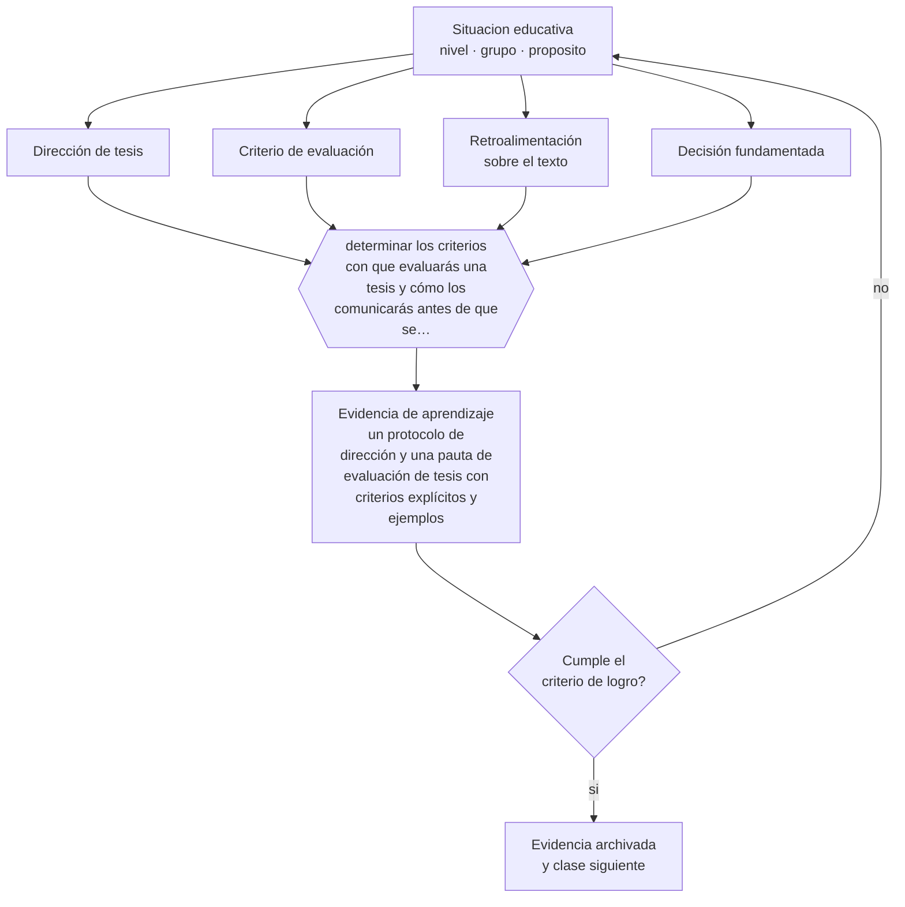

# Clase 214 — Dirección y evaluación de tesis

> **Parte 17 · Investigación doctoral y formación de formadores** — clase 10 de 12

**Estado de evidencia:** `PRACTICA-PROFESIONAL` · **Etapa:** 🔴 Etapa E — Investigación avanzada y formación de formadores · **Población de referencia:** nivel doctoral, dirección de tesis y formación docente 
**Decisión que habilita:** determinar los criterios con que evaluarás una tesis y cómo los comunicarás antes de que se escriba 
**Evidencia de aprendizaje:** un protocolo de dirección y una pauta de evaluación de tesis con criterios explícitos y ejemplos

## 🎯 Propósito

Ejercer dirección y evaluación de tesis con estructura: acuerdos explícitos, retroalimentación sobre el texto, criterios de evaluación conocidos y decisiones fundamentadas.

## 📚 Resultados de aprendizaje

Al finalizar esta clase podrás:

1. **Definir** con precisión los cuatro conceptos centrales de la clase y reconocerlos en una situación educativa real, no solo en su enunciado.
2. **Explicar** cómo se dirige una tesis sin escribirla y cómo se evalúa sin arbitrariedad.
3. **Decidir** —los criterios con que evaluarás una tesis y cómo los comunicarás antes de que se escriba— y sostener la decisión con un fundamento escrito.
4. **Producir** la evidencia de la clase —un protocolo de dirección y una pauta de evaluación de tesis con criterios explícitos y ejemplos— y contrastarla contra el criterio de logro.
5. **Distinguir** lo que la evidencia sostiene de lo que es práctica instalada, preferencia personal o costumbre de la institución.

## 🧩 Conceptos centrales

| Concepto | Comprensión verificable |
|---|---|
| **Dirección de tesis** | acompañamiento del proceso investigativo con traspaso progresivo de autonomía |
| **Criterio de evaluación** | estándar explícito con que se juzga el trabajo, conocido antes de su elaboración |
| **Retroalimentación sobre el texto** | comentario que permite al estudiante corregir, distinto de la reescritura por el director |
| **Decisión fundamentada** | juicio evaluativo justificado con referencia a criterios y a evidencia del trabajo |

## 🗺️ Flujo de razonamiento

## 📖 Desarrollo

### 1. El fondo del asunto

Dirigir tesis mal produce dos resultados igualmente malos: trabajos escritos por el director y estudiantes abandonados a su suerte. El equilibrio se sostiene con acuerdos explícitos y con traspaso progresivo de autonomía. Y la evaluación exige criterios públicos: cuando el estándar se descubre en la defensa, la evaluación se percibe —con razón— como arbitraria.

### 2. Cómo se traduce en decisiones de enseñanza

El protocolo de dirección define frecuencia, formato de entregas, plazos de respuesta y etapas de autonomía. La pauta de evaluación se entrega al inicio y describe qué se espera en cada criterio, con ejemplos de niveles. Y la evaluación misma debe fundamentarse por escrito, especialmente cuando es negativa: es la única forma de que el estudiante pueda corregir o apelar.

### 3. Qué sostiene la evidencia y qué no

No hay evidencia experimental sobre modelos de dirección: es conocimiento profesional con variación disciplinar y cultural fuerte. Lo que sí está documentado es que la calidad de la supervisión predice la finalización y la experiencia del estudiante mejor que casi cualquier otra variable institucional.

> **Cómo leer el estado de evidencia `PRACTICA-PROFESIONAL`.** Es conocimiento práctico acumulado del oficio, útil y transferible, pero no probado con diseños de investigación. Trátalo como un buen punto de partida sujeto a comprobación en tu contexto.

## 🧪 Taller guiado

Aplica la clase a **uno** de los contextos siguientes y repite después el ejercicio en un
contexto de exigencia distinta. Cambiar de contexto es parte del aprendizaje: lo que funciona
con un grupo no se traslada intacto a otro.

| Contexto | Rasgo que cambia la decisión |
|---|---|
| Tesis doctoral en curso | la contribución debe delimitarse y defenderse |
| Investigación con datos anidados | estudiantes en cursos, cursos en escuelas |
| Síntesis de evidencia acumulada | calidad de estudios y sesgo de publicación |
| Investigación basada en diseño | intervención y teoría se construyen a la vez |
| Dirección de tesis de otros | el método pasa a ser la relación de supervisión |
| Programa de formación docente | el criterio final es el cambio en la práctica |

**Secuencia de trabajo:**

1. Delimita el contexto: nivel, edad, tamaño del grupo, asignatura o experiencia y tiempo real disponible.
2. Declara qué saben ya los estudiantes y **cómo lo comprobaste**, no cómo lo supones.
3. Formula la decisión pedagógica que esta clase habilita y escribe su fundamento.
4. Anticipa qué observarías si la decisión funciona y qué observarías si no funciona.
5. Diseña de antemano la alternativa que aplicarás si la primera estrategia falla.
6. Ejecuta o simula, y registra lo observado con fecha, contexto y evidencia concreta.
7. Produce la evidencia de aprendizaje de la clase.
8. Contrástala contra el criterio de logro, corrige y recién entonces avanza.

### 📦 Evidencia de aprendizaje

Un protocolo de dirección y una pauta de evaluación de tesis con criterios explícitos y ejemplos.

Debe incluir contexto, decisión, fundamento, fuentes consultadas con su fecha, indicador de
logro observable, riesgos previstos y qué harías distinto en la siguiente iteración.

## 🏆 Reto verificable

Construye tu pauta de evaluación y entrégala a un estudiante al inicio de su trabajo. Evalúa con ella y contrasta tu juicio con el de un par.

## ✅ Criterio de logro

- [ ] la pauta de evaluación se entrega al inicio y describe niveles con ejemplos;
- [ ] las decisiones evaluativas se fundamentan por escrito con referencia a los criterios;
- [ ] cada afirmación sobre «lo que funciona» está atribuida a una fuente identificable, con autor y fecha;
- [ ] la decisión es ejecutable con el tiempo, el espacio, el número de estudiantes y los recursos que realmente tienes;
- [ ] la evidencia queda archivada de forma reproducible: otra persona podría revisarla sin que tú se la expliques.

## ⚠️ Errores frecuentes

**Propios de esta clase:**

- Reescribir el texto del estudiante en vez de retroalimentarlo para que lo corrija.
- Evaluar con criterios que el estudiante no conoció antes de escribir.

**Característicos de la parte 17:**

- Confundir novedad temática con contribución al conocimiento.
- Analizar datos anidados como si fueran independientes.

## ♿ Diversidad, accesibilidad y ética

Los estudiantes sin capital académico familiar desconocen las reglas implícitas del posgrado. Explicitar criterios y procedimientos es la intervención más directa de equidad disponible en este nivel.

Antes de aplicar cualquier decisión de esta clase con estudiantes reales, revisa el
[protocolo de práctica responsable](../../../docs/ETICA_Y_PRACTICA_RESPONSABLE.md):
consentimiento, resguardo de datos personales, proporcionalidad de la intervención y derecho
de cada estudiante a no ser objeto de un ensayo que no le reporta beneficio.

## ❓ Preguntas de comprobación

1. ¿Conoce tu estudiante los criterios con que será evaluado?
2. ¿Cuánto de su texto escribiste tú?
3. ¿Podrías fundamentar por escrito tu evaluación ante una apelación?

## 📕 Lecturas base

**Delamont, S., Atkinson, P. & Parry, O. (2004). *Supervising the Doctorate*.**  
*Qué aporta a esta clase:* modelo de supervisión con acuerdos, etapas y criterios.

**Committee on Publication Ethics (COPE). *Guidelines*.**  
*Qué aporta a esta clase:* criterios sobre autoría y contribución aplicables también a la relación de dirección.

Catálogo completo: [bibliografía del programa](../../../docs/BIBLIOGRAFIA.md) ·
[glosario](../../../docs/GLOSARIO.md) ·
[fuentes oficiales y cómo leerlas](../../../docs/FUENTES.md).

## 🔗 Conexión con el resto del programa

Aplica la clase 179 al nivel doctoral y se conecta con la clase 213 en la evaluación entre pares.

> [!IMPORTANT]
> Material de formación profesional. No reemplaza un título de pedagogía, una habilitación
> legal para ejercer, ni el juicio de un equipo educativo que conoce a sus estudiantes.

---

| Anterior | Índice | Siguiente |
|---|---|---|
| [← 213 · Publicación y peer review](../class-09-publicacion-y-peer-review/README.md) | [Parte 17](../README.md) · [Programa](../../../README.md) | [215 · Formación de docentes →](../class-11-formacion-de-docentes/README.md) |
