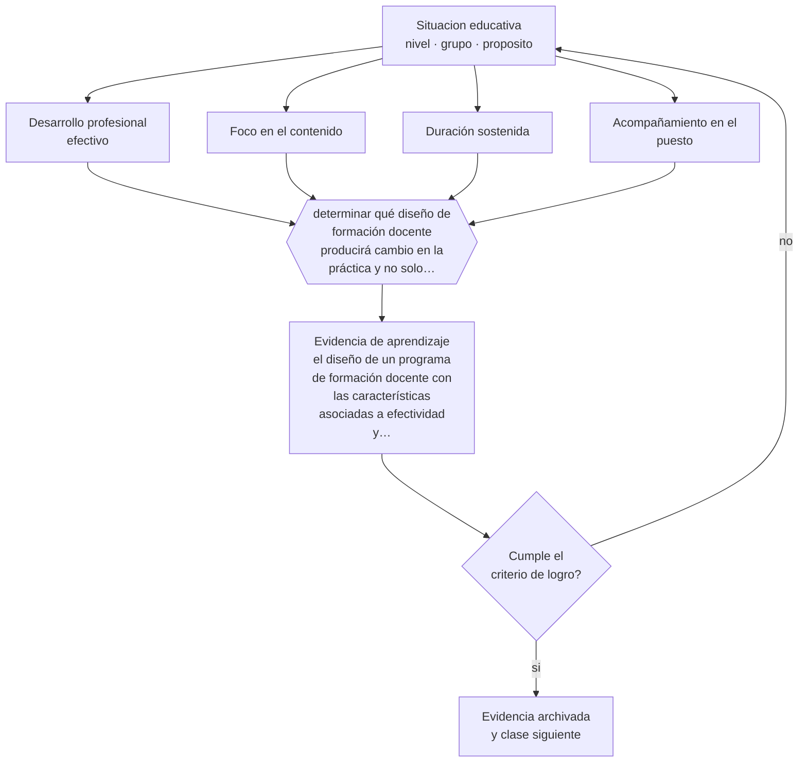

# Clase 215 — Formación de docentes

> **Parte 17 · Investigación doctoral y formación de formadores** — clase 11 de 12

**Estado de evidencia:** `ROBUSTA` · **Etapa:** 🔴 Etapa E — Investigación avanzada y formación de formadores · **Población de referencia:** nivel doctoral, dirección de tesis y formación docente 
**Decisión que habilita:** determinar qué diseño de formación docente producirá cambio en la práctica y no solo satisfacción 
**Evidencia de aprendizaje:** el diseño de un programa de formación docente con las características asociadas a efectividad y su evaluación

## 🎯 Propósito

Diseñar formación de docentes basada en la evidencia sobre desarrollo profesional efectivo: foco en contenido, duración sostenida, práctica con retroalimentación y acompañamiento en el puesto.

## 📚 Resultados de aprendizaje

Al finalizar esta clase podrás:

1. **Definir** con precisión los cuatro conceptos centrales de la clase y reconocerlos en una situación educativa real, no solo en su enunciado.
2. **Explicar** qué caracteriza al desarrollo profesional docente que efectivamente cambia la práctica.
3. **Decidir** —qué diseño de formación docente producirá cambio en la práctica y no solo satisfacción— y sostener la decisión con un fundamento escrito.
4. **Producir** la evidencia de la clase —el diseño de un programa de formación docente con las características asociadas a efectividad y su evaluación— y contrastarla contra el criterio de logro.
5. **Distinguir** lo que la evidencia sostiene de lo que es práctica instalada, preferencia personal o costumbre de la institución.

## 🧩 Conceptos centrales

| Concepto | Comprensión verificable |
|---|---|
| **Desarrollo profesional efectivo** | formación docente asociada a cambio en la práctica y en el aprendizaje de los estudiantes |
| **Foco en el contenido** | centralidad de la disciplina y de su didáctica específica, más allá de técnicas generales |
| **Duración sostenida** | extensión en el tiempo con múltiples instancias, en vez de talleres aislados |
| **Acompañamiento en el puesto** | apoyo en el aula real, donde el cambio de práctica efectivamente ocurre |

## 🗺️ Flujo de razonamiento

## 📖 Desarrollo

### 1. El fondo del asunto

La evidencia sobre desarrollo profesional docente es clara en lo que no funciona: talleres aislados, sin seguimiento y sobre técnicas generales desconectadas del contenido. Y razonablemente clara en lo que sí: foco en el contenido específico y su didáctica, duración sostenida, oportunidades de práctica con retroalimentación, colaboración entre docentes y acompañamiento en el aula. Ese conjunto es más caro y más lento que un taller, y es la diferencia entre cambiar la práctica y llenar un registro de capacitación.

### 2. Cómo se traduce en decisiones de enseñanza

El diseño debe declarar cómo cumple cada característica y cómo evaluará el cambio en la práctica, no solo la satisfacción ni el conocimiento declarado. La observación de aula antes y después, con un instrumento acotado, es el mínimo defendible. Y el acompañamiento en el puesto suele ser el componente que más se recorta por costo, siendo el más determinante.

### 3. Qué sostiene la evidencia y qué no

La evidencia proviene mayormente de programas bien financiados y bien implementados, y los efectos caen al escalar. Además, ningún programa de formación compensa condiciones institucionales que impiden aplicar lo aprendido: sin tiempo, sin materiales y sin respaldo directivo, el cambio no se sostiene.

> **Cómo leer el estado de evidencia `ROBUSTA`.** Hay evidencia convergente de varios equipos, países y diseños de investigación, incluidos estudios experimentales o cuasiexperimentales, y el efecto se sostiene al replicarlo. Puedes apoyar una decisión profesional en ella, sin olvidar que ningún efecto promedio describe a un estudiante concreto.

## 🧪 Taller guiado

Aplica la clase a **uno** de los contextos siguientes y repite después el ejercicio en un
contexto de exigencia distinta. Cambiar de contexto es parte del aprendizaje: lo que funciona
con un grupo no se traslada intacto a otro.

| Contexto | Rasgo que cambia la decisión |
|---|---|
| Tesis doctoral en curso | la contribución debe delimitarse y defenderse |
| Investigación con datos anidados | estudiantes en cursos, cursos en escuelas |
| Síntesis de evidencia acumulada | calidad de estudios y sesgo de publicación |
| Investigación basada en diseño | intervención y teoría se construyen a la vez |
| Dirección de tesis de otros | el método pasa a ser la relación de supervisión |
| Programa de formación docente | el criterio final es el cambio en la práctica |

**Secuencia de trabajo:**

1. Delimita el contexto: nivel, edad, tamaño del grupo, asignatura o experiencia y tiempo real disponible.
2. Declara qué saben ya los estudiantes y **cómo lo comprobaste**, no cómo lo supones.
3. Formula la decisión pedagógica que esta clase habilita y escribe su fundamento.
4. Anticipa qué observarías si la decisión funciona y qué observarías si no funciona.
5. Diseña de antemano la alternativa que aplicarás si la primera estrategia falla.
6. Ejecuta o simula, y registra lo observado con fecha, contexto y evidencia concreta.
7. Produce la evidencia de aprendizaje de la clase.
8. Contrástala contra el criterio de logro, corrige y recién entonces avanza.

### 📦 Evidencia de aprendizaje

El diseño de un programa de formación docente con las características asociadas a efectividad y su evaluación.

Debe incluir contexto, decisión, fundamento, fuentes consultadas con su fecha, indicador de
logro observable, riesgos previstos y qué harías distinto en la siguiente iteración.

## 🏆 Reto verificable

Diseña un programa con acompañamiento en el puesto y evalúa el cambio de práctica con observación antes y después.

## ✅ Criterio de logro

- [ ] el diseño declara cómo cumple foco en contenido, duración, práctica y acompañamiento;
- [ ] la evaluación observa cambio en la práctica de aula y no solo satisfacción;
- [ ] cada afirmación sobre «lo que funciona» está atribuida a una fuente identificable, con autor y fecha;
- [ ] la decisión es ejecutable con el tiempo, el espacio, el número de estudiantes y los recursos que realmente tienes;
- [ ] la evidencia queda archivada de forma reproducible: otra persona podría revisarla sin que tú se la expliques.

## ⚠️ Errores frecuentes

**Propios de esta clase:**

- Diseñar formación en formato de taller aislado y esperar cambio en la práctica.
- Evaluar el programa con encuestas de satisfacción y conocimiento declarado.

**Característicos de la parte 17:**

- Confundir novedad temática con contribución al conocimiento.
- Analizar datos anidados como si fueran independientes.

## ♿ Diversidad, accesibilidad y ética

La formación docente debe llegar también a quienes trabajan en contextos más difíciles y con menos tiempo disponible, que suelen ser los que menos acceden. Diseñar para esas condiciones es una decisión de equidad del sistema.

Antes de aplicar cualquier decisión de esta clase con estudiantes reales, revisa el
[protocolo de práctica responsable](../../../docs/ETICA_Y_PRACTICA_RESPONSABLE.md):
consentimiento, resguardo de datos personales, proporcionalidad de la intervención y derecho
de cada estudiante a no ser objeto de un ensayo que no le reporta beneficio.

## ❓ Preguntas de comprobación

1. ¿Qué hará distinto el docente en su aula después de tu programa?
2. ¿Cuánto acompañamiento en el puesto contempla tu diseño?
3. ¿Qué condición institucional impedirá aplicar lo aprendido?

## 📕 Lecturas base

**Darling-Hammond, L. et al. (2017). *Effective Teacher Professional Development*. Learning Policy Institute.**  
*Qué aporta a esta clase:* sintetiza las características asociadas a programas que cambian la práctica.

**Desimone, L. (2009). *Improving Impact Studies of Teachers' Professional Development*.**  
*Qué aporta a esta clase:* propone un marco conceptual y de medición para evaluar estos programas.

Catálogo completo: [bibliografía del programa](../../../docs/BIBLIOGRAFIA.md) ·
[glosario](../../../docs/GLOSARIO.md) ·
[fuentes oficiales y cómo leerlas](../../../docs/FUENTES.md).

## 🔗 Conexión con el resto del programa

Integra las partes 10, 14 y 15 y es el fundamento del proyecto de la clase 216.

> [!IMPORTANT]
> Material de formación profesional. No reemplaza un título de pedagogía, una habilitación
> legal para ejercer, ni el juicio de un equipo educativo que conoce a sus estudiantes.

---

| Anterior | Índice | Siguiente |
|---|---|---|
| [← 214 · Dirección y evaluación de tesis](../class-10-direccion-y-evaluacion-de-tesis/README.md) | [Parte 17](../README.md) · [Programa](../../../README.md) | [216 · Proyecto integrador: propuesta doctoral defendible →](../class-12-proyecto-integrador-propuesta-doctoral-defendible/README.md) |
