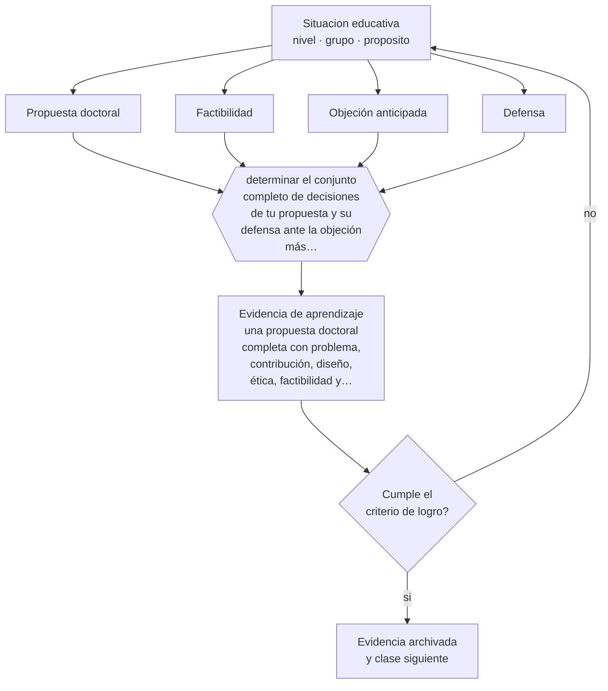

# Clase 216 — Proyecto integrador: propuesta doctoral defendible

> **Parte 17 · Investigación doctoral y formación de formadores** — clase 12 de 12

**Estado de evidencia:** `PRACTICA-PROFESIONAL` · **Etapa:** 🔴 Etapa E — Investigación avanzada y formación de formadores · **Población de referencia:** nivel doctoral, dirección de tesis y formación docente 
**Decisión que habilita:** determinar el conjunto completo de decisiones de tu propuesta y su defensa ante la objeción más fuerte 
**Evidencia de aprendizaje:** una propuesta doctoral completa con problema, contribución, diseño, ética, factibilidad y defensa de sus objeciones

## 🎯 Propósito

Integrar el programa completo en una propuesta doctoral defendible: problema, contribución, marco, diseño, plan de análisis, ética, factibilidad y cronograma, con sus límites declarados.

## 📚 Resultados de aprendizaje

Al finalizar esta clase podrás:

1. **Definir** con precisión los cuatro conceptos centrales de la clase y reconocerlos en una situación educativa real, no solo en su enunciado.
2. **Explicar** cómo se construye una propuesta doctoral que resista la crítica de una comisión que conoce el campo.
3. **Decidir** —el conjunto completo de decisiones de tu propuesta y su defensa ante la objeción más fuerte— y sostener la decisión con un fundamento escrito.
4. **Producir** la evidencia de la clase —una propuesta doctoral completa con problema, contribución, diseño, ética, factibilidad y defensa de sus objeciones— y contrastarla contra el criterio de logro.
5. **Distinguir** lo que la evidencia sostiene de lo que es práctica instalada, preferencia personal o costumbre de la institución.

## 🧩 Conceptos centrales

| Concepto | Comprensión verificable |
|---|---|
| **Propuesta doctoral** | documento que compromete un problema, un diseño y un plan verificable de ejecución |
| **Factibilidad** | posibilidad real de ejecutar la investigación con el acceso, el tiempo y los recursos disponibles |
| **Objeción anticipada** | crítica previsible que la propuesta responde antes de que se formule |
| **Defensa** | argumentación fundamentada de las decisiones ante una comisión especializada |

## 🗺️ Flujo de razonamiento

## 📖 Desarrollo

### 1. El fondo del asunto

El proyecto que cierra el programa exige articular todo lo trabajado: un problema que el campo reconozca, una contribución formulada con precisión, un diseño coherente con la pregunta, un plan de análisis que corresponda a los datos, resguardos éticos completos y un cronograma que alguien con experiencia considere realista. La factibilidad es donde más propuestas fallan, y es la parte que las comisiones examinan con más dureza.

### 2. Cómo se traduce en decisiones de enseñanza

La preparación de la defensa consiste en anticipar objeciones: escribir las tres críticas más fuertes que un especialista podría hacer y responderlas por escrito. Si alguna no tiene respuesta, la propuesta debe cambiar antes de la defensa y no después. Ese ejercicio es también el mejor filtro de calidad disponible antes de comprometer años de trabajo.

### 3. Qué sostiene la evidencia y qué no

Una propuesta es un compromiso provisional: los diseños se ajustan, el acceso cambia y los hallazgos redirigen el trabajo. Lo que se evalúa no es la certeza sino la calidad del razonamiento y la honestidad sobre lo que se sabe y lo que no. Presentar certezas donde hay supuestos es el error que más rápido detecta una comisión.

> **Cómo leer el estado de evidencia `PRACTICA-PROFESIONAL`.** Es conocimiento práctico acumulado del oficio, útil y transferible, pero no probado con diseños de investigación. Trátalo como un buen punto de partida sujeto a comprobación en tu contexto.

## 🧪 Taller guiado

Aplica la clase a **uno** de los contextos siguientes y repite después el ejercicio en un
contexto de exigencia distinta. Cambiar de contexto es parte del aprendizaje: lo que funciona
con un grupo no se traslada intacto a otro.

| Contexto | Rasgo que cambia la decisión |
|---|---|
| Tesis doctoral en curso | la contribución debe delimitarse y defenderse |
| Investigación con datos anidados | estudiantes en cursos, cursos en escuelas |
| Síntesis de evidencia acumulada | calidad de estudios y sesgo de publicación |
| Investigación basada en diseño | intervención y teoría se construyen a la vez |
| Dirección de tesis de otros | el método pasa a ser la relación de supervisión |
| Programa de formación docente | el criterio final es el cambio en la práctica |

**Secuencia de trabajo:**

1. Delimita el contexto: nivel, edad, tamaño del grupo, asignatura o experiencia y tiempo real disponible.
2. Declara qué saben ya los estudiantes y **cómo lo comprobaste**, no cómo lo supones.
3. Formula la decisión pedagógica que esta clase habilita y escribe su fundamento.
4. Anticipa qué observarías si la decisión funciona y qué observarías si no funciona.
5. Diseña de antemano la alternativa que aplicarás si la primera estrategia falla.
6. Ejecuta o simula, y registra lo observado con fecha, contexto y evidencia concreta.
7. Produce la evidencia de aprendizaje de la clase.
8. Contrástala contra el criterio de logro, corrige y recién entonces avanza.

### 📦 Evidencia de aprendizaje

Una propuesta doctoral completa con problema, contribución, diseño, ética, factibilidad y defensa de sus objeciones.

Debe incluir contexto, decisión, fundamento, fuentes consultadas con su fecha, indicador de
logro observable, riesgos previstos y qué harías distinto en la siguiente iteración.

## 🏆 Reto verificable

Defiende tu propuesta ante tres colegas con instrucción de objetarla duramente. Corrige cada punto donde no pudiste responder con fundamento.

## ✅ Criterio de logro

- [ ] la propuesta responde por escrito a las tres objeciones más fuertes previsibles;
- [ ] el cronograma y la factibilidad fueron revisados por alguien con experiencia en el campo;
- [ ] cada afirmación sobre «lo que funciona» está atribuida a una fuente identificable, con autor y fecha;
- [ ] la decisión es ejecutable con el tiempo, el espacio, el número de estudiantes y los recursos que realmente tienes;
- [ ] la evidencia queda archivada de forma reproducible: otra persona podría revisarla sin que tú se la expliques.

## ⚠️ Errores frecuentes

**Propios de esta clase:**

- Comprometer un cronograma que no considera los tiempos reales de acceso, permisos y análisis.
- Presentar la propuesta sin haber anticipado ni respondido las objeciones más fuertes.

**Característicos de la parte 17:**

- Confundir novedad temática con contribución al conocimiento.
- Analizar datos anidados como si fueran independientes.

## ♿ Diversidad, accesibilidad y ética

Una propuesta seria declara a quiénes incluye y a quiénes deja fuera, y qué consecuencias tiene esa decisión para el alcance de sus conclusiones y para las personas que representa.

Antes de aplicar cualquier decisión de esta clase con estudiantes reales, revisa el
[protocolo de práctica responsable](../../../docs/ETICA_Y_PRACTICA_RESPONSABLE.md):
consentimiento, resguardo de datos personales, proporcionalidad de la intervención y derecho
de cada estudiante a no ser objeto de un ensayo que no le reporta beneficio.

## ❓ Preguntas de comprobación

1. ¿Cuál es la crítica más fuerte que te pueden hacer, y qué respondes?
2. ¿Qué parte de tu cronograma no resiste un imprevisto de tres meses?
3. ¿Qué harías si el acceso al campo se cae?

## 📕 Lecturas base

**Dunleavy, P. (2003). *Authoring a PhD*.**  
*Qué aporta a esta clase:* estructura y estrategia del trabajo doctoral, incluida la propuesta.

**Booth, W., Colomb, G. & Williams, J. *The Craft of Research*.**  
*Qué aporta a esta clase:* argumentación y anticipación de objeciones aplicadas a la propuesta de investigación.

Catálogo completo: [bibliografía del programa](../../../docs/BIBLIOGRAFIA.md) ·
[glosario](../../../docs/GLOSARIO.md) ·
[fuentes oficiales y cómo leerlas](../../../docs/FUENTES.md).

## 🔗 Conexión con el resto del programa

Cierra el programa completo. Integra las partes 16 y 17 y se apoya en las competencias construidas desde la parte 00.

> [!IMPORTANT]
> Material de formación profesional. No reemplaza un título de pedagogía, una habilitación
> legal para ejercer, ni el juicio de un equipo educativo que conoce a sus estudiantes.

---

| Anterior | Índice | Siguiente |
|---|---|---|
| [← 215 · Formación de docentes](../class-11-formacion-de-docentes/README.md) | [Parte 17](../README.md) · [Programa](../../../README.md) | [Programa completo →](../../../README.md) |
