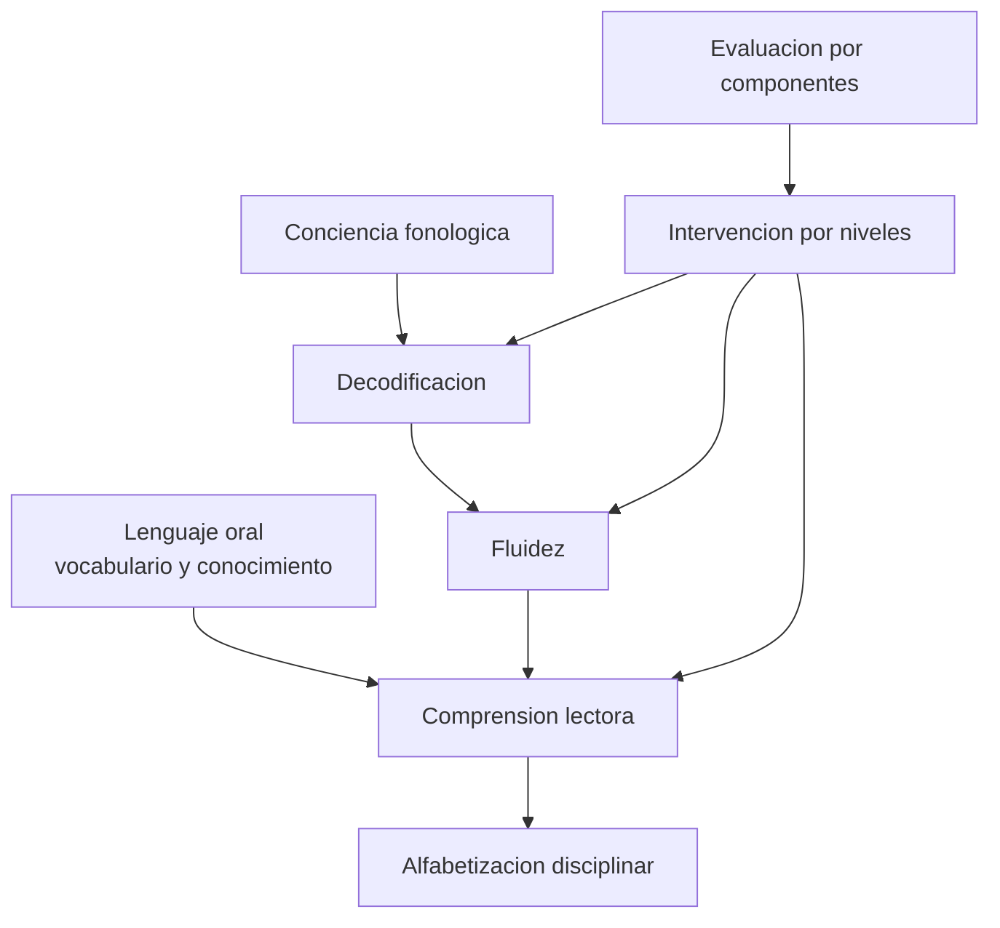

# Parte 18 — Alfabetización inicial y ciencia de la lectura

> *Aprender a leer no ocurre solo: se enseña, y se enseña de maneras que no rinden igual*

🟤 **Etapa F — Especialización y desafíos contemporáneos** · salida de la etapa: resolver los problemas que efectivamente aparecen en el aula chilena de hoy

**Clases:** 12 (217–228) · **Población de referencia:** parvularia y primer ciclo básico, con proyección a todo el sistema · **Conceptos operacionales:** 48 · **Señales observables:** 36 
**Contenido central:** Modelo simple de la lectura, conciencia fonológica, correspondencias en español, fluidez, vocabulario, comprensión, escritura inicial, dislexia, evaluación por componentes, intervención por niveles y alfabetización disciplinar

## 🎯 De qué trata esta parte

Ninguna decisión pedagógica tiene consecuencias tan largas como la de cómo se enseña a leer. Un estudiante que termina el primer ciclo sin leer con fluidez arrastra esa deuda por toda la escolaridad, porque a partir de tercero o cuarto básico el sistema deja de enseñar a leer y empieza a exigir leer para aprender. La brecha se ensancha sola: quien lee bien lee más, y quien lee más aprende más vocabulario y más mundo.

El campo llegó a acuerdos que no siempre llegan al aula. La enseñanza sistemática y explícita de las correspondencias entre letras y sonidos produce mejores resultados que confiar en el reconocimiento global o en la adivinación por contexto, y el efecto es mayor justamente en los estudiantes con más riesgo. Al mismo tiempo, decodificar no es comprender: la comprensión depende del vocabulario y del conocimiento del mundo, que se construyen desde mucho antes y por otras vías.

Esta parte trata la lectura como un sistema de componentes que se enseñan en paralelo y se evalúan por separado. Esa distinción es lo que permite intervenir con precisión: quien no decodifica y quien decodifica sin comprender tienen problemas distintos y necesitan respuestas distintas. Todo se trabaja sobre el problema del caso, que es el más común del sistema chileno.

## 🏫 Caso de la parte

Las doce clases trabajan sobre la misma realidad, para que puedas ver cómo cambia tu diagnóstico
a medida que avanzas:

> En 3.º básico, 11 de 32 estudiantes leen bajo 60 palabras por minuto y el establecimiento no tiene registro de fluidez de años anteriores. La escuela compró un programa comercial de comprensión lectora sin haber medido decodificación.

**Artefacto que produces al terminar:** plan lector con progresión por componentes, medición de fluidez y criterio de derivación a intervención intensiva.

## 📚 Resultados de la parte

Al terminar esta parte podrás:

1. **Diseñar la progresión de enseñanza lectora de un curso, con criterio de dominio por componente**.
2. **Medir fluidez lectora con un instrumento comparable y leer el resultado sin sobreinterpretarlo**.
3. **Distinguir un problema de decodificación de uno de vocabulario, comprensión o motivación**.
4. **Organizar intervención por niveles con criterios de entrada, salida y derivación**.
5. **Construir un plan lector de establecimiento que sobreviva al cambio de docentes**.

## 🗺️ Mapa de la parte

## 🧠 Marco de referencia

- modelo simple de la lectura y sus dos componentes necesarios
- enseñanza sistemática y explícita frente a enfoques basados en el contexto
- evaluación por componentes como condición para intervenir con precisión
- respuesta a la intervención y organización de apoyos por niveles

**Autoras y autores que conviene conocer:** Anne Castles, Kate Nation y Kathleen Rastle, Mark Seidenberg, Catherine Snow, Steve Graham, Douglas Fuchs y Lynn Fuchs, Margaret Snowling y Charles Hulme, National Early Literacy Panel y Plan Nacional de Lectura

## 📋 Las 12 clases

| # | Clase | Decisión que habilita | Evidencia |
|---:|---|---|---|
| 217 | [Qué resolvió la ciencia de la lectura](class-01-que-resolvio-la-ciencia-de-la-lectura/README.md) | determinar qué componente de la lectura está fallando en tu curso antes de elegir cualquier programa o material | `ROBUSTA` |
| 218 | [Conciencia fonológica y principio alfabético](class-02-conciencia-fonologica-y-principio-alfabetico/README.md) | determinar qué nivel de conciencia fonológica tiene tu grupo y qué se enseña en los próximos dos meses | `ROBUSTA` |
| 219 | [Enseñanza explícita de correspondencias en español](class-03-ensenanza-explicita-de-correspondencias-en-espanol/README.md) | determinar el orden de enseñanza de las correspondencias y qué texto usa el estudiante mientras las aprende | `ROBUSTA` |
| 220 | [Fluidez lectora: medirla y desarrollarla](class-04-fluidez-lectora-medirla-y-desarrollarla/README.md) | determinar el nivel de fluidez de cada estudiante y qué práctica recibe el tercio más bajo | `ROBUSTA` |
| 221 | [Vocabulario y conocimiento del mundo](class-05-vocabulario-y-conocimiento-del-mundo/README.md) | determinar qué palabras se enseñan explícitamente en tu unidad y cómo se verifica que quedaron disponibles | `CONSISTENTE` |
| 222 | [Comprensión lectora y sus estrategias](class-06-comprension-lectora-y-sus-estrategias/README.md) | determinar si la dificultad de comprensión de tu curso pide estrategia, vocabulario o conocimiento del tema | `CONSISTENTE` |
| 223 | [Enseñanza de la escritura inicial](class-07-ensenanza-de-la-escritura-inicial/README.md) | determinar qué componente de la escritura enseñas en cada tramo y qué se corrige en cada entrega | `CONSISTENTE` |
| 224 | [Dislexia y dificultades específicas de lectura](class-08-dislexia-y-dificultades-especificas-de-lectura/README.md) | determinar si el bajo rendimiento lector de un estudiante exige intensificar la enseñanza o iniciar evaluación especializada | `CONSISTENTE` |
| 225 | [Evaluación de la lectura por componentes](class-09-evaluacion-de-la-lectura-por-componentes/README.md) | determinar qué se mide, cuándo y con qué instrumento en el sistema de evaluación lectora de tu establecimiento | `CONSISTENTE` |
| 226 | [Intervención por niveles y grupos de refuerzo](class-10-intervencion-por-niveles-y-grupos-de-refuerzo/README.md) | determinar quién entra a intervención intensiva, con qué dosis y bajo qué criterio de salida | `CONSISTENTE` |
| 227 | [Alfabetización disciplinar en las asignaturas](class-11-alfabetizacion-disciplinar-en-las-asignaturas/README.md) | determinar qué práctica lectora propia de tu asignatura vas a enseñar explícitamente este semestre | `EMERGENTE` |
| 228 | [Proyecto integrador: plan lector de establecimiento](class-12-proyecto-integrador/README.md) | determinar el plan lector completo del establecimiento y quién responde por cada componente | `PRACTICA-PROFESIONAL` |

## ⚠️ Riesgos característicos

- Comprar un programa de comprensión sin haber medido decodificación ni fluidez.
- Trasladar sin ajuste los plazos de la investigación anglosajona al español, que es ortográficamente transparente.
- Confundir lentitud lectora con desinterés y responder con exigencia en vez de con enseñanza.
- Dar por cerrada la alfabetización al terminar el primer ciclo y dejar de enseñar a leer en las asignaturas.

## 📕 Lecturas de referencia de la parte

- **Castles, A., Rastle, K. & Nation, K. (2018). *Ending the Reading Wars*.** — la síntesis más equilibrada de lo que el campo tiene resuelto y de lo que sigue abierto. **Localizar:** [DOI 10.1177/1529100618772271](https://doi.org/10.1177/1529100618772271) · [ficha](../../docs/REGISTRO_DE_FUENTES.md#castles-rastle-2018-ending-the-reading-wars)
- **Seidenberg, M. (2017). *Language at the Speed of Sight*.** — explica el mecanismo cognitivo de la lectura y por qué ciertos métodos populares fallan. **Localizar:** [ISBN 9780465080656](https://openlibrary.org/isbn/9780465080656) · [ficha](../../docs/REGISTRO_DE_FUENTES.md#seidenberg-2017-language-at-the-speed-of-sight)
- **Snow, C., Burns, S. & Griffin, P. (eds.) (1998). *Preventing Reading Difficulties in Young Children*.** — el informe que ordenó la prevención temprana como política, no como remedio tardío. **Localizar:** [ficha](../../docs/REGISTRO_DE_FUENTES.md#snow-burns-1998-preventing-reading-difficulties-in-young-children) — sin localizador verificado todavía.
- **Graham, S. & Perin, D. (2007). *Writing Next*.** — qué prácticas de enseñanza de la escritura tienen respaldo y cuáles se sostienen solo por tradición. **Localizar:** [ficha](../../docs/REGISTRO_DE_FUENTES.md#graham-perin-2007-writing-next) — sin localizador verificado todavía.

## ✅ Evidencia mínima para dar la parte por cerrada

- [ ] la progresión de correspondencias del curso con su criterio de dominio;
- [ ] el registro de fluidez del curso, con instrumento, fecha y condiciones de aplicación;
- [ ] el plan de intervención del tercio más bajo, con criterio de salida;
- [ ] el plan lector del establecimiento, ejecutable por un docente que llega nuevo.

## 🧭 Práctica y evaluación de la parte

- [Rúbrica maestra e instrumentos de autoevaluación](../../assessments/README.md)
- [Casos profesionales para resolver con este marco](../../cases/README.md)
- [Laboratorios de decisión](../../labs/README.md)
- [Dónde se archiva la evidencia](../../evidence/README.md)

---

| Anterior | Índice | Siguiente |
|---|---|---|
| [← Parte 17 · Investigación doctoral y formación de formadores](../part-17-investigacion-doctoral-y-formacion-de-formadores/README.md) | [Programa](../../README.md) · [Currículo](../../CURRICULUM.md) | [Parte 19 · Metodologías y enfoques pedagógicos →](../part-19-metodologias-y-enfoques-pedagogicos/README.md) |
