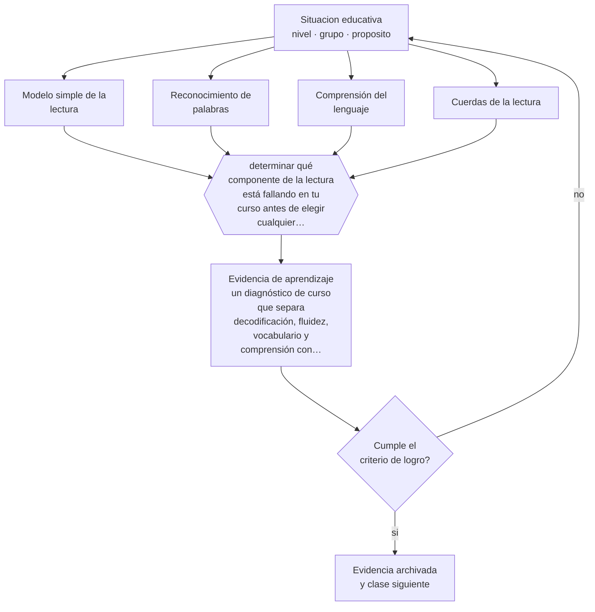

# Clase 217 — Qué resolvió la ciencia de la lectura

> **Parte 18 · Alfabetización inicial y ciencia de la lectura** — clase 1 de 12

**Estado de evidencia:** `ROBUSTA` · **Etapa:** 🟤 Etapa F — Especialización y desafíos contemporáneos · **Población de referencia:** parvularia y primer ciclo básico, con proyección a todo el sistema 
**Decisión que habilita:** determinar qué componente de la lectura está fallando en tu curso antes de elegir cualquier programa o material 
**Evidencia de aprendizaje:** un diagnóstico de curso que separa decodificación, fluidez, vocabulario y comprensión con evidencia para cada uno

## 🎯 Propósito

Establecer el modelo que ordena toda la parte: leer con comprensión exige decodificar y comprender el lenguaje, y ningún componente compensa la ausencia del otro.

## 📚 Resultados de aprendizaje

Al finalizar esta clase podrás:

1. **Definir** con precisión los cuatro conceptos centrales de la clase y reconocerlos en una situación educativa real, no solo en su enunciado.
2. **Explicar** por qué la lectura es el único aprendizaje escolar cuyo mecanismo cognitivo está esencialmente resuelto.
3. **Decidir** —qué componente de la lectura está fallando en tu curso antes de elegir cualquier programa o material— y sostener la decisión con un fundamento escrito.
4. **Producir** la evidencia de la clase —un diagnóstico de curso que separa decodificación, fluidez, vocabulario y comprensión con evidencia para cada uno— y contrastarla contra el criterio de logro.
5. **Distinguir** lo que la evidencia sostiene de lo que es práctica instalada, preferencia personal o costumbre de la institución.

## 🧭 Agenda sugerida (90 minutos)

| Minutos | Bloque | Qué ocurre |
|---:|---|---|
| 0–10 | Activación | Recuperar sin mirar la clase anterior y responder la pregunta de foco. |
| 10–25 | Conceptos | Definir los cuatro conceptos y reconocerlos en un caso real. |
| 25–45 | Modelo mental | Recorrer el método: delimitar el contexto y comprobar —no suponer— qué saben ya los estudiantes. |
| 45–70 | Ejemplo trabajado | Aplicar el método al caso de la parte, paso a paso y con evidencia. |
| 70–85 | Taller | Trasladar la decisión al contexto propio y anticipar su alternativa. |
| 85–90 | Cierre | Fijar responsable, plazo e indicador de la evidencia de aprendizaje. |

Fuera de la sesión, la clase exige aproximadamente **una hora y media** de práctica y de
producción de la evidencia. Si el tiempo se recorta, se recorta el ejemplo trabajado, nunca la
producción de evidencia: es la única parte que prueba el aprendizaje.

## 🧩 Conceptos centrales

| Concepto | Comprensión verificable |
|---|---|
| **Modelo simple de la lectura** | comprensión lectora entendida como producto de reconocimiento de palabras y comprensión del lenguaje: si uno vale cero, el producto vale cero |
| **Reconocimiento de palabras** | identificación rápida y automática de la forma escrita; se automatiza con enseñanza y práctica, no con exposición |
| **Comprensión del lenguaje** | capacidad de entender el mensaje oral; depende de vocabulario, sintaxis y conocimiento del mundo |
| **Cuerdas de la lectura** | representación de la lectura como hebras que se entrelazan y se automatizan a distinto ritmo, no como etapas sucesivas |

## 🧠 Modelo mental

El método de esta clase, en cinco pasos que se ejecutan en orden:

1. Delimitar el contexto y comprobar —no suponer— qué saben ya los estudiantes.
2. Clasificar la situación distinguiendo **Modelo simple de la lectura** de **Reconocimiento de palabras**.
3. Decidir con fundamento, usando **Comprensión del lenguaje** como criterio y declarando la fuente.
4. Anticipar qué evidencia confirmaría la decisión y cuál la refutaría, con **Cuerdas de la lectura** a la vista.
5. Registrar lo ocurrido y contrastarlo contra el criterio de logro antes de avanzar.

Lo que hace profesional a este método no son los pasos sino la evidencia que exige en cada uno.
Estas son las señales observables con las que se comprueba, y que deben quedar definidas **antes**
de recogerlas:

| Señal observable | Cómo se recoge y qué significa |
|---|---|
| **Evidencia de partida** | qué sabían o podían hacer los estudiantes antes de la decisión, comprobado y no supuesto |
| **Evidencia de proceso** | qué se observó mientras la decisión se aplicaba, con fecha, contexto y responsable del registro |
| **Evidencia de logro** | qué muestra un diagnóstico de curso que separa decodificación, fluidez, vocabulario y comprensión con evidencia para cada uno frente al criterio declarado de antemano |

**Frontera de aplicación.** El método vale mientras las condiciones que lo sostienen se cumplan.
El modelo simple es potente por su parsimonia y esa es también su limitación: Cuando esa condición falla, el paso siguiente no es forzar el método:
es declarar el límite y decidir con menos certeza, dejándolo por escrito.

## 🗺️ Flujo de razonamiento

## 📖 Desarrollo

### 1. El fondo del asunto

Durante décadas la enseñanza de la lectura se discutió como una cuestión de escuelas de pensamiento. La investigación cognitiva cambió el terreno: hoy se conoce con detalle qué hace el cerebro al leer, en qué se diferencia un lector hábil de uno que lucha, y qué enseñanza produce esa diferencia. El modelo simple de la lectura es la formulación más útil para el aula porque es multiplicativo: un estudiante que decodifica perfectamente y no entiende el lenguaje no comprende, y uno con enorme vocabulario que no decodifica tampoco. La consecuencia práctica es inmediata: la pregunta correcta nunca es si un estudiante lee mal, sino cuál de los dos componentes falla.

### 2. Frontera conceptual: qué es y qué no es

Los cuatro conceptos de esta clase se confunden entre sí con facilidad, y esa confusión no es
inocua: produce decisiones que atacan el problema equivocado. **Modelo simple de la lectura** no es lo
mismo que **Reconocimiento de palabras** —identificación rápida y automática de la forma escrita; se automatiza con enseñanza y práctica, no con exposición—, y tratarlos como sinónimos hace
que la intervención se dirija al lugar incorrecto. Del mismo modo, **Comprensión del lenguaje** y
**Cuerdas de la lectura** describen aspectos distintos de la misma situación: el primero
capacidad de entender el mensaje oral;, mientras el segundo representación de la lectura como hebras que se entrelazan y se automatizan a distinto ritmo, no como etapas sucesivas.

La prueba de que la distinción está entendida es operacional, no verbal: dos personas que
observan la misma clase deben poder clasificar el mismo episodio de la misma manera. Si no
coinciden, el problema está en la definición y no en el observador. El error de clasificación más
frecuente en esta materia es el primero de los que se listan más abajo, y conviene anticiparlo
antes de aplicar nada.

### 3. Cómo se observa y se mide

Nada de lo anterior sirve si no se puede observar. Estas son las señales que esta clase usa y
cómo se recogen:

- **Evidencia de partida.** Qué sabían o podían hacer los estudiantes antes de la decisión, comprobado y no supuesto. Se registra con fecha y contexto; sin eso, la señal no distingue una tendencia de una casualidad.
- **Evidencia de proceso.** Qué se observó mientras la decisión se aplicaba, con fecha, contexto y responsable del registro. Se registra con fecha y contexto; sin eso, la señal no distingue una tendencia de una casualidad.
- **Evidencia de logro.** Qué muestra un diagnóstico de curso que separa decodificación, fluidez, vocabulario y comprensión con evidencia para cada uno frente al criterio declarado de antemano. Se registra con fecha y contexto; sin eso, la señal no distingue una tendencia de una casualidad.

Ninguna de estas señales es el aprendizaje: son indicios de él. Confundir el indicio con el
fenómeno es el error clásico de la medición educativa, y por eso cada señal se interpreta junto
con el contexto, el punto de partida del grupo y lo que el propio estudiante puede explicar sobre
su trabajo.

### 4. Cómo se traduce en decisiones de enseñanza

Un diagnóstico profesional evalúa por separado. Se mide decodificación con palabras aisladas y pseudopalabras —que impiden adivinar—, fluidez con un texto conocido y cronómetro, vocabulario con una prueba de amplitud y comprensión con un texto que el estudiante pueda decodificar. La combinación de resultados define el perfil: dificultad específica de lectura, dificultad de comprensión, o ambas. Cada perfil tiene una respuesta distinta, y aplicar la respuesta equivocada consume el año escolar sin mover el resultado.

### 5. Qué sostiene la evidencia y qué no

El modelo simple es potente por su parsimonia y esa es también su limitación: no describe la motivación, el conocimiento previo específico del texto, ni el efecto acumulativo de leer o no leer durante años. Tampoco resuelve qué hacer, solo dónde mirar. Y su formulación original proviene del inglés: el español, ortográficamente transparente, hace que el componente de decodificación se resuelva antes y que el peso relativo del vocabulario aparezca más temprano.

> **Cómo leer el estado de evidencia `ROBUSTA`.** Hay evidencia convergente de varios equipos, países y diseños de investigación, incluidos estudios experimentales o cuasiexperimentales, y el efecto se sostiene al replicarlo. Puedes apoyar una decisión profesional en ella, sin olvidar que ningún efecto promedio describe a un estudiante concreto.

### 6. Integración: de los conceptos a una decisión defendible

Una decisión es defendible cuando puede explicarse a alguien que no estuvo presente. Esta clase
te deja en condiciones de qué componente de la lectura está fallando en tu curso antes de elegir cualquier programa o material, y esa decisión se sostiene solo si
declara cuatro cosas: la evidencia que la funda, el supuesto que asume, el indicador que la
comprobaría y la condición que la haría cambiar.

Ese es también el criterio con el que se evalúa la evidencia de aprendizaje de la clase. Un
análisis que podría copiarse a otra clase, a otro curso o a otro establecimiento sin cambiar una
palabra no es una decisión: es una declaración general, y el oficio empieza justo donde las
declaraciones generales terminan.

## 📚 Lectura comparada

Las obras no cumplen el mismo papel. Esta tabla indica qué lente aporta cada una;
después de leer, escribe una discrepancia real entre al menos dos fuentes.

| Fuente | Lente que aporta | Pregunta crítica |
|---|---|---|
| Castles, A., Rastle, K. & Nation, K. (2018). *Ending the Reading Wars*. | la síntesis que ordena qué está resuelto, qué sigue abierto y por qué la discusión pública va atrasada. | ¿Qué supuesto de esta clase ayuda a poner a prueba? |
| Seidenberg, M. (2017). *Language at the Speed of Sight*. | el mecanismo cognitivo explicado con suficiente detalle para juzgar métodos por su fundamento. | ¿Qué supuesto de esta clase ayuda a poner a prueba? |

La lectura se evalúa por **uso**, no por cantidad de páginas. Tu nota de lectura debe indicar qué
tesis modifica tu diagnóstico, qué evidencia del caso la tensiona y qué decisión concreta
cambiarías después del contraste. Una nota que solo resume el texto no cumple el criterio.

## 🧮 Ejemplo trabajado

**Situación.** En 3.º básico, 11 de 32 estudiantes leen bajo 60 palabras por minuto y el establecimiento no tiene registro de fluidez de años anteriores. La escuela compró un programa comercial de comprensión lectora sin haber medido decodificación.

**Paso 1 — Delimitar el contexto y comprobar —no suponer— qué saben ya los estudiantes.** El equipo escribe primero el supuesto asociado a **Modelo simple de la lectura** y se prohíbe tratarlo como hecho. Contrasta ese supuesto con **Evidencia de partida** y anota qué parte del dato todavía no existe. Del paso sale un registro fechado y una frase explícita: «cambiaríamos de decisión si…».

**Paso 2 — Clasificar la situación distinguiendo Modelo simple de la lectura de Reconocimiento de palabras.** El trabajo aquí es separar lo observado de lo interpretado sobre **Reconocimiento de palabras**. La evidencia que ordena la conversación es **Evidencia de proceso**; si su definición no está escrita, escribirla es parte del paso. Nada avanza mientras el equipo no acuerde qué contaría como refutación.

**Paso 3 — Decidir con fundamento, usando Comprensión del lenguaje como criterio y declarando la fuente.** El riesgo de este paso es cerrar demasiado rápido alrededor de **Comprensión del lenguaje**. Antes de concluir, se enumeran dos explicaciones alternativas del mismo patrón y se revisa si **Evidencia de logro** logra distinguirlas. Si no lo logra, hace falta otra evidencia y así debe quedar registrado.

**Paso 4 — Anticipar qué evidencia confirmaría la decisión y cuál la refutaría, con Cuerdas de la lectura a la vista.** Con **Cuerdas de la lectura** ya delimitado, la pregunta pasa a ser de consecuencia: qué cambia para los estudiantes, para el tiempo de clase y para la carga del equipo. **Evidencia de partida** entrega la lectura observable; el juicio profesional sigue siendo humano y debe quedar firmado por quien lo hace.

**Paso 5 — Registrar lo ocurrido y contrastarlo contra el criterio de logro antes de avanzar.** El cierre exige compromiso: responsable, fecha, indicador de logro y condición de detención. **Evidencia de proceso** se convierte en la señal de seguimiento, y se acuerda con qué frecuencia se revisa y quién puede declarar que no funcionó sin costo político.

**Síntesis.** La recomendación termina con responsable, fecha, evidencia de logro y señal de
detención. Omitir cualquiera de esas cuatro piezas convierte el análisis en una opinión que nadie
podrá auditar dentro de tres meses, y que por lo tanto nadie corregirá.

## 🔀 Comparación de caminos y límites

Ante la misma situación caben varios cursos de acción. La decisión profesional no es
elegir el «correcto», sino saber qué privilegia cada uno y qué arriesga.

| Camino | Qué privilegia | Cuándo elegirlo | Riesgo principal |
|---|---|---|---|
| Intervenir sobre **Modelo simple de la lectura** | Comprensión lectora entendida como producto de reconocimiento de palabras y comprensión del lenguaje: si uno vale cero, el producto vale cero | Cuando **Evidencia de partida** es observable y accionable dentro del plazo de la decisión. | Sobrerreaccionar a una señal parcial. |
| Intervenir sobre **Reconocimiento de palabras** | Identificación rápida y automática de la forma escrita; se automatiza con enseñanza y práctica, no con exposición | Cuando la primera explicación no distingue mecanismo ni responsable. | Convertir el concepto en etiqueta y no en intervención. |
| Observar antes de decidir | Reducir la incertidumbre antes de comprometer tiempo y credibilidad | Cuando la decisión es reversible y la evidencia disponible no distingue causas. | Observar indefinidamente y no decidir nunca. |
| Derivar o escalar | Poner la decisión donde están la competencia y la responsabilidad | Cuando hay normativa, resguardo de datos, salud o vulneración de derechos en juego. | Delegar hacia arriba lo que sí correspondía decidir en el aula. |

**Frontera de aplicación.** El modelo simple es potente por su parsimonia y esa es también su limitación: Fuera de esa frontera, la comparación
anterior deja de ser válida y la decisión debe tomarse con evidencia distinta.

## 🪜 El mismo tema según el rol

La misma materia cambia de forma según quién decida. Al subir de nivel aumentan las
personas, el tiempo y las consecuencias que quedan dentro de la decisión.

| Nivel | Responsabilidad sobre qué resolvió la ciencia de la lectura |
|---|---|
| **Docente de aula** | Aplica, observa y registra la evidencia; declara qué no puede resolver desde su rol. |
| **Equipo de apoyo o educación diferencial** | Verifica que la decisión no deje fuera a quien más barreras enfrenta y aporta los apoyos. |
| **Jefatura técnico-pedagógica** | Convierte la decisión en criterio compartido, tiempo protegido y acompañamiento. |
| **Dirección** | Decide si esto cambia condiciones institucionales, recursos o el plan de mejora. |
| **Formación e investigación** | Pregunta si la decisión es generalizable, con qué evidencia y qué haría falta para probarlo. |

Si trabajas en uno de esos niveles, la [guía de carrera de tu rol](../../../rutas/README.md)
indica en qué orden conviene recorrer el programa y qué artefactos acreditan tu competencia.

## 🧪 Taller guiado

Aplica la clase a **uno** de los contextos siguientes y repite después el ejercicio en un
contexto de exigencia distinta. Cambiar de contexto es parte del aprendizaje: lo que funciona
con un grupo no se traslada intacto a otro.

| Contexto | Rasgo que cambia la decisión |
|---|---|
| Nivel de transición en jardín | el trabajo es oral y fonológico, no de lápiz y papel |
| Primero y segundo básico | es la ventana donde la enseñanza sistemática rinde más |
| Tercero y cuarto básico | hay que enseñar a leer y avanzar en contenido al mismo tiempo |
| Curso con lectores muy dispares | la respuesta es agrupamiento flexible, no una sola clase para todos |
| Escuela rural multigrado | la práctica de fluidez se organiza en parejas y turnos |
| Educación media con deuda lectora | se interviene por componentes, sin infantilizar el material |

**Secuencia de trabajo:**

1. Delimita el contexto: nivel, edad, tamaño del grupo, asignatura o experiencia y tiempo real disponible.
2. Declara qué saben ya los estudiantes y **cómo lo comprobaste**, no cómo lo supones.
3. Formula la decisión pedagógica que esta clase habilita y escribe su fundamento.
4. Anticipa qué observarías si la decisión funciona y qué observarías si no funciona.
5. Diseña de antemano la alternativa que aplicarás si la primera estrategia falla.
6. Ejecuta o simula, y registra lo observado con fecha, contexto y evidencia concreta.
7. Produce la evidencia de aprendizaje de la clase.
8. Contrástala contra el criterio de logro, corrige y recién entonces avanza.

## 🏫 Caso profesional

**Situación.** En 3.º básico, 11 de 32 estudiantes leen bajo 60 palabras por minuto y el establecimiento no tiene registro de fluidez de años anteriores. La escuela compró un programa comercial de comprensión lectora sin haber medido decodificación.

Entrega un **informe de decisión** de una página que contenga:

1. **Hechos y fuentes** — qué está documentado y con qué evidencia, separado de lo que se supone.
2. **Hipótesis** — la explicación más probable y una alternativa que también encajaría.
3. **Dos opciones defendibles** — no una recomendación y un espantapájaros.
4. **Efecto esperado** — sobre los estudiantes, el tiempo de clase, el equipo y los apoyos.
5. **Recomendación** — con su fundamento y la fuente que la respalda.
6. **Condición de revisión** — qué resultado te haría cambiar de decisión.
7. **Responsable y fecha** — quién ejecuta y cuándo se revisa.

Usa al menos **dos** fuentes de la lectura comparada para desafiar tu primera respuesta. Una
recomendación que ninguna fuente pone en duda casi siempre está poco examinada.

## 📥 Evidencia de aprendizaje

Un diagnóstico de curso que separa decodificación, fluidez, vocabulario y comprensión con evidencia para cada uno.

Guárdala en `evidence/P18-C217-que-resolvio-la-ciencia-de-la-lectura/` con estos archivos:

| Archivo | Qué contiene |
|---|---|
| `decision.md` | contexto, decisión, fundamento, fuentes con fecha, indicador de logro y riesgos |
| `senales.md` | definición operacional de las tres señales, cómo se recogieron y qué no distinguen |
| `nota-de-lectura.md` | dos fuentes contrastadas, con edición y páginas consultadas |
| `revision-critica.md` | la objeción más fuerte a tu decisión y qué evidencia la invalidaría |

Esta evidencia alimenta el artefacto de la parte: **plan lector con progresión por componentes, medición de fluidez y criterio de derivación a intervención intensiva**.

## 🏆 Reto verificable

Aplica a cinco estudiantes de tu curso una medición separada de decodificación y de comprensión. Compara los perfiles y escribe qué harías distinto con cada uno la próxima semana.

## ✅ Evaluación de la clase

| Criterio | Peso | Evidencia esperada |
|---|---:|---|
| Precisión conceptual | 25 % | Distinciones correctas y observables entre los cuatro conceptos, aplicadas a un caso real. |
| Diagnóstico y evidencia | 30 % | Conocimiento previo comprobado, evidencia recogida con fecha y contexto, y límites del dato declarados. |
| Decisión y alternativas | 30 % | Decisión fundada, alternativa prevista si falla, y condición explícita que la haría cambiar. |
| Responsabilidad y comunicación | 15 % | Diversidad y resguardos considerados, fuentes citadas y evidencia archivada de forma reproducible. |

**Aprobación:** 80 de 100 y ningún criterio bajo el 60 %. Una respuesta que podría copiarse sin
cambios a otra clase, a otro curso o a otro establecimiento se considera insuficiente, aunque
esté bien escrita.

**Criterio de logro de la evidencia:**

- [ ] el diagnóstico presenta evidencia separada para al menos tres componentes;
- [ ] el perfil de cada grupo de estudiantes se traduce en una decisión distinta;
- [ ] cada afirmación sobre «lo que funciona» está atribuida a una fuente identificable, con autor y fecha;
- [ ] la decisión es ejecutable con el tiempo, el espacio, el número de estudiantes y los recursos que realmente tienes;
- [ ] la evidencia queda archivada de forma reproducible: otra persona podría revisarla sin que tú se la expliques.

## ⚠️ Errores frecuentes

**Propios de esta clase:**

- Diagnosticar la lectura con una sola prueba de comprensión y concluir que el problema es comprender.
- Interpretar el modelo como una secuencia de etapas: primero decodificar, después comprender.

**Característicos de la parte 18:**

- Comprar un programa de comprensión sin haber medido decodificación ni fluidez.
- Trasladar sin ajuste los plazos de la investigación anglosajona al español, que es ortográficamente transparente.

Los cuatro comparten estructura: un síntoma visible, una causa que no se ve y una corrección que
casi siempre es de diseño y no de esfuerzo. Antes de atribuir el problema a los estudiantes o a
ti, comprueba cuál de ellos está operando y qué evidencia lo distinguiría de los otros tres.

## ♿ Diversidad, accesibilidad y ética

Diagnosticar por componentes es lo que evita atribuir a desinterés o a falta de apoyo familiar lo que es una dificultad específica y tratable. Los estudiantes con más riesgo son también los que más se perjudican con métodos que confían en la adivinación por contexto, porque carecen de la base para adivinar bien.

Antes de aplicar cualquier decisión de esta clase con estudiantes reales, revisa el
[protocolo de práctica responsable](../../../docs/ETICA_Y_PRACTICA_RESPONSABLE.md):
consentimiento, resguardo de datos personales, proporcionalidad de la intervención y derecho
de cada estudiante a no ser objeto de un ensayo que no le reporta beneficio.

## 🇨🇱 Contexto chileno y cumplimiento

Riesgo característico de esta parte: **Comprar un programa de comprensión sin haber medido decodificación ni fluidez.** Antes de aplicar
cualquier decisión de esta clase en un establecimiento real, verifica el marco vigente:

- Marco institucional y normativo: [`docs/MARCO_CHILE.md`](../../../docs/MARCO_CHILE.md).
- Inclusión y apoyos: [`docs/INCLUSION_Y_DUA.md`](../../../docs/INCLUSION_Y_DUA.md).
- Datos personales, IA y resguardos: [`docs/IA_EN_EDUCACION.md`](../../../docs/IA_EN_EDUCACION.md).
- Fuentes oficiales con cómo leerlas: [`docs/FUENTES.md`](../../../docs/FUENTES.md).

La regla del programa es simple: **la fuente oficial manda sobre el material pedagógico**. Si la
norma cambió después de la fecha de esta clase, gana la norma.

## ❓ Preguntas de comprobación

1. ¿Qué evidencia tienes hoy de la decodificación de tu curso, distinta de la nota de lenguaje?
2. ¿Cuántos de tus estudiantes decodifican bien y comprenden mal, y qué haces distinto con ellos?
3. ¿Qué decisión cambiaría si supieras que el problema es de vocabulario y no de decodificación?

## 📗 Fuentes y verificación

- Castles, A., Rastle, K. & Nation, K. (2018). *Ending the Reading Wars*. **Uso en esta clase:** la síntesis que ordena qué está resuelto, qué sigue abierto y por qué la discusión pública va atrasada. Lectura selectiva: índice y capítulos pertinentes; registra edición y páginas consultadas.
- Seidenberg, M. (2017). *Language at the Speed of Sight*. **Uso en esta clase:** el mecanismo cognitivo explicado con suficiente detalle para juzgar métodos por su fundamento. Lectura selectiva: índice y capítulos pertinentes; registra edición y páginas consultadas.

Catálogo completo: [bibliografía del programa](../../../docs/BIBLIOGRAFIA.md) ·
[glosario](../../../docs/GLOSARIO.md) ·
[fuentes oficiales y cómo leerlas](../../../docs/FUENTES.md).

> **Regla de fuentes.** Las obras anteriores estructuran las perspectivas de esta materia.
> Cualquier norma, decreto, orientación ministerial o política institucional mencionada debe
> comprobarse en su fuente primaria vigente antes de usarse con estudiantes reales. El desarrollo
> de esta clase es original y no reproduce capítulos protegidos por derechos de autor.

## 🔗 Conexión con el resto del programa

Abre la parte 18 y da el marco a las once clases siguientes. Retoma la clase 049 y la 040, y sostiene todo el trabajo de la parte 04.

> [!IMPORTANT]
> Material de formación profesional. No reemplaza un título de pedagogía, una habilitación
> legal para ejercer, ni el juicio de un equipo educativo que conoce a sus estudiantes.

---

| Anterior | Índice | Siguiente |
|---|---|---|
| [← Parte 18](../README.md) | [Parte 18](../README.md) · [Programa](../../../README.md) | [218 · Conciencia fonológica y principio alfabético →](../class-02-conciencia-fonologica-y-principio-alfabetico/README.md) |
