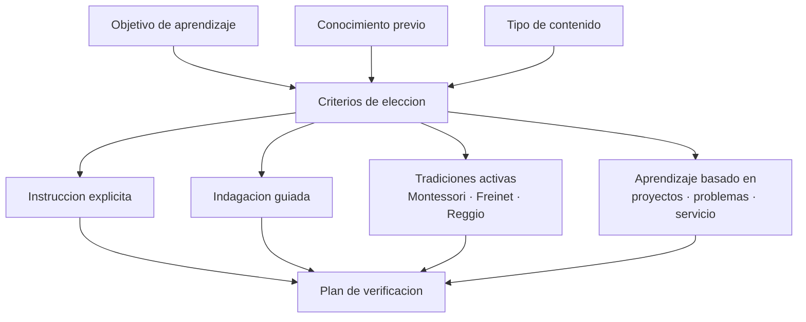

# Parte 19 — Metodologías y enfoques pedagógicos

> *Ningún enfoque es bueno en abstracto: lo es para un objetivo, un contenido y unos estudiantes*

🟤 **Etapa F — Especialización y desafíos contemporáneos** · salida de la etapa: resolver los problemas que efectivamente aparecen en el aula chilena de hoy

**Clases:** 12 (229–240) · **Población de referencia:** transversal, de parvularia a educación superior · **Conceptos operacionales:** 48 · **Señales observables:** 36 
**Contenido central:** Criterios para comparar enfoques, instrucción explícita, indagación guiada, tradiciones conductista, cognitivista y constructivista, Montessori, Waldorf, Reggio Emilia, Freinet, Escuela Nueva, pedagogía crítica, aprendizaje basado en proyectos y problemas, aprendizaje-servicio, gamificación y enfoque por competencias

## 🎯 De qué trata esta parte

La conversación sobre métodos suele plantearse como una guerra de bandos: enseñanza directa contra descubrimiento, tradicional contra innovador. Esa forma de discutir impide decidir. Lo que la evidencia muestra es más incómodo y más útil: la eficacia de un enfoque depende del objetivo perseguido, del conocimiento previo del estudiante y de la naturaleza del contenido. El mismo método que funciona con expertos perjudica a novatos.

Esta parte entrega criterios de comparación antes que catálogos. Cada enfoque se examina por lo que asume sobre el aprendizaje, por lo que exige para funcionar, por la evidencia que lo respalda y por lo que se pierde al adoptarlo. Las tradiciones históricas —Montessori, Waldorf, Reggio, Freinet, Escuela Nueva— se tratan con la misma seriedad: qué elemento transfiere a un aula chilena con 35 estudiantes y qué elemento solo funciona en el sistema que lo creó.

El resultado esperado no es adherir a una escuela de pensamiento sino poder defender una decisión metodológica ante un consejo de profesores: por qué este enfoque, para qué objetivo, con qué condiciones y cómo sabremos si funcionó.

## 🏫 Caso de la parte

Las doce clases trabajan sobre la misma realidad, para que puedas ver cómo cambia tu diagnóstico
a medida que avanzas:

> El equipo directivo pide adoptar «aprendizaje basado en proyectos en todas las asignaturas» tras una charla. Dos docentes ya lo aplican con resultados opuestos y nadie ha definido qué se esperaba que mejorara.

**Artefacto que produces al terminar:** decisión metodológica escrita con criterios de elección, condiciones de implementación y plan de verificación.

## 📚 Resultados de la parte

Al terminar esta parte podrás:

1. **Comparar dos enfoques pedagógicos con criterios explícitos y no por afinidad**.
2. **Elegir método según objetivo, conocimiento previo y tipo de contenido**.
3. **Reconocer qué exige cada enfoque para funcionar y qué pasa cuando esa condición falta**.
4. **Distinguir el núcleo transferible de una tradición pedagógica de su envoltorio cultural**.
5. **Defender una decisión metodológica con un plan de verificación asociado**.

## 🗺️ Mapa de la parte

## 🧠 Marco de referencia

- efecto de reversión por conocimiento previo: lo que ayuda al novato estorba al experto
- carga cognitiva y guía durante la instrucción como variable central del debate
- tradiciones pedagógicas históricas y su núcleo transferible
- condiciones de implementación: sin ellas, el método declarado no es el método ejecutado

**Autoras y autores que conviene conocer:** Richard Mayer, John Sweller, Paul Kirschner, Jerome Bruner, María Montessori, Célestin Freinet, Loris Malaguzzi, Paulo Freire, Barbara Means y equipos de revisión sistemática

## 📋 Las 12 clases

| # | Clase | Decisión que habilita | Evidencia |
|---:|---|---|---|
| 229 | [Cómo se compara un enfoque pedagógico](class-01-como-se-compara-un-enfoque-pedagogico/README.md) | determinar con qué criterios vas a comparar dos enfoques antes de elegir uno para tu curso | `CONSISTENTE` |
| 230 | [Instrucción explícita y enseñanza directa](class-02-instruccion-explicita-y-ensenanza-directa/README.md) | determinar cuándo tu contenido exige instrucción explícita y qué parte de su estructura estás omitiendo | `ROBUSTA` |
| 231 | [Indagación y descubrimiento guiado](class-03-indagacion-y-descubrimiento-guiado/README.md) | determinar cuánta guía necesita tu actividad de indagación y en qué momento se retira | `EN-DEBATE` |
| 232 | [Conductismo, cognitivismo y constructivismo](class-04-conductismo-cognitivismo-y-constructivismo/README.md) | determinar qué supuesto sobre el aprendizaje está detrás de la práctica que usas todos los días | `CONSISTENTE` |
| 233 | [Montessori, Waldorf y Reggio Emilia](class-05-montessori-waldorf-y-reggio-emilia/README.md) | determinar qué elemento de estas tradiciones puedes adoptar con las condiciones que efectivamente tienes | `PRACTICA-PROFESIONAL` |
| 234 | [Freinet, Escuela Nueva y pedagogías activas](class-06-freinet-escuela-nueva-y-pedagogias-activas/README.md) | determinar qué dispositivo de las pedagogías activas resuelve un problema real de tu aula | `PRACTICA-PROFESIONAL` |
| 235 | [Pedagogía crítica y educación popular](class-07-pedagogia-critica-y-educacion-popular/README.md) | determinar qué contenido de tu asignatura cambia cuando se pregunta a quién sirve el conocimiento que enseñas | `EN-DEBATE` |
| 236 | [Familias del aprendizaje basado en algo](class-08-familias-del-aprendizaje-basado-en-algo/README.md) | determinar cuál de estas familias corresponde a tu objetivo y qué exige para funcionar | `CONSISTENTE` |
| 237 | [Aprendizaje-servicio y vínculo comunitario](class-09-aprendizaje-servicio-y-vinculo-comunitario/README.md) | determinar si tu actividad comunitaria tiene aprendizaje declarado, servicio real y reciprocidad, o solo una de las tres | `EMERGENTE` |
| 238 | [Gamificación y juego serio](class-10-gamificacion-y-juego-serio/README.md) | determinar si tu actividad necesita mecánicas de juego o si el problema real es de sentido de la tarea | `EN-DEBATE` |
| 239 | [Enfoque por competencias y su coherencia](class-11-enfoque-por-competencias-y-su-coherencia/README.md) | determinar si tu programa por competencias tiene evaluación de desempeño o solo contenidos renombrados | `MARCO-NORMATIVO` |
| 240 | [Proyecto integrador: decisión metodológica fundamentada](class-12-proyecto-integrador/README.md) | determinar el enfoque que adoptarás, con qué condiciones y cómo sabrás si funcionó | `PRACTICA-PROFESIONAL` |

## ⚠️ Riesgos característicos

- Adoptar un enfoque por moda institucional y evaluarlo con criterios de otro.
- Confundir actividad visible con aprendizaje: estudiantes ocupados no son estudiantes aprendiendo.
- Aplicar métodos de guía mínima con estudiantes que aún no tienen la base para orientarse.
- Importar una tradición completa sin las condiciones materiales y de formación que la sostienen.

## 📕 Lecturas de referencia de la parte

- **Kirschner, P., Sweller, J. & Clark, R. (2006). *Why Minimal Guidance During Instruction Does Not Work*.** — el argumento más fuerte contra la guía mínima; hay que leerlo junto a sus réplicas, no en lugar de ellas. **Localizar:** [DOI 10.1207/s15326985ep4102_1](https://doi.org/10.1207/s15326985ep4102_1) · [ficha](../../docs/REGISTRO_DE_FUENTES.md#kirschner-sweller-2006-why-minimal-guidance-during-instruction-does-2)
- **Mayer, R. (2004). *Should There Be a Three-Strikes Rule Against Pure Discovery Learning?*** — distingue descubrimiento puro de descubrimiento guiado, que es la distinción que decide el resultado. **Localizar:** [DOI 10.1037/0003-066x.59.1.14](https://doi.org/10.1037/0003-066x.59.1.14) · [ficha](../../docs/REGISTRO_DE_FUENTES.md#mayer-2004-should-there-be-a-three-strikes)
- **Freire, P. (1970). *Pedagogía del oprimido*.** — obliga a preguntar para qué y para quién se enseña, algo que ningún método técnico responde. **Localizar:** [ISBN 9789871220106](https://openlibrary.org/isbn/9789871220106) · [ficha](../../docs/REGISTRO_DE_FUENTES.md#freire-1970-pedagogia-del-oprimido)
- **Rinaldi, C. (2006). *In Dialogue with Reggio Emilia*.** — muestra una tradición viva por dentro, con sus condiciones institucionales a la vista. **Localizar:** [ISBN 9780415345040](https://openlibrary.org/isbn/9780415345040) · [ficha](../../docs/REGISTRO_DE_FUENTES.md#rinaldi-2006-in-dialogue-with-reggio-emilia)

## ✅ Evidencia mínima para dar la parte por cerrada

- [ ] una comparación escrita de dos enfoques para un mismo objetivo, con criterios declarados;
- [ ] el registro de una clase ejecutada con el enfoque elegido y su análisis posterior;
- [ ] la lista de condiciones de implementación verificadas antes de decidir;
- [ ] la decisión metodológica final con su plan de verificación.

## 🧭 Práctica y evaluación de la parte

- [Rúbrica maestra e instrumentos de autoevaluación](../../assessments/README.md)
- [Casos profesionales para resolver con este marco](../../cases/README.md)
- [Laboratorios de decisión](../../labs/README.md)
- [Dónde se archiva la evidencia](../../evidence/README.md)

---

| Anterior | Índice | Siguiente |
|---|---|---|
| [← Parte 18 · Alfabetización inicial y ciencia de la lectura](../part-18-alfabetizacion-inicial-y-ciencia-de-la-lectura/README.md) | [Programa](../../README.md) · [Currículo](../../CURRICULUM.md) | [Parte 20 · Estrategias pedagógicas para necesidades educativas específicas →](../part-20-estrategias-pedagogicas-para-necesidades-educativas-especificas/README.md) |
