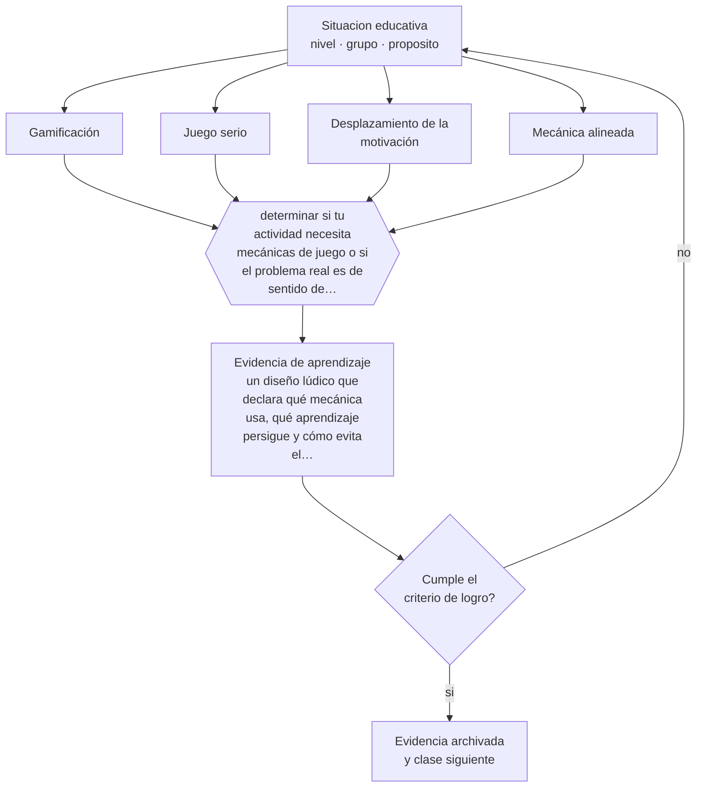

# Clase 238 — Gamificación y juego serio

> **Parte 19 · Metodologías y enfoques pedagógicos** — clase 10 de 12

**Estado de evidencia:** `EN-DEBATE` · **Etapa:** 🟤 Etapa F — Especialización y desafíos contemporáneos · **Población de referencia:** transversal, de parvularia a educación superior 
**Decisión que habilita:** determinar si tu actividad necesita mecánicas de juego o si el problema real es de sentido de la tarea 
**Evidencia de aprendizaje:** un diseño lúdico que declara qué mecánica usa, qué aprendizaje persigue y cómo evita el desplazamiento de la motivación

## 🎯 Propósito

Distinguir gamificación superficial de diseño de juego con propósito de aprendizaje, y anticipar el efecto sobre la motivación de largo plazo.

## 📚 Resultados de aprendizaje

Al finalizar esta clase podrás:

1. **Definir** con precisión los cuatro conceptos centrales de la clase y reconocerlos en una situación educativa real, no solo en su enunciado.
2. **Explicar** por qué los puntos y las insignias funcionan al principio y con qué costo lo hacen.
3. **Decidir** —si tu actividad necesita mecánicas de juego o si el problema real es de sentido de la tarea— y sostener la decisión con un fundamento escrito.
4. **Producir** la evidencia de la clase —un diseño lúdico que declara qué mecánica usa, qué aprendizaje persigue y cómo evita el desplazamiento de la motivación— y contrastarla contra el criterio de logro.
5. **Distinguir** lo que la evidencia sostiene de lo que es práctica instalada, preferencia personal o costumbre de la institución.

## 🧭 Agenda sugerida (90 minutos)

| Minutos | Bloque | Qué ocurre |
|---:|---|---|
| 0–10 | Activación | Recuperar sin mirar la clase anterior y responder la pregunta de foco. |
| 10–25 | Conceptos | Definir los cuatro conceptos y reconocerlos en un caso real. |
| 25–45 | Modelo mental | Recorrer el método: delimitar el contexto y comprobar —no suponer— qué saben ya los estudiantes. |
| 45–70 | Ejemplo trabajado | Aplicar el método al caso de la parte, paso a paso y con evidencia. |
| 70–85 | Taller | Trasladar la decisión al contexto propio y anticipar su alternativa. |
| 85–90 | Cierre | Fijar responsable, plazo e indicador de la evidencia de aprendizaje. |

Fuera de la sesión, la clase exige aproximadamente **una hora y media** de práctica y de
producción de la evidencia. Si el tiempo se recorta, se recorta el ejemplo trabajado, nunca la
producción de evidencia: es la única parte que prueba el aprendizaje.

## 🧩 Conceptos centrales

| Concepto | Comprensión verificable |
|---|---|
| **Gamificación** | incorporación de mecánicas de juego —puntos, niveles, insignias— a una actividad que no es un juego |
| **Juego serio** | juego diseñado desde el inicio con propósito de aprendizaje, donde la mecánica es el contenido |
| **Desplazamiento de la motivación** | efecto por el cual una recompensa externa reduce el interés intrínseco previo por la tarea |
| **Mecánica alineada** | elemento de juego cuya lógica coincide con el aprendizaje perseguido y no solo con la conducta de participar |

## 🧠 Modelo mental

El método de esta clase, en cinco pasos que se ejecutan en orden:

1. Delimitar el contexto y comprobar —no suponer— qué saben ya los estudiantes.
2. Clasificar la situación distinguiendo **Gamificación** de **Juego serio**.
3. Decidir con fundamento, usando **Desplazamiento de la motivación** como criterio y declarando la fuente.
4. Anticipar qué evidencia confirmaría la decisión y cuál la refutaría, con **Mecánica alineada** a la vista.
5. Registrar lo ocurrido y contrastarlo contra el criterio de logro antes de avanzar.

Lo que hace profesional a este método no son los pasos sino la evidencia que exige en cada uno.
Estas son las señales observables con las que se comprueba, y que deben quedar definidas **antes**
de recogerlas:

| Señal observable | Cómo se recoge y qué significa |
|---|---|
| **Evidencia de partida** | qué sabían o podían hacer los estudiantes antes de la decisión, comprobado y no supuesto |
| **Evidencia de proceso** | qué se observó mientras la decisión se aplicaba, con fecha, contexto y responsable del registro |
| **Evidencia de logro** | qué muestra un diseño lúdico que declara qué mecánica usa, qué aprendizaje persigue y cómo evita el desplazamiento de la motivación frente al criterio declarado de antemano |

**Frontera de aplicación.** El método vale mientras las condiciones que lo sostienen se cumplan.
La evidencia es heterogénea y está afectada por publicación selectiva y por estudios de corta duración que capturan el efecto de novedad. Cuando esa condición falla, el paso siguiente no es forzar el método:
es declarar el límite y decidir con menos certeza, dejándolo por escrito.

## 🗺️ Flujo de razonamiento

## 📖 Desarrollo

### 1. El fondo del asunto

La gamificación produce efectos iniciales visibles sobre participación y conducta, y ese efecto tiende a decaer. La discusión seria no es si motiva, sino qué motiva: casi siempre motiva a obtener el punto, y solo a veces a aprender el contenido. La distinción clave es entre mecánica alineada y mecánica agregada. Cuando el juego encarna la estructura del contenido —resolver el juego es entender el concepto—, el efecto es sobre el aprendizaje; cuando el juego solo premia la ejecución de tareas, el efecto es sobre la conducta.

### 2. Frontera conceptual: qué es y qué no es

Los cuatro conceptos de esta clase se confunden entre sí con facilidad, y esa confusión no es
inocua: produce decisiones que atacan el problema equivocado. **Gamificación** no es lo
mismo que **Juego serio** —juego diseñado desde el inicio con propósito de aprendizaje, donde la mecánica es el contenido—, y tratarlos como sinónimos hace
que la intervención se dirija al lugar incorrecto. Del mismo modo, **Desplazamiento de la motivación** y
**Mecánica alineada** describen aspectos distintos de la misma situación: el primero
efecto por el cual una recompensa externa reduce el interés intrínseco previo por la tarea, mientras el segundo elemento de juego cuya lógica coincide con el aprendizaje perseguido y no solo con la conducta de participar.

La prueba de que la distinción está entendida es operacional, no verbal: dos personas que
observan la misma clase deben poder clasificar el mismo episodio de la misma manera. Si no
coinciden, el problema está en la definición y no en el observador. El error de clasificación más
frecuente en esta materia es el primero de los que se listan más abajo, y conviene anticiparlo
antes de aplicar nada.

### 3. Cómo se observa y se mide

Nada de lo anterior sirve si no se puede observar. Estas son las señales que esta clase usa y
cómo se recogen:

- **Evidencia de partida.** Qué sabían o podían hacer los estudiantes antes de la decisión, comprobado y no supuesto. Se registra con fecha y contexto; sin eso, la señal no distingue una tendencia de una casualidad.
- **Evidencia de proceso.** Qué se observó mientras la decisión se aplicaba, con fecha, contexto y responsable del registro. Se registra con fecha y contexto; sin eso, la señal no distingue una tendencia de una casualidad.
- **Evidencia de logro.** Qué muestra un diseño lúdico que declara qué mecánica usa, qué aprendizaje persigue y cómo evita el desplazamiento de la motivación frente al criterio declarado de antemano. Se registra con fecha y contexto; sin eso, la señal no distingue una tendencia de una casualidad.

Ninguna de estas señales es el aprendizaje: son indicios de él. Confundir el indicio con el
fenómeno es el error clásico de la medición educativa, y por eso cada señal se interpreta junto
con el contexto, el punto de partida del grupo y lo que el propio estudiante puede explicar sobre
su trabajo.

### 4. Cómo se traduce en decisiones de enseñanza

El diseño responsable empieza por preguntarse si el problema es de motivación o de sentido. Si la tarea carece de propósito, agregarle puntos disfraza el problema sin resolverlo. Cuando la gamificación se justifica, conviene alinear la mecánica con el aprendizaje, evitar rankings públicos que desmotivan a la mayoría, y planificar la retirada de las recompensas antes de instalarlas. Los juegos serios bien diseñados son otra cosa y su evidencia es más favorable, aunque su costo de desarrollo es alto.

### 5. Qué sostiene la evidencia y qué no

La evidencia es heterogénea y está afectada por publicación selectiva y por estudios de corta duración que capturan el efecto de novedad. El desplazamiento de la motivación intrínseca está documentado sobre todo en tareas que ya interesaban al estudiante, y es menos claro en tareas que no interesaban a nadie. Y los rankings públicos tienen efectos asimétricos: motivan a quienes van adelante y desmotivan a quienes no.

> **Cómo leer el estado de evidencia `EN-DEBATE`.** Hay desacuerdo activo y publicado entre especialistas competentes. La clase presenta las posiciones y sus argumentos; tu tarea no es escoger un bando, sino saber qué evidencia te haría cambiar de posición.

### 6. Integración: de los conceptos a una decisión defendible

Una decisión es defendible cuando puede explicarse a alguien que no estuvo presente. Esta clase
te deja en condiciones de si tu actividad necesita mecánicas de juego o si el problema real es de sentido de la tarea, y esa decisión se sostiene solo si
declara cuatro cosas: la evidencia que la funda, el supuesto que asume, el indicador que la
comprobaría y la condición que la haría cambiar.

Ese es también el criterio con el que se evalúa la evidencia de aprendizaje de la clase. Un
análisis que podría copiarse a otra clase, a otro curso o a otro establecimiento sin cambiar una
palabra no es una decisión: es una declaración general, y el oficio empieza justo donde las
declaraciones generales terminan.

## 📚 Lectura comparada

Las obras no cumplen el mismo papel. Esta tabla indica qué lente aporta cada una;
después de leer, escribe una discrepancia real entre al menos dos fuentes.

| Fuente | Lente que aporta | Pregunta crítica |
|---|---|---|
| Deci, E. & Ryan, R. (2000). *Self-Determination Theory*. | explica el mecanismo del desplazamiento motivacional y sus condiciones. | ¿Qué supuesto de esta clase ayuda a poner a prueba? |
| Hamari, J., Koivisto, J. & Sarsa, H. (2014). *Does Gamification Work?* | revisión que muestra la heterogeneidad de resultados y la debilidad de muchos diseños. | ¿Qué supuesto de esta clase ayuda a poner a prueba? |

La lectura se evalúa por **uso**, no por cantidad de páginas. Tu nota de lectura debe indicar qué
tesis modifica tu diagnóstico, qué evidencia del caso la tensiona y qué decisión concreta
cambiarías después del contraste. Una nota que solo resume el texto no cumple el criterio.

## 🧮 Ejemplo trabajado

**Situación.** El equipo directivo pide adoptar «aprendizaje basado en proyectos en todas las asignaturas» tras una charla. Dos docentes ya lo aplican con resultados opuestos y nadie ha definido qué se esperaba que mejorara.

**Paso 1 — Delimitar el contexto y comprobar —no suponer— qué saben ya los estudiantes.** El equipo escribe primero el supuesto asociado a **Gamificación** y se prohíbe tratarlo como hecho. Contrasta ese supuesto con **Evidencia de partida** y anota qué parte del dato todavía no existe. Del paso sale un registro fechado y una frase explícita: «cambiaríamos de decisión si…».

**Paso 2 — Clasificar la situación distinguiendo Gamificación de Juego serio.** El trabajo aquí es separar lo observado de lo interpretado sobre **Juego serio**. La evidencia que ordena la conversación es **Evidencia de proceso**; si su definición no está escrita, escribirla es parte del paso. Nada avanza mientras el equipo no acuerde qué contaría como refutación.

**Paso 3 — Decidir con fundamento, usando Desplazamiento de la motivación como criterio y declarando la fuente.** El riesgo de este paso es cerrar demasiado rápido alrededor de **Desplazamiento de la motivación**. Antes de concluir, se enumeran dos explicaciones alternativas del mismo patrón y se revisa si **Evidencia de logro** logra distinguirlas. Si no lo logra, hace falta otra evidencia y así debe quedar registrado.

**Paso 4 — Anticipar qué evidencia confirmaría la decisión y cuál la refutaría, con Mecánica alineada a la vista.** Con **Mecánica alineada** ya delimitado, la pregunta pasa a ser de consecuencia: qué cambia para los estudiantes, para el tiempo de clase y para la carga del equipo. **Evidencia de partida** entrega la lectura observable; el juicio profesional sigue siendo humano y debe quedar firmado por quien lo hace.

**Paso 5 — Registrar lo ocurrido y contrastarlo contra el criterio de logro antes de avanzar.** El cierre exige compromiso: responsable, fecha, indicador de logro y condición de detención. **Evidencia de proceso** se convierte en la señal de seguimiento, y se acuerda con qué frecuencia se revisa y quién puede declarar que no funcionó sin costo político.

**Síntesis.** La recomendación termina con responsable, fecha, evidencia de logro y señal de
detención. Omitir cualquiera de esas cuatro piezas convierte el análisis en una opinión que nadie
podrá auditar dentro de tres meses, y que por lo tanto nadie corregirá.

## 🔀 Comparación de caminos y límites

Ante la misma situación caben varios cursos de acción. La decisión profesional no es
elegir el «correcto», sino saber qué privilegia cada uno y qué arriesga.

| Camino | Qué privilegia | Cuándo elegirlo | Riesgo principal |
|---|---|---|---|
| Intervenir sobre **Gamificación** | Incorporación de mecánicas de juego —puntos, niveles, insignias— a una actividad que no es un juego | Cuando **Evidencia de partida** es observable y accionable dentro del plazo de la decisión. | Sobrerreaccionar a una señal parcial. |
| Intervenir sobre **Juego serio** | Juego diseñado desde el inicio con propósito de aprendizaje, donde la mecánica es el contenido | Cuando la primera explicación no distingue mecanismo ni responsable. | Convertir el concepto en etiqueta y no en intervención. |
| Observar antes de decidir | Reducir la incertidumbre antes de comprometer tiempo y credibilidad | Cuando la decisión es reversible y la evidencia disponible no distingue causas. | Observar indefinidamente y no decidir nunca. |
| Derivar o escalar | Poner la decisión donde están la competencia y la responsabilidad | Cuando hay normativa, resguardo de datos, salud o vulneración de derechos en juego. | Delegar hacia arriba lo que sí correspondía decidir en el aula. |

**Frontera de aplicación.** La evidencia es heterogénea y está afectada por publicación selectiva y por estudios de corta duración que capturan el efecto de novedad. Fuera de esa frontera, la comparación
anterior deja de ser válida y la decisión debe tomarse con evidencia distinta.

## 🪜 El mismo tema según el rol

La misma materia cambia de forma según quién decida. Al subir de nivel aumentan las
personas, el tiempo y las consecuencias que quedan dentro de la decisión.

| Nivel | Responsabilidad sobre gamificación y juego serio |
|---|---|
| **Docente de aula** | Aplica, observa y registra la evidencia; declara qué no puede resolver desde su rol. |
| **Equipo de apoyo o educación diferencial** | Verifica que la decisión no deje fuera a quien más barreras enfrenta y aporta los apoyos. |
| **Jefatura técnico-pedagógica** | Convierte la decisión en criterio compartido, tiempo protegido y acompañamiento. |
| **Dirección** | Decide si esto cambia condiciones institucionales, recursos o el plan de mejora. |
| **Formación e investigación** | Pregunta si la decisión es generalizable, con qué evidencia y qué haría falta para probarlo. |

Si trabajas en uno de esos niveles, la [guía de carrera de tu rol](../../../rutas/README.md)
indica en qué orden conviene recorrer el programa y qué artefactos acreditan tu competencia.

## 🧪 Taller guiado

Aplica la clase a **uno** de los contextos siguientes y repite después el ejercicio en un
contexto de exigencia distinta. Cambiar de contexto es parte del aprendizaje: lo que funciona
con un grupo no se traslada intacto a otro.

| Contexto | Rasgo que cambia la decisión |
|---|---|
| Curso con base débil en el contenido | la guía alta no es conservadurismo: es lo que la evidencia indica |
| Curso avanzado o electivo | aquí la guía excesiva estorba y conviene abrir |
| Asignatura procedimental o taller | modelamiento y práctica deliberada antes que proyecto abierto |
| Establecimiento que adopta un enfoque institucional | hay que negociar condiciones, no solo aceptar la decisión |
| Formación de adultos | la experiencia previa cambia el punto de partida de cualquier método |
| Aula con recursos limitados | el costo de implementación es parte del criterio, no un detalle |

**Secuencia de trabajo:**

1. Delimita el contexto: nivel, edad, tamaño del grupo, asignatura o experiencia y tiempo real disponible.
2. Declara qué saben ya los estudiantes y **cómo lo comprobaste**, no cómo lo supones.
3. Formula la decisión pedagógica que esta clase habilita y escribe su fundamento.
4. Anticipa qué observarías si la decisión funciona y qué observarías si no funciona.
5. Diseña de antemano la alternativa que aplicarás si la primera estrategia falla.
6. Ejecuta o simula, y registra lo observado con fecha, contexto y evidencia concreta.
7. Produce la evidencia de aprendizaje de la clase.
8. Contrástala contra el criterio de logro, corrige y recién entonces avanza.

## 🏫 Caso profesional

**Situación.** El equipo directivo pide adoptar «aprendizaje basado en proyectos en todas las asignaturas» tras una charla. Dos docentes ya lo aplican con resultados opuestos y nadie ha definido qué se esperaba que mejorara.

Entrega un **informe de decisión** de una página que contenga:

1. **Hechos y fuentes** — qué está documentado y con qué evidencia, separado de lo que se supone.
2. **Hipótesis** — la explicación más probable y una alternativa que también encajaría.
3. **Dos opciones defendibles** — no una recomendación y un espantapájaros.
4. **Efecto esperado** — sobre los estudiantes, el tiempo de clase, el equipo y los apoyos.
5. **Recomendación** — con su fundamento y la fuente que la respalda.
6. **Condición de revisión** — qué resultado te haría cambiar de decisión.
7. **Responsable y fecha** — quién ejecuta y cuándo se revisa.

Usa al menos **dos** fuentes de la lectura comparada para desafiar tu primera respuesta. Una
recomendación que ninguna fuente pone en duda casi siempre está poco examinada.

## 📥 Evidencia de aprendizaje

Un diseño lúdico que declara qué mecánica usa, qué aprendizaje persigue y cómo evita el desplazamiento de la motivación.

Guárdala en `evidence/P19-C238-gamificacion-y-juego-serio/` con estos archivos:

| Archivo | Qué contiene |
|---|---|
| `decision.md` | contexto, decisión, fundamento, fuentes con fecha, indicador de logro y riesgos |
| `senales.md` | definición operacional de las tres señales, cómo se recogieron y qué no distinguen |
| `nota-de-lectura.md` | dos fuentes contrastadas, con edición y páginas consultadas |
| `revision-critica.md` | la objeción más fuerte a tu decisión y qué evidencia la invalidaría |

Esta evidencia alimenta el artefacto de la parte: **decisión metodológica escrita con criterios de elección, condiciones de implementación y plan de verificación**.

## 🏆 Reto verificable

Toma una actividad gamificada que uses y clasifica cada mecánica como alineada o agregada. Rediseña una de las agregadas y compara la participación con el registro anterior.

## ✅ Evaluación de la clase

| Criterio | Peso | Evidencia esperada |
|---|---:|---|
| Precisión conceptual | 25 % | Distinciones correctas y observables entre los cuatro conceptos, aplicadas a un caso real. |
| Diagnóstico y evidencia | 30 % | Conocimiento previo comprobado, evidencia recogida con fecha y contexto, y límites del dato declarados. |
| Decisión y alternativas | 30 % | Decisión fundada, alternativa prevista si falla, y condición explícita que la haría cambiar. |
| Responsabilidad y comunicación | 15 % | Diversidad y resguardos considerados, fuentes citadas y evidencia archivada de forma reproducible. |

**Aprobación:** 80 de 100 y ningún criterio bajo el 60 %. Una respuesta que podría copiarse sin
cambios a otra clase, a otro curso o a otro establecimiento se considera insuficiente, aunque
esté bien escrita.

**Criterio de logro de la evidencia:**

- [ ] el diseño declara si la mecánica está alineada con el aprendizaje o solo con la participación;
- [ ] existe un plan de retirada de las recompensas y una previsión de su efecto;
- [ ] cada afirmación sobre «lo que funciona» está atribuida a una fuente identificable, con autor y fecha;
- [ ] la decisión es ejecutable con el tiempo, el espacio, el número de estudiantes y los recursos que realmente tienes;
- [ ] la evidencia queda archivada de forma reproducible: otra persona podría revisarla sin que tú se la expliques.

## ⚠️ Errores frecuentes

**Propios de esta clase:**

- Agregar puntos a una actividad sin sentido y llamar a eso innovación metodológica.
- Instalar un ranking visible y no anticipar el efecto sobre los estudiantes del último tercio.

**Característicos de la parte 19:**

- Adoptar un enfoque por moda institucional y evaluarlo con criterios de otro.
- Confundir actividad visible con aprendizaje: estudiantes ocupados no son estudiantes aprendiendo.

Los cuatro comparten estructura: un síntoma visible, una causa que no se ve y una corrección que
casi siempre es de diseño y no de esfuerzo. Antes de atribuir el problema a los estudiantes o a
ti, comprueba cuál de ellos está operando y qué evidencia lo distinguiría de los otros tres.

## ♿ Diversidad, accesibilidad y ética

Las mecánicas competitivas visibles perjudican sistemáticamente a los estudiantes con más dificultades, que quedan expuestos públicamente en su posición. Las mecánicas de progreso individual, en cambio, permiten que cada uno compita contra su propio registro anterior.

Antes de aplicar cualquier decisión de esta clase con estudiantes reales, revisa el
[protocolo de práctica responsable](../../../docs/ETICA_Y_PRACTICA_RESPONSABLE.md):
consentimiento, resguardo de datos personales, proporcionalidad de la intervención y derecho
de cada estudiante a no ser objeto de un ensayo que no le reporta beneficio.

## 🇨🇱 Contexto chileno y cumplimiento

Riesgo característico de esta parte: **Adoptar un enfoque por moda institucional y evaluarlo con criterios de otro.** Antes de aplicar
cualquier decisión de esta clase en un establecimiento real, verifica el marco vigente:

- Marco institucional y normativo: [`docs/MARCO_CHILE.md`](../../../docs/MARCO_CHILE.md).
- Inclusión y apoyos: [`docs/INCLUSION_Y_DUA.md`](../../../docs/INCLUSION_Y_DUA.md).
- Datos personales, IA y resguardos: [`docs/IA_EN_EDUCACION.md`](../../../docs/IA_EN_EDUCACION.md).
- Fuentes oficiales con cómo leerlas: [`docs/FUENTES.md`](../../../docs/FUENTES.md).

La regla del programa es simple: **la fuente oficial manda sobre el material pedagógico**. Si la
norma cambió después de la fecha de esta clase, gana la norma.

## ❓ Preguntas de comprobación

1. ¿Tu estudiante juega para aprender o aprende para jugar?
2. ¿Qué pasa con la motivación cuando retiras los puntos en octubre?
3. ¿Quién queda al final del ranking y qué le enseña esa posición?

## 📗 Fuentes y verificación

- Deci, E. & Ryan, R. (2000). *Self-Determination Theory*. **Uso en esta clase:** explica el mecanismo del desplazamiento motivacional y sus condiciones. Lectura selectiva: índice y capítulos pertinentes; registra edición y páginas consultadas. **Localizar:** [DOI 10.1037//0003-066x.55.1.68](https://doi.org/10.1037//0003-066x.55.1.68) · [ficha](../../../docs/REGISTRO_DE_FUENTES.md#deci-ryan-2000-self-determination-theory)
- Hamari, J., Koivisto, J. & Sarsa, H. (2014). *Does Gamification Work?* **Uso en esta clase:** revisión que muestra la heterogeneidad de resultados y la debilidad de muchos diseños. Lectura selectiva: índice y capítulos pertinentes; registra edición y páginas consultadas. **Localizar:** [DOI 10.1109/hicss.2014.377](https://doi.org/10.1109/hicss.2014.377) · [ficha](../../../docs/REGISTRO_DE_FUENTES.md#hamari-koivisto-2014-does-gamification-work)

Catálogo completo: [registro de fuentes con localizador](../../../docs/REGISTRO_DE_FUENTES.md) ·
[bibliografía del programa](../../../docs/BIBLIOGRAFIA.md) ·
[glosario](../../../docs/GLOSARIO.md) ·
[fuentes oficiales y cómo leerlas](../../../docs/FUENTES.md).

> **Regla de fuentes.** Las obras anteriores estructuran las perspectivas de esta materia.
> Cualquier norma, decreto, orientación ministerial o política institucional mencionada debe
> comprobarse en su fuente primaria vigente antes de usarse con estudiantes reales. El desarrollo
> de esta clase es original y no reproduce capítulos protegidos por derechos de autor.

## 🔗 Conexión con el resto del programa

Se apoya en la clase 022 y dialoga con la 232. Enlaza con la parte 13 y con la clase 151.

> [!IMPORTANT]
> Material de formación profesional. No reemplaza un título de pedagogía, una habilitación
> legal para ejercer, ni el juicio de un equipo educativo que conoce a sus estudiantes.

---

| Anterior | Índice | Siguiente |
|---|---|---|
| [← 237 · Aprendizaje-servicio y vínculo comunitario](../class-09-aprendizaje-servicio-y-vinculo-comunitario/README.md) | [Parte 19](../README.md) · [Programa](../../../README.md) | [239 · Enfoque por competencias y su coherencia →](../class-11-enfoque-por-competencias-y-su-coherencia/README.md) |
