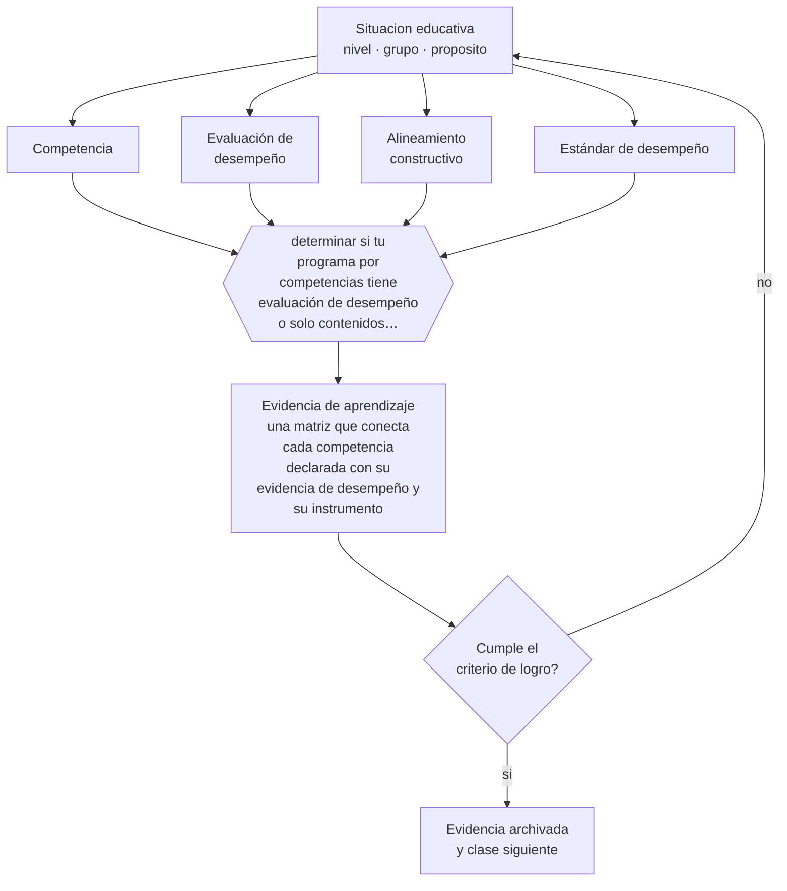

# Clase 239 — Enfoque por competencias y su coherencia

> **Parte 19 · Metodologías y enfoques pedagógicos** — clase 11 de 12

**Estado de evidencia:** `MARCO-NORMATIVO` · **Etapa:** 🟤 Etapa F — Especialización y desafíos contemporáneos · **Población de referencia:** transversal, de parvularia a educación superior 
**Decisión que habilita:** determinar si tu programa por competencias tiene evaluación de desempeño o solo contenidos renombrados 
**Evidencia de aprendizaje:** una matriz que conecta cada competencia declarada con su evidencia de desempeño y su instrumento

## 🎯 Propósito

Implementar un enfoque por competencias con coherencia entre desempeño declarado, enseñanza y evaluación, y reconocer cuándo el enfoque es solo nominal.

## 📚 Resultados de aprendizaje

Al finalizar esta clase podrás:

1. **Definir** con precisión los cuatro conceptos centrales de la clase y reconocerlos en una situación educativa real, no solo en su enunciado.
2. **Explicar** por qué declarar competencias no cambia nada si la evaluación sigue midiendo contenidos.
3. **Decidir** —si tu programa por competencias tiene evaluación de desempeño o solo contenidos renombrados— y sostener la decisión con un fundamento escrito.
4. **Producir** la evidencia de la clase —una matriz que conecta cada competencia declarada con su evidencia de desempeño y su instrumento— y contrastarla contra el criterio de logro.
5. **Distinguir** lo que la evidencia sostiene de lo que es práctica instalada, preferencia personal o costumbre de la institución.

## 🧭 Agenda sugerida (90 minutos)

| Minutos | Bloque | Qué ocurre |
|---:|---|---|
| 0–10 | Activación | Recuperar sin mirar la clase anterior y responder la pregunta de foco. |
| 10–25 | Conceptos | Definir los cuatro conceptos y reconocerlos en un caso real. |
| 25–45 | Modelo mental | Recorrer el método: delimitar el contexto y comprobar —no suponer— qué saben ya los estudiantes. |
| 45–70 | Ejemplo trabajado | Aplicar el método al caso de la parte, paso a paso y con evidencia. |
| 70–85 | Taller | Trasladar la decisión al contexto propio y anticipar su alternativa. |
| 85–90 | Cierre | Fijar responsable, plazo e indicador de la evidencia de aprendizaje. |

Fuera de la sesión, la clase exige aproximadamente **una hora y media** de práctica y de
producción de la evidencia. Si el tiempo se recorta, se recorta el ejemplo trabajado, nunca la
producción de evidencia: es la única parte que prueba el aprendizaje.

## 🧩 Conceptos centrales

| Concepto | Comprensión verificable |
|---|---|
| **Competencia** | capacidad de movilizar conocimientos, habilidades y actitudes para resolver una situación en un contexto determinado |
| **Evaluación de desempeño** | instrumento que exige ejecutar la tarea real o su simulación fiel, no describirla |
| **Alineamiento constructivo** | coherencia entre lo declarado, lo enseñado y lo evaluado; sin ella el enfoque es nominal |
| **Estándar de desempeño** | descripción del nivel esperado en términos observables, conocida por el estudiante antes de ejecutar |

## 🧠 Modelo mental

El método de esta clase, en cinco pasos que se ejecutan en orden:

1. Delimitar el contexto y comprobar —no suponer— qué saben ya los estudiantes.
2. Clasificar la situación distinguiendo **Competencia** de **Evaluación de desempeño**.
3. Decidir con fundamento, usando **Alineamiento constructivo** como criterio y declarando la fuente.
4. Anticipar qué evidencia confirmaría la decisión y cuál la refutaría, con **Estándar de desempeño** a la vista.
5. Registrar lo ocurrido y contrastarlo contra el criterio de logro antes de avanzar.

Lo que hace profesional a este método no son los pasos sino la evidencia que exige en cada uno.
Estas son las señales observables con las que se comprueba, y que deben quedar definidas **antes**
de recogerlas:

| Señal observable | Cómo se recoge y qué significa |
|---|---|
| **Evidencia de partida** | qué sabían o podían hacer los estudiantes antes de la decisión, comprobado y no supuesto |
| **Evidencia de proceso** | qué se observó mientras la decisión se aplicaba, con fecha, contexto y responsable del registro |
| **Evidencia de logro** | qué muestra una matriz que conecta cada competencia declarada con su evidencia de desempeño y su instrumento frente al criterio declarado de antemano |

**Frontera de aplicación.** El método vale mientras las condiciones que lo sostienen se cumplan.
El enfoque tiene críticas legítimas: Cuando esa condición falla, el paso siguiente no es forzar el método:
es declarar el límite y decidir con menos certeza, dejándolo por escrito.

## 🗺️ Flujo de razonamiento

## 📖 Desarrollo

### 1. El fondo del asunto

El enfoque por competencias ordena hoy la formación técnico-profesional, buena parte de la educación superior y los marcos de cualificación de la mayoría de los países. Su promesa es sensata: declarar lo que la persona debe poder hacer y evaluarlo haciéndolo. Su fracaso más común es igualmente predecible: se reescriben los objetivos en formato de competencia, se mantiene la misma enseñanza y se sigue evaluando con pruebas de conocimiento. El resultado es un cambio de vocabulario con costo administrativo y sin efecto pedagógico.

### 2. Frontera conceptual: qué es y qué no es

Los cuatro conceptos de esta clase se confunden entre sí con facilidad, y esa confusión no es
inocua: produce decisiones que atacan el problema equivocado. **Competencia** no es lo
mismo que **Evaluación de desempeño** —instrumento que exige ejecutar la tarea real o su simulación fiel, no describirla—, y tratarlos como sinónimos hace
que la intervención se dirija al lugar incorrecto. Del mismo modo, **Alineamiento constructivo** y
**Estándar de desempeño** describen aspectos distintos de la misma situación: el primero
coherencia entre lo declarado, lo enseñado y lo evaluado;, mientras el segundo descripción del nivel esperado en términos observables, conocida por el estudiante antes de ejecutar.

La prueba de que la distinción está entendida es operacional, no verbal: dos personas que
observan la misma clase deben poder clasificar el mismo episodio de la misma manera. Si no
coinciden, el problema está en la definición y no en el observador. El error de clasificación más
frecuente en esta materia es el primero de los que se listan más abajo, y conviene anticiparlo
antes de aplicar nada.

### 3. Cómo se observa y se mide

Nada de lo anterior sirve si no se puede observar. Estas son las señales que esta clase usa y
cómo se recogen:

- **Evidencia de partida.** Qué sabían o podían hacer los estudiantes antes de la decisión, comprobado y no supuesto. Se registra con fecha y contexto; sin eso, la señal no distingue una tendencia de una casualidad.
- **Evidencia de proceso.** Qué se observó mientras la decisión se aplicaba, con fecha, contexto y responsable del registro. Se registra con fecha y contexto; sin eso, la señal no distingue una tendencia de una casualidad.
- **Evidencia de logro.** Qué muestra una matriz que conecta cada competencia declarada con su evidencia de desempeño y su instrumento frente al criterio declarado de antemano. Se registra con fecha y contexto; sin eso, la señal no distingue una tendencia de una casualidad.

Ninguna de estas señales es el aprendizaje: son indicios de él. Confundir el indicio con el
fenómeno es el error clásico de la medición educativa, y por eso cada señal se interpreta junto
con el contexto, el punto de partida del grupo y lo que el propio estudiante puede explicar sobre
su trabajo.

### 4. Cómo se traduce en decisiones de enseñanza

La implementación real se reconoce por la evaluación. Si la competencia declara que el egresado puede elaborar un informe técnico, la evaluación exige elaborar un informe técnico con criterios publicados de antemano. Eso obliga a definir estándares de desempeño observables, a construir rúbricas calibradas entre evaluadores y a asumir que evaluar competencias cuesta más tiempo que aplicar una prueba escrita. Ese costo es la razón por la que tantos programas se quedan en la declaración.

### 5. Qué sostiene la evidencia y qué no

El enfoque tiene críticas legítimas: fragmenta el saber en unidades verificables y tiende a dejar fuera lo que no se deja observar en una tarea acotada, como el juicio profesional maduro o la formación del criterio. Aplicado con rigidez produce listas interminables de desempeños atomizados. Además, buena parte de su adopción responde a marcos normativos y de aseguramiento de la calidad más que a evidencia sobre aprendizaje.

> **Cómo leer el estado de evidencia `MARCO-NORMATIVO`.** El contenido no se decide por evidencia empírica sino por norma, política pública o marco institucional vigente. Verifica siempre la versión vigente a la fecha en que vas a aplicarlo: la norma cambia y la clase no se actualiza sola.

### 6. Integración: de los conceptos a una decisión defendible

Una decisión es defendible cuando puede explicarse a alguien que no estuvo presente. Esta clase
te deja en condiciones de si tu programa por competencias tiene evaluación de desempeño o solo contenidos renombrados, y esa decisión se sostiene solo si
declara cuatro cosas: la evidencia que la funda, el supuesto que asume, el indicador que la
comprobaría y la condición que la haría cambiar.

Ese es también el criterio con el que se evalúa la evidencia de aprendizaje de la clase. Un
análisis que podría copiarse a otra clase, a otro curso o a otro establecimiento sin cambiar una
palabra no es una decisión: es una declaración general, y el oficio empieza justo donde las
declaraciones generales terminan.

## 📚 Lectura comparada

Las obras no cumplen el mismo papel. Esta tabla indica qué lente aporta cada una;
después de leer, escribe una discrepancia real entre al menos dos fuentes.

| Fuente | Lente que aporta | Pregunta crítica |
|---|---|---|
| Biggs, J. & Tang, C. (2011). *Teaching for Quality Learning at University*. | el alineamiento constructivo como criterio para juzgar si el enfoque es real o nominal. | ¿Qué supuesto de esta clase ayuda a poner a prueba? |
| Baartman, L. et al. (2007). *Evaluating Assessment Quality in Competence-Based Education*. | criterios de calidad específicos para evaluación de competencias. | ¿Qué supuesto de esta clase ayuda a poner a prueba? |

La lectura se evalúa por **uso**, no por cantidad de páginas. Tu nota de lectura debe indicar qué
tesis modifica tu diagnóstico, qué evidencia del caso la tensiona y qué decisión concreta
cambiarías después del contraste. Una nota que solo resume el texto no cumple el criterio.

## 🧮 Ejemplo trabajado

**Situación.** El equipo directivo pide adoptar «aprendizaje basado en proyectos en todas las asignaturas» tras una charla. Dos docentes ya lo aplican con resultados opuestos y nadie ha definido qué se esperaba que mejorara.

**Paso 1 — Delimitar el contexto y comprobar —no suponer— qué saben ya los estudiantes.** El equipo escribe primero el supuesto asociado a **Competencia** y se prohíbe tratarlo como hecho. Contrasta ese supuesto con **Evidencia de partida** y anota qué parte del dato todavía no existe. Del paso sale un registro fechado y una frase explícita: «cambiaríamos de decisión si…».

**Paso 2 — Clasificar la situación distinguiendo Competencia de Evaluación de desempeño.** El trabajo aquí es separar lo observado de lo interpretado sobre **Evaluación de desempeño**. La evidencia que ordena la conversación es **Evidencia de proceso**; si su definición no está escrita, escribirla es parte del paso. Nada avanza mientras el equipo no acuerde qué contaría como refutación.

**Paso 3 — Decidir con fundamento, usando Alineamiento constructivo como criterio y declarando la fuente.** El riesgo de este paso es cerrar demasiado rápido alrededor de **Alineamiento constructivo**. Antes de concluir, se enumeran dos explicaciones alternativas del mismo patrón y se revisa si **Evidencia de logro** logra distinguirlas. Si no lo logra, hace falta otra evidencia y así debe quedar registrado.

**Paso 4 — Anticipar qué evidencia confirmaría la decisión y cuál la refutaría, con Estándar de desempeño a la vista.** Con **Estándar de desempeño** ya delimitado, la pregunta pasa a ser de consecuencia: qué cambia para los estudiantes, para el tiempo de clase y para la carga del equipo. **Evidencia de partida** entrega la lectura observable; el juicio profesional sigue siendo humano y debe quedar firmado por quien lo hace.

**Paso 5 — Registrar lo ocurrido y contrastarlo contra el criterio de logro antes de avanzar.** El cierre exige compromiso: responsable, fecha, indicador de logro y condición de detención. **Evidencia de proceso** se convierte en la señal de seguimiento, y se acuerda con qué frecuencia se revisa y quién puede declarar que no funcionó sin costo político.

**Síntesis.** La recomendación termina con responsable, fecha, evidencia de logro y señal de
detención. Omitir cualquiera de esas cuatro piezas convierte el análisis en una opinión que nadie
podrá auditar dentro de tres meses, y que por lo tanto nadie corregirá.

## 🔀 Comparación de caminos y límites

Ante la misma situación caben varios cursos de acción. La decisión profesional no es
elegir el «correcto», sino saber qué privilegia cada uno y qué arriesga.

| Camino | Qué privilegia | Cuándo elegirlo | Riesgo principal |
|---|---|---|---|
| Intervenir sobre **Competencia** | Capacidad de movilizar conocimientos, habilidades y actitudes para resolver una situación en un contexto determinado | Cuando **Evidencia de partida** es observable y accionable dentro del plazo de la decisión. | Sobrerreaccionar a una señal parcial. |
| Intervenir sobre **Evaluación de desempeño** | Instrumento que exige ejecutar la tarea real o su simulación fiel, no describirla | Cuando la primera explicación no distingue mecanismo ni responsable. | Convertir el concepto en etiqueta y no en intervención. |
| Observar antes de decidir | Reducir la incertidumbre antes de comprometer tiempo y credibilidad | Cuando la decisión es reversible y la evidencia disponible no distingue causas. | Observar indefinidamente y no decidir nunca. |
| Derivar o escalar | Poner la decisión donde están la competencia y la responsabilidad | Cuando hay normativa, resguardo de datos, salud o vulneración de derechos en juego. | Delegar hacia arriba lo que sí correspondía decidir en el aula. |

**Frontera de aplicación.** El enfoque tiene críticas legítimas: Fuera de esa frontera, la comparación
anterior deja de ser válida y la decisión debe tomarse con evidencia distinta.

## 🪜 El mismo tema según el rol

La misma materia cambia de forma según quién decida. Al subir de nivel aumentan las
personas, el tiempo y las consecuencias que quedan dentro de la decisión.

| Nivel | Responsabilidad sobre enfoque por competencias y su coherencia |
|---|---|
| **Docente de aula** | Aplica, observa y registra la evidencia; declara qué no puede resolver desde su rol. |
| **Equipo de apoyo o educación diferencial** | Verifica que la decisión no deje fuera a quien más barreras enfrenta y aporta los apoyos. |
| **Jefatura técnico-pedagógica** | Convierte la decisión en criterio compartido, tiempo protegido y acompañamiento. |
| **Dirección** | Decide si esto cambia condiciones institucionales, recursos o el plan de mejora. |
| **Formación e investigación** | Pregunta si la decisión es generalizable, con qué evidencia y qué haría falta para probarlo. |

Si trabajas en uno de esos niveles, la [guía de carrera de tu rol](../../../rutas/README.md)
indica en qué orden conviene recorrer el programa y qué artefactos acreditan tu competencia.

## 🧪 Taller guiado

Aplica la clase a **uno** de los contextos siguientes y repite después el ejercicio en un
contexto de exigencia distinta. Cambiar de contexto es parte del aprendizaje: lo que funciona
con un grupo no se traslada intacto a otro.

| Contexto | Rasgo que cambia la decisión |
|---|---|
| Curso con base débil en el contenido | la guía alta no es conservadurismo: es lo que la evidencia indica |
| Curso avanzado o electivo | aquí la guía excesiva estorba y conviene abrir |
| Asignatura procedimental o taller | modelamiento y práctica deliberada antes que proyecto abierto |
| Establecimiento que adopta un enfoque institucional | hay que negociar condiciones, no solo aceptar la decisión |
| Formación de adultos | la experiencia previa cambia el punto de partida de cualquier método |
| Aula con recursos limitados | el costo de implementación es parte del criterio, no un detalle |

**Secuencia de trabajo:**

1. Delimita el contexto: nivel, edad, tamaño del grupo, asignatura o experiencia y tiempo real disponible.
2. Declara qué saben ya los estudiantes y **cómo lo comprobaste**, no cómo lo supones.
3. Formula la decisión pedagógica que esta clase habilita y escribe su fundamento.
4. Anticipa qué observarías si la decisión funciona y qué observarías si no funciona.
5. Diseña de antemano la alternativa que aplicarás si la primera estrategia falla.
6. Ejecuta o simula, y registra lo observado con fecha, contexto y evidencia concreta.
7. Produce la evidencia de aprendizaje de la clase.
8. Contrástala contra el criterio de logro, corrige y recién entonces avanza.

## 🏫 Caso profesional

**Situación.** El equipo directivo pide adoptar «aprendizaje basado en proyectos en todas las asignaturas» tras una charla. Dos docentes ya lo aplican con resultados opuestos y nadie ha definido qué se esperaba que mejorara.

Entrega un **informe de decisión** de una página que contenga:

1. **Hechos y fuentes** — qué está documentado y con qué evidencia, separado de lo que se supone.
2. **Hipótesis** — la explicación más probable y una alternativa que también encajaría.
3. **Dos opciones defendibles** — no una recomendación y un espantapájaros.
4. **Efecto esperado** — sobre los estudiantes, el tiempo de clase, el equipo y los apoyos.
5. **Recomendación** — con su fundamento y la fuente que la respalda.
6. **Condición de revisión** — qué resultado te haría cambiar de decisión.
7. **Responsable y fecha** — quién ejecuta y cuándo se revisa.

Usa al menos **dos** fuentes de la lectura comparada para desafiar tu primera respuesta. Una
recomendación que ninguna fuente pone en duda casi siempre está poco examinada.

## 📥 Evidencia de aprendizaje

Una matriz que conecta cada competencia declarada con su evidencia de desempeño y su instrumento.

Guárdala en `evidence/P19-C239-enfoque-por-competencias-y-su-coherencia/` con estos archivos:

| Archivo | Qué contiene |
|---|---|
| `decision.md` | contexto, decisión, fundamento, fuentes con fecha, indicador de logro y riesgos |
| `senales.md` | definición operacional de las tres señales, cómo se recogieron y qué no distinguen |
| `nota-de-lectura.md` | dos fuentes contrastadas, con edición y páginas consultadas |
| `revision-critica.md` | la objeción más fuerte a tu decisión y qué evidencia la invalidaría |

Esta evidencia alimenta el artefacto de la parte: **decisión metodológica escrita con criterios de elección, condiciones de implementación y plan de verificación**.

## 🏆 Reto verificable

Toma un programa por competencias real y verifica cuántas tienen evaluación de desempeño. Rediseña la evaluación de una competencia que hoy se mide con prueba escrita.

## ✅ Evaluación de la clase

| Criterio | Peso | Evidencia esperada |
|---|---:|---|
| Precisión conceptual | 25 % | Distinciones correctas y observables entre los cuatro conceptos, aplicadas a un caso real. |
| Diagnóstico y evidencia | 30 % | Conocimiento previo comprobado, evidencia recogida con fecha y contexto, y límites del dato declarados. |
| Decisión y alternativas | 30 % | Decisión fundada, alternativa prevista si falla, y condición explícita que la haría cambiar. |
| Responsabilidad y comunicación | 15 % | Diversidad y resguardos considerados, fuentes citadas y evidencia archivada de forma reproducible. |

**Aprobación:** 80 de 100 y ningún criterio bajo el 60 %. Una respuesta que podría copiarse sin
cambios a otra clase, a otro curso o a otro establecimiento se considera insuficiente, aunque
esté bien escrita.

**Criterio de logro de la evidencia:**

- [ ] cada competencia declarada tiene evidencia de desempeño y un instrumento asociado;
- [ ] los estándares están descritos en términos observables y publicados antes de la evaluación;
- [ ] cada afirmación sobre «lo que funciona» está atribuida a una fuente identificable, con autor y fecha;
- [ ] la decisión es ejecutable con el tiempo, el espacio, el número de estudiantes y los recursos que realmente tienes;
- [ ] la evidencia queda archivada de forma reproducible: otra persona podría revisarla sin que tú se la expliques.

## ⚠️ Errores frecuentes

**Propios de esta clase:**

- Reescribir objetivos en lenguaje de competencias y mantener intactas la enseñanza y la evaluación.
- Atomizar la competencia en decenas de desempeños verificables y perder el sentido del conjunto.

**Característicos de la parte 19:**

- Adoptar un enfoque por moda institucional y evaluarlo con criterios de otro.
- Confundir actividad visible con aprendizaje: estudiantes ocupados no son estudiantes aprendiendo.

Los cuatro comparten estructura: un síntoma visible, una causa que no se ve y una corrección que
casi siempre es de diseño y no de esfuerzo. Antes de atribuir el problema a los estudiantes o a
ti, comprueba cuál de ellos está operando y qué evidencia lo distinguiría de los otros tres.

## ♿ Diversidad, accesibilidad y ética

La evaluación de desempeño puede favorecer a estudiantes que rinden mal en pruebas escritas y desfavorecer a quienes tienen dificultades de ejecución motora o de interacción. Las adecuaciones deben declararse en el estándar, no improvisarse el día de la evaluación.

Antes de aplicar cualquier decisión de esta clase con estudiantes reales, revisa el
[protocolo de práctica responsable](../../../docs/ETICA_Y_PRACTICA_RESPONSABLE.md):
consentimiento, resguardo de datos personales, proporcionalidad de la intervención y derecho
de cada estudiante a no ser objeto de un ensayo que no le reporta beneficio.

## 🇨🇱 Contexto chileno y cumplimiento

Riesgo característico de esta parte: **Adoptar un enfoque por moda institucional y evaluarlo con criterios de otro.** Antes de aplicar
cualquier decisión de esta clase en un establecimiento real, verifica el marco vigente:

- Marco institucional y normativo: [`docs/MARCO_CHILE.md`](../../../docs/MARCO_CHILE.md).
- Inclusión y apoyos: [`docs/INCLUSION_Y_DUA.md`](../../../docs/INCLUSION_Y_DUA.md).
- Datos personales, IA y resguardos: [`docs/IA_EN_EDUCACION.md`](../../../docs/IA_EN_EDUCACION.md).
- Fuentes oficiales con cómo leerlas: [`docs/FUENTES.md`](../../../docs/FUENTES.md).

La regla del programa es simple: **la fuente oficial manda sobre el material pedagógico**. Si la
norma cambió después de la fecha de esta clase, gana la norma.

## ❓ Preguntas de comprobación

1. ¿Tu evaluación exige ejecutar la competencia o describirla?
2. ¿Qué competencia declarada no tiene hoy instrumento asociado?
3. ¿Qué se perdió al fragmentar el desempeño en criterios verificables?

## 📗 Fuentes y verificación

- Biggs, J. & Tang, C. (2011). *Teaching for Quality Learning at University*. **Uso en esta clase:** el alineamiento constructivo como criterio para juzgar si el enfoque es real o nominal. Lectura selectiva: índice y capítulos pertinentes; registra edición y páginas consultadas. **Localizar:** [ISBN 9780335242764](https://openlibrary.org/isbn/9780335242764) · [ficha](../../../docs/REGISTRO_DE_FUENTES.md#biggs-tang-2011-teaching-for-quality-learning-at-university)
- Baartman, L. et al. (2007). *Evaluating Assessment Quality in Competence-Based Education*. **Uso en esta clase:** criterios de calidad específicos para evaluación de competencias. Lectura selectiva: índice y capítulos pertinentes; registra edición y páginas consultadas. **Localizar:** [DOI 10.1016/j.edurev.2007.06.001](https://doi.org/10.1016/j.edurev.2007.06.001) · [ficha](../../../docs/REGISTRO_DE_FUENTES.md#baartman-2007-evaluating-assessment-quality-in-competence-based)

Catálogo completo: [registro de fuentes con localizador](../../../docs/REGISTRO_DE_FUENTES.md) ·
[bibliografía del programa](../../../docs/BIBLIOGRAFIA.md) ·
[glosario](../../../docs/GLOSARIO.md) ·
[fuentes oficiales y cómo leerlas](../../../docs/FUENTES.md).

> **Regla de fuentes.** Las obras anteriores estructuran las perspectivas de esta materia.
> Cualquier norma, decreto, orientación ministerial o política institucional mencionada debe
> comprobarse en su fuente primaria vigente antes de usarse con estudiantes reales. El desarrollo
> de esta clase es original y no reproduce capítulos protegidos por derechos de autor.

## 🔗 Conexión con el resto del programa

Se apoya en la parte 09 y en la 11, y aplica a las partes 06 y 14. Prepara la clase 240.

> [!IMPORTANT]
> Material de formación profesional. No reemplaza un título de pedagogía, una habilitación
> legal para ejercer, ni el juicio de un equipo educativo que conoce a sus estudiantes.

---

| Anterior | Índice | Siguiente |
|---|---|---|
| [← 238 · Gamificación y juego serio](../class-10-gamificacion-y-juego-serio/README.md) | [Parte 19](../README.md) · [Programa](../../../README.md) | [240 · Proyecto integrador: decisión metodológica fundamentada →](../class-12-proyecto-integrador/README.md) |
