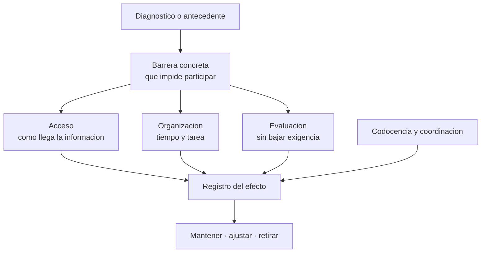

# Parte 20 — Estrategias pedagógicas para necesidades educativas específicas

> *El diagnóstico no dice qué hacer el lunes: la estrategia sí, y se elige por barrera, no por etiqueta*

🟤 **Etapa F — Especialización y desafíos contemporáneos** · salida de la etapa: resolver los problemas que efectivamente aparecen en el aula chilena de hoy

**Clases:** 12 (241–252) · **Población de referencia:** transversal, con foco en aula común · **Conceptos operacionales:** 48 · **Señales observables:** 36 
**Contenido central:** Del diagnóstico a la estrategia, TDAH, síndrome de Down, autismo, discapacidad intelectual, dificultades específicas del aprendizaje, discapacidad sensorial y motora, comunicación aumentativa, trastornos del lenguaje, altas capacidades, acompañamiento diferenciado y codocencia

## 🎯 De qué trata esta parte

La parte 08 establece el marco: barreras, diseño universal y diversificación. Esta parte responde la pregunta siguiente, que es la que se hace un docente el domingo en la noche: qué hago concretamente el lunes con este estudiante, en esta clase, con estos recursos. La respuesta no se deduce de la categoría diagnóstica. Dos estudiantes con el mismo diagnóstico pueden necesitar apoyos opuestos.

Cada clase recorre una condición o grupo de condiciones y traduce lo que se sabe sobre ella en decisiones de aula: cómo se presenta la información, cómo se organiza el tiempo, cómo se evalúa sin bajar la exigencia, qué se anticipa y qué se registra. El criterio ordenador es siempre el mismo: identificar la barrera concreta que impide participar o aprender, y elegir el apoyo mínimo suficiente para removerla.

El cierre es organizativo, porque los apoyos fracasan por logística más que por diseño: quién hace qué, cuándo se coordinan el docente de aula y el educador diferencial, y cómo se registra lo que ocurre para que el apoyo se ajuste en vez de repetirse todo el año.

## 🏫 Caso de la parte

Las doce clases trabajan sobre la misma realidad, para que puedas ver cómo cambia tu diagnóstico
a medida que avanzas:

> En 5.º A hay un estudiante con TDAH sin tratamiento estable, una estudiante con síndrome de Down que sigue el currículum con adecuaciones y dos con dificultades específicas de lectura. La docente tiene 45 minutos semanales de coordinación con la educadora diferencial.

**Artefacto que produces al terminar:** plan de apoyo por estudiante con estrategias de aula, responsables, horario real de codocencia y evidencia de seguimiento.

## 📚 Resultados de la parte

Al terminar esta parte podrás:

1. **Traducir un diagnóstico en barreras concretas y en apoyos verificables**.
2. **Aplicar estrategias específicas para TDAH, síndrome de Down, autismo y dificultades del aprendizaje**.
3. **Ajustar acceso, presentación y evaluación sin reducir la exigencia de aprendizaje**.
4. **Organizar codocencia y acompañamiento diferenciado con roles y tiempos reales**.
5. **Registrar el efecto de un apoyo y decidir si se mantiene, se ajusta o se retira**.

## 🗺️ Mapa de la parte

## 🧠 Marco de referencia

- modelo social y biopsicosocial: la barrera está en la interacción, no solo en la persona
- apoyo mínimo suficiente y retirada planificada del andamio
- adecuaciones de acceso frente a adecuaciones de objetivo, y cuándo corresponde cada una
- normativa chilena de decretos 83/2015 y 170/2009 y Ley 21.545 como marco de las decisiones

**Autoras y autores que conviene conocer:** Russell Barkley, Sue Buckley y equipos de investigación en síndrome de Down, Connie Kasari, Robert Schalock, Margaret Snowling, David y Lynn Fuchs, Susan Assouline, CAST y Ministerio de Educación de Chile

## 📋 Las 12 clases

| # | Clase | Decisión que habilita | Evidencia |
|---:|---|---|---|
| 241 | [De la categoría diagnóstica a la estrategia de aula](class-01-de-la-categoria-diagnostica-a-la-estrategia-de-aula/README.md) | determinar qué barrera concreta enfrenta este estudiante en esta clase y qué apoyo la remueve | `CONSISTENTE` |
| 242 | [TDAH: atención, autorregulación y organización](class-02-tdah-atencion-autorregulacion-y-organizacion/README.md) | determinar qué ajustes de entorno, tarea y retroalimentación necesita este estudiante para sostener la actividad | `ROBUSTA` |
| 243 | [Síndrome de Down: aprendizaje, lenguaje y participación](class-03-sindrome-de-down-aprendizaje-lenguaje-y-participacion/README.md) | determinar qué apoyos de presentación, ritmo y comunicación necesita este estudiante para acceder al currículum | `CONSISTENTE` |
| 244 | [Autismo: estructura, anticipación y comunicación](class-04-autismo-estructura-anticipacion-y-comunicacion/README.md) | determinar qué elementos de estructura, anticipación y regulación sensorial requiere este estudiante | `CONSISTENTE` |
| 245 | [Discapacidad intelectual y acceso al currículum](class-05-discapacidad-intelectual-y-acceso-al-curriculum/README.md) | determinar qué objetivos se mantienen, cuáles se priorizan y cuáles se adecúan para este estudiante | `CONSISTENTE` |
| 246 | [Dislexia, disgrafía y discalculia en el aula común](class-06-dislexia-disgrafia-y-discalculia-en-el-aula-comun/README.md) | determinar qué apoyos de acceso permiten que este estudiante aprenda tu asignatura mientras trabaja su dificultad | `CONSISTENTE` |
| 247 | [Discapacidad visual y auditiva: estrategias de acceso](class-07-discapacidad-visual-y-auditiva-estrategias-de-acceso/README.md) | determinar qué ajustes de acceso requiere este estudiante y quién verifica que funcionan | `MARCO-NORMATIVO` |
| 248 | [Discapacidad motora y comunicación aumentativa](class-08-discapacidad-motora-y-comunicacion-aumentativa/README.md) | determinar qué vía de comunicación y qué acceso físico están garantizados para este estudiante en cada actividad | `CONSISTENTE` |
| 249 | [Trastornos del lenguaje y de la comunicación](class-09-trastornos-del-lenguaje-y-de-la-comunicacion/README.md) | determinar qué demanda lingüística de tu clase está bloqueando el aprendizaje de este estudiante | `CONSISTENTE` |
| 250 | [Altas capacidades: enriquecimiento y aceleración](class-10-altas-capacidades-enriquecimiento-y-aceleracion/README.md) | determinar qué combinación de compactación, profundización y aceleración corresponde a este estudiante | `CONSISTENTE` |
| 251 | [Acompañamiento diferenciado y codocencia](class-11-acompanamiento-diferenciado-y-codocencia/README.md) | determinar qué modelo de codocencia usa tu curso, con qué tiempo real de coordinación y con qué reparto de responsabilidad | `PRACTICA-PROFESIONAL` |
| 252 | [Proyecto integrador: plan de apoyo con estrategias verificables](class-12-proyecto-integrador/README.md) | determinar el plan de apoyo completo de un estudiante y cómo se verificará que se ejecutó | `PRACTICA-PROFESIONAL` |

## ⚠️ Riesgos característicos

- Elegir la estrategia por la etiqueta diagnóstica en vez de por la barrera observada.
- Confundir adecuación de acceso con rebaja de objetivo y anular el aprendizaje que se dice proteger.
- Delegar todo el apoyo en el educador diferencial y mantener la clase igual.
- Aplicar apoyos sin registro, de modo que nadie puede saber si sirvieron.

## 📕 Lecturas de referencia de la parte

- **Barkley, R. (2015). *Attention-Deficit Hyperactivity Disorder: A Handbook*.** — el TDAH como problema de autorregulación y no de voluntad, con implicancias directas de aula.
- **Buckley, S. & Bird, G. *Educación de estudiantes con síndrome de Down* (edición vigente).** — perfil de aprendizaje específico —fortaleza visual, memoria verbal a corto plazo más frágil— y qué hacer con él.
- **Booth, T. & Ainscow, M. (2011). *Index for Inclusion*.** — convierte la inclusión en un conjunto de indicadores revisables, no en una declaración.
- **Assouline, S. et al. (2015). *A Nation Empowered*.** — la evidencia sobre aceleración, que contradice buena parte de la intuición escolar.

## ✅ Evidencia mínima para dar la parte por cerrada

- [ ] el mapa de barreras de un estudiante, con la fuente de cada afirmación;
- [ ] la estrategia elegida con su fundamento y su alternativa si no resulta;
- [ ] el acuerdo de codocencia con roles, tiempos y responsable de registro;
- [ ] el plan de apoyo completo con evidencia de seguimiento y decisión de ajuste.

## 🧭 Práctica y evaluación de la parte

- [Rúbrica maestra e instrumentos de autoevaluación](../../assessments/README.md)
- [Casos profesionales para resolver con este marco](../../cases/README.md)
- [Laboratorios de decisión](../../labs/README.md)
- [Dónde se archiva la evidencia](../../evidence/README.md)

---

| Anterior | Índice | Siguiente |
|---|---|---|
| [← Parte 19 · Metodologías y enfoques pedagógicos](../part-19-metodologias-y-enfoques-pedagogicos/README.md) | [Programa](../../README.md) · [Currículo](../../CURRICULUM.md) | [Parte 21 · Desafíos actuales del aula →](../part-21-desafios-actuales-del-aula/README.md) |
