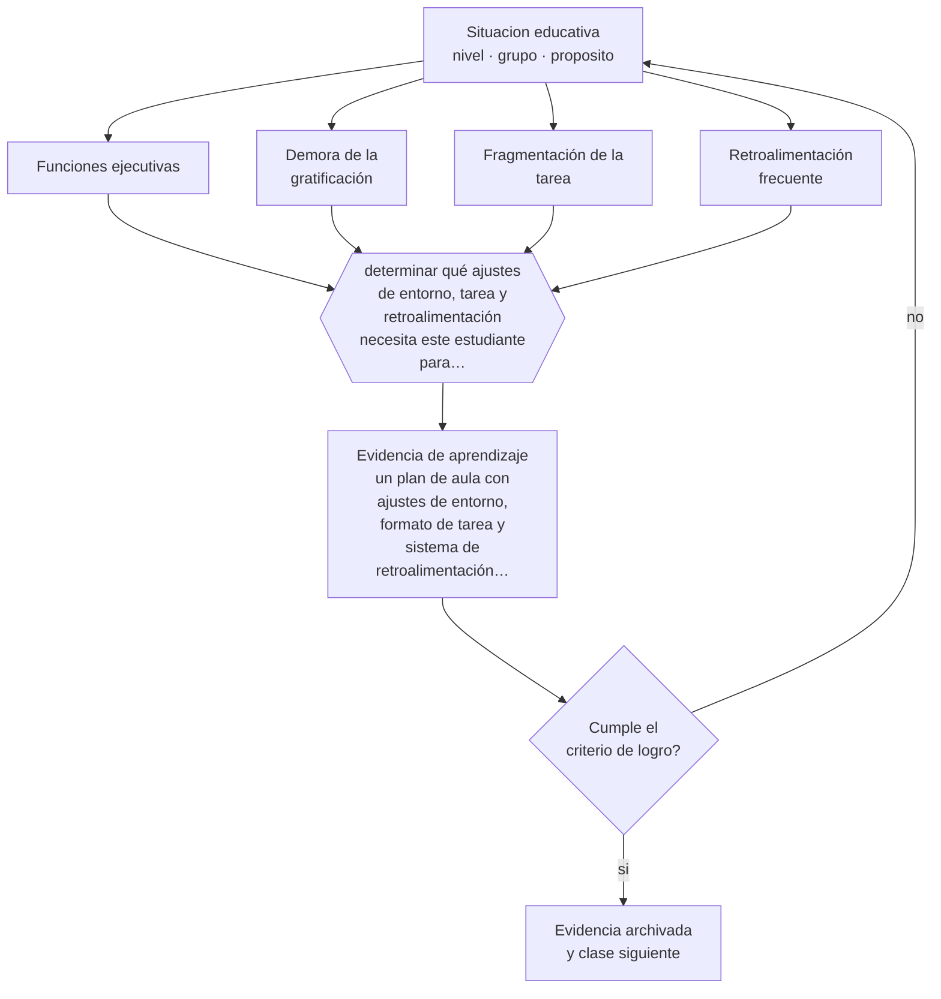

# Clase 242 — TDAH: atención, autorregulación y organización

> **Parte 20 · Estrategias pedagógicas para necesidades educativas específicas** — clase 2 de 12

**Estado de evidencia:** `ROBUSTA` · **Etapa:** 🟤 Etapa F — Especialización y desafíos contemporáneos · **Población de referencia:** transversal, con foco en aula común 
**Decisión que habilita:** determinar qué ajustes de entorno, tarea y retroalimentación necesita este estudiante para sostener la actividad 
**Evidencia de aprendizaje:** un plan de aula con ajustes de entorno, formato de tarea y sistema de retroalimentación frecuente

## 🎯 Propósito

Aplicar estrategias de atención, organización y autorregulación con estudiantes con TDAH, ajustando el entorno antes que exigiendo esfuerzo.

## 📚 Resultados de aprendizaje

Al finalizar esta clase podrás:

1. **Definir** con precisión los cuatro conceptos centrales de la clase y reconocerlos en una situación educativa real, no solo en su enunciado.
2. **Explicar** por qué el TDAH es un problema de regulación y no de voluntad, y qué cambia eso en el aula.
3. **Decidir** —qué ajustes de entorno, tarea y retroalimentación necesita este estudiante para sostener la actividad— y sostener la decisión con un fundamento escrito.
4. **Producir** la evidencia de la clase —un plan de aula con ajustes de entorno, formato de tarea y sistema de retroalimentación frecuente— y contrastarla contra el criterio de logro.
5. **Distinguir** lo que la evidencia sostiene de lo que es práctica instalada, preferencia personal o costumbre de la institución.

## 🧭 Agenda sugerida (90 minutos)

| Minutos | Bloque | Qué ocurre |
|---:|---|---|
| 0–10 | Activación | Recuperar sin mirar la clase anterior y responder la pregunta de foco. |
| 10–25 | Conceptos | Definir los cuatro conceptos y reconocerlos en un caso real. |
| 25–45 | Modelo mental | Recorrer el método: delimitar el contexto y comprobar —no suponer— qué saben ya los estudiantes. |
| 45–70 | Ejemplo trabajado | Aplicar el método al caso de la parte, paso a paso y con evidencia. |
| 70–85 | Taller | Trasladar la decisión al contexto propio y anticipar su alternativa. |
| 85–90 | Cierre | Fijar responsable, plazo e indicador de la evidencia de aprendizaje. |

Fuera de la sesión, la clase exige aproximadamente **una hora y media** de práctica y de
producción de la evidencia. Si el tiempo se recorta, se recorta el ejemplo trabajado, nunca la
producción de evidencia: es la única parte que prueba el aprendizaje.

## 🧩 Conceptos centrales

| Concepto | Comprensión verificable |
|---|---|
| **Funciones ejecutivas** | conjunto de procesos de control —inhibición, memoria de trabajo, flexibilidad— que permiten dirigir la conducta a una meta |
| **Demora de la gratificación** | dificultad para sostener conducta cuya recompensa es lejana; explica buena parte del comportamiento observado |
| **Fragmentación de la tarea** | división del trabajo en unidades con cierre visible, que reduce la demanda de sostenimiento |
| **Retroalimentación frecuente** | señal de progreso entregada en intervalos cortos, que sustituye a la motivación diferida |

## 🧠 Modelo mental

El método de esta clase, en cinco pasos que se ejecutan en orden:

1. Delimitar el contexto y comprobar —no suponer— qué saben ya los estudiantes.
2. Clasificar la situación distinguiendo **Funciones ejecutivas** de **Demora de la gratificación**.
3. Decidir con fundamento, usando **Fragmentación de la tarea** como criterio y declarando la fuente.
4. Anticipar qué evidencia confirmaría la decisión y cuál la refutaría, con **Retroalimentación frecuente** a la vista.
5. Registrar lo ocurrido y contrastarlo contra el criterio de logro antes de avanzar.

Lo que hace profesional a este método no son los pasos sino la evidencia que exige en cada uno.
Estas son las señales observables con las que se comprueba, y que deben quedar definidas **antes**
de recogerlas:

| Señal observable | Cómo se recoge y qué significa |
|---|---|
| **Evidencia de partida** | qué sabían o podían hacer los estudiantes antes de la decisión, comprobado y no supuesto |
| **Evidencia de proceso** | qué se observó mientras la decisión se aplicaba, con fecha, contexto y responsable del registro |
| **Evidencia de logro** | qué muestra un plan de aula con ajustes de entorno, formato de tarea y sistema de retroalimentación frecuente frente al criterio declarado de antemano |

**Frontera de aplicación.** El método vale mientras las condiciones que lo sostienen se cumplan.
Los apoyos escolares mejoran el funcionamiento en el aula y no modifican el cuadro subyacente. Cuando esa condición falla, el paso siguiente no es forzar el método:
es declarar el límite y decidir con menos certeza, dejándolo por escrito.

## 🗺️ Flujo de razonamiento

## 📖 Desarrollo

### 1. El fondo del asunto

El TDAH se entiende hoy mejor como una dificultad de autorregulación que como un déficit de atención en sentido estricto: el estudiante puede sostener la atención en actividades de recompensa inmediata y no en aquellas cuya recompensa es lejana. Esa asimetría es la que se malinterpreta como falta de voluntad, porque un observador ve que sí puede concentrarse cuando quiere. La consecuencia práctica es que exigir más esfuerzo no funciona: lo que funciona es reducir la distancia entre acción y consecuencia.

### 2. Frontera conceptual: qué es y qué no es

Los cuatro conceptos de esta clase se confunden entre sí con facilidad, y esa confusión no es
inocua: produce decisiones que atacan el problema equivocado. **Funciones ejecutivas** no es lo
mismo que **Demora de la gratificación** —dificultad para sostener conducta cuya recompensa es lejana; explica buena parte del comportamiento observado—, y tratarlos como sinónimos hace
que la intervención se dirija al lugar incorrecto. Del mismo modo, **Fragmentación de la tarea** y
**Retroalimentación frecuente** describen aspectos distintos de la misma situación: el primero
división del trabajo en unidades con cierre visible, que reduce la demanda de sostenimiento, mientras el segundo señal de progreso entregada en intervalos cortos, que sustituye a la motivación diferida.

La prueba de que la distinción está entendida es operacional, no verbal: dos personas que
observan la misma clase deben poder clasificar el mismo episodio de la misma manera. Si no
coinciden, el problema está en la definición y no en el observador. El error de clasificación más
frecuente en esta materia es el primero de los que se listan más abajo, y conviene anticiparlo
antes de aplicar nada.

### 3. Cómo se observa y se mide

Nada de lo anterior sirve si no se puede observar. Estas son las señales que esta clase usa y
cómo se recogen:

- **Evidencia de partida.** Qué sabían o podían hacer los estudiantes antes de la decisión, comprobado y no supuesto. Se registra con fecha y contexto; sin eso, la señal no distingue una tendencia de una casualidad.
- **Evidencia de proceso.** Qué se observó mientras la decisión se aplicaba, con fecha, contexto y responsable del registro. Se registra con fecha y contexto; sin eso, la señal no distingue una tendencia de una casualidad.
- **Evidencia de logro.** Qué muestra un plan de aula con ajustes de entorno, formato de tarea y sistema de retroalimentación frecuente frente al criterio declarado de antemano. Se registra con fecha y contexto; sin eso, la señal no distingue una tendencia de una casualidad.

Ninguna de estas señales es el aprendizaje: son indicios de él. Confundir el indicio con el
fenómeno es el error clásico de la medición educativa, y por eso cada señal se interpreta junto
con el contexto, el punto de partida del grupo y lo que el propio estudiante puede explicar sobre
su trabajo.

### 4. Cómo se traduce en decisiones de enseñanza

Los ajustes con mejor respaldo son de entorno y de tarea: ubicación con menos distractores y cerca del docente, instrucciones cortas y verificadas, tareas fragmentadas con cierres visibles, apoyos externos de organización —agenda, listas, recordatorios—, y retroalimentación en intervalos cortos. La retroalimentación positiva específica y frecuente rinde más que el sistema de sanciones, que en estos estudiantes se acumula sin cambiar la conducta. Los movimientos permitidos y las pausas planificadas evitan la escalada.

### 5. Qué sostiene la evidencia y qué no

Los apoyos escolares mejoran el funcionamiento en el aula y no modifican el cuadro subyacente. La decisión sobre tratamiento farmacológico es médica y está fuera del rol docente, aunque el docente aporte observación estructurada. Además, el diagnóstico presenta tasas de sobreidentificación y de subidentificación según género y contexto socioeconómico: las niñas con presentación inatenta suelen pasar años sin ser detectadas.

> **Cómo leer el estado de evidencia `ROBUSTA`.** Hay evidencia convergente de varios equipos, países y diseños de investigación, incluidos estudios experimentales o cuasiexperimentales, y el efecto se sostiene al replicarlo. Puedes apoyar una decisión profesional en ella, sin olvidar que ningún efecto promedio describe a un estudiante concreto.

### 6. Integración: de los conceptos a una decisión defendible

Una decisión es defendible cuando puede explicarse a alguien que no estuvo presente. Esta clase
te deja en condiciones de qué ajustes de entorno, tarea y retroalimentación necesita este estudiante para sostener la actividad, y esa decisión se sostiene solo si
declara cuatro cosas: la evidencia que la funda, el supuesto que asume, el indicador que la
comprobaría y la condición que la haría cambiar.

Ese es también el criterio con el que se evalúa la evidencia de aprendizaje de la clase. Un
análisis que podría copiarse a otra clase, a otro curso o a otro establecimiento sin cambiar una
palabra no es una decisión: es una declaración general, y el oficio empieza justo donde las
declaraciones generales terminan.

## 📚 Lectura comparada

Las obras no cumplen el mismo papel. Esta tabla indica qué lente aporta cada una;
después de leer, escribe una discrepancia real entre al menos dos fuentes.

| Fuente | Lente que aporta | Pregunta crítica |
|---|---|---|
| Barkley, R. (2015). *Attention-Deficit Hyperactivity Disorder: A Handbook*. | el modelo de autorregulación y sus implicancias directas para el diseño del aula. | ¿Qué supuesto de esta clase ayuda a poner a prueba? |
| DuPaul, G. & Stoner, G. *ADHD in the Schools* (edición vigente). | el manual de intervenciones escolares con evidencia, organizado por tipo de apoyo. | ¿Qué supuesto de esta clase ayuda a poner a prueba? |

La lectura se evalúa por **uso**, no por cantidad de páginas. Tu nota de lectura debe indicar qué
tesis modifica tu diagnóstico, qué evidencia del caso la tensiona y qué decisión concreta
cambiarías después del contraste. Una nota que solo resume el texto no cumple el criterio.

## 🧮 Ejemplo trabajado

**Situación.** En 5.º A hay un estudiante con TDAH sin tratamiento estable, una estudiante con síndrome de Down que sigue el currículum con adecuaciones y dos con dificultades específicas de lectura. La docente tiene 45 minutos semanales de coordinación con la educadora diferencial.

**Paso 1 — Delimitar el contexto y comprobar —no suponer— qué saben ya los estudiantes.** El equipo escribe primero el supuesto asociado a **Funciones ejecutivas** y se prohíbe tratarlo como hecho. Contrasta ese supuesto con **Evidencia de partida** y anota qué parte del dato todavía no existe. Del paso sale un registro fechado y una frase explícita: «cambiaríamos de decisión si…».

**Paso 2 — Clasificar la situación distinguiendo Funciones ejecutivas de Demora de la gratificación.** El trabajo aquí es separar lo observado de lo interpretado sobre **Demora de la gratificación**. La evidencia que ordena la conversación es **Evidencia de proceso**; si su definición no está escrita, escribirla es parte del paso. Nada avanza mientras el equipo no acuerde qué contaría como refutación.

**Paso 3 — Decidir con fundamento, usando Fragmentación de la tarea como criterio y declarando la fuente.** El riesgo de este paso es cerrar demasiado rápido alrededor de **Fragmentación de la tarea**. Antes de concluir, se enumeran dos explicaciones alternativas del mismo patrón y se revisa si **Evidencia de logro** logra distinguirlas. Si no lo logra, hace falta otra evidencia y así debe quedar registrado.

**Paso 4 — Anticipar qué evidencia confirmaría la decisión y cuál la refutaría, con Retroalimentación frecuente a la vista.** Con **Retroalimentación frecuente** ya delimitado, la pregunta pasa a ser de consecuencia: qué cambia para los estudiantes, para el tiempo de clase y para la carga del equipo. **Evidencia de partida** entrega la lectura observable; el juicio profesional sigue siendo humano y debe quedar firmado por quien lo hace.

**Paso 5 — Registrar lo ocurrido y contrastarlo contra el criterio de logro antes de avanzar.** El cierre exige compromiso: responsable, fecha, indicador de logro y condición de detención. **Evidencia de proceso** se convierte en la señal de seguimiento, y se acuerda con qué frecuencia se revisa y quién puede declarar que no funcionó sin costo político.

**Síntesis.** La recomendación termina con responsable, fecha, evidencia de logro y señal de
detención. Omitir cualquiera de esas cuatro piezas convierte el análisis en una opinión que nadie
podrá auditar dentro de tres meses, y que por lo tanto nadie corregirá.

## 🔀 Comparación de caminos y límites

Ante la misma situación caben varios cursos de acción. La decisión profesional no es
elegir el «correcto», sino saber qué privilegia cada uno y qué arriesga.

| Camino | Qué privilegia | Cuándo elegirlo | Riesgo principal |
|---|---|---|---|
| Intervenir sobre **Funciones ejecutivas** | Conjunto de procesos de control —inhibición, memoria de trabajo, flexibilidad— que permiten dirigir la conducta a una meta | Cuando **Evidencia de partida** es observable y accionable dentro del plazo de la decisión. | Sobrerreaccionar a una señal parcial. |
| Intervenir sobre **Demora de la gratificación** | Dificultad para sostener conducta cuya recompensa es lejana; explica buena parte del comportamiento observado | Cuando la primera explicación no distingue mecanismo ni responsable. | Convertir el concepto en etiqueta y no en intervención. |
| Observar antes de decidir | Reducir la incertidumbre antes de comprometer tiempo y credibilidad | Cuando la decisión es reversible y la evidencia disponible no distingue causas. | Observar indefinidamente y no decidir nunca. |
| Derivar o escalar | Poner la decisión donde están la competencia y la responsabilidad | Cuando hay normativa, resguardo de datos, salud o vulneración de derechos en juego. | Delegar hacia arriba lo que sí correspondía decidir en el aula. |

**Frontera de aplicación.** Los apoyos escolares mejoran el funcionamiento en el aula y no modifican el cuadro subyacente. Fuera de esa frontera, la comparación
anterior deja de ser válida y la decisión debe tomarse con evidencia distinta.

## 🪜 El mismo tema según el rol

La misma materia cambia de forma según quién decida. Al subir de nivel aumentan las
personas, el tiempo y las consecuencias que quedan dentro de la decisión.

| Nivel | Responsabilidad sobre tDAH: atención, autorregulación y organización |
|---|---|
| **Docente de aula** | Aplica, observa y registra la evidencia; declara qué no puede resolver desde su rol. |
| **Equipo de apoyo o educación diferencial** | Verifica que la decisión no deje fuera a quien más barreras enfrenta y aporta los apoyos. |
| **Jefatura técnico-pedagógica** | Convierte la decisión en criterio compartido, tiempo protegido y acompañamiento. |
| **Dirección** | Decide si esto cambia condiciones institucionales, recursos o el plan de mejora. |
| **Formación e investigación** | Pregunta si la decisión es generalizable, con qué evidencia y qué haría falta para probarlo. |

Si trabajas en uno de esos niveles, la [guía de carrera de tu rol](../../../rutas/README.md)
indica en qué orden conviene recorrer el programa y qué artefactos acreditan tu competencia.

## 🧪 Taller guiado

Aplica la clase a **uno** de los contextos siguientes y repite después el ejercicio en un
contexto de exigencia distinta. Cambiar de contexto es parte del aprendizaje: lo que funciona
con un grupo no se traslada intacto a otro.

| Contexto | Rasgo que cambia la decisión |
|---|---|
| Aula común con un solo docente | hay que priorizar apoyos que no exijan un adulto extra |
| Aula con programa de integración | el problema suele ser de coordinación, no de conocimiento |
| Educación parvularia | el apoyo se juega en la rutina y el ambiente, no en la ficha |
| Educación media | la autonomía y la identidad del estudiante entran en la decisión |
| Educación técnico-profesional | el taller exige resolver acceso y seguridad al mismo tiempo |
| Educación superior | los apoyos se negocian con el estudiante adulto, que decide qué declara |

**Secuencia de trabajo:**

1. Delimita el contexto: nivel, edad, tamaño del grupo, asignatura o experiencia y tiempo real disponible.
2. Declara qué saben ya los estudiantes y **cómo lo comprobaste**, no cómo lo supones.
3. Formula la decisión pedagógica que esta clase habilita y escribe su fundamento.
4. Anticipa qué observarías si la decisión funciona y qué observarías si no funciona.
5. Diseña de antemano la alternativa que aplicarás si la primera estrategia falla.
6. Ejecuta o simula, y registra lo observado con fecha, contexto y evidencia concreta.
7. Produce la evidencia de aprendizaje de la clase.
8. Contrástala contra el criterio de logro, corrige y recién entonces avanza.

## 🏫 Caso profesional

**Situación.** En 5.º A hay un estudiante con TDAH sin tratamiento estable, una estudiante con síndrome de Down que sigue el currículum con adecuaciones y dos con dificultades específicas de lectura. La docente tiene 45 minutos semanales de coordinación con la educadora diferencial.

Entrega un **informe de decisión** de una página que contenga:

1. **Hechos y fuentes** — qué está documentado y con qué evidencia, separado de lo que se supone.
2. **Hipótesis** — la explicación más probable y una alternativa que también encajaría.
3. **Dos opciones defendibles** — no una recomendación y un espantapájaros.
4. **Efecto esperado** — sobre los estudiantes, el tiempo de clase, el equipo y los apoyos.
5. **Recomendación** — con su fundamento y la fuente que la respalda.
6. **Condición de revisión** — qué resultado te haría cambiar de decisión.
7. **Responsable y fecha** — quién ejecuta y cuándo se revisa.

Usa al menos **dos** fuentes de la lectura comparada para desafiar tu primera respuesta. Una
recomendación que ninguna fuente pone en duda casi siempre está poco examinada.

## 📥 Evidencia de aprendizaje

Un plan de aula con ajustes de entorno, formato de tarea y sistema de retroalimentación frecuente.

Guárdala en `evidence/P20-C242-tdah-atencion-autorregulacion-y-organizacion/` con estos archivos:

| Archivo | Qué contiene |
|---|---|
| `decision.md` | contexto, decisión, fundamento, fuentes con fecha, indicador de logro y riesgos |
| `senales.md` | definición operacional de las tres señales, cómo se recogieron y qué no distinguen |
| `nota-de-lectura.md` | dos fuentes contrastadas, con edición y páginas consultadas |
| `revision-critica.md` | la objeción más fuerte a tu decisión y qué evidencia la invalidaría |

Esta evidencia alimenta el artefacto de la parte: **plan de apoyo por estudiante con estrategias de aula, responsables, horario real de codocencia y evidencia de seguimiento**.

## 🏆 Reto verificable

Diseña un plan con tres ajustes y aplícalo tres semanas registrando conducta y trabajo completado. Compara con el registro previo y ajusta lo que no movió nada.

## ✅ Evaluación de la clase

| Criterio | Peso | Evidencia esperada |
|---|---:|---|
| Precisión conceptual | 25 % | Distinciones correctas y observables entre los cuatro conceptos, aplicadas a un caso real. |
| Diagnóstico y evidencia | 30 % | Conocimiento previo comprobado, evidencia recogida con fecha y contexto, y límites del dato declarados. |
| Decisión y alternativas | 30 % | Decisión fundada, alternativa prevista si falla, y condición explícita que la haría cambiar. |
| Responsabilidad y comunicación | 15 % | Diversidad y resguardos considerados, fuentes citadas y evidencia archivada de forma reproducible. |

**Aprobación:** 80 de 100 y ningún criterio bajo el 60 %. Una respuesta que podría copiarse sin
cambios a otra clase, a otro curso o a otro establecimiento se considera insuficiente, aunque
esté bien escrita.

**Criterio de logro de la evidencia:**

- [ ] el plan declara ajustes de entorno, de tarea y de retroalimentación, no solo normas de conducta;
- [ ] existe registro de la respuesta del estudiante a cada ajuste durante al menos tres semanas;
- [ ] cada afirmación sobre «lo que funciona» está atribuida a una fuente identificable, con autor y fecha;
- [ ] la decisión es ejecutable con el tiempo, el espacio, el número de estudiantes y los recursos que realmente tienes;
- [ ] la evidencia queda archivada de forma reproducible: otra persona podría revisarla sin que tú se la expliques.

## ⚠️ Errores frecuentes

**Propios de esta clase:**

- Interpretar la variabilidad del rendimiento como prueba de que el estudiante podría si quisiera.
- Acumular anotaciones y sanciones que documentan el problema sin modificar ninguna condición.

**Característicos de la parte 20:**

- Elegir la estrategia por la etiqueta diagnóstica en vez de por la barrera observada.
- Confundir adecuación de acceso con rebaja de objetivo y anular el aprendizaje que se dice proteger.

Los cuatro comparten estructura: un síntoma visible, una causa que no se ve y una corrección que
casi siempre es de diseño y no de esfuerzo. Antes de atribuir el problema a los estudiantes o a
ti, comprueba cuál de ellos está operando y qué evidencia lo distinguiría de los otros tres.

## ♿ Diversidad, accesibilidad y ética

El estudiante con TDAH acumula más retroalimentación negativa que sus pares antes de terminar la enseñanza básica, con efectos documentados sobre su autoconcepto. Invertir deliberadamente esa proporción es una decisión pedagógica y no un gesto de amabilidad.

Antes de aplicar cualquier decisión de esta clase con estudiantes reales, revisa el
[protocolo de práctica responsable](../../../docs/ETICA_Y_PRACTICA_RESPONSABLE.md):
consentimiento, resguardo de datos personales, proporcionalidad de la intervención y derecho
de cada estudiante a no ser objeto de un ensayo que no le reporta beneficio.

## 🇨🇱 Contexto chileno y cumplimiento

Riesgo característico de esta parte: **Elegir la estrategia por la etiqueta diagnóstica en vez de por la barrera observada.** Antes de aplicar
cualquier decisión de esta clase en un establecimiento real, verifica el marco vigente:

- Marco institucional y normativo: [`docs/MARCO_CHILE.md`](../../../docs/MARCO_CHILE.md).
- Inclusión y apoyos: [`docs/INCLUSION_Y_DUA.md`](../../../docs/INCLUSION_Y_DUA.md).
- Datos personales, IA y resguardos: [`docs/IA_EN_EDUCACION.md`](../../../docs/IA_EN_EDUCACION.md).
- Fuentes oficiales con cómo leerlas: [`docs/FUENTES.md`](../../../docs/FUENTES.md).

La regla del programa es simple: **la fuente oficial manda sobre el material pedagógico**. Si la
norma cambió después de la fecha de esta clase, gana la norma.

## ❓ Preguntas de comprobación

1. ¿En qué actividades sí sostiene la atención, y qué tienen esas actividades que las otras no?
2. ¿Cada cuántos minutos recibe una señal de progreso este estudiante?
3. ¿Cuántas de tus anotaciones cambiaron algo, y cuántas solo registraron?

## 📗 Fuentes y verificación

- Barkley, R. (2015). *Attention-Deficit Hyperactivity Disorder: A Handbook*. **Uso en esta clase:** el modelo de autorregulación y sus implicancias directas para el diseño del aula. Lectura selectiva: índice y capítulos pertinentes; registra edición y páginas consultadas.
- DuPaul, G. & Stoner, G. *ADHD in the Schools* (edición vigente). **Uso en esta clase:** el manual de intervenciones escolares con evidencia, organizado por tipo de apoyo. Lectura selectiva: índice y capítulos pertinentes; registra edición y páginas consultadas.

Catálogo completo: [bibliografía del programa](../../../docs/BIBLIOGRAFIA.md) ·
[glosario](../../../docs/GLOSARIO.md) ·
[fuentes oficiales y cómo leerlas](../../../docs/FUENTES.md).

> **Regla de fuentes.** Las obras anteriores estructuran las perspectivas de esta materia.
> Cualquier norma, decreto, orientación ministerial o política institucional mencionada debe
> comprobarse en su fuente primaria vigente antes de usarse con estudiantes reales. El desarrollo
> de esta clase es original y no reproduce capítulos protegidos por derechos de autor.

## 🔗 Conexión con el resto del programa

Profundiza la clase 103 y aplica el método de la 241. Enlaza con la parte 12 y la clase 247.

> [!IMPORTANT]
> Material de formación profesional. No reemplaza un título de pedagogía, una habilitación
> legal para ejercer, ni el juicio de un equipo educativo que conoce a sus estudiantes.

---

| Anterior | Índice | Siguiente |
|---|---|---|
| [← 241 · De la categoría diagnóstica a la estrategia de aula](../class-01-de-la-categoria-diagnostica-a-la-estrategia-de-aula/README.md) | [Parte 20](../README.md) · [Programa](../../../README.md) | [243 · Síndrome de Down: aprendizaje, lenguaje y participación →](../class-03-sindrome-de-down-aprendizaje-lenguaje-y-participacion/README.md) |
