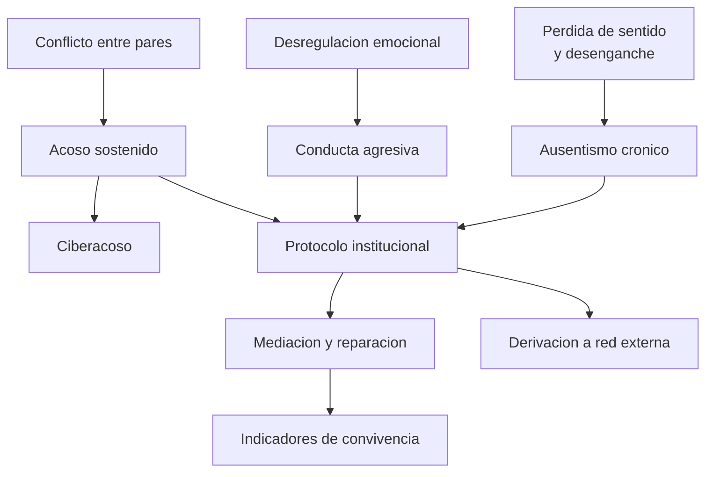

# Parte 21 — Desafíos actuales del aula

> *Los problemas que agotan a un docente no son fallas de vocación: son problemas con estructura y con respuesta*

🟤 **Etapa F — Especialización y desafíos contemporáneos** · salida de la etapa: resolver los problemas que efectivamente aparecen en el aula chilena de hoy

**Clases:** 12 (253–264) · **Población de referencia:** escolar, con énfasis en segundo ciclo y media · **Conceptos operacionales:** 48 · **Señales observables:** 36 
**Contenido central:** Desenganche y ausentismo, pérdida de sentido, atención y pantallas, violencia escolar, acoso, ciberacoso, conductas agresivas, agresiones al docente, mediación y prácticas restaurativas, aulas numerosas y riesgo psicosocial

## 🎯 De qué trata esta parte

La parte 12 construye el sistema de gestión de aula que previene. Esta parte enfrenta lo que ocurre igual: el curso que se desengancha, el estudiante que deja de venir, la agresión que escala, el video que circula, la profesora que termina con licencia. Son los problemas que hoy definen la conversación en las salas de profesores y que la formación inicial suele tratar de pasada.

El enfoque es doble. Primero, entender el fenómeno con la evidencia disponible y sin moralizar: el ausentismo crónico tiene predictores conocidos, el acoso tiene una estructura de roles que va más allá de agresor y víctima, y la desregulación emocional responde a mecanismos que se pueden anticipar. Segundo, decidir la respuesta correcta en el nivel correcto, distinguiendo lo que resuelve un docente, lo que exige protocolo institucional y lo que obliga a derivar.

La parte insiste en algo que se olvida: la respuesta a estos problemas es institucional o no es. Un docente sosteniendo solo una situación de violencia es una falla de diseño del establecimiento, no una prueba de compromiso.

## 🏫 Caso de la parte

Las doce clases trabajan sobre la misma realidad, para que puedas ver cómo cambia tu diagnóstico
a medida que avanzas:

> En 8.º básico hubo tres agresiones físicas en un semestre, un video circulando por redes y una profesora con licencia tras un episodio en clase. El reglamento existe, se aplica de forma desigual y la asistencia del curso cayó al 78 %.

**Artefacto que produces al terminar:** plan de convivencia con protocolos activables, escala de intervención, mediación y tres indicadores medidos mensualmente.

## 📚 Resultados de la parte

Al terminar esta parte podrás:

1. **Distinguir desenganche, ausentismo crónico y deserción, y responder a cada uno con su instrumento**.
2. **Intervenir una situación de acoso con un procedimiento que no dependa del carisma del docente**.
3. **Manejar una conducta agresiva sin escalada y con registro utilizable después**.
4. **Conducir una mediación entre estudiantes y una práctica restaurativa con reparación real**.
5. **Construir un plan de convivencia con indicadores que alguien revise cada mes**.

## 🗺️ Mapa de la parte

## 🧠 Marco de referencia

- ausentismo crónico como predictor temprano de deserción, no como falta administrativa
- estructura de roles del acoso escolar y programas con efecto comprobado
- escalada conductual y respuesta graduada sin confrontación pública
- justicia restaurativa, debido proceso y normativa chilena de convivencia escolar

**Autoras y autores que conviene conocer:** Dan Olweus, Christina Salmivalli, Robert Balfanz, Ross Greene, equipos de justicia restaurativa escolar, Superintendencia de Educación y Política Nacional de Convivencia Educativa

## 📋 Las 12 clases

| # | Clase | Decisión que habilita | Evidencia |
|---:|---|---|---|
| 253 | [Desenganche escolar y ausentismo crónico](class-01-desenganche-escolar-y-ausentismo-cronico/README.md) | determinar qué estudiantes de tu curso están en riesgo por asistencia y qué se activa con cada uno esta semana | `ROBUSTA` |
| 254 | [Falta de sentido: por qué estudiar dejó de ser evidente](class-02-falta-de-sentido-por-que-estudiar-dejo-de-ser-evidente/README.md) | determinar qué fuente de sentido está ausente en tu clase y cuál puedes reponer esta semana | `CONSISTENTE` |
| 255 | [Atención, pantallas y fragmentación cognitiva](class-03-atencion-pantallas-y-fragmentacion-cognitiva/README.md) | determinar la política de dispositivos de tu aula con fundamento y con un criterio de revisión | `EN-DEBATE` |
| 256 | [Violencia escolar: tipos, factores y respuesta](class-04-violencia-escolar-tipos-factores-y-respuesta/README.md) | determinar de qué tipo de situación se trata y qué respuesta institucional corresponde activar | `CONSISTENTE` |
| 257 | [Acoso escolar: detección e intervención con evidencia](class-05-acoso-escolar-deteccion-e-intervencion-con-evidencia/README.md) | determinar qué intervención corresponde a este caso de acoso y qué rol tiene el grupo curso | `ROBUSTA` |
| 258 | [Ciberacoso y conflictos que entran desde fuera](class-06-ciberacoso-y-conflictos-que-entran-desde-fuera/README.md) | determinar qué le corresponde a la escuela en este caso y qué corresponde derivar a otra instancia | `EMERGENTE` |
| 259 | [Conductas agresivas y desregulación emocional](class-07-conductas-agresivas-y-desregulacion-emocional/README.md) | determinar la secuencia de intervención de tu curso ante un episodio de desregulación o agresión | `CONSISTENTE` |
| 260 | [Agresiones al docente y protección del equipo](class-08-agresiones-al-docente-y-proteccion-del-equipo/README.md) | determinar qué activa tu establecimiento cuando un docente es agredido y quién lo acompaña | `MARCO-NORMATIVO` |
| 261 | [Mediación escolar y prácticas restaurativas](class-09-mediacion-escolar-y-practicas-restaurativas/README.md) | determinar si este caso admite mediación restaurativa y qué reparación concreta corresponde | `CONSISTENTE` |
| 262 | [Aulas numerosas y heterogéneas con recursos limitados](class-10-aulas-numerosas-y-heterogeneas-con-recursos-limitados/README.md) | determinar qué estrategias de diferenciación son sostenibles con el tamaño y los recursos reales de tu curso | `PRACTICA-PROFESIONAL` |
| 263 | [Consumo, riesgo psicosocial y derivación](class-11-consumo-riesgo-psicosocial-y-derivacion/README.md) | determinar si esta situación exige derivación, a qué instancia y con qué antecedentes | `MARCO-NORMATIVO` |
| 264 | [Proyecto integrador: plan de convivencia con indicadores](class-12-proyecto-integrador/README.md) | determinar el plan de convivencia del establecimiento y los tres indicadores que se medirán todos los meses | `PRACTICA-PROFESIONAL` |

## ⚠️ Riesgos característicos

- Tratar el ausentismo como problema del hogar y no como señal temprana que el establecimiento debe accionar.
- Responder al acoso con una conversación entre las partes, que en acoso sostenido agrava el daño.
- Confundir sanción con reparación y cerrar el caso sin que nada cambie para la víctima.
- Dejar a un docente sosteniendo solo una situación de violencia por falta de protocolo activable.

## 📕 Lecturas de referencia de la parte

- **Olweus, D. (1993). *Bullying at School*.** — define el fenómeno con criterios operacionales —intención, repetición y asimetría de poder— que siguen ordenando la práctica. **Localizar:** [ISBN 9780631227885](https://openlibrary.org/isbn/9780631227885) · [ficha](../../docs/REGISTRO_DE_FUENTES.md#olweus-1993-bullying-at-school)
- **Salmivalli, C. (2010). *Bullying and the Peer Group*.** — muestra que el grupo sostiene el acoso y que intervenir solo sobre agresor y víctima suele fracasar. **Localizar:** [DOI 10.1016/j.avb.2009.08.007](https://doi.org/10.1016/j.avb.2009.08.007) · [ficha](../../docs/REGISTRO_DE_FUENTES.md#salmivalli-2010-bullying-and-the-peer-group)
- **Balfanz, R. & Byrnes, V. (2012). *The Importance of Being in School*.** — convierte la asistencia en un indicador temprano accionable y no en una estadística de fin de año. **Localizar:** [ficha](../../docs/REGISTRO_DE_FUENTES.md#balfanz-byrnes-2012-the-importance-of-being-in-school) — sin localizador verificado todavía.
- **Greene, R. (2014). *Lost at School*.** — reencuadra la conducta como habilidad ausente y propone una respuesta colaborativa verificable. **Localizar:** [ISBN 9781511359481](https://openlibrary.org/isbn/9781511359481) · [ficha](../../docs/REGISTRO_DE_FUENTES.md#greene-2014-lost-at-school)

## ✅ Evidencia mínima para dar la parte por cerrada

- [ ] el análisis de asistencia del curso con estudiantes en riesgo identificados;
- [ ] el registro de una intervención de acoso con procedimiento y seguimiento;
- [ ] el acta de una mediación con acuerdo de reparación y fecha de revisión;
- [ ] el plan de convivencia con tres indicadores y su responsable de medición.

## 🧭 Práctica y evaluación de la parte

- [Rúbrica maestra e instrumentos de autoevaluación](../../assessments/README.md)
- [Casos profesionales para resolver con este marco](../../cases/README.md)
- [Laboratorios de decisión](../../labs/README.md)
- [Dónde se archiva la evidencia](../../evidence/README.md)

---

| Anterior | Índice | Siguiente |
|---|---|---|
| [← Parte 20 · Estrategias pedagógicas para necesidades educativas específicas](../part-20-estrategias-pedagogicas-para-necesidades-educativas-especificas/README.md) | [Programa](../../README.md) · [Currículo](../../CURRICULUM.md) | [Parte 22 · Diversidad cultural, lingüística y territorial →](../part-22-diversidad-cultural-linguistica-y-territorial/README.md) |
