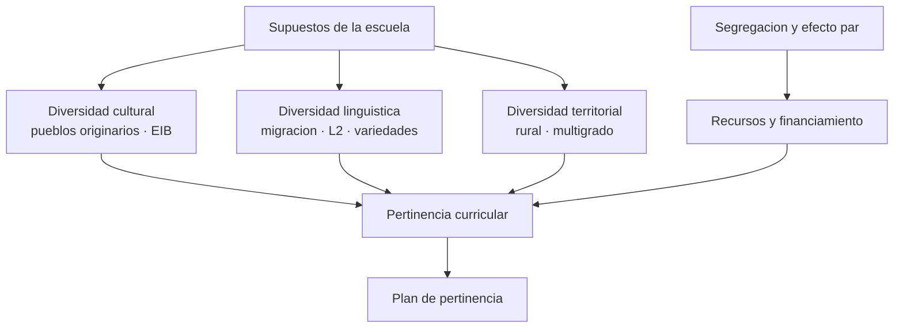

# Parte 22 — Diversidad cultural, lingüística y territorial

> *La escuela da por supuesto un estudiante: nombrar ese supuesto es el primer acto pedagógico*

🟤 **Etapa F — Especialización y desafíos contemporáneos** · salida de la etapa: resolver los problemas que efectivamente aparecen en el aula chilena de hoy

**Clases:** 12 (265–276) · **Población de referencia:** transversal, con foco en contextos interculturales, migrantes y rurales · **Conceptos operacionales:** 48 · **Señales observables:** 36 
**Contenido central:** Supuestos culturales de la escuela, educación intercultural, educación intercultural bilingüe, estudiantes migrantes, castellano como segunda lengua, lenguas extranjeras, variedades lingüísticas, educación rural, aula multigrado, segregación y financiamiento

## 🎯 De qué trata esta parte

Toda escuela enseña a un estudiante imaginario: uno que habla la lengua de instrucción en casa, que reconoce los ejemplos del texto, que puede estudiar en un espacio propio y cuya familia entiende cómo funciona el sistema. Cuando el estudiante real no coincide con ese supuesto, la diferencia se interpreta como déficit. Esta parte trata de hacer visible el supuesto para poder decidir sobre él.

El recorrido cubre tres diversidades que en Chile suelen tratarse por separado y se cruzan todo el tiempo: la cultural —pueblos originarios y educación intercultural bilingüe—, la lingüística —estudiantes migrantes que deben aprender la lengua de instrucción mientras aprenden en ella, y la enseñanza de lenguas extranjeras— y la territorial —la escuela rural, el aula multigrado y las decisiones que impone la distancia.

Cierra con lo que casi nunca se enseña a los docentes y decide buena parte de lo posible: cómo se financia el establecimiento, qué permite y qué prohíbe la subvención escolar preferencial, y cómo la segregación del sistema convierte una decisión pedagógica en una decisión política.

## 🏫 Caso de la parte

Las doce clases trabajan sobre la misma realidad, para que puedas ver cómo cambia tu diagnóstico
a medida que avanzas:

> El liceo recibió 34 estudiantes migrantes en dos años, 9 de ellos sin dominio del castellano académico, y la Escuela Rural El Maitén atiende a 48 estudiantes en tres cursos combinados con presencia de familias mapuche. Ninguna planificación distingue esas realidades.

**Artefacto que produces al terminar:** plan de pertinencia cultural y territorial con acogida lingüística, adecuación multigrado y uso declarado de los recursos SEP.

## 📚 Resultados de la parte

Al terminar esta parte podrás:

1. **Identificar los supuestos culturales de un material o una evaluación y corregirlos**.
2. **Diseñar acogida y trayectoria para un estudiante migrante sin dominio del castellano académico**.
3. **Distinguir enseñar en una lengua de enseñar la lengua, y planificar ambas cosas**.
4. **Planificar una clase multigrado con tarea común y exigencia diferenciada**.
5. **Fundamentar el uso de recursos SEP en una decisión pedagógica documentada**.

## 🗺️ Mapa de la parte

## 🧠 Marco de referencia

- diferencia cultural como recurso y no como déficit a compensar
- adquisición de segunda lengua y distinción entre lengua conversacional y lengua académica
- educación rural y multigrado como diseño propio, no como escuela pequeña incompleta
- marco chileno de educación intercultural bilingüe, derechos de estudiantes migrantes y subvención escolar preferencial

**Autoras y autores que conviene conocer:** Jim Cummins, Luis Moll y el trabajo sobre fondos de conocimiento, Gloria Ladson-Billings, Pierre Bourdieu, Cristián Bellei, Programa de Educación Intercultural Bilingüe y experiencias de Escuela Nueva en América Latina

## 📋 Las 12 clases

| # | Clase | Decisión que habilita | Evidencia |
|---:|---|---|---|
| 265 | [Lo que la escuela da por supuesto](class-01-lo-que-la-escuela-da-por-supuesto/README.md) | determinar qué supone tu material sobre la vida de tus estudiantes y qué cambia si ese supuesto no se cumple | `CONSISTENTE` |
| 266 | [Educación intercultural: del folclor al diálogo de saberes](class-02-educacion-intercultural-del-folclor-al-dialogo-de-saberes/README.md) | determinar si tu propuesta intercultural toca el currículum o solo lo decora | `PRACTICA-PROFESIONAL` |
| 267 | [Educación intercultural bilingüe y lenguas originarias](class-03-educacion-intercultural-bilingue-y-lenguas-originarias/README.md) | determinar qué modalidad de educación intercultural bilingüe corresponde a tu establecimiento y con qué condiciones | `MARCO-NORMATIVO` |
| 268 | [Estudiantes migrantes: acogida, trayectoria y derechos](class-04-estudiantes-migrantes-acogida-trayectoria-y-derechos/README.md) | determinar qué necesita este estudiante en sus primeras ocho semanas y quién responde por cada cosa | `CONSISTENTE` |
| 269 | [Castellano como segunda lengua](class-05-castellano-como-segunda-lengua/README.md) | determinar qué demanda lingüística tiene tu asignatura y cómo la enseñas explícitamente | `CONSISTENTE` |
| 270 | [Enseñanza de lenguas extranjeras](class-06-ensenanza-de-lenguas-extranjeras/README.md) | determinar qué proporción de tu clase de lengua extranjera ocurre efectivamente en esa lengua y con qué propósito | `CONSISTENTE` |
| 271 | [Variedades lingüísticas y prejuicio](class-07-variedades-linguisticas-y-prejuicio/README.md) | determinar qué corriges como error y qué corresponde a una variedad legítima del castellano | `CONSISTENTE` |
| 272 | [Educación rural: territorio y pertinencia](class-08-educacion-rural-territorio-y-pertinencia/README.md) | determinar qué del territorio entra en tu enseñanza y qué restricción de contexto debes resolver primero | `PRACTICA-PROFESIONAL` |
| 273 | [Aula multigrado: varios niveles a la vez](class-09-aula-multigrado-varios-niveles-a-la-vez/README.md) | determinar la estructura de tu clase multigrado: qué es común, qué se diferencia y quién trabaja con quién | `PRACTICA-PROFESIONAL` |
| 274 | [Segregación escolar y efecto par](class-10-segregacion-escolar-y-efecto-par/README.md) | determinar qué parte del resultado de tu establecimiento es efecto de composición y qué parte es efecto de su enseñanza | `CONSISTENTE` |
| 275 | [Financiamiento, recursos y decisiones pedagógicas](class-11-financiamiento-recursos-y-decisiones-pedagogicas/README.md) | determinar qué decisión pedagógica de tu establecimiento depende de un recurso y cómo se justifica su uso | `MARCO-NORMATIVO` |
| 276 | [Proyecto integrador: plan de pertinencia cultural y territorial](class-12-proyecto-integrador/README.md) | determinar el plan de pertinencia del establecimiento y qué evidencia mostrará que cambió algo | `PRACTICA-PROFESIONAL` |

## ⚠️ Riesgos característicos

- Reducir la interculturalidad a efemérides, comida y vestimenta sin tocar el currículum.
- Interpretar el silencio de un estudiante migrante como falta de capacidad y no como barrera lingüística.
- Planificar el aula multigrado como tres clases simultáneas, que es insostenible para un solo docente.
- Usar recursos SEP en compras sin decisión pedagógica documentada detrás.

## 📕 Lecturas de referencia de la parte

- **Cummins, J. (1979). *Cognitive/Academic Language Proficiency*.** — la distinción entre lengua de conversación y lengua académica explica años de diagnóstico equivocado. **Localizar:** [ficha](../../docs/REGISTRO_DE_FUENTES.md#cummins-1979-cognitive-academic-language-proficiency) — sin localizador verificado todavía.
- **Moll, L. et al. (1992). *Funds of Knowledge for Teaching*.** — convierte el saber de la familia en material de enseñanza en vez de en obstáculo. **Localizar:** [DOI 10.1080/00405849209543534](https://doi.org/10.1080/00405849209543534) · [ficha](../../docs/REGISTRO_DE_FUENTES.md#moll-1992-funds-of-knowledge-for-teaching)
- **Ladson-Billings, G. (1995). *Toward a Theory of Culturally Relevant Pedagogy*.** — define qué significa enseñar con pertinencia cultural sin bajar la exigencia académica. **Localizar:** [DOI 10.3102/00028312032003465](https://doi.org/10.3102/00028312032003465) · [ficha](../../docs/REGISTRO_DE_FUENTES.md#ladson-billings-1995-toward-a-theory-of-culturally-relevant)
- **Bellei, C. (2013). *El estudio de la segregación socioeconómica y académica de la educación chilena*.** — cuantifica el contexto en que se toman todas las decisiones pedagógicas del sistema chileno. **Localizar:** [DOI 10.4067/s0718-07052013000100019](https://doi.org/10.4067/s0718-07052013000100019) · [ficha](../../docs/REGISTRO_DE_FUENTES.md#bellei-2013-el-estudio-de-la-segregacion-socioeconomica)

## ✅ Evidencia mínima para dar la parte por cerrada

- [ ] la revisión de un material o instrumento con sus supuestos culturales corregidos;
- [ ] el plan de acogida lingüística de un estudiante migrante, con hitos y responsables;
- [ ] una planificación multigrado con tarea común y tres niveles de exigencia;
- [ ] el plan de pertinencia cultural y territorial con uso declarado de recursos.

## 🧭 Práctica y evaluación de la parte

- [Rúbrica maestra e instrumentos de autoevaluación](../../assessments/README.md)
- [Casos profesionales para resolver con este marco](../../cases/README.md)
- [Laboratorios de decisión](../../labs/README.md)
- [Dónde se archiva la evidencia](../../evidence/README.md)

---

| Anterior | Índice | Siguiente |
|---|---|---|
| [← Parte 21 · Desafíos actuales del aula](../part-21-desafios-actuales-del-aula/README.md) | [Programa](../../README.md) · [Currículo](../../CURRICULUM.md) | [Parte 23 · Bienestar, salud mental y sostenibilidad del oficio →](../part-23-bienestar-salud-mental-y-sostenibilidad-del-oficio/README.md) |
