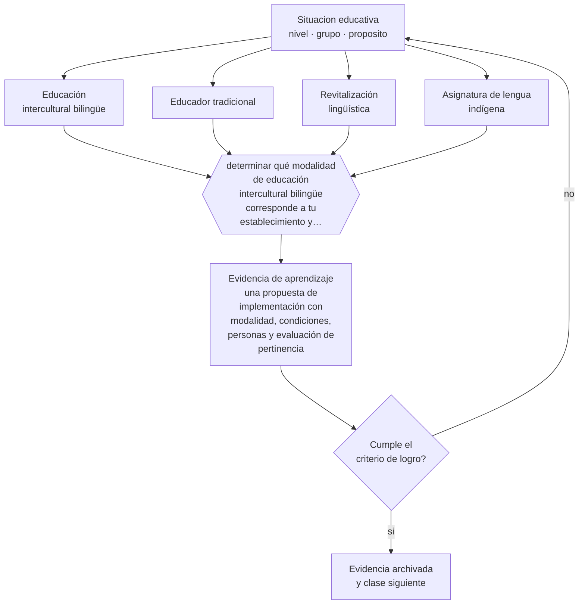

# Clase 267 — Educación intercultural bilingüe y lenguas originarias

> **Parte 22 · Diversidad cultural, lingüística y territorial** — clase 3 de 12

**Estado de evidencia:** `MARCO-NORMATIVO` · **Etapa:** 🟤 Etapa F — Especialización y desafíos contemporáneos · **Población de referencia:** transversal, con foco en contextos interculturales, migrantes y rurales 
**Decisión que habilita:** determinar qué modalidad de educación intercultural bilingüe corresponde a tu establecimiento y con qué condiciones 
**Evidencia de aprendizaje:** una propuesta de implementación con modalidad, condiciones, personas y evaluación de pertinencia

## 🎯 Propósito

Comprender el marco de la educación intercultural bilingüe en Chile y decidir con criterio sobre la enseñanza de lengua indígena en el establecimiento.

## 📚 Resultados de aprendizaje

Al finalizar esta clase podrás:

1. **Definir** con precisión los cuatro conceptos centrales de la clase y reconocerlos en una situación educativa real, no solo en su enunciado.
2. **Explicar** qué implica enseñar en una lengua que la escuela históricamente reprimió.
3. **Decidir** —qué modalidad de educación intercultural bilingüe corresponde a tu establecimiento y con qué condiciones— y sostener la decisión con un fundamento escrito.
4. **Producir** la evidencia de la clase —una propuesta de implementación con modalidad, condiciones, personas y evaluación de pertinencia— y contrastarla contra el criterio de logro.
5. **Distinguir** lo que la evidencia sostiene de lo que es práctica instalada, preferencia personal o costumbre de la institución.

## 🧭 Agenda sugerida (90 minutos)

| Minutos | Bloque | Qué ocurre |
|---:|---|---|
| 0–10 | Activación | Recuperar sin mirar la clase anterior y responder la pregunta de foco. |
| 10–25 | Conceptos | Definir los cuatro conceptos y reconocerlos en un caso real. |
| 25–45 | Modelo mental | Recorrer el método: delimitar el contexto y comprobar —no suponer— qué saben ya los estudiantes. |
| 45–70 | Ejemplo trabajado | Aplicar el método al caso de la parte, paso a paso y con evidencia. |
| 70–85 | Taller | Trasladar la decisión al contexto propio y anticipar su alternativa. |
| 85–90 | Cierre | Fijar responsable, plazo e indicador de la evidencia de aprendizaje. |

Fuera de la sesión, la clase exige aproximadamente **una hora y media** de práctica y de
producción de la evidencia. Si el tiempo se recorta, se recorta el ejemplo trabajado, nunca la
producción de evidencia: es la única parte que prueba el aprendizaje.

## 🧩 Conceptos centrales

| Concepto | Comprensión verificable |
|---|---|
| **Educación intercultural bilingüe** | modalidad que incorpora la lengua y cultura de un pueblo originario al proceso educativo |
| **Educador tradicional** | persona reconocida por su comunidad que enseña la lengua y la cultura junto al docente de aula |
| **Revitalización lingüística** | conjunto de acciones dirigidas a recuperar el uso de una lengua en riesgo de desaparición |
| **Asignatura de lengua indígena** | espacio curricular específico con marco propio dentro de la normativa chilena |

## 🧠 Modelo mental

El método de esta clase, en cinco pasos que se ejecutan en orden:

1. Delimitar el contexto y comprobar —no suponer— qué saben ya los estudiantes.
2. Clasificar la situación distinguiendo **Educación intercultural bilingüe** de **Educador tradicional**.
3. Decidir con fundamento, usando **Revitalización lingüística** como criterio y declarando la fuente.
4. Anticipar qué evidencia confirmaría la decisión y cuál la refutaría, con **Asignatura de lengua indígena** a la vista.
5. Registrar lo ocurrido y contrastarlo contra el criterio de logro antes de avanzar.

Lo que hace profesional a este método no son los pasos sino la evidencia que exige en cada uno.
Estas son las señales observables con las que se comprueba, y que deben quedar definidas **antes**
de recogerlas:

| Señal observable | Cómo se recoge y qué significa |
|---|---|
| **Evidencia de partida** | qué sabían o podían hacer los estudiantes antes de la decisión, comprobado y no supuesto |
| **Evidencia de proceso** | qué se observó mientras la decisión se aplicaba, con fecha, contexto y responsable del registro |
| **Evidencia de logro** | qué muestra una propuesta de implementación con modalidad, condiciones, personas y evaluación de pertinencia frente al criterio declarado de antemano |

**Frontera de aplicación.** El método vale mientras las condiciones que lo sostienen se cumplan.
La evidencia específica sobre resultados de la educación intercultural bilingüe en Chile es escasa y de calidad heterogénea. Cuando esa condición falla, el paso siguiente no es forzar el método:
es declarar el límite y decidir con menos certeza, dejándolo por escrito.

## 🗺️ Flujo de razonamiento

## 📖 Desarrollo

### 1. El fondo del asunto

La educación intercultural bilingüe en Chile tiene marco normativo, asignatura y figura del educador tradicional. También tiene una historia previa que explica su dificultad: durante buena parte del siglo veinte la escuela fue el lugar donde las lenguas originarias se perdieron, a veces por castigo explícito. Esa memoria condiciona la relación entre escuela y comunidad y no puede omitirse al implementar el programa, porque explica desconfianzas que de otro modo parecen incomprensibles.

### 2. Frontera conceptual: qué es y qué no es

Los cuatro conceptos de esta clase se confunden entre sí con facilidad, y esa confusión no es
inocua: produce decisiones que atacan el problema equivocado. **Educación intercultural bilingüe** no es lo
mismo que **Educador tradicional** —persona reconocida por su comunidad que enseña la lengua y la cultura junto al docente de aula—, y tratarlos como sinónimos hace
que la intervención se dirija al lugar incorrecto. Del mismo modo, **Revitalización lingüística** y
**Asignatura de lengua indígena** describen aspectos distintos de la misma situación: el primero
conjunto de acciones dirigidas a recuperar el uso de una lengua en riesgo de desaparición, mientras el segundo espacio curricular específico con marco propio dentro de la normativa chilena.

La prueba de que la distinción está entendida es operacional, no verbal: dos personas que
observan la misma clase deben poder clasificar el mismo episodio de la misma manera. Si no
coinciden, el problema está en la definición y no en el observador. El error de clasificación más
frecuente en esta materia es el primero de los que se listan más abajo, y conviene anticiparlo
antes de aplicar nada.

### 3. Cómo se observa y se mide

Nada de lo anterior sirve si no se puede observar. Estas son las señales que esta clase usa y
cómo se recogen:

- **Evidencia de partida.** Qué sabían o podían hacer los estudiantes antes de la decisión, comprobado y no supuesto. Se registra con fecha y contexto; sin eso, la señal no distingue una tendencia de una casualidad.
- **Evidencia de proceso.** Qué se observó mientras la decisión se aplicaba, con fecha, contexto y responsable del registro. Se registra con fecha y contexto; sin eso, la señal no distingue una tendencia de una casualidad.
- **Evidencia de logro.** Qué muestra una propuesta de implementación con modalidad, condiciones, personas y evaluación de pertinencia frente al criterio declarado de antemano. Se registra con fecha y contexto; sin eso, la señal no distingue una tendencia de una casualidad.

Ninguna de estas señales es el aprendizaje: son indicios de él. Confundir el indicio con el
fenómeno es el error clásico de la medición educativa, y por eso cada señal se interpreta junto
con el contexto, el punto de partida del grupo y lo que el propio estudiante puede explicar sobre
su trabajo.

### 4. Cómo se traduce en decisiones de enseñanza

La implementación exige decisiones concretas: qué lengua según el territorio y la matrícula, quién enseña y con qué reconocimiento de la comunidad, cómo se articula el educador tradicional con el docente de aula —el punto donde más fracasa el programa—, y qué lugar tiene la lengua fuera de la asignatura. La evidencia disponible sobre programas bilingües en general favorece los modelos que mantienen la lengua materna en vez de sustituirla temprano.

### 5. Qué sostiene la evidencia y qué no

La evidencia específica sobre resultados de la educación intercultural bilingüe en Chile es escasa y de calidad heterogénea. La disponibilidad de educadores tradicionales y de material es desigual por territorio. Y persiste una tensión real entre revitalización lingüística —que requiere uso intensivo— y una asignatura de pocas horas semanales, que difícilmente produce hablantes.

> **Cómo leer el estado de evidencia `MARCO-NORMATIVO`.** El contenido no se decide por evidencia empírica sino por norma, política pública o marco institucional vigente. Verifica siempre la versión vigente a la fecha en que vas a aplicarlo: la norma cambia y la clase no se actualiza sola.

### 6. Integración: de los conceptos a una decisión defendible

Una decisión es defendible cuando puede explicarse a alguien que no estuvo presente. Esta clase
te deja en condiciones de qué modalidad de educación intercultural bilingüe corresponde a tu establecimiento y con qué condiciones, y esa decisión se sostiene solo si
declara cuatro cosas: la evidencia que la funda, el supuesto que asume, el indicador que la
comprobaría y la condición que la haría cambiar.

Ese es también el criterio con el que se evalúa la evidencia de aprendizaje de la clase. Un
análisis que podría copiarse a otra clase, a otro curso o a otro establecimiento sin cambiar una
palabra no es una decisión: es una declaración general, y el oficio empieza justo donde las
declaraciones generales terminan.

## 📚 Lectura comparada

Las obras no cumplen el mismo papel. Esta tabla indica qué lente aporta cada una;
después de leer, escribe una discrepancia real entre al menos dos fuentes.

| Fuente | Lente que aporta | Pregunta crítica |
|---|---|---|
| Cummins, J. (1979). *Cognitive/Academic Language Proficiency*. | fundamenta por qué mantener la lengua materna favorece el aprendizaje académico. | ¿Qué supuesto de esta clase ayuda a poner a prueba? |
| Ley 19.253 (1993). *Ley Indígena, Chile*. | el marco de derechos que sustenta la educación intercultural bilingüe. | ¿Qué supuesto de esta clase ayuda a poner a prueba? |

La lectura se evalúa por **uso**, no por cantidad de páginas. Tu nota de lectura debe indicar qué
tesis modifica tu diagnóstico, qué evidencia del caso la tensiona y qué decisión concreta
cambiarías después del contraste. Una nota que solo resume el texto no cumple el criterio.

## 🧮 Ejemplo trabajado

**Situación.** El liceo recibió 34 estudiantes migrantes en dos años, 9 de ellos sin dominio del castellano académico, y la Escuela Rural El Maitén atiende a 48 estudiantes en tres cursos combinados con presencia de familias mapuche. Ninguna planificación distingue esas realidades.

**Paso 1 — Delimitar el contexto y comprobar —no suponer— qué saben ya los estudiantes.** El equipo escribe primero el supuesto asociado a **Educación intercultural bilingüe** y se prohíbe tratarlo como hecho. Contrasta ese supuesto con **Evidencia de partida** y anota qué parte del dato todavía no existe. Del paso sale un registro fechado y una frase explícita: «cambiaríamos de decisión si…».

**Paso 2 — Clasificar la situación distinguiendo Educación intercultural bilingüe de Educador tradicional.** El trabajo aquí es separar lo observado de lo interpretado sobre **Educador tradicional**. La evidencia que ordena la conversación es **Evidencia de proceso**; si su definición no está escrita, escribirla es parte del paso. Nada avanza mientras el equipo no acuerde qué contaría como refutación.

**Paso 3 — Decidir con fundamento, usando Revitalización lingüística como criterio y declarando la fuente.** El riesgo de este paso es cerrar demasiado rápido alrededor de **Revitalización lingüística**. Antes de concluir, se enumeran dos explicaciones alternativas del mismo patrón y se revisa si **Evidencia de logro** logra distinguirlas. Si no lo logra, hace falta otra evidencia y así debe quedar registrado.

**Paso 4 — Anticipar qué evidencia confirmaría la decisión y cuál la refutaría, con Asignatura de lengua indígena a la vista.** Con **Asignatura de lengua indígena** ya delimitado, la pregunta pasa a ser de consecuencia: qué cambia para los estudiantes, para el tiempo de clase y para la carga del equipo. **Evidencia de partida** entrega la lectura observable; el juicio profesional sigue siendo humano y debe quedar firmado por quien lo hace.

**Paso 5 — Registrar lo ocurrido y contrastarlo contra el criterio de logro antes de avanzar.** El cierre exige compromiso: responsable, fecha, indicador de logro y condición de detención. **Evidencia de proceso** se convierte en la señal de seguimiento, y se acuerda con qué frecuencia se revisa y quién puede declarar que no funcionó sin costo político.

**Síntesis.** La recomendación termina con responsable, fecha, evidencia de logro y señal de
detención. Omitir cualquiera de esas cuatro piezas convierte el análisis en una opinión que nadie
podrá auditar dentro de tres meses, y que por lo tanto nadie corregirá.

## 🔀 Comparación de caminos y límites

Ante la misma situación caben varios cursos de acción. La decisión profesional no es
elegir el «correcto», sino saber qué privilegia cada uno y qué arriesga.

| Camino | Qué privilegia | Cuándo elegirlo | Riesgo principal |
|---|---|---|---|
| Intervenir sobre **Educación intercultural bilingüe** | Modalidad que incorpora la lengua y cultura de un pueblo originario al proceso educativo | Cuando **Evidencia de partida** es observable y accionable dentro del plazo de la decisión. | Sobrerreaccionar a una señal parcial. |
| Intervenir sobre **Educador tradicional** | Persona reconocida por su comunidad que enseña la lengua y la cultura junto al docente de aula | Cuando la primera explicación no distingue mecanismo ni responsable. | Convertir el concepto en etiqueta y no en intervención. |
| Observar antes de decidir | Reducir la incertidumbre antes de comprometer tiempo y credibilidad | Cuando la decisión es reversible y la evidencia disponible no distingue causas. | Observar indefinidamente y no decidir nunca. |
| Derivar o escalar | Poner la decisión donde están la competencia y la responsabilidad | Cuando hay normativa, resguardo de datos, salud o vulneración de derechos en juego. | Delegar hacia arriba lo que sí correspondía decidir en el aula. |

**Frontera de aplicación.** La evidencia específica sobre resultados de la educación intercultural bilingüe en Chile es escasa y de calidad heterogénea. Fuera de esa frontera, la comparación
anterior deja de ser válida y la decisión debe tomarse con evidencia distinta.

## 🪜 El mismo tema según el rol

La misma materia cambia de forma según quién decida. Al subir de nivel aumentan las
personas, el tiempo y las consecuencias que quedan dentro de la decisión.

| Nivel | Responsabilidad sobre educación intercultural bilingüe y lenguas originarias |
|---|---|
| **Docente de aula** | Aplica, observa y registra la evidencia; declara qué no puede resolver desde su rol. |
| **Equipo de apoyo o educación diferencial** | Verifica que la decisión no deje fuera a quien más barreras enfrenta y aporta los apoyos. |
| **Jefatura técnico-pedagógica** | Convierte la decisión en criterio compartido, tiempo protegido y acompañamiento. |
| **Dirección** | Decide si esto cambia condiciones institucionales, recursos o el plan de mejora. |
| **Formación e investigación** | Pregunta si la decisión es generalizable, con qué evidencia y qué haría falta para probarlo. |

Si trabajas en uno de esos niveles, la [guía de carrera de tu rol](../../../rutas/README.md)
indica en qué orden conviene recorrer el programa y qué artefactos acreditan tu competencia.

## 🧪 Taller guiado

Aplica la clase a **uno** de los contextos siguientes y repite después el ejercicio en un
contexto de exigencia distinta. Cambiar de contexto es parte del aprendizaje: lo que funciona
con un grupo no se traslada intacto a otro.

| Contexto | Rasgo que cambia la decisión |
|---|---|
| Escuela urbana con alta matrícula migrante | la acogida lingüística no puede depender de un docente voluntario |
| Escuela con población mapuche o aymara | la lengua y el territorio son contenido, no decoración |
| Escuela rural multigrado | la planificación por tarea común es la única sostenible |
| Liceo técnico-profesional | la pertinencia se juega también en el vínculo con el territorio productivo |
| Establecimiento particular subvencionado | el financiamiento condiciona lo que se puede sostener en el tiempo |
| Educación de adultos | la trayectoria interrumpida es la norma y no la excepción |

**Secuencia de trabajo:**

1. Delimita el contexto: nivel, edad, tamaño del grupo, asignatura o experiencia y tiempo real disponible.
2. Declara qué saben ya los estudiantes y **cómo lo comprobaste**, no cómo lo supones.
3. Formula la decisión pedagógica que esta clase habilita y escribe su fundamento.
4. Anticipa qué observarías si la decisión funciona y qué observarías si no funciona.
5. Diseña de antemano la alternativa que aplicarás si la primera estrategia falla.
6. Ejecuta o simula, y registra lo observado con fecha, contexto y evidencia concreta.
7. Produce la evidencia de aprendizaje de la clase.
8. Contrástala contra el criterio de logro, corrige y recién entonces avanza.

## 🏫 Caso profesional

**Situación.** El liceo recibió 34 estudiantes migrantes en dos años, 9 de ellos sin dominio del castellano académico, y la Escuela Rural El Maitén atiende a 48 estudiantes en tres cursos combinados con presencia de familias mapuche. Ninguna planificación distingue esas realidades.

Entrega un **informe de decisión** de una página que contenga:

1. **Hechos y fuentes** — qué está documentado y con qué evidencia, separado de lo que se supone.
2. **Hipótesis** — la explicación más probable y una alternativa que también encajaría.
3. **Dos opciones defendibles** — no una recomendación y un espantapájaros.
4. **Efecto esperado** — sobre los estudiantes, el tiempo de clase, el equipo y los apoyos.
5. **Recomendación** — con su fundamento y la fuente que la respalda.
6. **Condición de revisión** — qué resultado te haría cambiar de decisión.
7. **Responsable y fecha** — quién ejecuta y cuándo se revisa.

Usa al menos **dos** fuentes de la lectura comparada para desafiar tu primera respuesta. Una
recomendación que ninguna fuente pone en duda casi siempre está poco examinada.

## 📥 Evidencia de aprendizaje

Una propuesta de implementación con modalidad, condiciones, personas y evaluación de pertinencia.

Guárdala en `evidence/P22-C267-educacion-intercultural-bilingue-y-lenguas-originarias/` con estos archivos:

| Archivo | Qué contiene |
|---|---|
| `decision.md` | contexto, decisión, fundamento, fuentes con fecha, indicador de logro y riesgos |
| `senales.md` | definición operacional de las tres señales, cómo se recogieron y qué no distinguen |
| `nota-de-lectura.md` | dos fuentes contrastadas, con edición y páginas consultadas |
| `revision-critica.md` | la objeción más fuerte a tu decisión y qué evidencia la invalidaría |

Esta evidencia alimenta el artefacto de la parte: **plan de pertinencia cultural y territorial con acogida lingüística, adecuación multigrado y uso declarado de los recursos SEP**.

## 🏆 Reto verificable

Elabora la propuesta de implementación para un establecimiento con matrícula indígena. Consulta la articulación con quien hoy ocupa el rol de educador tradicional.

## ✅ Evaluación de la clase

| Criterio | Peso | Evidencia esperada |
|---|---:|---|
| Precisión conceptual | 25 % | Distinciones correctas y observables entre los cuatro conceptos, aplicadas a un caso real. |
| Diagnóstico y evidencia | 30 % | Conocimiento previo comprobado, evidencia recogida con fecha y contexto, y límites del dato declarados. |
| Decisión y alternativas | 30 % | Decisión fundada, alternativa prevista si falla, y condición explícita que la haría cambiar. |
| Responsabilidad y comunicación | 15 % | Diversidad y resguardos considerados, fuentes citadas y evidencia archivada de forma reproducible. |

**Aprobación:** 80 de 100 y ningún criterio bajo el 60 %. Una respuesta que podría copiarse sin
cambios a otra clase, a otro curso o a otro establecimiento se considera insuficiente, aunque
esté bien escrita.

**Criterio de logro de la evidencia:**

- [ ] la propuesta declara la modalidad, las personas responsables y su reconocimiento comunitario;
- [ ] existe articulación explícita entre educador tradicional y docente de aula, con tiempo asignado;
- [ ] cada afirmación sobre «lo que funciona» está atribuida a una fuente identificable, con autor y fecha;
- [ ] la decisión es ejecutable con el tiempo, el espacio, el número de estudiantes y los recursos que realmente tienes;
- [ ] la evidencia queda archivada de forma reproducible: otra persona podría revisarla sin que tú se la expliques.

## ⚠️ Errores frecuentes

**Propios de esta clase:**

- Implementar la asignatura sin acuerdo con la comunidad y sin reconocimiento del educador tradicional.
- Tratar la lengua como contenido de una asignatura aislada y no como lengua viva del establecimiento.

**Característicos de la parte 22:**

- Reducir la interculturalidad a efemérides, comida y vestimenta sin tocar el currículum.
- Interpretar el silencio de un estudiante migrante como falta de capacidad y no como barrera lingüística.

Los cuatro comparten estructura: un síntoma visible, una causa que no se ve y una corrección que
casi siempre es de diseño y no de esfuerzo. Antes de atribuir el problema a los estudiantes o a
ti, comprueba cuál de ellos está operando y qué evidencia lo distinguiría de los otros tres.

## ♿ Diversidad, accesibilidad y ética

El reconocimiento de la lengua tiene efectos sobre la identidad y la permanencia escolar de los estudiantes del pueblo correspondiente, y su ausencia comunica —sin decirlo— qué conocimiento vale en esa escuela.

Antes de aplicar cualquier decisión de esta clase con estudiantes reales, revisa el
[protocolo de práctica responsable](../../../docs/ETICA_Y_PRACTICA_RESPONSABLE.md):
consentimiento, resguardo de datos personales, proporcionalidad de la intervención y derecho
de cada estudiante a no ser objeto de un ensayo que no le reporta beneficio.

## 🇨🇱 Contexto chileno y cumplimiento

Riesgo característico de esta parte: **Reducir la interculturalidad a efemérides, comida y vestimenta sin tocar el currículum.** Antes de aplicar
cualquier decisión de esta clase en un establecimiento real, verifica el marco vigente:

- Marco institucional y normativo: [`docs/MARCO_CHILE.md`](../../../docs/MARCO_CHILE.md).
- Inclusión y apoyos: [`docs/INCLUSION_Y_DUA.md`](../../../docs/INCLUSION_Y_DUA.md).
- Datos personales, IA y resguardos: [`docs/IA_EN_EDUCACION.md`](../../../docs/IA_EN_EDUCACION.md).
- Fuentes oficiales con cómo leerlas: [`docs/FUENTES.md`](../../../docs/FUENTES.md).

La regla del programa es simple: **la fuente oficial manda sobre el material pedagógico**. Si la
norma cambió después de la fecha de esta clase, gana la norma.

## ❓ Preguntas de comprobación

1. ¿Qué acuerdo existe con la comunidad sobre cómo se enseña su lengua?
2. ¿Cómo se articulan el educador tradicional y el docente, y en qué horario?
3. ¿Qué presencia tiene la lengua fuera de las horas de la asignatura?

## 📗 Fuentes y verificación

- Cummins, J. (1979). *Cognitive/Academic Language Proficiency*. **Uso en esta clase:** fundamenta por qué mantener la lengua materna favorece el aprendizaje académico. Lectura selectiva: índice y capítulos pertinentes; registra edición y páginas consultadas.
- Ley 19.253 (1993). *Ley Indígena, Chile*. **Uso en esta clase:** el marco de derechos que sustenta la educación intercultural bilingüe. Lectura selectiva: índice y capítulos pertinentes; registra edición y páginas consultadas.

Catálogo completo: [bibliografía del programa](../../../docs/BIBLIOGRAFIA.md) ·
[glosario](../../../docs/GLOSARIO.md) ·
[fuentes oficiales y cómo leerlas](../../../docs/FUENTES.md).

> **Regla de fuentes.** Las obras anteriores estructuran las perspectivas de esta materia.
> Cualquier norma, decreto, orientación ministerial o política institucional mencionada debe
> comprobarse en su fuente primaria vigente antes de usarse con estudiantes reales. El desarrollo
> de esta clase es original y no reproduce capítulos protegidos por derechos de autor.

## 🔗 Conexión con el resto del programa

Continúa la clase 266 y se articula con la 269. Enlaza con las clases 007 y 011.

> [!IMPORTANT]
> Material de formación profesional. No reemplaza un título de pedagogía, una habilitación
> legal para ejercer, ni el juicio de un equipo educativo que conoce a sus estudiantes.

---

| Anterior | Índice | Siguiente |
|---|---|---|
| [← 266 · Educación intercultural: del folclor al diálogo de saberes](../class-02-educacion-intercultural-del-folclor-al-dialogo-de-saberes/README.md) | [Parte 22](../README.md) · [Programa](../../../README.md) | [268 · Estudiantes migrantes: acogida, trayectoria y derechos →](../class-04-estudiantes-migrantes-acogida-trayectoria-y-derechos/README.md) |
